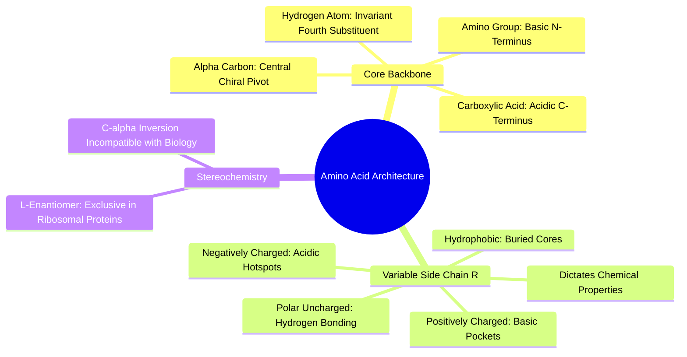

#### 2.1.1. Concept. The Alpha-Amino Acid Architecture
Proteins are linear polymers constructed from 20 genetically encoded **$\alpha$-amino acids**. Every amino acid shares a common structural scaffold centered on a single carbon atom, termed the **alpha carbon ($\text{C}_\alpha$)**.

1. **The Four Substituents:** The central $\text{C}_\alpha$ is bonded to four distinct chemical entities:
   * A basic **amino group** ($-\text{NH}_2$, or $-\text{NH}_3^+$ at $\text{pH } 7.4$).
   * An acidic **carboxylate group** ($-\text{COOH}$, or $-\text{COO}^-$ at $\text{pH } 7.4$).
   * A single invariant **hydrogen atom** ($-\text{H}$).
   * A variable **side chain (R group)** that determines the amino acid's identity.
2. **Stereocenters and Chirality:** Because the $\text{C}_\alpha$ is bonded to four chemically distinct groups, it represents a **chiral center** (with the exception of Glycine, where $\text{R}=\text{H}$). In biological proteins, virtually all amino acids are exclusively the **$\text{L}$-stereoisomer** (which corresponds to an $(S)$-configuration under the Cahn-Ingold-Prelog convention for 19 of the 20 amino acids; Cysteine is $(R)$ due to sulfur priority).
3. **The Backbone Chain:** The invariant amino, $\text{C}_\alpha$, and carboxylate groups constitute the repeating protein "backbone" ($-\text{N}—\text{C}_\alpha—\text{C}(=\text{O})-$), while the side chains extend outward into space to interact with other residues and bound drug molecules.

*Related Notes:*
* Connects to: `[[2.2.1. Concept. Formation, Geometry, and Resonance of the Peptide Bond]]`
* Connects to: `[[5.3.1. Concept. Stereocenters, Enantiomers, and Diastereomers]]`
