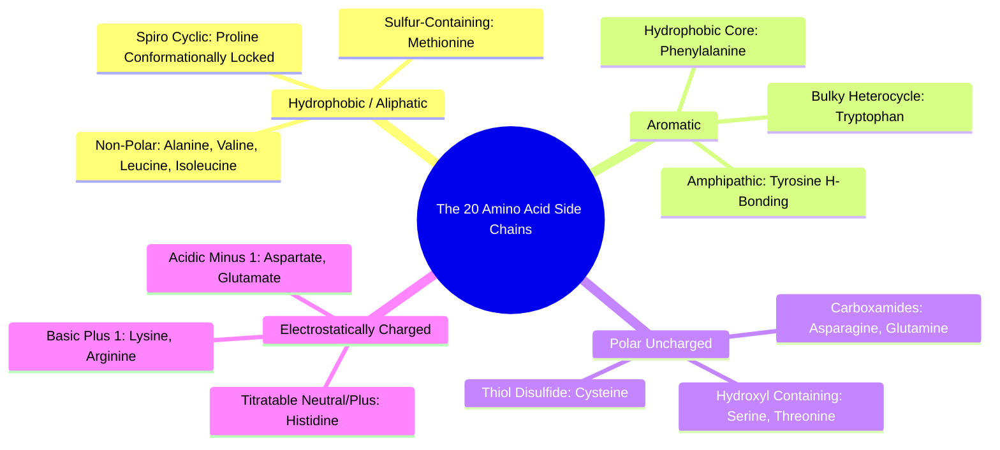

#### 2.1.2. Concept. Side-Chain Chemistry and Classification
The biological behavior, electrostatic surface, and pocket geometry of any protein target are entirely determined by the spatial arrangement of its amino acid side chains.

1. **Hydrophobic / Aliphatic Residues:**
   * **Alanine ($\text{Ala, A}$), Valine ($\text{Val, V}$), Leucine ($\text{Leu, L}$), Isoleucine ($\text{Ile, I}$):** Branched hydrocarbon chains. They cluster into the protein core to avoid water, forming greasy binding cavities that accommodate lipophilic drug fragments.
   * **Methionine ($\text{Met, M}$):** Contains an unbranched thioether ($-\text{S}-\text{CH}_3$).
   * **Proline ($\text{Pro, P}$):** The side chain loops back to bind covalently to the backbone nitrogen, locking its dihedral angle and acting as a rigid structural disruptor.
2. **Aromatic Residues:**
   * **Phenylalanine ($\text{Phe, F}$):** Benzene ring; engages in $\pi$-stacking with drug aromatics.
   * **Tyrosine ($\text{Tyr, Y}$):** Phenol group; simultaneously participates in $\pi$-stacking and hydrogen bond donation/acceptance via its hydroxyl ($-\text{OH}$).
   * **Tryptophan ($\text{Trp, W}$):** Massive, rigid indole bicycle; forms deep, polarizable hydrophobic subpockets.
3. **Polar Uncharged Residues:**
   * **Serine ($\text{Ser, S}$) and Threonine ($\text{Thr, T}$):** Aliphatic hydroxyls ($-\text{OH}$); act as both donors and acceptors for ligand hydrogen bonds.
   * **Asparagine ($\text{Asn, N}$) and Glutamine ($\text{Gln, Q}$):** Neutral primary carboxamides ($-\text{CONH}_2$).
   * **Cysteine ($\text{Cys, C}$):** Highly nucleophilic thiol ($-\text{SH}$). Can form covalent bonds with electrophilic warheads or pair with another cysteine to form an intramolecular **disulfide bridge** ($-\text{S—S}-$).
4. **Charged / Basic Residues:**
   * **Aspartate ($\text{Asp, D}$) and Glutamate ($\text{Glu, E}$):** Negatively charged carboxylates ($-1$). Represent strong electrostatic hotspots for cationic drug handles.
   * **Lysine ($\text{Lys, K}$) and Arginine ($\text{Arg, R}$):** Positively charged cations ($+1$).
   * **Histidine ($\text{His, H}$):** Contains an imidazole ring ($\text{p}K_a \approx 6.0$). At $\text{pH } 7.4$, it readily shifts between neutral and positively charged states, acting as a crucial catalytic acid/base in enzyme active sites.

*Related Notes:*
* Connects to: `[[3.3.2. Concept. Pharmacophore Hotspots and Interaction Fields]]`
* Code Manifestation: Mapped to interaction priors in `PocketHotspotFeaturizer` (`syntree/chemistry/hotspots.py`).

---

### 2.2. Topic. The Peptide Bond and Polypeptide Chains
