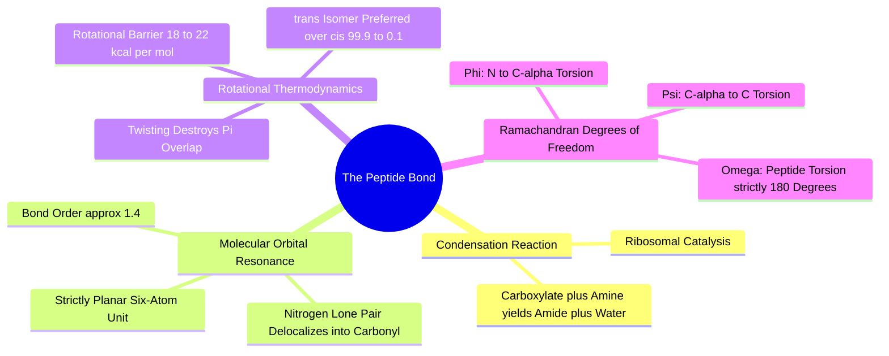

#### 2.2.1. Concept. Formation, Geometry, and Resonance of the Peptide Bond
Proteins are assembled when the carboxylic acid of one amino acid condenses with the $\alpha$-amino group of another, releasing a water molecule in a biochemical condensation reaction to form an **amide (peptide) bond**.

1. **The Resonance Phenomenon:** In an isolated amine, nitrogen's lone pair occupies a localized $sp^3$ orbital. However, when attached adjacent to a carbonyl ($\text{C=O}$), the nitrogen lone pair delocalizes into the carbonyl $\pi^*$ antibonding orbital:
   $$\text{—C}(=\text{O})—\text{N}\text{H—} \longleftrightarrow \text{—C}(\text{—O}^-) = \text{N}^+\text{H—}$$
2. **Partial Double-Bond Character:** Because of resonance, the central $\text{C—N}$ bond is not a simple single bond. Its physical bond order is approximately **$1.4$**, and its length ($1.33\text{ \AA}$) is substantially shorter than a normal $\text{C—N}$ single bond ($1.47\text{ \AA}$).
3. **Strict Planarity:** Because the peptide bond has substantial double-bond character, rotation around the $\text{C—N}$ axis is physically restricted. The six atoms involved—$\text{C}_\alpha^{(1)}$, the carbonyl $\text{C}$, the carbonyl $\text{O}$, the amide $\text{N}$, the amide $\text{H}$, and $\text{C}_\alpha^{(2)}$—are locked into a **strictly planar arrangement**.
4. **Rotational Energy Barrier:** The energy required to twist a peptide bond out of its plane is **$18\text{ to }22\text{ kcal/mol}$**. At body temperature ($37^\circ\text{C}$), the available thermal energy is:
   $$k_B T \approx 0.62\text{ kcal/mol}$$
   Because thermal energy is roughly 30 times smaller than the barrier, spontaneous thermal rotation around an amide bond is statistically impossible ($p \sim e^{-\Delta E / k_B T} \approx 10^{-14}$).
5. **The *trans* vs. *cis* Conformation:** Amides almost exclusively adopt the **$trans$ conformation** ($\omega \approx 180^\circ$), where adjacent $\text{C}_\alpha$ atoms point in opposite directions to minimize steric clash between their respective side chains. The $cis$ conformation ($\omega \approx 0^\circ$) is observed in fewer than $0.1\%$ of bonds, occurring primarily when the incoming residue is Proline.

*Related Notes:*
* Connects to: `[[5.4.1. Concept. Amide Coupling Chemistry]]`
* Connects to: `[[8.2. Exercise 2. Why the Twisted Amide is a Biophysical Catastrophe]]`
* Code Manifestation: Explains why `syntree/chemistry/conformer.py` must lock newly formed amide bonds to $180^\circ$ rather than treating them as unconstrained, continuous dihedrals.
