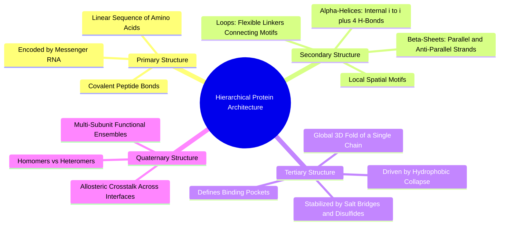

#### 2.3.1. Concept. Primary, Secondary, Tertiary, and Quaternary Structure
Proteins organize their three-dimensional structure across four hierarchical levels.

1. **Primary Structure ($1^\circ$):** The linear sequence of amino acids covalently linked by peptide bonds (e.g., $\text{Met-Ala-His-...}$). The sequence determines all downstream folding patterns.
2. **Secondary Structure ($2^\circ$):** Local, repeating conformational patterns stabilized entirely by hydrogen bonds between backbone carbonyl oxygens ($\text{C=O}$) and backbone amide hydrogens ($\text{N—H}$):
   * **Alpha Helix ($\alpha$-helix):** The polypeptide twists into a right-handed spiral. Every backbone $\text{C=O}$ at position $i$ forms a strong, linear hydrogen bond with the $\text{N—H}$ four residues downstream ($i+4$). There are $3.6$ residues per turn, with side chains projecting radially outward into the surrounding environment.
   * **Beta Sheet ($\beta$-sheet):** Extended polypeptide strands align side-by-side. Hydrogen bonds form laterally between strands. Strands can run in the same direction (**parallel**) or opposite directions (**antiparallel**). Side chains alternate, pointing above and below the plane of the sheet.
   * **Loops and Turns:** Regions lacking regular secondary structure. They connect helices and sheets, often lining the rims of binding cavities where their flexibility allows them to adapt to incoming drug molecules.
3. **Tertiary Structure ($3^\circ$):** The global, fully folded three-dimensional arrangement of a single polypeptide chain in space. Driven by the hydrophobic collapse of non-polar side chains into the interior, tertiary structure brings amino acids that were hundreds of positions apart in the linear sequence into close spatial proximity, carving out the exact geometric shape of the **drug-binding pocket**.
4. **Quaternary Structure ($4^\circ$):** The spatial assembly of multiple individual folded polypeptide chains (subunits) into a single functional biological machine (e.g., hemoglobin assembling as a tetramer of two $\alpha$ and two $\beta$ chains).

*Related Notes:*
* Connects to: `[[3.3.1. Concept. Cavity Geometry, Subpockets, and Enclosure]]`
* Connects to: `[[7.3.1. Concept. PaiNN Invariant Scalar and Equivariant Vector Features]]`
