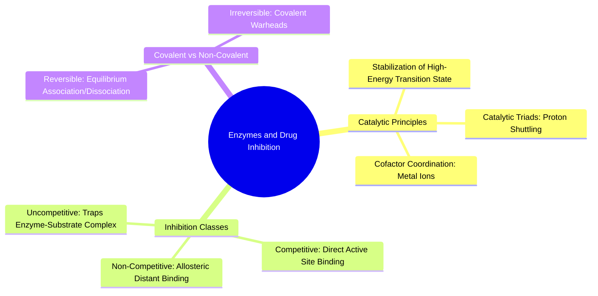

#### 2.4.1. Concept. Enzymes: Catalytic Mechanism and Inhibition Modes
**Enzymes** are biological catalysts that accelerate chemical reactions by lowering the activation energy barrier ($\Delta G^\ddagger$) without altering the overall thermodynamic equilibrium of the reaction.

1. **Transition-State Stabilization:** Enzymes do not bind their native substrates tightly. If an enzyme bound its substrate with extreme affinity, the substrate would become trapped in an energetic valley, and the reaction would stop. Instead, enzymes evolved active sites that are sterically and electrostatically complementary to the high-energy, unstable **transition state** of the reaction.
2. **Transition-State Analogs:** The most potent non-covalent enzyme inhibitors are synthetic small molecules designed to mimic the geometry and charge distribution of the reaction's transition state rather than the resting substrate.
3. **Mechanisms of Inhibition:**
   * **Competitive Inhibition:** The drug binds directly within the orthosteric active site, physically blocking the native substrate from entering. High concentrations of native substrate can outcompete and displace the drug.
   * **Allosteric (Non-Competitive) Inhibition:** The drug binds to a distinct, separate pocket far from the catalytic site. Binding induces a long-range conformational change that deforms the active site, inactivating the enzyme regardless of substrate concentration.
   * **Covalent Inhibition:** The drug carries an electrophilic functional group (a "warhead", e.g., an acrylamide) that reacts with a nucleophilic active-site residue (such as a Cysteine) to form an irreversible covalent bond.

*Related Notes:*
* Connects to: `[[4.2.1. Concept. Binding Affinity (Kd), Inhibitory Potency (IC50), and Efficacy]]`
* Connects to: `[[6.2.2. Concept. Scoring Functions: Physics-Based vs Empirical]]`
