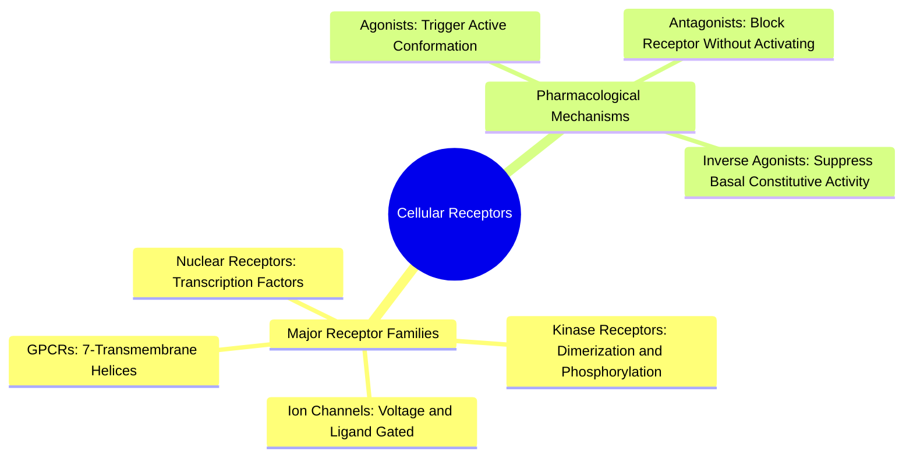

#### 2.4.2. Concept. Receptors: Agonism, Antagonism, and Signal Transduction
**Receptors** are cellular proteins responsible for sensing chemical signals (hormones, neurotransmitters) outside the cell and transmitting those signals across the cell membrane to trigger an intracellular biochemical cascade.

1. **Major Structural Families:**
   * **G-Protein Coupled Receptors (GPCRs):** The single largest class of human drug targets ($\approx 34\%$ of all FDA-approved drugs). They consist of an invariant bundle of **seven transmembrane $\alpha$-helices** embedded within the lipid bilayer. Ligand binding to the extracellular cavity forces helical rearrangement, activating an intracellular heterotrimeric G-protein.
   * **Receptor Tyrosine Kinases (RTKs):** Receptors that span the membrane once; ligand binding drives receptor dimerization, activating intracellular kinase domains that phosphorylate tyrosine residues on downstream target proteins.
   * **Ligand-Gated Ion Channels:** Membrane pores that open in response to ligand binding, permitting selective ion flux ($\text{Na}^+, \text{K}^+, \text{Ca}^{2+}, \text{Cl}^-$) across the membrane (e.g., nicotinic acetylcholine receptors).
2. **Functional Classifications of Receptor Drugs:**
   * **Agonist:** A drug that binds to the receptor and actively stabilizes its active conformation, triggering full biological signaling.
   * **Antagonist (Blocker):** A drug that binds to the receptor with high affinity but produces zero signaling, physically preventing native hormones from accessing the cavity.
   * **Inverse Agonist:** Many receptors possess basal (constitutive) signaling activity even in the total absence of native ligands. An inverse agonist binds selectively to the inactive state, shutting down this baseline signaling.

*Related Notes:*
* Connects to: `[[4.1.1. Concept. Target Identification and Validation]]`
* Connects to: `[[4.2.1. Concept. Binding Affinity (Kd), Inhibitory Potency (IC50), and Efficacy]]`
