# 03. Artificial Neural Networks (ANN) — Comprehensive

> **Prerequisites:** [[01. Fundamentals of Neural Networks]], [[02. Neural Network Architecture and Notation]]
> **Connections:** [[04. The Perceptron and the Chain Rule]], [[05. Forward Propagation and Activation Functions]], [[04.2 - Backpropagation Deep Dive]]

This note covers the formal theory of neurons, the Multi-Layer Perceptron (MLP), a worked exam exercise, backpropagation and gradient descent, and ANN classification. It is the comprehensive reference for ANN fundamentals.

---

# 2.1. Artificial Neural Network Fundamentals

This note covers the building block of Deep Learning: the Artificial Neuron (also called the Perceptron). It explains how biological inspiration translates into mathematical formulas.

## 1. The Formal Neuron
An Artificial Neural Network (ANN) is a computational model inspired by the human brain. It consists of layers of artificial neurons that process data and learn patterns automatically.

### The Biological vs. Mathematical Analogy
*   **Biological:** A neuron receives electrical signals via dendrites, processes them in the cell body (soma), and if the signal is strong enough, fires an output through the axon.
*   **Mathematical:** The "Formal Neuron" is a parametric algebraic function. It acts on input values to compute an output value.

### The Mathematical Formula
The output $y$ of a single neuron is calculated as:

$$ y = f\left(\sum_{i=1}^{n} w_i \cdot P_i + b\right) $$

#### Components Breakdown:
1.  **$P_i$ (Inputs):** These are the raw data points (e.g., pixel values of an image) or outputs from a previous layer.
2.  **$W_i$ (Weights):**
    *   Determine the **importance** of each input.
    *   A high weight means that specific input strongly influences the output.
    *   *Learning* essentially means adjusting these $W$ values.
3.  **$\Sigma$ (Weighted Sum):** The linear combination of inputs and weights.
    *   Formula: $n = (P_1 \cdot W_1) + (P_2 \cdot W_2) + \dots + (P_R \cdot W_R)$.
    *   This is often called the **Potential ($n$)**.
4.  **$b$ (Bias):**
    *   An additional term that allows the activation function to be shifted.
    *   *Tip:* Think of bias as the intercept $b$ in the line equation $y = ax + b$. Without it, the line must always pass through the origin $(0,0)$, which limits flexibility.
5.  **$f$ (Activation Function):** Defines the final output. It introduces non-linearity (explained below).
6.  **$y$ (Output):** The final result passed to the next layer.

### Vector Notation
To make calculations efficient (especially in programming), we use vectors:
*   Input Vector $P = [P_1, P_2, \dots, P_R]^T$
*   Weight Vector $W = [W_1, W_2, \dots, W_R]$
*   Potential $n = W \cdot P + b$

---

## 2. Activation Functions
The **Activation Function** (or Transfer Function) decides the output based on the potential $n$. Its most critical role is introducing **non-linearity**, allowing the network to learn complex curves rather than just straight lines.

### A. Linear Function
*   **Formula:** $f(n) = \lambda \cdot n$ (or just $f(n) = n$)
*   **Graph:** A straight diagonal line.
*   **Use Case:** Rarely used in hidden layers because stacking linear functions just creates another linear function. Used sometimes in the output layer for regression.

### B. Step Function (Threshold)
*   **Formula:**
    $$ f(n) = \begin{cases} \lambda & \text{if } n \geq 0 \\ 0 & \text{if } n < 0 \end{cases} $$
*   **Description:** The neuron is either "ON" or "OFF".
*   **Limitation:** Not differentiable at 0, making it hard to use with modern learning algorithms like Gradient Descent.

### C. ReLU (Rectified Linear Unit)
*   **Formula:**
    $$ f(n) = \begin{cases} n & \text{if } n > 0 \\ 0 & \text{if } n \leq 0 \end{cases} $$
*   **Graph:** Flat for negative numbers, linear for positive.
*   **Importance:** The most popular function for hidden layers in Deep Learning today because it is computationally fast and solves the "vanishing gradient" problem.

### D. Sigmoid Function
*   **Formula:** $f(n) = \frac{1}{1 + e^{-\lambda n}}$
*   **Range:** $[0, 1]$
*   **Graph:** An "S" curve.
*   **Use Case:** Good for probability outputs, but computationally expensive due to $e$.

### E. Hyperbolic Tangent (tanh)
*   **Formula:** $f(n) = \tanh(n) = \frac{e^n - e^{-n}}{e^n + e^{-n}}$
*   **Range:** $[-1, 1]$
*   **Graph:** Similar to Sigmoid but centered at 0.
*   **Advantage:** Often converges faster than Sigmoid because the data is centered around zero.

---

# 2.2. Multi-Layer Perceptron (MLP) Architecture

This note explains how single neurons are combined to form a network and the flow of data (Feed Forward).

## 1. Network Architecture
An Artificial Neural Network (ANN) is organized into layers.

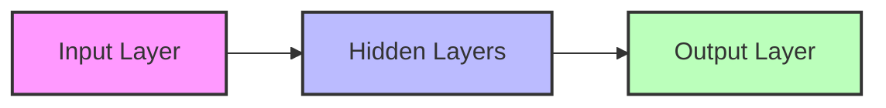

1.  **Input Layer:**
    *   Receives raw data (e.g., pixels of an image).
    *   No calculations happen here; it just passes values.
2.  **Hidden Layers:**
    *   Perform calculations and feature extraction.
    *   "Hidden" because the user does not see these values directly.
    *   Deep Learning = Many hidden layers.
3.  **Output Layer:**
    *   Produces the final result (prediction or classification).

### Direction of Flow
*   **Feed-Forward:** Information flows only in one direction: Input $\to$ Output. There are no loops.
*   **Recurrent/Feedback:** Information can loop back. (Not covered in this chapter, but mentioned as a comparison).

## 2. Matrix Notation for MLP
Calculating one neuron at a time is slow. We use matrices to calculate whole layers at once.

If we have a layer with indices $j$ connecting to a layer with indices $i$:
$$ N = W \cdot A_{prev} + B $$
*   $N$: Vector of potentials for the current layer.
*   $W$: Weight matrix.
*   $A_{prev}$: Output (activation) vector from the previous layer.
*   $B$: Bias vector.

---

# 2.3. Detailed Exercise Solution: MLP Calculation

**Context:** This note details the "Exo Examen" (Exam Exercise) found on Page 5 of the PDF. This is a crucial practical example of how a Forward Pass works.

## The Problem Setup
We have an MLP with the following structure:
*   **Input Layer:** 3 Neurons ($P_1, P_2, P_3$).
*   **Hidden Layer:** 2 Neurons ($n_1, n_2$).
    *   Activation Function: **Hyperbolic Tangent (tanh)**.
*   **Output Layer:** 3 Neurons ($S_1, S_2, S_3$).
    *   Activation Function: **Linear** (Identity).

### Diagram Representation
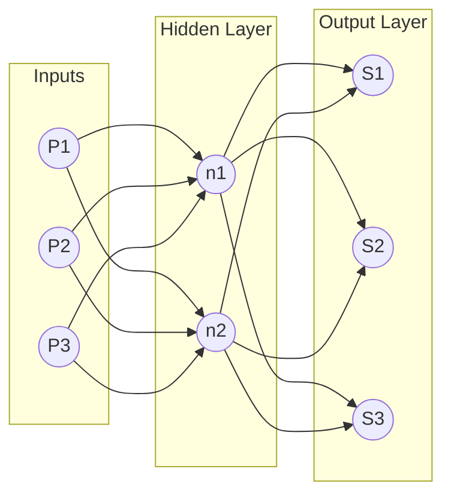

## Step 1: Calculating the Hidden Layer (Layer 1)
We need to calculate the *potential* ($n$) and the *activation* ($a$) for the hidden neurons.

### Notation Reminder
*   $W_{ij}^L$: Weight connecting neuron $j$ of the previous layer to neuron $i$ of layer $L$.
    *   *Note:* The PDF writes $W_{12}^1$ meaning weight to neuron 1 (layer 1) from input 2.
    *   *Be Careful:* Do not confuse the superscript 1 (Layer 1) with an exponent (power of 1).

### The Equations
The potentials for the hidden neurons are calculated as:
$$ n_1^1 = P_1 \cdot W_{11}^1 + P_2 \cdot W_{12}^1 + P_3 \cdot W_{13}^1 + b_1^1 $$
$$ n_2^1 = P_1 \cdot W_{21}^1 + P_2 \cdot W_{22}^1 + P_3 \cdot W_{23}^1 + b_2^1 $$

**Matrix Form:**
$$
\begin{bmatrix} n_1^1 \\ n_2^1 \end{bmatrix} =
\begin{bmatrix} W_{11}^1 & W_{12}^1 & W_{13}^1 \\ W_{21}^1 & W_{22}^1 & W_{23}^1 \end{bmatrix}
\times
\begin{bmatrix} P_1 \\ P_2 \\ P_3 \end{bmatrix}
+
\begin{bmatrix} b_1^1 \\ b_2^1 \end{bmatrix}
$$

### The Activation (Output of Hidden Layer)
The problem states the activation function is **tanh**.
$$ a_1^1 = f(n_1^1) = \frac{e^{n_1} - e^{-n_1}}{e^{n_1} + e^{-n_1}} $$
$$ a_2^1 = f(n_2^1) = \frac{e^{n_2} - e^{-n_2}}{e^{n_2} + e^{-n_2}} $$

These values ($a_1^1, a_2^1$) become the *inputs* for the next layer.

---

## Step 2: Calculating the Output Layer (Layer 2)
Now we compute the final outputs using the activations from the hidden layer.

### The Equations
$$ n_1^2 = a_1^1 \cdot W_{11}^2 + a_2^1 \cdot W_{12}^2 + b_1^2 $$
$$ n_2^2 = a_1^1 \cdot W_{21}^2 + a_2^1 \cdot W_{22}^2 + b_2^2 $$
$$ n_3^2 = a_1^1 \cdot W_{31}^2 + a_2^1 \cdot W_{32}^2 + b_3^2 $$

### The Final Activation
The problem states the output activation function is **Linear**.
Therefore, the final output $S$ is equal to the potential $n$:
$$ S_1 = n_1^2 $$
$$ S_2 = n_2^2 $$
$$ S_3 = n_3^2 $$

> **Important Tip for Exams:**
> Always check the activation function for the *Output* layer. In regression problems, it is often Linear. In classification problems (like determining if an image is a cat or dog), it is often Sigmoid or Softmax. Don't blindly apply Tanh or ReLU to the final layer unless specified.

---

# 2.4. Learning Algorithms and Error Calculation

This note covers the concepts on Page 6 and 7: How the network actually "learns" by measuring error.

## 1. The Goal of Learning
Learning involves updating the weights ($W$) to minimize the difference between what the network predicts and what the true answer is.

*   **$g_i(k)$:** The **Actual/Target** output (the ground truth from your dataset).
*   **$a_i(k)$:** The **Computed/Predicted** output (what your ANN produced).

## 2. Calculating Error
The error for a specific output neuron $i$ on sample $k$ is:
$$ e_i(k) = g_i(k) - a_i(k) $$

### Total Error (Loss Function)
To evaluate the whole network, we calculate the **Mean Squared Error (MSE)**. We square the error to eliminate negative signs and penalize large errors more heavily.
$$ E(k) = \frac{1}{2} \sum_{i=1}^{R} (g_i(k) - a_i(k))^2 $$
*   The $\frac{1}{2}$ is a mathematical convenience that cancels out when we take the derivative later.

## 3. Types of Learning (Updating Weights)
1.  **Incremental Learning (Stochastic):**
    *   Update weights after *every single sample* is presented.
    *   Fast, but the error path is noisy/bumpy.
2.  **Batch Learning:**
    *   Calculate the error for *all K samples* in the dataset first.
    *   Update weights once based on the average error.
    *   Mathematically stable, but requires more memory.
    *   **Epoch:** One complete pass through the entire dataset.

---

# 2.5. Gradient Descent and Backpropagation (The Math)

This is the most technically complex part of the notes (Page 7). It explains *how* we calculate the change in weights ($\Delta W$).

## 1. Gradient Descent Concept
Imagine you are on a mountain (the error function) and want to get to the bottom (zero error).
*   The **Gradient** tells you which way is "up".
*   To minimize error, we go in the **opposite direction** of the gradient.

### The Update Rule
$$ W_{new} = W_{old} + \Delta W $$
$$ \Delta W = -\eta \cdot \frac{\partial E}{\partial W} $$

*   $\eta$ (Eta): **Learning Rate**. Usually a small number between 0 and 1 (e.g., 0.01).
    *   If too big: You overshoot the minimum.
    *   If too small: Learning takes forever.
*   $\frac{\partial E}{\partial W}$: The derivative (gradient) of the error with respect to the weight.

## 2. Derivation of the Delta Rule (Chain Rule)
To find $\Delta W$, we must use the **Chain Rule** of calculus, because the Error $E$ depends on Output $a$, which depends on Potential $n$, which depends on Weight $W$.

$$ \frac{\partial E}{\partial W_{ij}} = \frac{\partial E}{\partial a_i} \cdot \frac{\partial a_i}{\partial n_i} \cdot \frac{\partial n_i}{\partial W_{ij}} $$

Let's break down the derivation provided in the notes (specifically for the Tanh function):

### Step A: Derivative of Error vs Output
Since $E = \frac{1}{2}(g - a)^2$:
$$ \frac{\partial E}{\partial a} = -(g - a) = -e(k) $$

### Step B: Derivative of Output vs Potential (The Activation Derivative)
The notes use $f(n) = \tanh(n)$.
We need the derivative $f'(n)$.
*   Identity: $f'(n) = 1 - f(n)^2$
*   So, $\frac{\partial a}{\partial n} = 1 - a^2$

### Step C: Derivative of Potential vs Weight
Since $n = W \cdot P$:
$$ \frac{\partial n}{\partial W} = P \text{ (the input to that connection)} $$

### Step D: Combining them (The Delta Rule)
Putting it all together for the weight update $\Delta W_{ij}$:

$$ \Delta W_{ij} = \eta \cdot \underbrace{e_i(k)}_{\text{Error}} \cdot \underbrace{(1 - a_i(k)^2)}_{\text{Slope of Tanh}} \cdot \underbrace{P_j(k)}_{\text{Input}} $$

> **Summary:** The change in weight is proportional to the **Error**, the **Derivative of the Activation Function**, and the **Input** that caused it.

---

# 2.6. ANN for Classification (Chapter 02 Content)

This note covers the content starting on Page 8: Applying the math above to classification problems (e.g., Iris Dataset).

## 1. Regression vs. Classification
*   **Regression:** Predicting a continuous number (e.g., Price of a house, temperature). Output layer usually has 1 neuron with Linear activation.
*   **Classification:** Predicting a category (e.g., Is this flower Setosa, Versicolor, or Virginica?).

## 2. One-Hot Encoding
Neural networks work with numbers, not text labels like "Setosa". We convert labels into vectors.
*   **Example (Iris Dataset):**
    *   Iris Setosa $\to [1, 0, 0]$
    *   Iris Versicolor $\to [0, 1, 0]$
    *   Iris Virginica $\to [0, 0, 1]$

This requires the Output Layer to have **3 Neurons** (one for each class).

## 3. The Softmax Function
For multi-class classification, we usually use the **Softmax** activation function in the output layer.
*   It converts raw outputs into **probabilities**.
*   The sum of all outputs will equal 1 ($100\%$).

### Interpretation Example
If the network outputs: $[0.62, 0.23, 0.15]$
*   Neuron 1 (Class 0): 62% probability.
*   Neuron 2 (Class 1): 23% probability.
*   Neuron 3 (Class 2): 15% probability.

**Conclusion:** The network classifies this input as **Class 0**.

## 4. Confusion Matrix (Evaluation)
To test how well the classification works, we compare Predicted vs. Actual values using a matrix.

| | Predicted Yes | Predicted No |
| :--- | :---: | :---: |
| **Actual Yes** | True Positive (TP) | False Negative (FN) |
| **Actual No** | False Positive (FP) | True Negative (TN) |

*   **TP:** Correctly identified positive.
*   **TN:** Correctly identified negative.
*   **FP (Type 1 Error):** Predicted Yes, but it was No.
*   **FN (Type 2 Error):** Predicted No, but it was Yes.


---

## Complementary Notes — Non-Academic Summary

> *Source file: `Non Academic/Machine Learning/04. Artificial Neural Networks (ANN) & Deep Learning.md`*


# 3.1. The Biological & Formal Neuron

Artificial Neural Networks (ANN) are a branch of Machine Learning inspired by the architecture of the human brain. The goal is to simulate the massive parallelism and learning capability of biological neurons.

## 1. The Biological Inspiration
To understand the math, we must look at the biological architecture:
1.  **Dendrites:** Receivers of electrical signals from other neurons.
2.  **Soma (Cell Body):** Sums the incoming signals. If the total electrical potential reaches a certain threshold, the neuron "fires."
3.  **Axon:** The transmission line that sends the signal to the next neuron.
4.  **Synapse:** The connection point. Learning happens by strengthening or weakening these connections.

---

## 2. The Formal Neuron (The Perceptron)
The **Formal Neuron** is the mathematical abstraction of the biological process. It is a parametric function that maps an input vector to a single output.

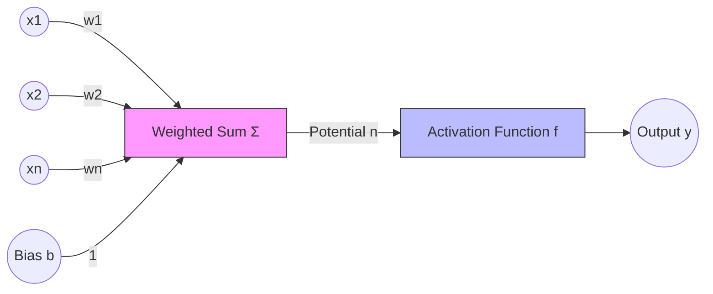

### The Mathematical Components:
1.  **Inputs ($x_i$):** The data features or outputs from a previous layer.
2.  **Weights ($w_i$):** Represent the **synaptic strength**. They determine how much influence a specific input has on the final output.
3.  **Bias ($b$):** 
    *   An additional parameter that allows the activation function to shift.
    *   **Analogy:** The bias is like a "threshold of stubbornness." It determines how high the signal must be before the neuron fires. Without it, the model would always be forced through the origin $(0,0)$.
4.  **The Potential ($n$):** The linear combination of inputs and weights.
    $$ n = \sum_{i=1}^{k} (w_i \cdot x_i) + b $$
5.  **Activation Function ($f$):** A non-linear function applied to the potential to produce the output.
6.  **Output ($y$):**
    $$ y = f(n) = f\left(\sum w_i x_i + b\right) $$

---

## 3. Vector and Matrix Notation
In practice, calculating neurons individually is inefficient. We treat inputs and weights as vectors:

*   **Input Vector:** $X = [x_1, x_2, \dots, x_n]^T$
*   **Weight Vector:** $W = [w_1, w_2, \dots, w_n]$
*   **Vector Equation:** $y = f(W \cdot X + b)$

> [!IMPORTANT] The Role of Learning
> When we say a Neural Network is "learning," we mean it is iteratively adjusting the values of **$W$ (weights)** and **$b$ (bias)** to minimize the error in its predictions.


# 3.2. Activation Functions Deep Dive

The activation function is the most critical component for making a Neural Network "Deep." Without it, the network would just be a series of linear regressions.

## 1. The Necessity of Non-Linearity
If we stack multiple layers of linear neurons (e.g., $f(x) = ax$), the result is still a linear function: $f(g(x)) = a(bx) = (ab)x$. 
**Linear layers cannot learn complex shapes.** 
Activation functions introduce "bends" and "curves" in the math, allowing the network to approximate any continuous function (Universal Approximation Theorem).

---

## 2. Common Activation Functions

### A. The Step Function (Heaviside)
*   **Formula:** $f(n) = 1$ if $n \ge 0$, else $0$.
*   **Use Case:** Early Perceptrons (Binary logic).
*   **Problem:** It is not differentiable at 0. You cannot use it with Gradient Descent because the "slope" is zero everywhere else.

### B. The Linear Function
*   **Formula:** $f(n) = n$
*   **Use Case:** Often used in the **Output Layer** for Regression tasks where you need to predict a raw number (like price).

### C. The Sigmoid Function (Logistic)
*   **Formula:** $\sigma(n) = \frac{1}{1 + e^{-n}}$
*   **Range:** $(0, 1)$
*   **Use Case:** Output layer for binary classification (gives a probability).
*   **Drawback:** For very high or low inputs, the slope is almost zero. This causes the **Vanishing Gradient** problem (learning stops).

### D. The Tanh Function (Hyperbolic Tangent)
*   **Formula:** $f(n) = \frac{e^n - e^{-n}}{e^n + e^{-n}}$
*   **Range:** $(-1, 1)$
*   **Advantage:** Zero-centered. It generally performs better than Sigmoid in hidden layers because it centers the data for the next layer.

### E. The ReLU Function (Rectified Linear Unit)
*   **Formula:** $f(n) = \max(0, n)$
*   **Range:** $[0, \infty)$
*   **Why it's King:** It is computationally very fast (no exponents) and does not saturate for positive values, meaning it learns faster than Sigmoid or Tanh. It is the **default choice** for hidden layers.

---

## 3. Comparison Table

| Function | Formula | Range | Best For... |
| :--- | :--- | :--- | :--- |
| **Linear** | $n$ | $(-\infty, \infty)$ | Regression Output |
| **Sigmoid**| $1/(1+e^{-n})$ | $(0, 1)$ | Binary Classification Output |
| **Tanh** | $\tanh(n)$ | $(-1, 1)$ | Hidden Layers (Standard) |
| **ReLU** | $\max(0, n)$ | $[0, \infty)$ | Hidden Layers (Modern/Deep) |
| **Softmax**| $e^{z_i}/\sum e^{z_j}$| $(0, 1)$ | Multi-class Classification Output |

> [!TIP] Exam Tip
> If asked which function to use for hidden layers in a Deep Network, always answer **ReLU**. If asked for binary classification output, answer **Sigmoid**.


# 3.3. Multi-Layer Perceptron (MLP) Architecture

A single neuron is limited. To solve complex problems, we organize neurons into a structure called a **Multi-Layer Perceptron (MLP)**.

## 1. Layer Organization
An MLP consists of three types of layers:

1.  **Input Layer:** 
    *   One neuron for every feature in your data.
    *   No computation happens here; it just receives the data.
2.  **Hidden Layers:** 
    *   One or more layers between input and output.
    *   This is where feature extraction happens.
3.  **Output Layer:** 
    *   Produces the final prediction.
    *   1 neuron for Regression.
    *   $N$ neurons for Classification (where $N$ is the number of classes).

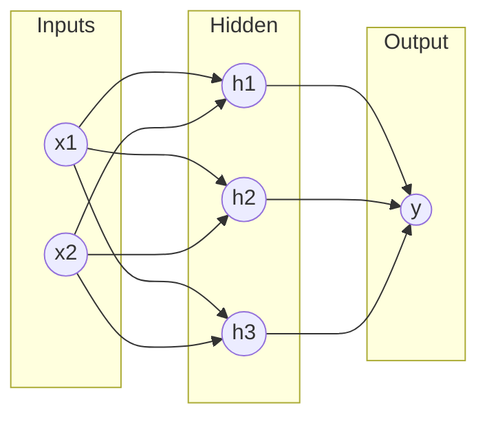

---

## 2. Feed-Forward Mechanism
In an MLP, information flows in **one direction**: Input $\to$ Hidden $\to$ Output. There are no loops or cycles.

### Forward Pass Calculation (Exhaustive Step-by-Step)
Imagine an MLP with:
*   Inputs: $P_1, P_2$
*   Hidden Layer: $n_1, n_2$ (Tanh activation)
*   Output Layer: $S$ (Linear activation)

**Step 1: Hidden Layer Potentials ($n$)**
$$ n_1^{hidden} = P_1 W_{11}^1 + P_2 W_{12}^1 + b_1^1 $$
$$ n_2^{hidden} = P_1 W_{21}^1 + P_2 W_{22}^1 + b_2^1 $$

**Step 2: Hidden Layer Activations ($a$)**
$$ a_1^{hidden} = \tanh(n_1^{hidden}) $$
$$ a_2^{hidden} = \tanh(n_2^{hidden}) $$

**Step 3: Output Layer Potential ($n$)**
The outputs of the hidden layer ($a$) become the inputs for the output layer.
$$ n^{output} = a_1^{hidden} W_{11}^2 + a_2^{hidden} W_{12}^2 + b^2 $$

**Step 4: Final Output ($S$)**
$$ S = \text{Linear}(n^{output}) = n^{output} $$

---

## 3. Matrix Representation (Vectorization)
To calculate a whole layer at once:
$$ A^L = f(W^L \cdot A^{L-1} + B^L) $$
*   $A^L$: Output of current layer.
*   $W^L$: Matrix of weights for current layer.
*   $A^{L-1}$: Output of previous layer.
*   $B^L$: Vector of biases for current layer.

> [!NOTE] Deep Learning Definition
> A "Deep" Neural Network is simply an MLP with many hidden layers. GPUs are used because they can calculate the matrix multiplication $W \cdot A$ for millions of neurons simultaneously.


# Sparsity / Sparse Activations

## Definition
A neural network is **sparse** when **most of its neurons are inactive (output zero) at any given time**.

---

## How It Happens
- **ReLU** naturally creates sparsity: negative inputs → output = 0
- These "dead" neurons don't contribute to the next layer

---

## Example
```
Layer with 1000 neurons
Only 300 neurons fire (output > 0) for a given input
→ 70% sparsity
```

---

## Visual: Dense vs Sparse Activations

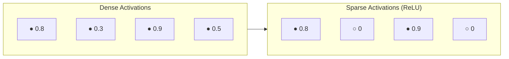

---

## Why Sparsity Matters

| Benefit | Explanation |
|---------|-------------|
| **Computational Efficiency** | Fewer active neurons → fewer calculations |
| **Better Generalization** | Network focuses on important features, not all neurons |
| **Memory Efficiency** | Sparse matrices can be stored more compactly |
| **Reduced Overfitting** | Less reliance on every neuron reduces memorization |

---

## How ReLU Creates Sparsity

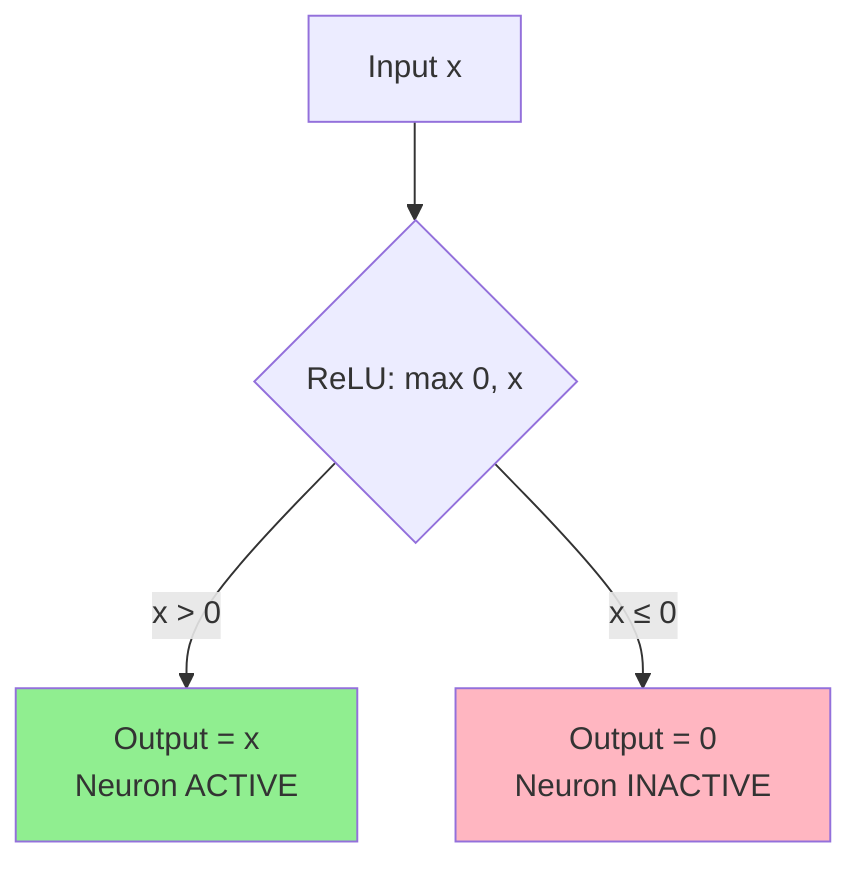

---

## Quick Memory Aid
**Sparse** = Many zeros = Efficiency + Better Generalization


# 3.4. Backpropagation & Learning Dynamics

Learning in a Neural Network is the process of minimizing a **Loss Function** by adjusting weights using the **Backpropagation** algorithm and **Gradient Descent**.

## 1. Measuring Error (The Loss)
For a given input sample $k$, we define the error as the difference between the actual target ($g$) and the predicted activation ($a$).

**Mean Squared Error (MSE):**
$$ E = \frac{1}{2} \sum_{i=1}^{R} (g_i - a_i)^2 $$
*   We square the error to make it positive.
*   The $\frac{1}{2}$ is for calculus convenience (cancels the 2 when derived).

---

## 2. The Learning Rule (Delta Rule)
We want to update each weight $w_{ij}$ in the direction that reduces the error $E$.
$$ w_{new} = w_{old} - \mu \frac{\partial E}{\partial w} $$
*   $\mu$: **Learning Rate**.
*   $\frac{\partial E}{\partial w}$: **The Gradient** (how much the error changes if we wiggle the weight).

---

## 3. Backpropagation Intuition (The Chain Rule)
How do we find the gradient for a weight buried deep in the hidden layers? We use the **Chain Rule** from calculus to propagate the error backwards from the output.

**The Chain of Influence:**
Weight $\to$ Potential ($n$) $\to$ Activation ($a$) $\to$ Error ($E$)

$$ \frac{\partial E}{\partial w} = \frac{\partial E}{\partial a} \cdot \frac{\partial a}{\partial n} \cdot \frac{\partial n}{\partial w} $$

### Breaking Down the Derivation:
1.  **$\frac{\partial E}{\partial a}$:** Derivative of Error vs Output. 
    *   Result: $-(g - a)$
2.  **$\frac{\partial a}{\partial n}$:** Derivative of the Activation Function.
    *   If using Tanh: $(1 - a^2)$
3.  **$\frac{\partial n}{\partial w}$:** Derivative of the Potential vs Weight.
    *   Result: $Input$ (the signal coming into that connection).

### Final Weight Update ($\Delta w$):
$$ \Delta w = \mu \cdot \text{Error} \cdot \text{Slope of Activation} \cdot \text{Input} $$

---

## 4. Training Modes
*   **Incremental (Stochastic) Learning:**
    *   Update weights after **every single sample**.
    *   Fast, but noisy path to the minimum.
*   **Batch Learning:**
    *   Calculate the average error for the **entire dataset** (one Epoch).
    *   Update weights once.
    *   Stable, but requires more memory and time per update.

> [!WARNING] The Learning Rate Trap
> *   **If $\mu$ is too high:** The weights will oscillate and explode (divergence).
> *   **If $\mu$ is too low:** The network will take weeks to learn (too slow).
> *   **Standard values:** $0.01, 0.001, 0.0001$.


# Gradient Flow

## Definition
**Gradient flow** describes how gradients propagate backward through layers during training.

---

## Good vs Poor Gradient Flow

```mermaid
flowchart TB
    subgraph Good[" Good Gradient Flow"]
        G_Input[Input Layer]
        G_H1[Hidden Layer 1]
        G_H2[Hidden Layer 2]
        G_Out[Output Layer]
        
        G_Out -->|Strong| G_H2
        G_H2 -->|Strong| G_H1
        G_H1 -->|Strong| G_Input
    end
    
    subgraph Poor[" Poor Gradient Flow"]
        P_Input[Input Layer]
        P_H1[Hidden Layer 1]
        P_H2[Hidden Layer 2]
        P_Out[Output Layer]
        
        P_Out -->|Strong| P_H2
        P_H2 -->|Weak| P_H1
        P_H1 -->|Tiny| P_Input
    end
    
    style G_Input fill:#90EE90
    style G_H1 fill:#90EE90
    style G_H2 fill:#90EE90
    style G_Out fill:#98FB98
    
    style P_Input fill:#FFB6C1
    style P_H1 fill:#FFA07A
    style P_H2 fill:#90EE90
    style P_Out fill:#98FB98
```

---

## Factors Affecting Gradient Flow

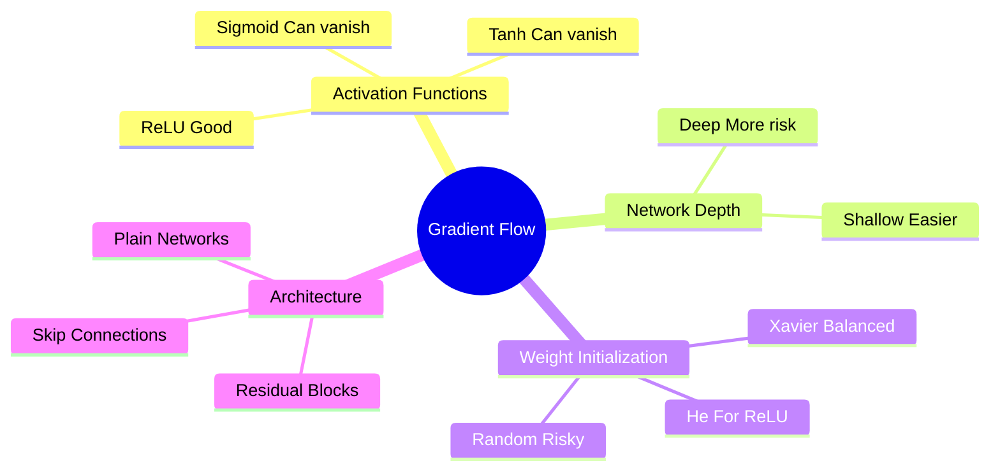

| Factor | Impact |
|--------|--------|
| **Activation Functions** | ReLU improves flow; Sigmoid/Tanh hinder it |
| **Network Depth** | Deeper = more opportunities for degradation |
| **Weight Initialization** | Poor initialization → poor flow from start |
| **Skip Connections** | Provide "highways" for gradients |

---

## Why It's Important

1. **All layers learn properly** with good gradient flow
2. **Faster convergence** during training
3. **Enables training very deep networks** (100+ layers)

---

## The ReLU Advantage

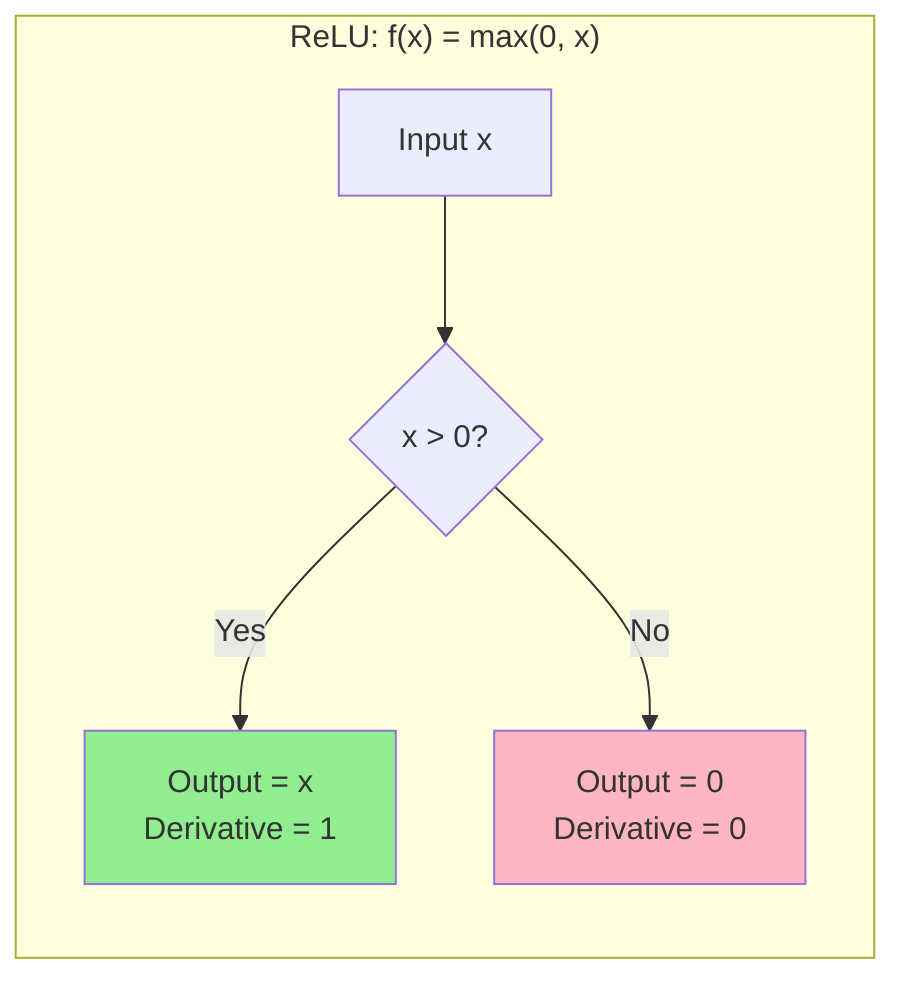

**For positive inputs:**
- Gradient = 1 (passes through unchanged!)
- No multiplication of small numbers
- Gradient preserved through many layers

---

## How Skip Connections Help

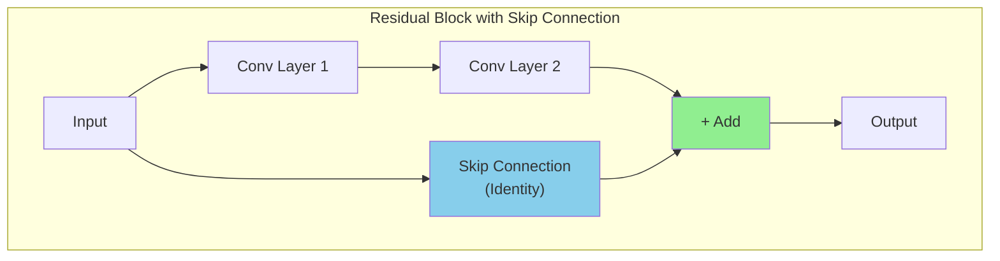

**Benefits:**
- Gradient can flow directly through skip connection
- Even if main path has vanishing gradients, skip path preserves them
- Enables training of 100+ layer networks

---

## Quick Memory Aid
**Gradient Flow** = Highway for learning signals → ReLU + Skip Connections keep it smooth

# Vanishing Gradient

## Definition
During backpropagation, **gradients (used to update weights) become extremely small**, often near 0, as they propagate backward through deep networks.

---

## The Problem: Gradients Shrink Through Layers

```mermaid
flowchart LR
    subgraph Backward["← Backpropagation Direction"]
        L1["Layer 1<br/>Gradient: TINY"]
        L2["Layer 2<br/>Gradient: Small"]
        L3["Layer 3<br/>Gradient: Medium"]
        LN["Layer N (Output)<br/>Gradient: Large"]
    end
    
    L1 <-- L2 <-- L3 <-- LN
    
    style L1 fill:#FFB6C1
    style L2 fill:#FFA07A
    style L3 fill:#90EE90
    style LN fill:#98FB98
```

---

## Why It Happens

| Activation | Derivative Range | Problem |
|------------|------------------|---------|
| **Sigmoid** | 0 to 0.25 | Derivative ≤ 0.25, multiplies down layers |
| **Tanh** | 0 to 1 | Derivative ≤ 1, still can vanish |
| **ReLU** | 0 or 1 | No vanishing for positive inputs! |

---

## Mathematical Explanation

```
For sigmoid: σ'(x) = σ(x) × (1 - σ(x))
Maximum value = 0.25 (when σ(x) = 0.5)

In a 10-layer network:
0.25^10 ≈ 0.0000000009 → gradient is essentially ZERO
```

---

## Visual: Sigmoid Derivative Problem

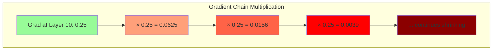

---

## Consequences

1. **Early layers learn very slowly** or almost not at all
2. **Training becomes inefficient** or fails entirely
3. **Deep networks become impossible to train**

---

## Solutions

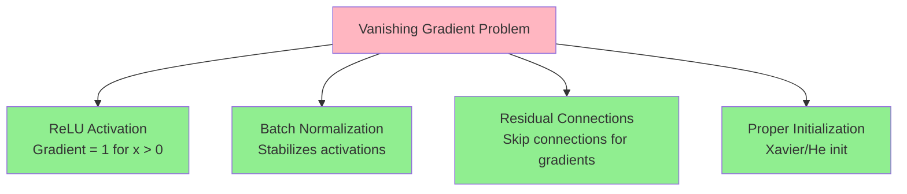

| Solution | How It Helps |
|----------|--------------|
| **ReLU Activation** | Gradient = 1 for positive inputs (no vanishing) |
| **Batch Normalization** | Normalizes activations, stabilizes gradients |
| **Residual Connections** | Skip connections allow gradients to flow directly |
| **Proper Initialization** | Xavier/He initialization prevents early vanishing |

---

## Quick Memory Aid
**Vanishing Gradient** = Gradients disappear → Can't learn → Use ReLU to fix

# ResNet (Residual Networks)

## What is ResNet?

**ResNet** (Residual Network) is a family of deep convolutional neural network architectures introduced to make very deep networks trainable by using **skip connections** (also called shortcut connections). It solved the problem that simply stacking more layers often made training **worse** (not better) due to vanishing/exploding gradients and optimization difficulties.

---

## The Problem: Why Do We Need ResNet?

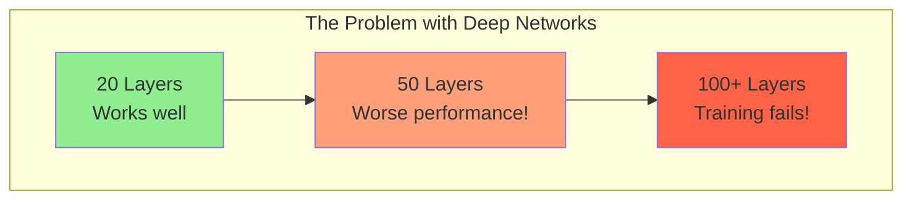

**Paradox:** Deeper networks should perform better, but they often perform **worse** due to:
- **Vanishing gradients** - early layers don't learn
- **Degradation problem** - even with good initialization, deeper = harder to optimize

---

## Intuition / Motivation

When you stack many layers, it becomes hard for SGD to update weights so deeper layers improve performance. ResNet puts **identity shortcuts** that let gradients and signals flow directly through the network.

### Key Insight
Instead of forcing a block to learn a full mapping **H(x)**, you ask it to learn the **residual**:

$$F(x) = H(x) - x$$

Then the block output is:

$$\text{output} = F(x) + x$$

**If the block cannot improve on identity**, it can learn F(x) ≈ 0 so the block behaves like an identity — this stabilizes very deep nets.

---

## The Solution: Skip Connections

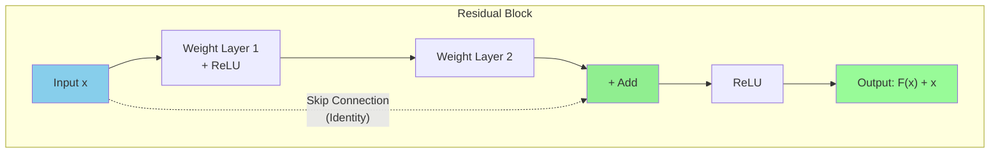

---

## Plain Network vs ResNet

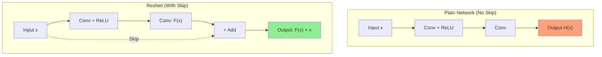

---

## The Residual Block (Two Variants)

### Basic Block (ResNet-18 / ResNet-34)

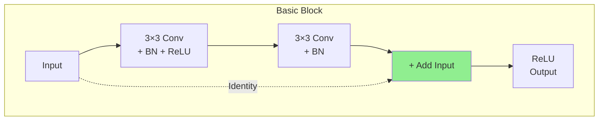

- Two 3×3 convolutions (Conv-BN-ReLU), then add the input (x)
- If spatial or channel dimensions change (stride >1 or different channels), a **projection** (1×1 conv) is applied to x to match shapes

### Bottleneck Block (ResNet-50/101/152)

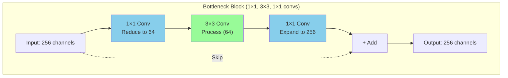

- 1×1 conv reduces channels → 3×3 conv processes → 1×1 conv expands channels
- Reduces computation while allowing deeper models

---

## Why Skip Connections Help (Gradient View)

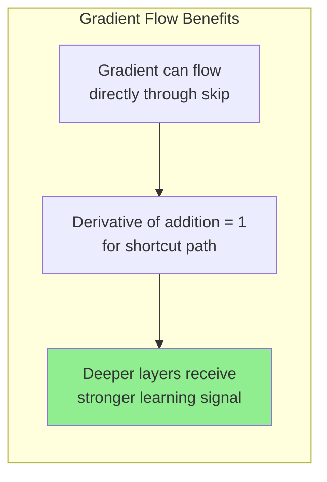

### 1. **Gradient Highway**
- Skip connection acts as a "gradient superhighway"
- Gradients flow backward without being multiplied by small numbers
- Derivative of addition is 1 for the shortcut path

### 2. **Easy Identity Learning**
- If the best solution is to pass input unchanged, network can learn F(x) = 0
- Then H(x) = 0 + x = x (identity mapping)

### 3. **Solves Degradation Problem**
- Adding more layers doesn't hurt performance
- Network can always learn to ignore extra layers if needed

---

## ResNet Versions and Differences

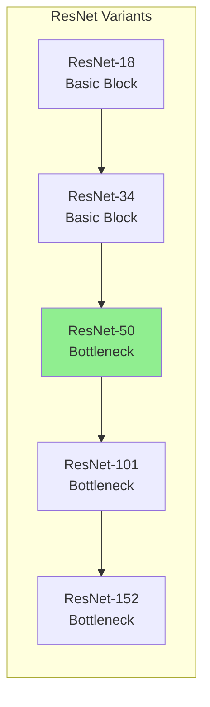

| Model | Layers | Block Type | Use Case |
|-------|--------|------------|----------|
| ResNet-18 | 18 | Basic | Small datasets, fast training |
| ResNet-34 | 34 | Basic | Medium complexity tasks |
| **ResNet-50** | 50 | Bottleneck | **Most popular, good balance** |
| ResNet-101 | 101 | Bottleneck | Complex tasks, more compute |
| ResNet-152 | 152 | Bottleneck | Research, maximum accuracy |

### ResNet-v2 (Pre-activation)
- Reorders block as **BN → ReLU → Conv**
- Helps optimization and generalization in very deep models

---

## ResNet vs Previous Architectures

```mermaid
flowchart TB
    subgraph Comparison["Evolution of Deep Networks"]
        VGG["VGG (2014)<br/>Very deep but slow<br/>No skip connections"]
        ResNet["ResNet (2015)<br/>Deeper AND faster<br/>Skip connections "]
        DenseNet["DenseNet (2017)<br/>Dense connections<br/>Even better gradient flow"]
    end
    
    VGG --> ResNet --> DenseNet
    
    style ResNet fill:#90EE90
```

---

## Practical Details / Training Tips

```mermaid
mindmap
    root((ResNet Training))
        Normalization
            BatchNorm after Conv
            Essential for ResNets
        Initialization
            He/Kaiming init
            Standard for ReLU nets
        Learning Rate
            Step decay
            Cosine annealing
            Warmup
        Skip Connection
            Identity if same shape
            Projection 1×1 if changed
        Transfer Learning
            Remove final FC
            Attach your head
```

| Tip | Details |
|-----|---------|
| **BatchNorm** | Use after convolutions (ResNets rely on it) |
| **Initialization** | He initialization (Kaiming) is standard |
| **Learning Rate** | Typical schedules: step decay, cosine, warmup |
| **Projection** | If channels/stride change, use 1×1 conv in shortcut |
| **Transfer Learning** | Remove final FC layer and attach your custom head |

---

## Common Uses

```mermaid
flowchart TB
    subgraph Uses["ResNet Applications"]
        IC["Image Classification<br/>(ImageNet)"]
        DET["Detection Backbones<br/>(Faster R-CNN, Mask R-CNN)"]
        SEG["Segmentation<br/>(FCN, DeepLab)"]
        TL["Transfer Learning<br/>(Vision & Multi-modal)"]
        NV["Non-Vision Domains<br/>(Deep feedforward nets)"]
    end
    
    style IC fill:#90EE90
    style TL fill:#98FB98
```

- **Image classification** (ImageNet)
- **Detection and segmentation backbones** (Faster R-CNN, Mask R-CNN)
- **Transfer learning backbone** in many vision and multi-modal architectures
- **Non-vision domains** where very deep feedforward nets are helpful

---

## Strengths and Limitations

### Strengths 

| Strength | Explanation |
|----------|-------------|
| **Elegant Design** | Simple trick with outsized impact — fundamentally changed deep learning |
| **Robust Backbone** | Very reliable for transfer learning |
| **Scalable** | Scales to deep models (100+ layers) while remaining trainable |
| **Must-Know Baseline** | Understanding residual connections is essential for modern architectures |

### Limitations 

| Limitation | Explanation |
|------------|-------------|
| **Compute Heavy** | Still heavy compute for large models |
| **Newer Architectures** | Swin, ConvNeXt, Vision Transformers can outperform ResNets on some tasks |
| **May Need Modifications** | Pre-activation, layer scaling, improved normalization can provide better performance |

---

## Key Takeaways

```mermaid
mindmap
    root((ResNet))
        Core Idea
            Skip Connections
            Learn Residual F(x)
            Output = F(x) + x
        Benefits
            Train Very Deep Networks
            Solve Vanishing Gradients
            Easy Identity Learning
        Variants
            ResNet-18 to ResNet-152
            Basic vs Bottleneck Blocks
            Pre-activation ResNet v2
        Impact
            Won ImageNet 2015
            152 layers trained
            Foundation for many architectures
```

---

## Quick Memory Aid

| Term | Meaning |
|------|---------|
| **ResNet** | Residual Network with skip connections |
| **Skip Connection** | Direct path that adds input to output |
| **Residual** | What the network learns (F(x) = H(x) - x) |
| **Bottleneck** | 1×1 → 3×3 → 1×1 conv block for efficiency |
| **Basic Block** | Two 3×3 convs (ResNet-18/34) |
| **Projection** | 1×1 conv to match dimensions when needed |

**ResNet = Skip connections let gradients flow → Train 100+ layers successfully!**

