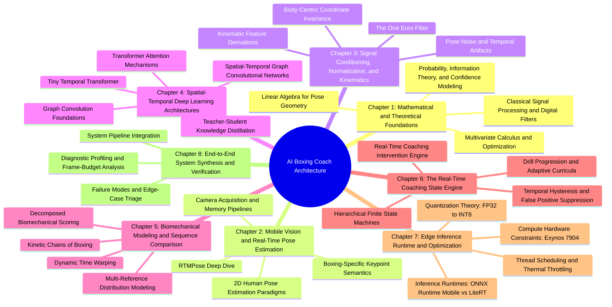

# Course Curriculum: Real-Time Mobile AI Kinematics and Motion Coaching

This is the learning curriculum behind the [[00. Vault Index|AI Boxing Coach Vault]].

## Curriculum Map



## Chapter Navigation

### [[01. Mathematical and Theoretical Foundations/Chapter 1. Foundations|Chapter 1 — Mathematical and Theoretical Foundations]]

**Focus:** mathematical foundations required for pose geometry, model training, uncertainty, and signal processing.

Core topics:

- Linear algebra for pose geometry
- Vectors, norms, dot products, and signed angles
- Affine transformations and body-relative coordinate systems
- SVD/PCA
- Gradient descent and backpropagation
- Velocity, acceleration, and jerk
- Probability and confidence modeling
- Information theory
- Sampling and aliasing
- LTI systems and group delay

### [[02. Mobile Vision and Real-Time Pose Estimation/Chapter 2. Mobile Vision and Pose|Chapter 2 — Mobile Vision and Real-Time Pose Estimation]]

**Focus:** converting camera frames into reliable boxing skeleton observations on Android.

Core topics:

- CameraX and ImageAnalysis
- Backpressure and KEEP_ONLY_LATEST
- YUV 4:2:0 pipelines
- Native/direct-buffer conversion
- Top-down vs bottom-up pose estimation
- RTMPose and SimCC
- Boxing-specific keypoints
- Multi-rate capture, inference, and rendering

### [[03. Signal Conditioning, Normalization, and Kinematics/Chapter 3. Conditioning and Kinematics|Chapter 3 — Signal Conditioning, Normalization, and Kinematics]]

**Focus:** turning noisy keypoints into a stable, camera-independent motion signal.

Core topics:

- pose jitter and occlusion
- One Euro filtering
- confidence-aware processing
- translation, rotation, and scale normalization
- joint angles
- velocities and accelerations
- live causal derivatives
- post-session analysis

### [[04. Spatial-Temporal Deep Learning Architectures/Chapter 4. Spatial-Temporal Deep Learning|Chapter 4 — Spatial-Temporal Deep Learning Architectures]]

**Focus:** learning local skeletal relationships and temporal motion context.

Core topics:

- graph representations
- graph Laplacians
- ST-GCN
- temporal convolutions
- self-attention
- causal transformers
- positional encoding
- Tiny Temporal Transformer
- teacher-student knowledge distillation

### [[05. Biomechanical Modeling and Sequence Comparison/Chapter 5. Biomechanical Modeling|Chapter 5 — Biomechanical Modeling and Sequence Comparison]]

**Focus:** evaluating whether a movement resembles technically meaningful boxing mechanics.

Core topics:

- kinetic chains
- punch phase decomposition
- Dynamic Time Warping
- Sakoe-Chiba constraints
- statistical reference distributions
- Mahalanobis distance
- decomposed technique scoring
- coach/expert annotation

### [[06. Real-Time Coaching State Engine/Chapter 6. Real-Time Coaching Engine|Chapter 6 — The Real-Time Coaching State Engine]]

**Focus:** converting model outputs into stable, useful coaching behavior.

Core topics:

- hierarchical state machines
- temporal hysteresis
- dwell-time requirements
- intervention prioritization
- audio rate limiting
- corrective feedback semantics
- drill progression
- adaptive curricula

### [[07. Edge Inference Runtime and Optimization/Chapter 7. Edge Runtime and Optimization|Chapter 7 — Edge Inference Runtime and Optimization]]

**Focus:** actually making the system run on constrained Android hardware.

Core topics:

- Exynos 7904 constraints
- CPU/GPU/NPU considerations
- FP32, FP16, and INT8
- quantized matrix multiplication
- ONNX Runtime Mobile
- LiteRT
- ARM/XNNPACK execution
- thread scheduling
- thermal adaptation

### [[08. End-to-End System Synthesis and Verification/Chapter 8. System Synthesis and Verification|Chapter 8 — End-to-End System Synthesis and Verification]]

**Focus:** validating the entire pipeline as one real-time system.

Core topics:

- end-to-end pipeline integration
- frame-budget analysis
- latency profiling
- P95/P99 performance
- device benchmarking
- failure modes
- robustness testing
- acceptance criteria
- first implementation slice

## Dependency Chain

```text
Mathematics
    ↓
Mobile Vision
    ↓
Signal Conditioning
    ↓
Spatial-Temporal Models
    ↓
Biomechanical Comparison
    ↓
Coaching State Engine
    ↓
Edge Optimization
    ↓
System Verification
```

## Relationship to the Boxing App

The curriculum exists to explain the engineering behind the application described in [[readme|Final Technical Report — Real-Time AI Boxing Coach]].

The target concept is a real-time coach that can:

- analyze stance
- recognize punches
- model punch phases
- evaluate defense and footwork
- recognize combinations
- compare repetitions against reference movement
- issue specific live corrections
- analyze reaction timing
- review sessions
- eventually adapt drills to recurring technical errors

The central engineering principle remains:

> **Train large models on the RTX 3060; deploy compact motion intelligence on the Galaxy A30s.**

## Implementation Progression

1. Camera and pose
2. Filtering and normalization
3. Stance evaluation
4. Jab detection
5. Jab phase analysis
6. Reference comparison
7. Real-time corrective feedback
8. Combination state machine
9. Expanded movement library
10. Teacher-student motion modeling
11. Mobile optimization
12. Full verification

## Complete Technical Notes

The chapter notes above are concise navigation notes. Each chapter now also has a complete technical deep-dive companion containing the detailed equations, algorithms, implementation examples, diagrams, and engineering caveats from the supplied curriculum.

- [[01. Mathematical and Theoretical Foundations/Chapter 1. Complete Technical Deep Dive|Chapter 1 — Complete Technical Deep Dive]]
- [[02. Mobile Vision and Real-Time Pose Estimation/Chapter 2. Complete Technical Deep Dive|Chapter 2 — Complete Technical Deep Dive]]
- [[03. Signal Conditioning, Normalization, and Kinematics/Chapter 3. Complete Technical Deep Dive|Chapter 3 — Complete Technical Deep Dive]]
- [[04. Spatial-Temporal Deep Learning Architectures/Chapter 4. Complete Technical Deep Dive|Chapter 4 — Complete Technical Deep Dive]]
- [[05. Biomechanical Modeling and Sequence Comparison/Chapter 5. Complete Technical Deep Dive|Chapter 5 — Complete Technical Deep Dive]]
- [[06. Real-Time Coaching State Engine/Chapter 6. Complete Technical Deep Dive|Chapter 6 — Complete Technical Deep Dive]]
- [[07. Edge Inference Runtime and Optimization/Chapter 7. Complete Technical Deep Dive|Chapter 7 — Complete Technical Deep Dive]]
- [[08. End-to-End System Synthesis and Verification/Chapter 8. Complete Technical Deep Dive|Chapter 8 — Complete Technical Deep Dive]]
