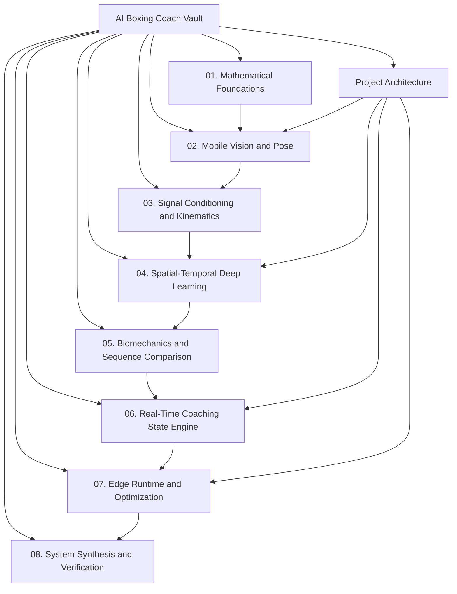

# AI Boxing Coach Vault

This folder is the knowledge vault for the **Real-Time AI Boxing Coach** project.

The vault has two complementary layers:

1. **Project architecture and product direction** — the existing [[readme|Final Technical Report — Real-Time AI Boxing Coach]].
2. **Technical learning curriculum** — the eight-chapter *Real-Time Mobile AI Kinematics and Motion Coaching* curriculum added below.

The curriculum is intentionally organized as a dependency chain from mathematics and signal processing through computer vision, motion models, biomechanics, coaching logic, mobile optimization, and complete-system verification.

## Vault Map



## Project Reference

- [[readme|Final Technical Report — Real-Time AI Boxing Coach]]
- Target device: Samsung Galaxy A30s / Exynos 7904 / 4 GB RAM
- Development and training target: RTX 3060 6 GB PC
- Core philosophy: **train big off-device, deploy small on-device**
- Primary mobile stack: CameraX → pose estimation → temporal motion representation → technique evaluation → coaching feedback
- First practical technique: jab
- Initial product mode: stance + jab coaching

## Curriculum

### [[01. Mathematical and Theoretical Foundations/Chapter 1. Foundations|Chapter 1 — Mathematical and Theoretical Foundations]]
Linear algebra, optimization, kinematics, probability, information theory, sampling, filtering, and latency.

### [[02. Mobile Vision and Real-Time Pose Estimation/Chapter 2. Mobile Vision and Pose|Chapter 2 — Mobile Vision and Real-Time Pose Estimation]]
CameraX, YUV pipelines, pose paradigms, RTMPose/SimCC, and boxing-specific keypoints.

### [[03. Signal Conditioning, Normalization, and Kinematics/Chapter 3. Conditioning and Kinematics|Chapter 3 — Signal Conditioning, Normalization, and Kinematics]]
Noise, One Euro filtering, body-centric invariance, and derived biomechanical features.

### [[04. Spatial-Temporal Deep Learning Architectures/Chapter 4. Spatial-Temporal Deep Learning|Chapter 4 — Spatial-Temporal Deep Learning]]
Graph convolutions, ST-GCN, temporal attention, Tiny Temporal Transformers, and knowledge distillation.

### [[05. Biomechanical Modeling and Sequence Comparison/Chapter 5. Biomechanical Modeling|Chapter 5 — Biomechanical Modeling and Sequence Comparison]]
Kinetic chains, punch phases, DTW, statistical reference distributions, and decomposed scoring.

### [[06. Real-Time Coaching State Engine/Chapter 6. Real-Time Coaching Engine|Chapter 6 — The Real-Time Coaching State Engine]]
HFSMs, hysteresis, intervention prioritization, and adaptive drill progression.

### [[07. Edge Inference Runtime and Optimization/Chapter 7. Edge Runtime and Optimization|Chapter 7 — Edge Inference Runtime and Optimization]]
Exynos constraints, quantization, ONNX Runtime Mobile vs LiteRT, thread scheduling, and thermals.

### [[08. End-to-End System Synthesis and Verification/Chapter 8. System Synthesis and Verification|Chapter 8 — End-to-End System Synthesis and Verification]]
Integrated pipeline, frame budgets, diagnostics, and edge-case handling.

## Recommended Study Path


The chapters should be read in order when learning the system from first principles. During implementation, use the index as a reference map and jump directly to the subsystem being developed.

## Design Principle

> The boxing app is not just a pose detector. It is a real-time motion-understanding and coaching system.

The intended chain is:

```text
Camera
→ Boxer tracking
→ Pose
→ Filtering
→ Body-relative normalization
→ Kinematic features
→ Spatial-temporal representation
→ Movement understanding
→ Reference comparison
→ Technique evaluation
→ Coaching state
→ Real-time feedback
→ Session analytics
```
