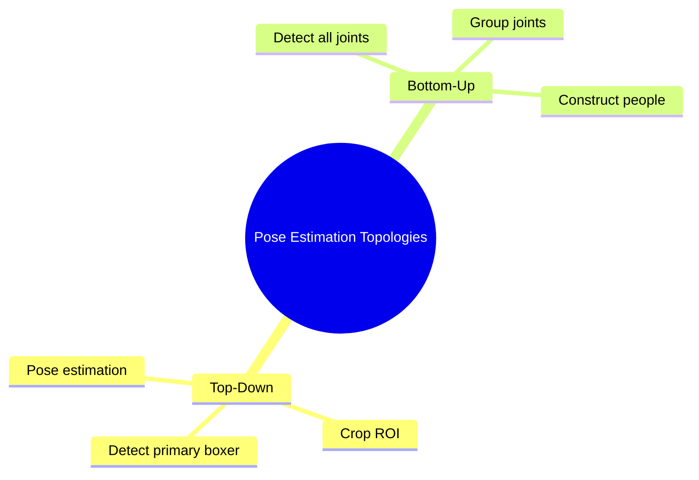

# Chapter 2 — Mobile Vision and Real-Time Pose Estimation

This note expands [[Chapter 2. Mobile Vision and Pose]] with the complete technical details.

## 2.1 Camera Acquisition and Memory Pipelines

### 2.1.1 CameraX Architecture and ImageAnalysis Lifecycle

CameraX sits above Android Camera2 and provides a device-independent camera API.

A baseline ImageAnalysis configuration is:

```kotlin
val imageAnalysis = ImageAnalysis.Builder()
    .setTargetResolution(Size(1280, 720))
    .setBackpressureStrategy(ImageAnalysis.STRATEGY_KEEP_ONLY_LATEST)
    .setOutputImageFormat(ImageAnalysis.OUTPUT_IMAGE_FORMAT_YUV_420_888)
    .build()
```

KEEP_ONLY_LATEST is important for real-time coaching. If analysis cannot keep up, the newest frame is more valuable than a queue of obsolete frames.

Every ImageProxy must be closed after processing so camera buffers are returned to the camera HAL.

### 2.1.2 YUV 420 888 and Zero-Copy Tensor Conversion

YUV separates luminance from chrominance.

A 1280 × 720 YUV 4:2:0 frame approximately contains:

- Y plane: 921,600 bytes
- U plane: 230,400 bytes
- V plane: 230,400 bytes
- total: 1,382,400 bytes

An equivalent 1280 × 720 × 3 RGB byte representation is 2,764,800 bytes before other representation overheads.

Avoid:

Camera frame
→ JVM ByteArray
→ RGB Bitmap
→ copied tensor buffer

Prefer:

Camera frame
→ direct/native memory
→ accelerated conversion
→ model tensor

A native JNI/C++ conversion path can use optimized libraries and ARM SIMD when profiling shows JVM conversion is a bottleneck.

## 2.2 2D Human Pose Estimation Paradigms



### 2.2.1 Top-Down vs Bottom-Up

| Metric | Top-Down | Bottom-Up |
|---|---|---|
| Pipeline | detector/ROI then pose | all joints then grouping |
| Single-person boxing | well matched | unnecessary grouping work |
| Scale normalization | crop-based | shared scene |
| Background people | easy to ignore | must be grouped/filtered |
| Compute | grows with detected people | one network pass plus grouping |

Because the intended use case is one primary boxer, a top-down or ROI-tracked design is preferred.

A tracked ROI can be padded around detected keypoint bounds:

$$
B_t
=
[
\min_kx_k-\Delta_x,
\min_ky_k-\Delta_y,
\max_kx_k+\Delta_x,
\max_ky_k+\Delta_y
].
$$

## 2.3 RTMPose Deep Dive

### 2.3.1 Heatmap vs Regression vs SimCC

Three common pose heads:

1. 2D heatmaps
2. direct Cartesian regression
3. SimCC coordinate classification

SimCC predicts two 1D distributions rather than a dense 2D map. This can reduce memory and preserve fine coordinate localization.

The project baseline is RTMPose-S with boxing-specific fine-tuning.

Published performance on other devices is a reference only. The actual Galaxy A30s must be benchmarked.

### 2.3.2 CSPNeXt Backbone and Depthwise Convolutions

Standard convolution FLOPs are approximately:

$$
F_{standard}
=
HWC_{in}C_{out}K_hK_w.
$$

Depthwise separable convolution:

$$
F_{separable}
=
HWC_{in}K_hK_w
+
HWC_{in}C_{out}.
$$

The approximate ratio is:

$$
\frac{F_{separable}}{F_{standard}}
=
\frac1{C_{out}}
+
\frac1{K_hK_w}.
$$

For a 3 × 3 kernel and sufficiently large channel count this can substantially reduce compute.

CSP-style routing splits the representation into computational and bypass paths, later fusing them.

## 2.4 Boxing-Specific Keypoint Semantics

Generic COCO keypoints are useful but boxing needs additional semantic information.

### Gloves and Wrist Articulation

The wrist landmark is an anatomical joint rather than the glove's terminal point. An auxiliary hand/glove centroid or endpoint can improve punch trajectory and orientation analysis.

### Foot Base

An ankle point alone cannot characterize the full support base. Heel and metatarsal/forefoot landmarks improve stance-width, foot-axis, pivot, and crossing analysis.

### Head and Chin

A proxy can be constructed:

$$
p_{chin}
\approx
p_{nose}
+
0.4(p_{neck}-p_{nose})
$$

but the coefficient is a calibration hypothesis and should be learned or validated empirically.

## 2.5 Real-Time Rate Separation

Camera capture, pose inference, temporal modeling, and UI rendering do not need identical rates.

```text
Camera                 ~30 FPS
Pose inference         adaptive ~10–15 updates/s target
Filtering              continuous
Temporal model         rolling sequence
UI rendering            up to display refresh rate
```

The application should measure:

- pose latency
- end-to-end latency
- effective FPS
- dropped frames
- CPU
- RAM
- battery drain
- thermal throttling

## Chapter 2 Technical Connections

- [[01. Mathematical and Theoretical Foundations/Chapter 1. Foundations]]
- [[03. Signal Conditioning, Normalization, and Kinematics/Chapter 3. Conditioning and Kinematics]]
- [[07. Edge Inference Runtime and Optimization/Chapter 7. Edge Runtime and Optimization]]
- [[readme|Final Technical Report — Real-Time AI Boxing Coach]]
