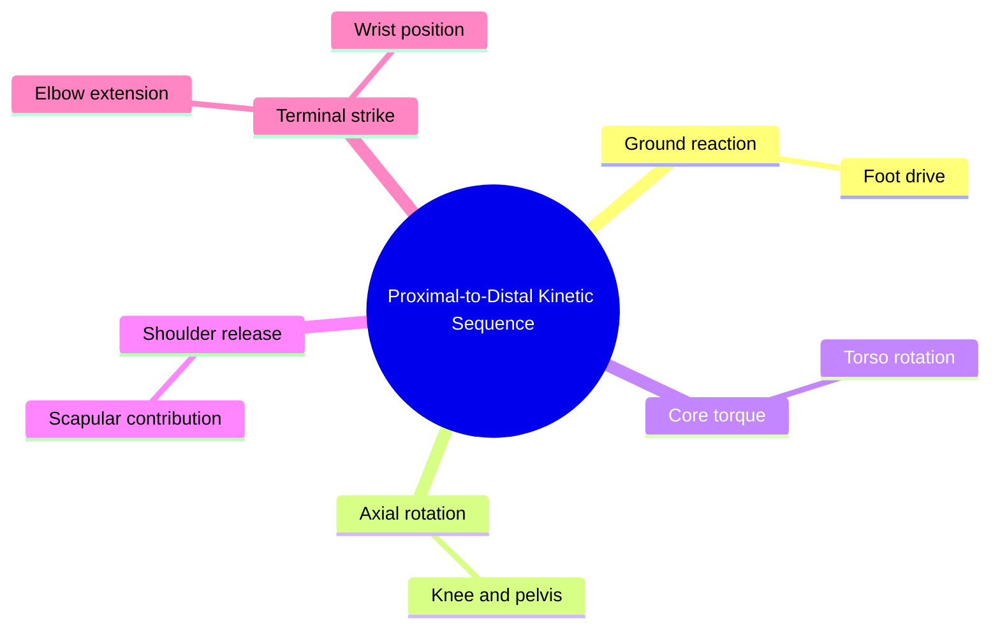

# Chapter 5 — Biomechanical Modeling and Sequence Comparison

## 5.1 Kinetic Chains of Boxing

### 5.1.1 Kinematics of the Kinetic Chain

A technically coordinated punch can be modeled as a proximal-to-distal kinetic sequence:



The curriculum proposes checking the ordering of peak segment angular velocities:

$$
t_{peak}(\dot\theta_{foot})
\le
t_{peak}(\dot\theta_{pelvis})
\le
t_{peak}(\dot\theta_{torso})
\le
t_{peak}(\dot\theta_{shoulder})
\le
t_{peak}(\dot\theta_{elbow}).
$$

This ordering should be treated as a hypothesis to validate against real boxing data, not a universal requirement for every punch or style.

### 5.1.2 Punch Phase Decomposition

Five phases:

1. Preparation
2. Initiation
3. Acceleration
4. Peak extension
5. Retraction/recovery

Reference table:

| Phase | Entry condition | Main checks |
|---|---|---|
| Preparation | wrist velocity low and guard active | stance, balance, guard |
| Initiation | wrist velocity crosses initiation threshold | telegraphing, base |
| Acceleration | wrist acceleration increases | path and guard |
| Peak extension | extension approaches terminal position | extension, alignment |
| Retraction | wrist reverses toward guard | recovery speed/path |

An implementation may model wrist velocity, acceleration, elbow angle, torso rotation, feet, and guard position jointly.

## 5.2 Dynamic Time Warping

### 5.2.1 Dynamic Programming Formulation

Euclidean frame-by-frame comparison is sensitive to execution speed.

$$
D_{Euclidean}(X,Y)
=
\sum_t\|x_t-y_t\|_2.
$$

DTW instead searches for an alignment path W minimizing cumulative cost:

$$
DTW(X,Y)
=
\min_W
\sum_k
c(x_{i_k},y_{j_k}).
$$

Boundary conditions:

$$
w_1=(1,1),
\qquad
w_K=(N,M).
$$

Monotonicity:

$$
i_{k+1}\ge i_k,
\qquad
j_{k+1}\ge j_k.
$$

Allowed steps:

$$
(1,0),
\quad
(0,1),
\quad
(1,1).
$$

Accumulated-cost recurrence:

$$
D(i,j)
=
c(x_i,y_j)
+
\min
\{
D(i-1,j),
D(i,j-1),
D(i-1,j-1)
\}.
$$

Kotlin baseline:

```kotlin
fun computeDTWDistance(
    sequenceX: Array<FloatArray>,
    sequenceY: Array<FloatArray>
): Float {
    val n = sequenceX.size
    val m = sequenceY.size
    val d = Array(n + 1) {
        FloatArray(m + 1) { Float.POSITIVE_INFINITY }
    }

    d[0][0] = 0f

    for (i in 1..n) {
        for (j in 1..m) {
            val cost = euclideanDistance(
                sequenceX[i - 1],
                sequenceY[j - 1]
            )
            d[i][j] = cost + minOf(
                d[i - 1][j],
                d[i][j - 1],
                d[i - 1][j - 1]
            )
        }
    }

    return d[n][m]
}

private fun euclideanDistance(
    a: FloatArray,
    b: FloatArray
): Float {
    var sum = 0f
    for (i in a.indices) {
        val diff = a[i] - b[i]
        sum += diff * diff
    }
    return kotlin.math.sqrt(sum)
}
```

### 5.2.2 Sakoe-Chiba Band

Constrain the path:

$$
|i-j|\le R.
$$

Complexity becomes approximately:

$$
O(R\min(N,M))
$$

instead of:

$$
O(NM).
$$

The band also prevents pathological alignments that stretch one short movement phase over a long reference phase.

The proposed radius should be benchmarked from actual repetition-speed variation.

## 5.3 Multi-Reference Distribution Modeling

### 5.3.1 Statistical Motion Envelopes

A single "perfect" reference punishes legitimate athlete variation.

The dataset should include:

- multiple athletes
- different heights and proportions
- orthodox and southpaw
- multiple speeds
- repeated executions
- different camera distances
- legitimate stylistic variation

After temporal normalization:

$$
x_{ref}(\tau)
\sim
\mathcal{N}
(\mu(\tau),\Sigma(\tau)).
$$

Mean:

$$
\mu(\tau)
=
\frac1K
\sum_{k=1}^K
x_k(\tau).
$$

Covariance:

$$
\Sigma(\tau)
=
\frac1{K-1}
\sum_{k=1}^K
(x_k-\mu)
(x_k-\mu)^T
+
\epsilon I.
$$

Mahalanobis distance:

$$
D_M
=
\sqrt{
(x_{user}-\mu)^T
\Sigma^{-1}
(x_{user}-\mu)
}.
$$

This makes the penalty depend on how much legitimate variation exists in each feature.

## 5.4 Decomposed Biomechanical Scoring

Suggested components:

1. Trajectory Accuracy
2. Kinetic Velocity/Acceleration
3. Guard Discipline
4. Stance Stability
5. Temporal Rhythm

Trajectory example:

$$
S_{traj}
=
100
\exp
\left(
-\frac{1}{2\lambda T}
\sum_\tau D_M(x_{user}(\tau),\mu(\tau))
\right).
$$

Kinetic score:

$$
S_{kin}
=
100
\min
\left(
1,
\frac{
\max_t\|a_{wrist}(t)\|_2
}{
\max_\tau\|a_{ref}(\tau)\|_2
}
\right).
$$

Guard score:

$$
S_{guard}
=
100
\left(
1-
\frac1T
\sum_t
ReLU
\left(
\frac{
\|p_{rear\_wrist}(t)-p_{chin}(t)\|_2-d_{safe}
}{
d_{safe}
}
\right)
\right).
$$

Stance-base score:

$$
S_{base}
=
100
\left(
1-
\frac1T
\sum_t
\frac{
|W_{feet}(t)-W_{ideal}|
}{
W_{ideal}
}
\right).
$$

Extension/retraction ratio:

$$
R_{ext/ret}
=
\frac{T_{extension}}{T_{retraction}}.
$$

Rhythm score:

$$
S_{rhythm}
=
100
\exp
\left(
-\frac{
(R_{ext/ret}-R_{ref})^2
}{
2\sigma_{rhythm}^2
}
\right).
$$

These formulas are starting models. Their thresholds, scaling, and even usefulness must be validated against expert-labeled data.

## 5.5 Dataset and Expert Annotation

Each repetition should contain:

- video
- pose sequence
- confidence values
- movement label
- phase labels
- stance
- side
- timing
- technical annotations

Example annotation categories:

- rear hand low
- excessive lean
- elbow flare
- recovery slow
- foot crossing
- trajectory deviation
- unstable stance

Open datasets and third-party models must be checked individually for licensing and redistribution/training permissions.

## Core Connections

- [[03. Signal Conditioning, Normalization, and Kinematics/Chapter 3. Conditioning and Kinematics]]
- [[04. Spatial-Temporal Deep Learning Architectures/Chapter 4. Spatial-Temporal Deep Learning]]
- [[06. Real-Time Coaching State Engine/Chapter 6. Real-Time Coaching Engine]]
