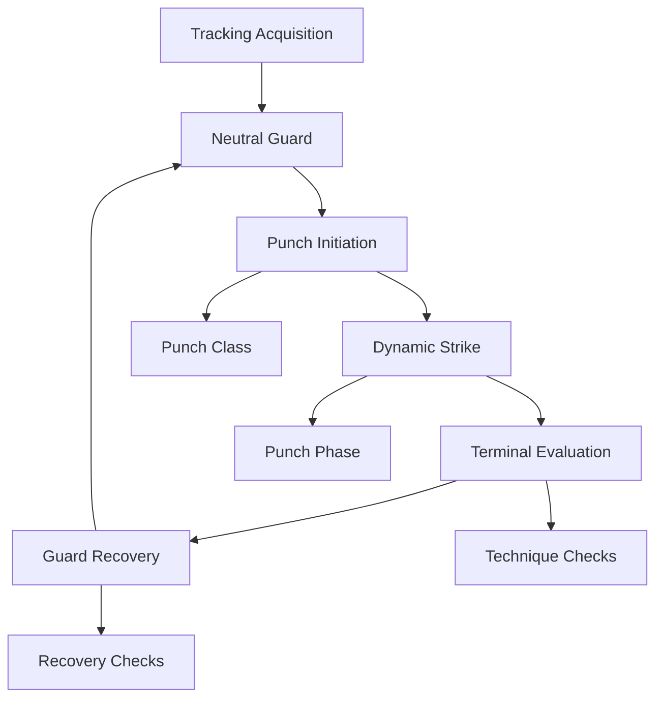

# Chapter 6: The Real-Time Coaching State Engine

## 6.1 Hierarchical Finite State Machines

Coaching logic is stateful.



Transitions require evidence:

$$
T(S_i\to S_j)
\iff
C_{kinematic}
\land
C_{confidence}
\land
\Delta t_{dwell}\ge\tau_{min}.
$$

This prevents one noisy frame from changing the state.

Global states can include:

- no person
- calibration
- active practice
- post-round summary

Nested states can manage:

- stance evaluation
- punch class
- punch phase
- technique checks
- recovery

## 6.2 Temporal Hysteresis and False Positive Suppression

Single thresholds create chattering.

For a warning metric d, use:

$$
d>d_{enter}
$$

to activate and:

$$
d<d_{exit}
$$

to deactivate, with:

$$
d_{exit}<d_{enter}.
$$

A confirmation window requires the condition to persist for several frames.

Reference Kotlin:

```kotlin
class HysteresisThreshold(
    private val enterThreshold: Float,
    private val exitThreshold: Float,
    private val confirmationFrames: Int = 4
) {
    private var isTriggered = false
    private var frameCounter = 0

    fun update(currentValue: Float): Boolean {
        if (!isTriggered) {
            if (currentValue >= enterThreshold) {
                frameCounter++
                if (frameCounter >= confirmationFrames) {
                    isTriggered = true
                    frameCounter = 0
                }
            } else {
                frameCounter = 0
            }
        } else {
            if (currentValue <= exitThreshold) {
                frameCounter++
                if (frameCounter >= confirmationFrames) {
                    isTriggered = false
                    frameCounter = 0
                }
            } else {
                frameCounter = 0
            }
        }

        return isTriggered
    }
}
```

The actual thresholds should normally be normalized and learned/calibrated from data rather than assumed universal centimeter values.

## 6.3 Real-Time Coaching Intervention Engine

Several errors can coexist:

- guard drop
- elbow flare
- head displacement
- slow recovery

The engine should prioritize rather than speak all four.

Suggested hierarchy:

1. critical defensive/guard error
2. major stance/base problem
3. trajectory problem
4. subtle timing issue

Audio policy:

- speak the highest-priority active error
- suppress new voice prompts during a refractory period
- save secondary errors for visual or post-round reporting

This is a cognitive-load control system, not just a notification queue.

## 6.4 Drill Progression and Adaptive Curricula

Skill state:

$$
s_t
=
[s_{stance},s_{jab},s_{cross},s_{hook},s_{slip}]^T.
$$

EWMA update:

$$
s_k
=
\gamma s_{k-1}
+
(1-\gamma)S_{rep}(k).
$$

A mastery gate can require a target score over a recent repetition window.

Example progression:

```text
Static stance
→ single jab
→ jab + cross
→ multi-punch combinations
→ defense transitions
→ reaction training
→ randomized drills
```

The Markov Decision Process abstraction can later support a richer adaptive curriculum, but an initial deterministic progression engine is simpler and easier to validate.

## 6.5 Feedback Semantics

Feedback should describe the observed cause:

Bad:
Technique incorrect.

Better:
Rear hand dropped during jab extension.

Feedback types:

- positive reinforcement
- corrective cue
- sequence error
- input-quality/framing warning

Low-confidence joints should suppress or soften the corresponding corrective statement.

## Core Connections

- [[05. Biomechanical Modeling and Sequence Comparison/Chapter 5. Biomechanical Modeling]]
- [[07. Edge Inference Runtime and Optimization/Chapter 7. Edge Runtime and Optimization]]
- [[08. End-to-End System Synthesis and Verification/Chapter 8. System Synthesis and Verification]]
