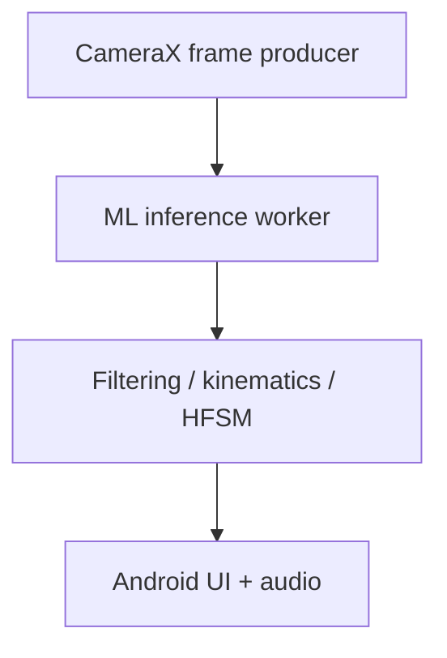

# Chapter 7 — Edge Inference Runtime and Optimization

## 7.1 Compute Hardware Constraints: Exynos 7904

Target device: Samsung Galaxy A30s.

The curriculum models the hardware as:

- 2 Cortex-A73 performance cores around 1.8 GHz
- 6 Cortex-A53 efficiency cores around 1.6 GHz
- Mali-G71 MP2 GPU
- no dedicated NPU

These specifications describe the hardware, not guaranteed sustained runtime behavior.

The architectural consequence is that the phone should prioritize compact models, CPU-friendly operators, memory efficiency, and thermal stability.

## 7.2 Quantization Theory

### 7.2.1 Post-Training Uniform Affine Quantization

FP32 parameters use 4 bytes each.

INT8 uses 1 byte each, giving a theoretical 75% reduction in parameter storage before metadata/packing overhead.

Affine quantization:

$$
q
=
clip
\left(
round
\left(
\frac{x}{S}
\right)
+
Z,
q_{min},
q_{max}
\right).
$$

Dequantization:

$$
\hat{x}
=
S(q-Z).
$$

For weights using symmetric quantization:

$$
\alpha
=
\max(|x_{min}|,|x_{max}|)
$$

$$
S=\frac{\alpha}{127},
\qquad
Z=0.
$$

### 7.2.2 Quantized Matrix Multiplication Derivation

For:

$$
Y=XW
$$

with:

$$
X\approx S_X(q_X-Z_X)
$$

and:

$$
W\approx S_Wq_W,
$$

then:

$$
Y
\approx
S_XS_W
\left(
q_Xq_W
-
Z_X\sum_kq_{W,k}
\right).
$$

INT8 products are accumulated into INT32 registers to avoid overflow.

The correction term can be precomputed when applicable.

The exact CPU instruction set and acceleration available on the target chipset must be confirmed through benchmarking rather than assumed from newer ARM hardware.

## 7.3 Inference Runtimes

### 7.3.1 ONNX Runtime Mobile vs LiteRT

Primary candidate:

**ONNX Runtime Mobile with XNNPACK**

Alternative:

**LiteRT / TensorFlow Lite**

The choice is an empirical deployment decision.

Conceptual ONNX configuration:

```kotlin
val env = OrtEnvironment.getEnvironment()
val sessionOptions = OrtSession.SessionOptions().apply {
    setIntraOpNumThreads(2)
    setOptimizationLevel(
        OrtSession.SessionOptions.OptLevel.ALL_OPT
    )
    addConfigEntry(
        "session.intra_op_parallelism_threads",
        "2"
    )
    addConfigEntry(
        "session.execution_mode",
        "ORT_SEQUENTIAL"
    )
}
```

The number of inference threads should be benchmarked. Setting two threads does not guarantee hard OS affinity to the performance cores.

The curriculum also notes that Android's newer platform direction makes reliance on legacy NNAPI behavior undesirable as the only backend strategy.

## 7.4 Thread Scheduling and Thermal Throttling

### 7.4.1 Asymmetric Multi-Core Allocation

Conceptual threading:



Monitor:

- inference latency
- effective FPS
- CPU
- RAM
- temperature
- battery drain
- thermal throttling

Adaptive frame controller:

```kotlin
class AdaptiveFrameRateController(
    private val standardFps: Int = 15,
    private val throttledFps: Int = 10
) {
    private var lastFrameTime = 0L

    fun shouldProcessFrame(
        currentTimeMs: Long,
        batteryTempCelsius: Float
    ): Boolean {
        val targetFps =
            if (batteryTempCelsius > 41.5f)
                throttledFps
            else
                standardFps

        val minIntervalMs = 1000L / targetFps

        return if (
            currentTimeMs - lastFrameTime >= minIntervalMs
        ) {
            lastFrameTime = currentTimeMs
            true
        } else {
            false
        }
    }
}
```

The 41.5 °C threshold is a tunable engineering parameter, not a universal thermal limit.

## 7.5 Quantization and Deployment Validation

Candidate sequence:

FP32 baseline
→ FP16 experiment
→ INT8 post-training quantization
→ quantization-aware training if necessary
→ actual A30s benchmark

Evaluate each version for both performance and correctness.

## Core Connections

- [[02. Mobile Vision and Real-Time Pose Estimation/Chapter 2. Mobile Vision and Pose]]
- [[04. Spatial-Temporal Deep Learning Architectures/Chapter 4. Spatial-Temporal Deep Learning]]
- [[08. End-to-End System Synthesis and Verification/Chapter 8. System Synthesis and Verification]]
