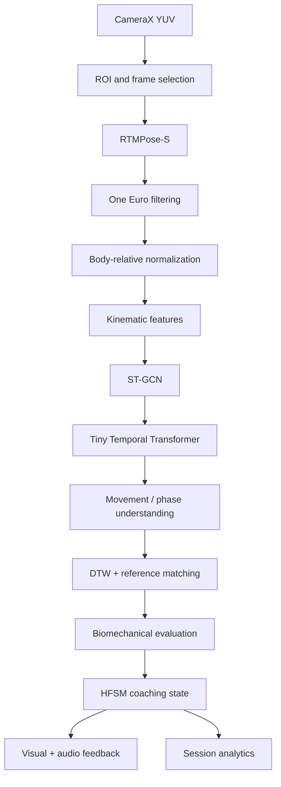

# Chapter 8 — End-to-End System Synthesis and Verification

## 8.1 System Pipeline Integration



The target transformation is:

raw camera data
→ pose
→ stable motion signal
→ representation
→ movement understanding
→ technique evaluation
→ coaching decision.

## 8.2 Diagnostic Frame-Budget Analysis

At 15 FPS:

$$
\tau_{budget}
=
\frac{1000}{15}
\approx
66.6ms.
$$

Initial planning budget:

| Stage | Planned time |
|---|---:|
| YUV capture/conversion | 8.5 ms |
| RTMPose-S inference | 38.0 ms |
| One Euro + normalization | 1.2 ms |
| ST-GCN + Transformer | 7.8 ms |
| DTW + kinematics | 4.5 ms |
| Coaching engine/UI | 3.5 ms |
| Spare headroom | 3.1 ms |
| Total | 63.5 ms |

These are **planning numbers from the architecture document, not measurements of the Galaxy A30s**.

The acceptance test must measure real device behavior.

## 8.3 Failure Modes and Edge-Case Triage

| Failure mode | Root trigger | Mitigation |
|---|---|---|
| Framing violation | boxer too close or leaves frame | boundary monitoring and framing assistance |
| Low-confidence detection | lighting, blur, occlusion | suppress affected technical feedback |
| Rapid occlusion | hand crosses body | temporal context and interpolation where justified |
| Multi-person interference | another person enters scene | maintain primary boxer identity |
| State chatter | metric hovers around threshold | hysteresis and dwell time |
| Stale-frame backlog | inference slower than camera | KEEP_ONLY_LATEST |
| Thermal overload | sustained heavy inference | reduce processing cadence |
| Poor lighting | exposure/motion blur | input-quality warning |

Framing checks can monitor normalized boundaries near 0 and 1.

Lighting can use the Y-plane brightness as an input-quality signal:

$$
\mu_Y
=
\frac{1}{HW}
\sum_{i,j}Y_{ij}.
$$

A very low measured mean indicates a candidate lighting warning, but the actual threshold must be calibrated against device camera behavior.

## 8.4 Verification Matrix

### Stance tests

- correct stance
- narrow stance
- wide stance
- crossed feet
- guard asymmetry
- torso lean

### Punch tests

- jab
- cross
- lead hook
- rear hook
- lead uppercut
- rear uppercut
- phase segmentation

### Combination tests

- correct order
- wrong order
- missing movement
- extra movement
- timing variation
- recovery

### Environment tests

- different lighting
- different distances
- different heights
- different body proportions
- different clothing
- slow movements
- fast movements
- partial occlusion
- secondary person

## 8.5 Acceptance Criteria

The system should demonstrate:

1. reliable full-body tracking
2. stable keypoint streams
3. robust movement classification
4. useful phase segmentation
5. specific corrective feedback
6. acceptable real-time latency
7. confidence-aware suppression
8. repeatable A30s performance benchmarks

## 8.6 First Complete Implementation Slice

```text
Camera
↓
RTMPose-S
↓
Filtering
↓
Normalization
↓
Live skeleton
↓
Stance evaluation
↓
Jab detection
↓
Basic phase analysis
↓
Specific feedback
```

This provides a controlled first milestone before combinations, free shadowboxing, reaction drills, teacher-student modeling, and adaptive training.

## Core Connections

- [[01. Mathematical and Theoretical Foundations/Chapter 1. Foundations]]
- [[02. Mobile Vision and Real-Time Pose Estimation/Chapter 2. Mobile Vision and Pose]]
- [[05. Biomechanical Modeling and Sequence Comparison/Chapter 5. Biomechanical Modeling]]
- [[06. Real-Time Coaching State Engine/Chapter 6. Real-Time Coaching Engine]]
- [[07. Edge Inference Runtime and Optimization/Chapter 7. Edge Runtime and Optimization]]
- [[readme|Final Technical Report — Real-Time AI Boxing Coach]]
