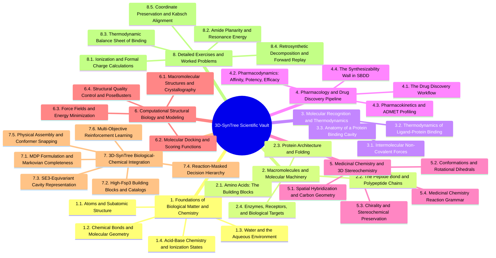

# 3D-SynTree Biology, Pharmacology, and Medicinal Chemistry Vault

---

## 0. Master Map of Content

### 0.1. Vault Architecture and Navigation Map

### 0.2. Chapter Navigation

- [[1. Chapter 1. Foundations of Biological Matter and Chemistry/1.1. Topic. Atoms and Subatomic Particles in Biology/1.1.1. Concept. Subatomic Particles and Atomic Number]]
- [[2. Chapter 2. Macromolecules and the Molecular Machinery of Life/2.1. Topic. Amino Acids: The Building Blocks of Proteins/2.1.1. Concept. The Alpha-Amino Acid Architecture]]
- [[3. Chapter 3. Molecular Recognition and Thermodynamics of Binding/3.1. Topic. Intermolecular Non-Covalent Forces/3.1.1. Concept. Electrostatic Interactions and Salt Bridges]]
- [[4. Chapter 4. Pharmacology and the Drug Discovery Pipeline/4.1. Topic. The Drug Discovery Workflow/4.1.1. Concept. Target Identification and Validation]]
- [[5. Chapter 5. Medicinal Chemistry and 3D Stereochemistry/5.1. Topic. Spatial Hybridization and Carbon Geometry/5.1.1. Concept. sp3, sp2, and sp Hybridization]]
- [[6. Chapter 6. Computational Structural Biology and SBDD/6.1. Topic. Macromolecular Structures and File Formats/6.1.1. Concept. X-Ray Crystallography and Cryo-EM Resolution]]
- [[7. Chapter 7. 3D-SynTree Biological and Chemical Architecture/7.1. Topic. MDP Formulation and Markovian Completeness/7.1.1. Concept. The Markov Property in SBDD]]
- [[8. Detailed Exercises and Worked Problems/8.1. Exercise 1. Calculating Formal Charges and Ionization States at Physiological pH]]
- [[9. Comprehensive Glossary of Technical Terms]]
