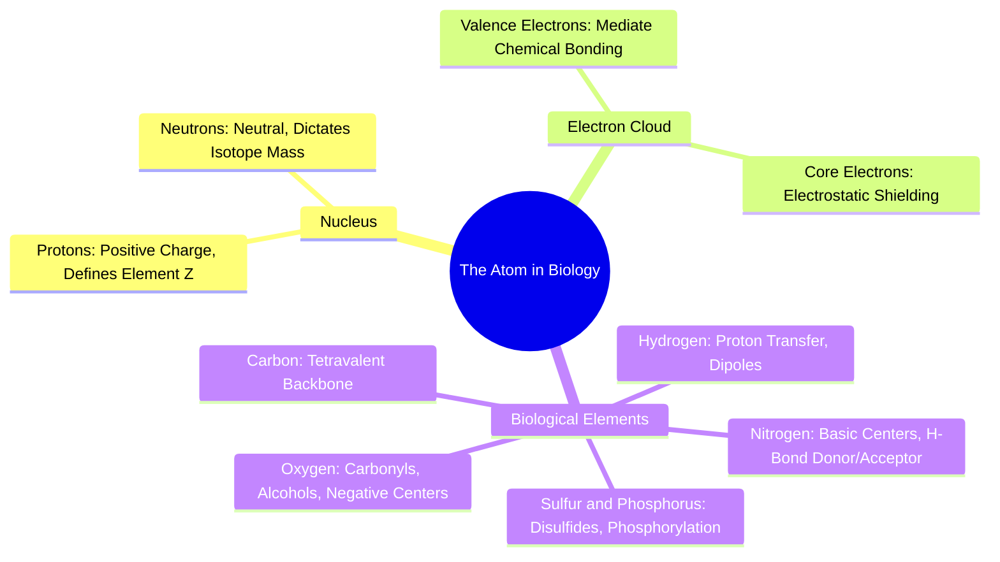

#### 1.1.1. Concept. Subatomic Particles and Atomic Number
All biological matter—including enzymes, viral proteins, and synthetic pharmaceutical drugs—is built from atoms. An atom consists of a central **nucleus** containing positively charged **protons** and uncharged **neutrons**, surrounded by a diffuse cloud of negatively charged **electrons**. 

1. **Atomic Number ($Z$):** The number of protons in the nucleus defines the atomic identity. In the `3D-SynTree` code, `pocket_z` represents this exact quantity as an integer tensor (e.g., $Z=6$ for Carbon, $Z=7$ for Nitrogen, $Z=8$ for Oxygen, $Z=16$ for Sulfur).
2. **Atomic Mass and Isotopes:** The sum of protons and neutrons defines the atomic mass. Isotopes are atoms with the same $Z$ but differing neutron counts. In `reactions.py`, `3D-SynTree` exploits isotopes as non-reactive internal tracking tags (assigning core atoms isotope labels $1000 + i$ and synthon atoms $2000 + j$). Because isotopes retain identical chemical valence, RDKit's reaction routines process them normally while preserving atom-level provenance across bond formations and leaving-group removals.
3. **Electrons and Energy Levels:** Electrons reside in quantum mechanical orbitals grouped into shells. Chemical reactions occur because atoms seek lower-energy electronic configurations, usually achieved by filling their outermost valence shell.

*Related Notes:*
* Connects to: `[[1.2.1. Concept. Covalent Bonds and Valence Rules]]`
* Connects to: `[[6.1.2. Concept. The Protein Data Bank Format and Structural Quirks]]`
* Code Manifestation: `pocket_z` in `syntree/data/featurizer.py` and isotope tracking in `syntree/chemistry/reactions.py`.

---
