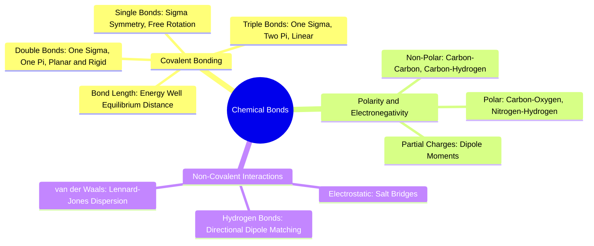

#### 1.2.1. Concept. Covalent Bonds and Valence Rules
A **covalent bond** represents the mutual sharing of one or more pairs of electrons between two atomic nuclei to satisfy their respective valence shells.

1. **Sigma ($\sigma$) Bonds:** Formed by the direct, end-to-end overlap of atomic orbitals along the internuclear axis. Single bonds (e.g., $\text{C—C}$, $\text{C—H}$, $\text{C—N}$) are $\sigma$ bonds. They possess cylindrical symmetry, which physically permits rotational motion around the bond axis unless constrained by a ring system.
2. **Pi ($\pi$) Bonds:** Formed by the lateral, side-by-side overlap of parallel $p$ orbitals situated above and below the internuclear axis. Double bonds (e.g., $\text{C=O}$, $\text{C=C}$) consist of one $\sigma$ bond and one $\pi$ bond. Lateral $p$-orbital overlap requires both atoms to remain strictly co-planar; twisting the bond breaks this overlap, introducing a massive energetic barrier ($>60\text{ kcal/mol}$).
3. **Bond Length Equilibrium:** Atoms in a covalent bond settle at an equilibrium distance where attractive forces (nucleus-to-electron attraction) balance repulsive forces (nucleus-to-nucleus repulsion). For example:
   * $\text{C—C}$ single bond length: $\approx 1.54\text{ \AA}$
   * $\text{C=C}$ double bond length: $\approx 1.34\text{ \AA}$
   * $\text{C—N}$ single bond length: $\approx 1.47\text{ \AA}$
   * $\text{C(=O)—N}$ amide junction bond length: $\approx 1.33\text{ \AA}$ (due to resonance).

*Related Notes:*
* Connects to: `[[5.2.1. Concept. Dihedral Angles and Rotational Barriers]]`
* Connects to: `[[8.2. Exercise 2. Why the Twisted Amide is a Biophysical Catastrophe]]`
* Code Manifestation: Hard-coded bond distance boundaries verified in `tests/test_chemistry_conformer.py`.

---
