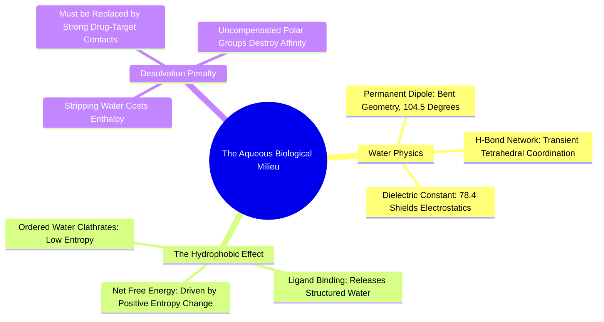

#### 1.3.1. Concept. Water Structure and Biological Hydrogen Bonding
Life evolved in liquid water, and all human pharmacological targets function within an aqueous cellular or extracellular milieu. A drug candidate never encounters an empty, dry protein in nature; it encounters a protein completely coated in water molecules.

1. **The Water Molecule ($\text{H}_2\text{O}$):** Oxygen uses two of its six valence electrons to bind two hydrogens, leaving two non-bonding lone pairs. Its geometry is bent (bond angle $\approx 104.5^\circ$). The extreme electronegativity difference between Oxygen ($\chi = 3.44$) and Hydrogen ($\chi = 2.20$) produces a strong dipole, with $\delta^-$ on Oxygen and $\delta^+$ on each Hydrogen.
2. **Hydrogen Bond Networks:** In bulk liquid water, each water molecule acts simultaneously as a **hydrogen bond donor** (via its two acidic protons) and a **hydrogen bond acceptor** (via its two lone pairs). Water forms an extensive, dynamic, fluctuating three-dimensional tetrahedral network with an average lifetime of $\approx 1\text{ to }10\text{ picoseconds}$ per bond.
3. **Dielectric Constant ($\epsilon$):** Water has a remarkably high dielectric constant ($\epsilon \approx 78.4$ at $25^\circ\text{C}$), compared to a vacuum ($\epsilon = 1$) or the interior of a protein cavity ($\epsilon \approx 2\text{ to }4$). According to Coulomb’s Law:
   $$F = \frac{1}{4\pi \epsilon_0 \epsilon} \frac{q_1 q_2}{r^2}$$
   Water attenuates and shields bare electrostatic attractions between ions by nearly an order of two magnitudes, preventing biological salts from crystallizing inside living cells.

*Related Notes:*
* Connects to: `[[3.2.2. Concept. Enthalpy-Entropy Compensation]]`
* Connects to: `[[8.3. Exercise 3. Thermodynamic Balance Sheet of Ligand Binding]]`

---
