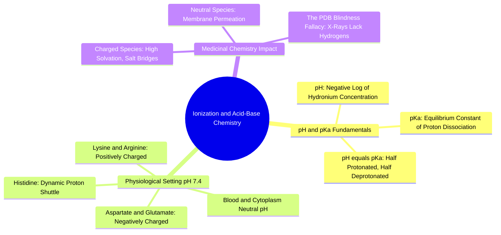

#### 1.4.1. Concept. pH, pKa, and Proton Exchange
Virtually all drug molecules and protein amino acids contain ionizable functional groups that can gain or lose a proton ($\text{H}^+$).

1. **Definition of $\text{pH}$:** The acidity of an aqueous solution, defined as:
   $$\text{pH} = -\log_{10}[\text{H}_3\text{O}^+]$$
   Human blood, cytoplasm, and standard extracellular fluids maintain a strictly buffered homeostatic $\text{pH}$ of approximately $7.40 \pm 0.05$.
2. **Definition of $\text{p}K_a$:** The acid dissociation constant measures the strength of an acid in solution:
   $$\text{HA} \rightleftharpoons \text{H}^+ + \text{A}^- \quad\implies\quad K_a = \frac{[\text{H}^+][\text{A}^-]}{[\text{HA}]}, \quad \text{p}K_a = -\log_{10} K_a$$
   * A low $\text{p}K_a$ ($< 3$) indicates a strong acid that readily releases its proton.
   * A high $\text{p}K_a$ ($> 10$) indicates a weak acid (or strong conjugate base) that tenaciously holds its proton.
3. **The Henderson-Hasselbalch Equation:** Connects solution $\text{pH}$, acid $\text{p}K_a$, and the ratio of protonated to deprotonated species:
   $$\text{pH} = \text{p}K_a + \log_{10}\left( \frac{[\text{A}^-]}{[\text{HA}]} \right)$$
   * When $\text{pH} = \text{p}K_a$: exactly $50\%$ of the molecule is protonated and $50\%$ is deprotonated.
   * When $\text{pH} > \text{p}K_a$: the basic, deprotonated form dominates.
   * When $\text{pH} < \text{p}K_a$: the acidic, protonated form dominates.

*Related Notes:*
* Connects to: `[[1.4.2. Concept. Formal Charges at Physiological pH]]`
* Connects to: `[[8.1. Exercise 1. Calculating Formal Charges and Ionization States]]`

---
