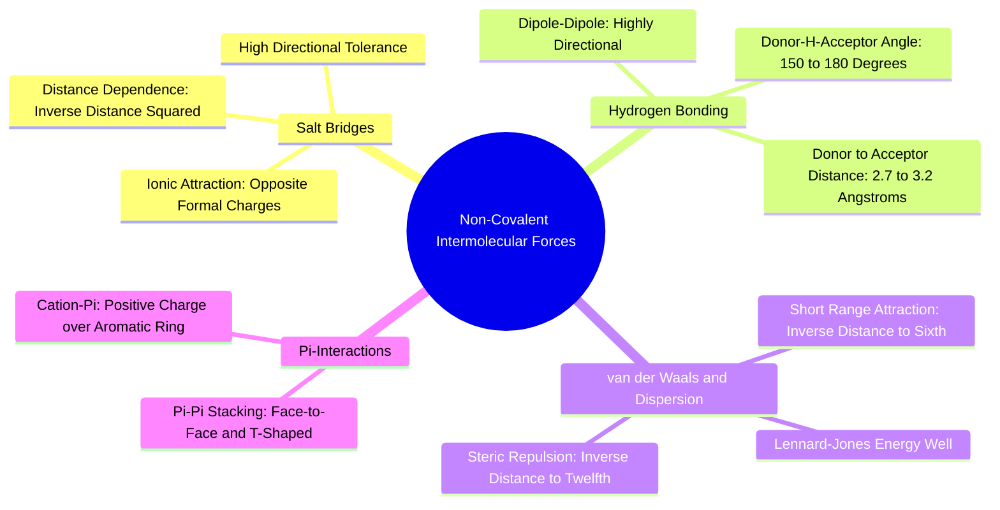

#### 3.1.1. Concept. Electrostatic Interactions and Salt Bridges
Electrostatic interactions represent long-range non-covalent forces operating between fixed formal charges or permanent dipoles.

1. **The Salt Bridge (Ionic Bond):** Occurs when a fully positively charged functional group on one molecule aligns with a fully negatively charged group on another. In drug-protein complexes, the most common salt bridges form between:
   * A protonated basic drug amine ($-\text{NH}_3^+$) and an Aspartate or Glutamate side-chain carboxylate ($-\text{COO}^-$).
   * A deprotonated drug carboxylate ($-\text{COO}^-$) and a Lysine ($-\text{NH}_3^+$) or Arginine ($-\text{C(NH}_2)_2^+$) side chain.
2. **Thermodynamic Impact:** While a salt bridge in a vacuum has an enormous bond energy ($>100\text{ kcal/mol}$), in water its effective free-energy contribution to binding is modest ($\approx -1\text{ to }-3\text{ kcal/mol}$). This occurs because both charged ions were previously surrounded by tightly bound, highly favorable hydration shells of water molecules. To form the salt bridge, both ions must be completely stripped of their water coats (**desolvation penalty**). The net gain in free energy is only the difference between the protein-ligand salt bridge and the sum of the two isolated water-ion interactions.
3. **Distance Dependence:** The electrostatic energy between two point charges follows Coulomb’s Law:
   $$E_{\text{elec}} = \frac{q_1 q_2}{4\pi \epsilon_0 \epsilon \cdot r}$$
   Because it decays as $1/r$, electrostatic attraction operates over longer spatial distances than any other non-covalent interaction.

*Related Notes:*
* Connects to: `[[1.4.2. Concept. Formal Charges at Physiological pH]]`
* Connects to: `[[3.2.1. Concept. Gibbs Free Energy of Binding]]`
