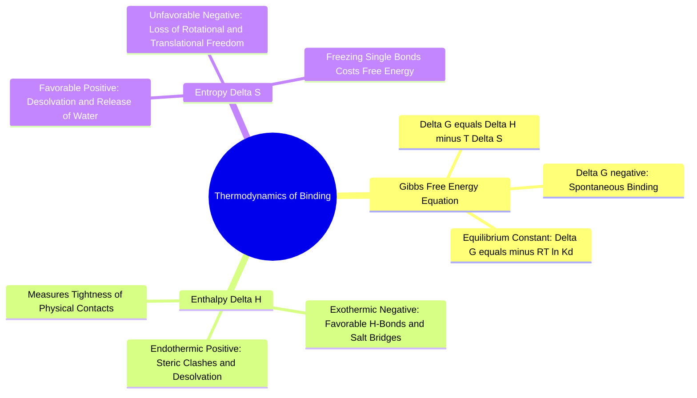

#### 3.2.1. Concept. Gibbs Free Energy of Binding
The fundamental currency that determines whether a small-molecule drug candidate will bind to its target protein is the **change in Gibbs Free Energy ($\Delta G_{\text{bind}}$)**.

1. **The Fundamental Thermodynamic Equation:**
   $$\Delta G_{\text{bind}} = \Delta H_{\text{bind}} - T\Delta S_{\text{bind}}$$
   where:
   * $\Delta H_{\text{bind}}$ is the **change in enthalpy** (heat exchanged).
   * $\Delta S_{\text{bind}}$ is the **change in entropy** (disorder or degrees of freedom).
   * $T$ is the absolute temperature in Kelvin.
   A binding process is spontaneous and thermodynamically favorable if and only if $\Delta G_{\text{bind}} < 0$. The more negative $\Delta G_{\text{bind}}$, the more tightly the drug binds.
2. **The Relationship to the Dissociation Constant ($K_d$):** The free energy change is quantitatively related to the experimental binding affinity by:
   $$\Delta G_{\text{bind}} = -R T \ln K_a = +R T \ln K_d$$
   where $R$ is the universal gas constant ($1.987\times 10^{-3}\text{ kcal}\cdot\text{mol}^{-1}\text{K}^{-1}$), $T = 310.15\text{ K}$ ($37^\circ\text{C}$), and $K_d$ is the dissociation constant in Molar (M).
   * A drop of **$-1.42\text{ kcal/mol}$** in $\Delta G_{\text{bind}}$ improves the binding affinity $K_d$ by a **factor of 10** at body temperature.
   * A micromolar drug ($K_d = 1\text{ }\mu\text{M} = 10^{-6}\text{ M}$) corresponds to $\Delta G_{\text{bind}} \approx -8.5\text{ kcal/mol}$.
   * A potent nanomolar drug ($K_d = 1\text{ nM} = 10^{-9}\text{ M}$) corresponds to $\Delta G_{\text{bind}} \approx -12.8\text{ kcal/mol}$.

*Related Notes:*
* Connects to: `[[4.2.1. Concept. Binding Affinity (Kd), Inhibitory Potency (IC50), and Efficacy]]`
* Connects to: `[[8.3. Exercise 3. Thermodynamic Balance Sheet of Ligand Binding]]`
