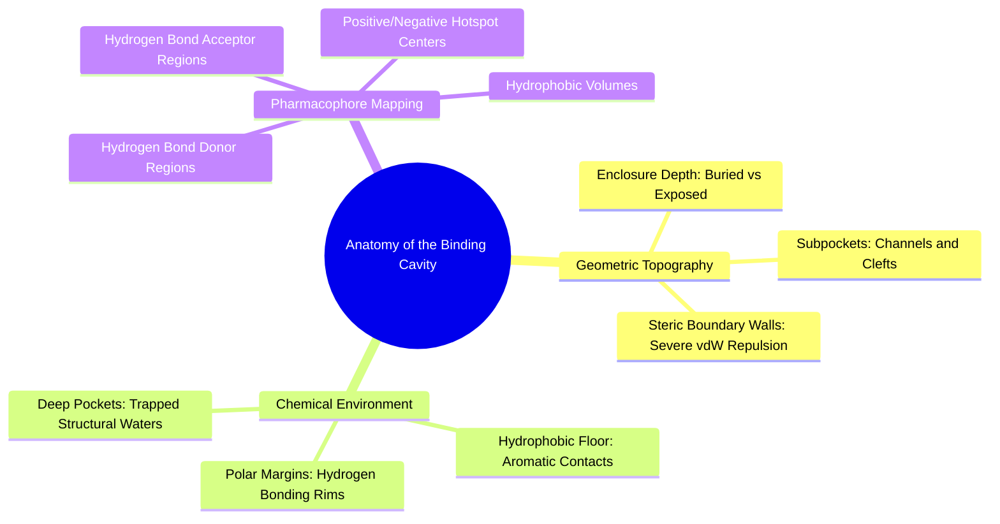

#### 3.3.1. Concept. Cavity Geometry, Subpockets, and Enclosure
A **binding pocket (or cavity)** is a specialized geometric indentation or cleft on the surface of a protein formed by the tertiary folding of the polypeptide chain.

1. **Volume and Enclosure:** Pockets vary from shallow, flat, solvent-exposed surfaces (common in protein-protein interaction interfaces, notoriously difficult to drug) to deep, buried, water-excluded caverns (common in enzyme catalytic clefts and GPCR ligand cavities). Deeper pockets provide greater shielding from bulk water dielectric attenuation, dramatically magnifying electrostatic and hydrogen bond strengths.
2. **Subpockets:** A complex binding pocket is rarely a single geometric sphere; it typically branches into discrete topological zones termed **subpockets** (e.g., the catalytic pocket, the specificity subpocket, the solvent front). In kinase inhibitors, for example, the cavity is dissected into the ATP-binding adenine pocket, the hydrophobic back-pocket, and the ribose-binding channel.
3. **The Markov Chain Challenge in SBDD:** An autoregressive molecule generator must bridge these subpockets sequentially. If the AI model adds an initial fragment into Subpocket A, it must be able to "see" that fragment in three dimensions so it can grow an extension across the intervening cleft into Subpocket B without hitting the dividing protein ridge.

*Related Notes:*
* Connects to: `[[7.1.1. Concept. The Markov Property in SBDD]]`
* Connects to: `[[7.3.1. Concept. PaiNN Invariant Scalar and Equivariant Vector Features]]`
