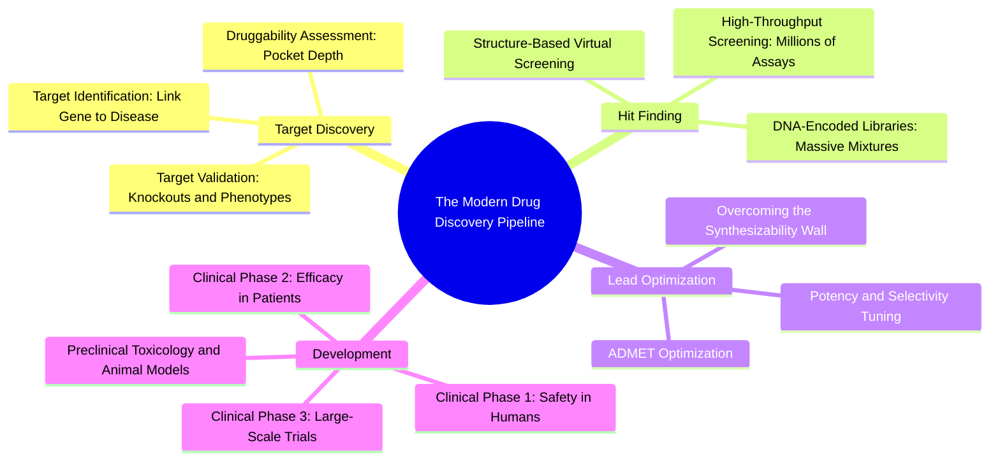

#### 4.1.1. Concept. Target Identification and Validation
The pharmaceutical development process is a multi-year, multi-billion-dollar endeavor that moves from a biological hypothesis to an approved medicine.

1. **Target Identification:** Identifying a specific human protein (or viral/bacterial enzyme) whose biological activity directly causes or exacerbates a clinical disease state. For example, discovering that the BCR-ABL fusion kinase causes chronic myeloid leukemia.
2. **Target Validation:** Proving experimentally that pharmacologically inhibiting or modulating that protein halts disease progression. Techniques include genetic knockouts (CRISPR-Cas9), small interfering RNA (siRNA), and biological phenotypic assays.
3. **Druggability (Ligandability) Assessment:** Determining whether the validated protein target possesses a well-defined physical binding pocket capable of recognizing small molecules with high affinity and selectivity. Targets with flat, featureless surfaces lacking deep cavities are historically classified as "undruggable."

*Related Notes:*
* Connects to: `[[2.4.1. Concept. Enzymes: Catalytic Mechanism and Inhibition Modes]]`
* Connects to: `[[4.4.1. Concept. The Flat Grease Trap in Generative Chemistry]]`

---
