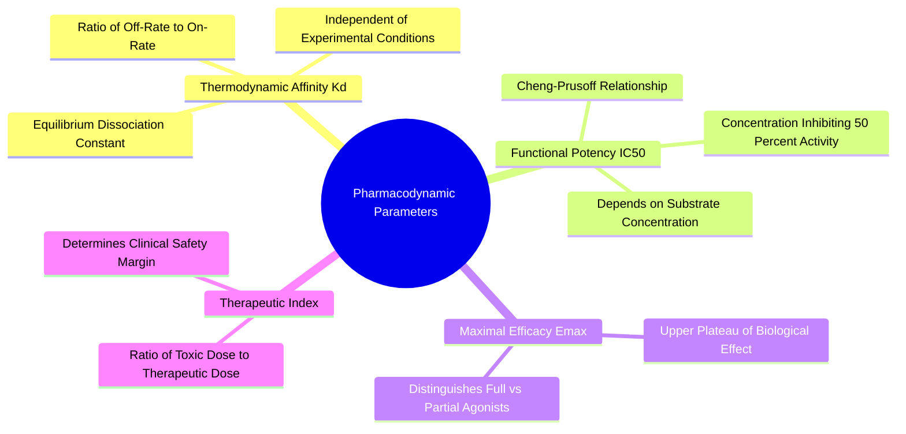

#### 4.2.1. Concept. Binding Affinity (Kd), Inhibitory Potency (IC50), and Efficacy
In pharmacology, scientists carefully distinguish between how tightly a drug binds to a protein, how much drug is needed to inhibit a biological response, and the maximum response achievable.

1. **Dissociation Constant ($K_d$ - True Thermodynamic Affinity):** Measures the equilibrium ratio of separated components to the intact complex:
   $$\text{P} + \text{L} \xrightleftharpoons[k_{\text{off}}]{k_{\text{on}}} \text{P}\cdot\text{L}, \quad K_d = \frac{[\text{P}][\text{L}]}{[\text{P}\cdot\text{L}]} = \frac{k_{\text{off}}}{k_{\text{on}}}$$
   * $K_d$ has units of concentration (Molar, M).
   * It reflects the concentration of free drug at which exactly **$50\%$ of the protein receptors are occupied** at equilibrium.
   * Smaller $K_d$ values mean higher binding affinity. A nanomolar drug ($K_d = 10^{-9}\text{ M}$) binds 1,000 times more tightly than a micromolar drug ($K_d = 10^{-6}\text{ M}$).
2. **Half-Maximal Inhibitory Concentration ($\text{IC}_{50}$ - Functional Potency):** The concentration of drug required to inhibit a specific biological or biochemical function by **$50\%$** in an experimental assay.
   * While $K_d$ is a fixed thermodynamic property, $\text{IC}_{50}$ depends on experimental conditions, including the concentration of the competing native substrate.
   * The **Cheng-Prusoff Equation** connects the two for competitive enzyme inhibitors:
     $$K_i = \frac{\text{IC}_{50}}{1 + \frac{[\text{S}]}{K_m}}$$
     where $[\text{S}]$ is substrate concentration and $K_m$ is the Michaelis-Menten constant.
3. **Efficacy ($E_{\text{max}}$):** The maximum biological effect or functional response that a drug can produce when all receptors are completely saturated. A full agonist achieves $100\%$ efficacy; a partial agonist might plateau at $40\%$ efficacy; a competitive antagonist has $0\%$ efficacy (it simply blocks the site).
4. **Computational Pitfall:** Computational docking models output docking scores (approximations of $\Delta G_{\text{bind}}$ or $K_d$). A low docking score does *not* prove that a molecule is an efficacious drug; it merely predicts that the molecule fits inside the cavity.

*Related Notes:*
* Connects to: `[[3.2.1. Concept. Gibbs Free Energy of Binding]]`
* Connects to: `[[6.2.2. Concept. Scoring Functions: Physics-Based vs Empirical]]`

---
