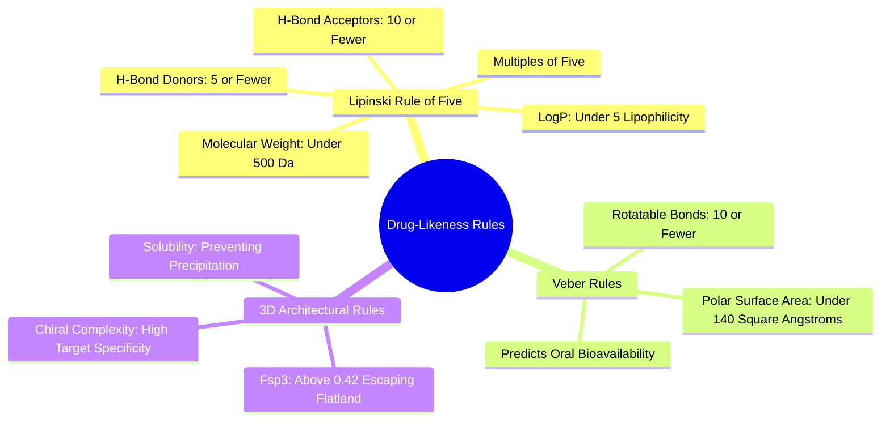

#### 4.3.1. Concept. Lipinski's Rule of Five and Veber's Rules
For a small molecule to function as an orally administered pill, it must dissolve in stomach fluid, survive harsh enzymes, pass through the intestinal wall into the bloodstream, and reach its target tissue without excessive clearance. Christopher Lipinski analyzed thousands of clinical drugs to identify the physicochemical boundaries associated with good oral absorption.

1. **Lipinski’s Rule of Five (Ro5):** Poor oral absorption and permeation are more likely when a molecule violates two or more of the following four criteria (all multiples of 5):
   * **Molecular Weight ($\text{MW}$):** $\le 500\text{ Da}$ (larger molecules diffuse too slowly through cell membranes).
   * **Lipophilicity ($\log P$):** $\le 5$ (measured as the partition coefficient between 1-octanol and water; molecules that are too hydrophobic remain permanently trapped in membrane lipids).
   * **Hydrogen Bond Donors ($\text{HBD}$):** $\le 5$ (sum of all $-\text{OH}$ and $-\text{NH}-$ groups; too many donors make it energetically impossible to strip water and cross hydrophobic cell membranes).
   * **Hydrogen Bond Acceptors ($\text{HBA}$):** $\le 10$ (sum of all Nitrogen and Oxygen atoms).
2. **Veber’s Rules for Oral Bioavailability (2002):** Daniel Veber updated these principles, demonstrating that molecular flexibility is equally critical:
   * **Rotatable Bonds ($\text{NROT}$):** $\le 10$ (molecules with $>10$ rotatable bonds suffer excessive entropic penalties upon binding and struggle to permeate tight cellular junctions).
   * **Topological Polar Surface Area ($\text{TPSA}$):** $\le 140\text{ \AA}^2$ (the surface sum over all polar atoms; values $>140\text{ \AA}^2$ correlate with poor intestinal permeation; values $>90\text{ \AA}^2$ cannot cross the Blood-Brain Barrier).
3. **Application in 3D-SynTree:** In `syntree/chemistry/catalog.py`, `3D-SynTree` enforces these rules directly at the building-block level:
   * Synthon Molecular Weight $\le 220\text{ Da}$ (ensuring that assembling 2 to 3 synthons yields a final drug candidate well within the $\le 500\text{ Da}$ Lipinski envelope).
   * Verified drug-like descriptors reported automatically in `ChemicalValidator.descriptors` (`syntree/chemistry/validator.py`).

*Related Notes:*
* Connects to: `[[1.3.2. Concept. The Hydrophobic Effect and Solvation Shells]]`
* Connects to: `[[3.2.2. Concept. Enthalpy-Entropy Compensation]]`
* Code Manifestation: Descriptors evaluated in `syntree/chemistry/validator.py`.

---
