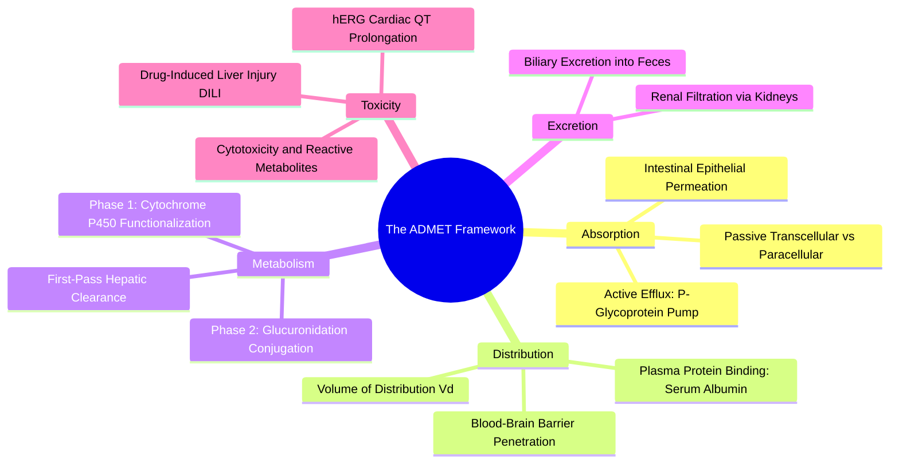

#### 4.3.2. Concept. Pharmacokinetics and the ADMET Profile
**Pharmacokinetics (PK)** describes the physiological fate of a drug inside the human body over time, summarized by the acronym **ADMET**: "What the body does to the drug."

1. **Absorption ($\text{A}$):** The fraction of the administered drug that successfully travels from the site of administration (e.g., the gastrointestinal tract) into systemic circulation.
2. **Distribution ($\text{D}$):** The reversible transfer of drug between the bloodstream and various bodily tissues. Highly hydrophobic drugs bind extensively to blood proteins (like Human Serum Albumin), reducing the fraction of "free" active drug available to enter diseased tissues.
3. **Metabolism ($\text{M}$):** The biochemical breakdown of the drug by internal enzymatic defense mechanisms, primarily located in the liver:
   * **Phase I Metabolism:** Cytochrome P450 enzymes ($\text{CYP3A4, CYP2D6}$) introduce reactive, polar groups through oxidation or hydroxylation, often converting flat aromatic rings into toxic reactive quinones.
   * **Phase II Metabolism:** Conjugating enzymes attach bulky, highly charged groups (glucuronic acid, sulfate) to make the drug water-soluble for clearance.
4. **Excretion ($\text{E}$):** The permanent elimination of the parent drug and its metabolites from the body, primarily via the kidneys (urine) or liver/biliary system (feces). The **half-life ($t_{1/2}$)** measures the time required for plasma drug concentration to drop by half.
5. **Toxicity ($\text{T}$):** Harmful, unwanted physiological side effects, ranging from acute cellular toxicity and liver failure (Drug-Induced Liver Injury, DILI) to mutagenicity and hERG-induced cardiac arrest.

*Related Notes:*
* Connects to: `[[4.2.2. Concept. Selectivity and Off-Target Toxicity]]`
* Connects to: `[[7.6.1. Concept. The Multi-Objective Reinforcement Learning Reward]]`

---

### 4.4. Topic. The Synthesizability Wall in SBDD
