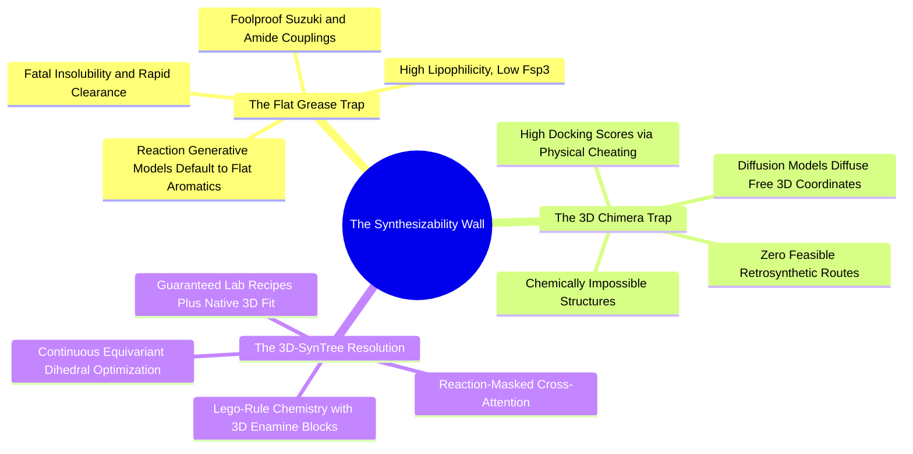

#### 4.4.1. Concept. The Flat Grease Trap in Generative Chemistry
When computational algorithms design molecules without chemical synthesis constraints, they systematically fall into one of two pathological optimization traps. The first is the **"Flat Grease" trap**.

1. **Historical Context:** Early 2D reaction-based generative AI systems (e.g., *SynNet*, *SyntheMol*) guaranteed synthesizability by mimicking medicinal chemistry reactions.
2. **The Pathology:** Because simple aromatic couplings (e.g., Suzuki cross-couplings and classic amide couplings) are the most robust, high-yielding reactions in chemical catalogs, these models iteratively linked flat benzene rings, pyridines, and aromatic linkers together.
3. **The Pharmacological Consequence:** The resulting compounds exhibit:
   * Extremely low Fraction of $sp^3$ carbons ($\text{Fsp3} < 0.25$).
   * Excessive molecular flatness and rigidity.
   * Poor aqueous solubility (they form crystalline $\pi$-stacked lattices that cannot dissolve in water).
   * High promiscuous binding to off-target proteins and rapid clearance by hepatic Cytochrome P450 enzymes.
   * Inability to adapt to three-dimensional protein pockets that require curved, non-planar, chiral geometries.

*Related Notes:*
* Connects to: `[[1.3.2. Concept. The Hydrophobic Effect and Solvation Shells]]`
* Connects to: `[[5.1.2. Concept. Fraction of sp3 Carbons (Fsp3)]]`

---
