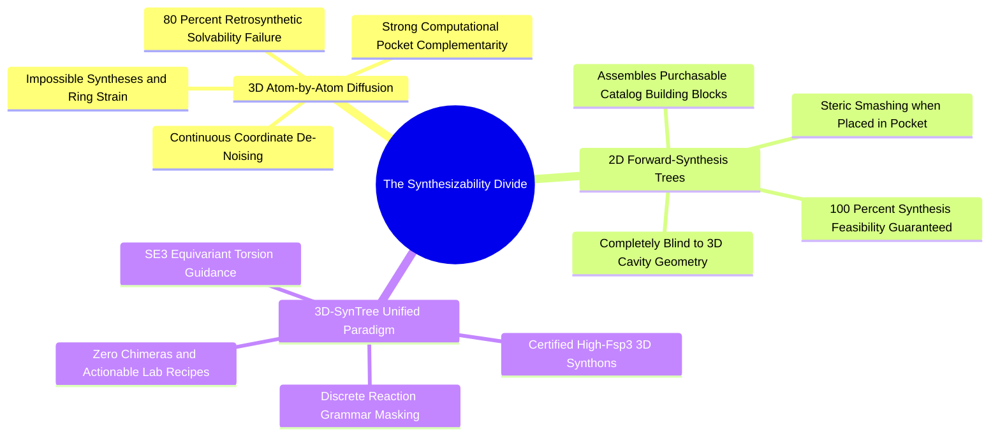

#### 4.4.2. Concept. The Synthesizability Wall: 2D Trees vs 3D Chimeras
The core scientific thesis of `3D-SynTree` is tearing down the **Synthesizability Wall** that divides contemporary computational drug discovery into two broken extremes.

1. **Extreme A: Atom-by-Atom 3D Diffusion Models (e.g., *TargetDiff*, *DiffSBDD*):**
   * **Mechanism:** Diffuse continuous 3D coordinates of individual atoms $(x, y, z)$ inside a protein cavity, gradually denoising an initial random point cloud into a molecular shape.
   * **The Flaw:** They construct molecules without any representation of chemical synthesis rules or bond valences. They produce **chemical chimeras**: molecules with pentavalent carbons, impossible ring strain, unstable peroxide chains ($-\text{O—O}-$), bridgehead double bonds violating Bredt's rule, and zero actionable synthetic pathways. Independent retrosynthetic algorithms (such as *AiZynthFinder*) solve fewer than $20\%$ of their generated designs.
2. **Extreme B: 2D Forward-Synthesis Graphs (e.g., *SyntheMol*):**
   * **Mechanism:** Assemble certified commercial building blocks from vendors like Enamine using validated chemical reactions.
   * **The Flaw:** They operate purely in 2D graph space. They are completely blind to the 3D protein pocket. If their 2D graph is subsequently embedded into 3D space, its rigid covalent bond angles ($109.5^\circ, 120^\circ$) inevitably smash into the protein cavity walls (severe steric clash).
3. **The 3D-SynTree Solution:** `3D-SynTree` formulates molecular generation as a Markov Decision Process over a reaction-constrained discrete synthon action space, where the continuous 3D degrees of freedom are restricted to the **dihedral angle ($\phi$)** of the newly formed bond. Every compound outputs a pristine 3D structure and a certified laboratory recipe.

*Related Notes:*
* Connects to: `[[7.1.1. Concept. The Markov Property in SBDD]]`
* Connects to: `[[7.2.1. Concept. Curating the Enamine REAL 3D-Diversity Catalog]]`

---
