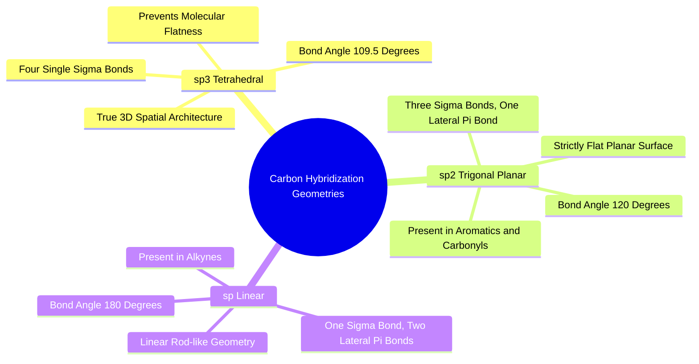

#### 5.1.1. Concept. sp3, sp2, and sp Hybridization
The physical three-dimensional shape of any organic molecule is governed by the quantum mechanical **hybridization** of its atomic orbitals.

1. **$sp^3$ Hybridization (Tetrahedral Geometry):**
   * Formed when the carbon $2s$ orbital mixes with all three $2p$ orbitals ($p_x, p_y, p_z$) to create four identical hybrid orbitals directed toward the four corners of a regular tetrahedron.
   * Ideal bond angle: **$109.5^\circ$**.
   * Carbons with four single bonds are $sp^3$ hybridized. They confer depth, thickness, and true three-dimensional complexity to drug candidates.
2. **$sp^2$ Hybridization (Trigonal Planar Geometry):**
   * Formed when the $2s$ orbital mixes with only two $2p$ orbitals, leaving one unhybridized $p$ orbital perpendicular to the plane.
   * Ideal bond angle: **$120.0^\circ$**.
   * Carbons involved in double bonds ($\text{C=O}$, $\text{C=C}$) and all carbons within aromatic rings (benzene, pyridine) are $sp^2$ hybridized. They enforce strict two-dimensional planarity.
3. **$sp$ Hybridization (Linear Geometry):**
   * Formed when the $2s$ orbital mixes with one $2p$ orbital, leaving two unhybridized $p$ orbitals.
   * Ideal bond angle: **$180.0^\circ$**.
   * Found in alkynes ($-\text{C}\equiv\text{C}-$) and nitriles ($-\text{C}\equiv\text{N}$). They behave as rigid, linear rods.

*Related Notes:*
* Connects to: `[[1.2.1. Concept. Covalent Bonds and Valence Rules]]`
* Connects to: `[[5.1.2. Concept. Fraction of sp3 Carbons (Fsp3)]]`

---
