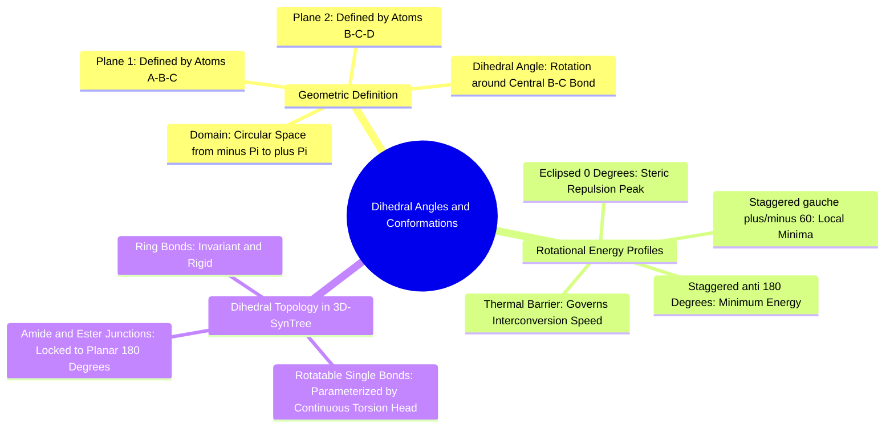

#### 5.2.1. Concept. Dihedral Angles and Rotational Barriers
A **dihedral angle (torsion angle, $\phi$)** is the geometric angle between two intersecting planes defined by four sequentially bonded atoms: $A—B—C—D$.

1. **Geometric Definition:** Plane 1 contains atoms $A$, $B$, and $C$. Plane 2 contains atoms $B$, $C$, and $D$. The angle between these two planes defines $\phi$, typically expressed in the continuous circular domain:
   $$\phi \in [-\pi, +\pi) \quad \text{or} \quad [-180^\circ, +180^\circ)$$
2. **Rotational Potential Energy (Ethane and Butane):** As rotation occurs around the central single bond ($B—C$), the energy of the molecule changes periodically:
   * **Staggered Conformations:** The electron pairs of bonds $A—B$ and $C—D$ are maximized in their separation.
     * *Anti* ($\phi = 180^\circ$): Bulky groups are completely opposite. Global thermodynamic minimum.
     * *Gauche* ($\phi = \pm 60^\circ$): Local thermodynamic energy minimum.
   * **Eclipsed Conformations ($\phi = 0^\circ, \pm 120^\circ$):** Bonds align directly in line with one another, resulting in severe electron-electron repulsion and steric clash. Global thermodynamic maximum.
3. **Circular Geometry in Machine Learning:** Because $\phi = -\pi$ and $\phi = +\pi$ represent the identical physical point in space, dihedral angles cannot be trained using standard Mean Squared Error (MSE). A loss like $(\phi_{\text{pred}} - \phi_{\text{true}})^2$ penalizes a prediction of $+3.14$ against a ground truth of $-3.14$ with an error of $(6.28)^2 \approx 39.4$, despite the two angles being separated by $0.001$ radians. `3D-SynTree` resolves this by parameterizing the dihedral angle as a continuous **von Mises distribution on the circle $SO(2)$**.

*Related Notes:*
* Connects to: `[[1.2.1. Concept. Covalent Bonds and Valence Rules]]`
* Connects to: `[[7.4.3. Concept. The Continuous von Mises Dihedral Torsion Head]]`
* Code Manifestation: Calculated in `ConformerEngine.set_dihedral` (`syntree/chemistry/conformer.py`) and trained in `ContinuousTorsionHead` (`syntree/models/torsion_head.py`).

---
