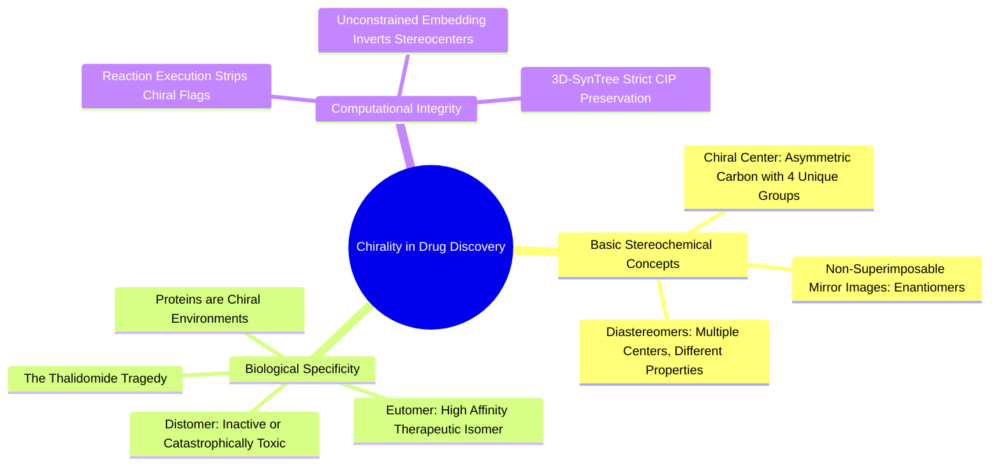

#### 5.3.1. Concept. Stereocenters, Enantiomers, and Diastereomers
**Stereoisomers** are molecules that share the identical molecular formula and identical atom-to-atom bonding connectivity, but differ in the three-dimensional orientation of their atoms in space.

1. **Enantiomers:** A pair of non-superimposable mirror-image molecules (like a left hand and a right hand).
   * Enantiomers have identical physical and chemical properties in an achiral environment (same boiling point, same solubility, identical NMR spectra).
   * However, they rotate plane-polarized light in opposite directions (dextrorotatory vs. levorotatory).
2. **Diastereomers:** Stereoisomers that are not mirror images of one another. Occurs when a molecule possesses two or more chiral centers. Diastereomers have completely different physical properties, different solubilities, different melting points, and different biological activities.
3. **Biological Chiral Discrimination:** Because proteins are constructed exclusively from $\text{L}$-amino acids, the binding cavity is an asymmetric, chiral environment. A chiral drug molecule will interact with the chiral pocket differently depending on which enantiomer is present (Pfeiffer’s Rule).
   * **Eutomer:** The enantiomer that matches the chiral pocket and delivers the therapeutic response.
   * **Distomer:** The opposing enantiomer. The distomer can be completely inactive, act as an antagonist, or bind to an entirely different biological target and cause catastrophic human toxicity (e.g., the historical thalidomide disaster, where the $(R)$-enantiomer was a safe sedative, while the $(S)$-enantiomer caused severe teratogenic birth defects).

*Related Notes:*
* Connects to: `[[2.1.1. Concept. The Alpha-Amino Acid Architecture]]`
* Connects to: `[[5.3.2. Concept. Stereochemical Amnesia and Chiral Inversion Hazards]]`

---
