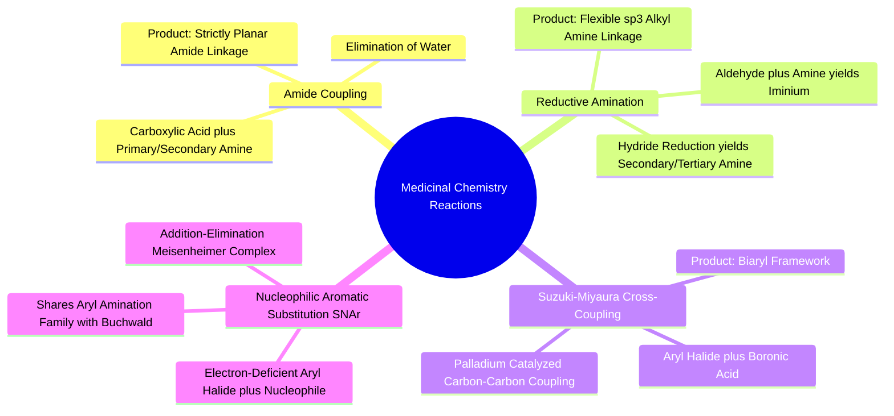

#### 5.4.1. Concept. Amide Coupling Chemistry
Amide coupling is the single most prevalent reaction in modern drug discovery, appearing in over $25\%$ of all active pharmaceutical ingredient synthesis pathways.



1. **Reaction Components:**
   * **Electrophile:** Carboxylic Acid ($-\text{C}(=\text{O})\text{OH}$).
   * **Nucleophile:** Primary or Secondary Amine ($-\text{NH}_2$ or $-\text{NHR}$).
2. **SMARTS Template in 3D-SynTree:**
   ```smarts
   [C:1](=O)[OH].[N;!H0;!H3;!$(NC=O):2] >> [C:1](=O)[N:2]
   ```
   * The predicate `!$(NC=O)` guarantees that amide nitrogens cannot act as nucleophiles, preventing impossible multi-amide cascades.
3. **Biological Role:** Forms a stable, planar, neutral linkage that provides a strong hydrogen bond acceptor ($\text{C=O}$) and a strong hydrogen bond donor ($\text{N—H}$).

*Related Notes:*
* Connects to: `[[2.2.1. Concept. Formation, Geometry, and Resonance of the Peptide Bond]]`
* Code Manifestation: Template `amide_coupling` in `REACTION_TEMPLATES` in `syntree/chemistry/reactions.py`.

---
