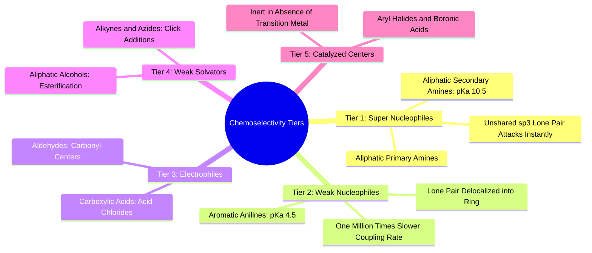

#### 5.4.4. Concept. Chemoselectivity and Competing Reactive Handles
**Chemoselectivity** is the chemical preference of a reaction to occur at one specific functional group among several competing groups on the same molecule.

1. **The Amine Competition Problem:** Suppose a growing intermediate ligand contains both an **aliphatic piperidine amine** ($\text{p}K_a \approx 10.5$) and an **aromatic aniline amine** ($\text{p}K_a \approx 4.5$). Because the aniline lone pair delocalizes into the aromatic $\pi$ system, the aliphatic amine is roughly **one million times ($10^6$) more nucleophilic**.
2. **The Amateur SMARTS Flaw:** A naive Python regex that searches for `[N]` will simply match whichever nitrogen atom appears earlier in the PDB/SDF coordinate file. If the aniline happens to have a lower index, the algorithm attempts to couple the acid to the aniline while leaving the highly reactive aliphatic amine unreacted. In a wet lab, this reaction produces **$0\%$ yield** of the predicted molecule.
3. **The `3D-SynTree` Fix:** In `syntree/chemistry/reactions.py`, `ReactionEngine.rank_handles()` sorts all detected handles using an explicit **medicinal chemistry reactivity tier hierarchy**:
   * Tier 1: Aliphatic primary/secondary amines.
   * Tier 2: Aromatic amines (anilines).
   * Tier 3: Electrophilic coupling handles (acids, aldehydes).
   * Tier 4: Weak nucleophiles (alcohols).
   * Tier 5: Metal-catalyzed coupling partners (aryl halides, boronic acids).
   The model always attempts to grow through the most reactive handle first, reflecting laboratory reality.

*Related Notes:*
* Connects to: `[[1.2.2. Concept. Electronegativity, Dipoles, and Polar Covalent Bonds]]`
* Code Manifestation: Enforced in `HANDLE_REACTIVITY_TIERS` and `rank_handles` in `syntree/chemistry/reactions.py`.

---
