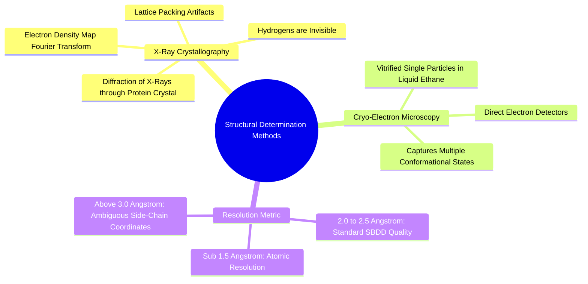

#### 6.1.1. Concept. X-Ray Crystallography and Cryo-EM Resolution
Structure-based drug design relies on experimental three-dimensional coordinates of proteins solved via **X-Ray Crystallography** or **Cryogenic Electron Microscopy (Cryo-EM)**.

1. **The Electron Density Map:** X-rays scatter off electrons, not atomic nuclei. Crystallographers mathematically transform the observed X-ray diffraction pattern using Fourier synthesis to produce a continuous 3D **electron density map ($\rho(x, y, z)$)**, into which the amino acid sequence is computationally threaded.
2. **Resolution ($\text{\AA}$):**
   * **$< 1.5\text{ \AA}$ (Ultra-High Resolution):** Individual atoms are clearly separated as distinct spherical density peaks. Side-chain conformations and bound water molecules are unambiguous.
   * **$1.8\text{ to }2.5\text{ \AA}$ (Standard SBDD Resolution):** The general protein backbone and major side-chain orientations are clear, but single bonds and atom identities (e.g., distinguishing Carbon from Nitrogen or Oxygen in an imidazole ring) require chemical inferencing.
   * **$> 3.0\text{ \AA}$ (Low Resolution):** Only coarse secondary-structure shapes are visible. Individual side-chain coordinates have significant uncertainty.
3. **Filtering in `3D-SynTree`:** In `scripts/preprocess_multidataset.py`, `3D-SynTree` enforces a strict resolution cutoff:
   $$\text{Resolution} \le 2.5\text{ \AA}$$
   Structures with resolution $> 2.5\text{ \AA}$ are discarded to prevent the geometric neural network from learning training labels from noisy or ambiguous atomic coordinates.

*Related Notes:*
* Connects to: `[[6.1.2. Concept. The Protein Data Bank Format and Structural Quirks]]`
* Code Manifestation: Filtered via `--max-resolution 2.5` in `scripts/preprocess_multidataset.py`.

---
