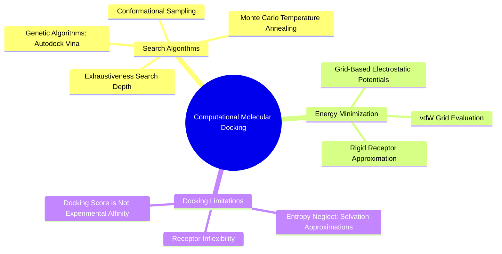

#### 6.2.1. Concept. Physics and Mechanics of Docking Algorithms
**Molecular docking** is a computational modeling technique that predicts the preferred three-dimensional binding orientation (pose) of a small molecule inside a receptor cavity.



1. **The Search Space:** The docking engine must search a continuous multidimensional space:
   * **6 Rigid-Body Degrees of Freedom:** 3 translational coordinates $(x, y, z)$ and 3 rotational Euler angles $(\theta, \psi, \phi)$ positioning the molecule in the cavity.
   * **$N$ Internal Degrees of Freedom:** The rotational dihedral angles across all rotatable bonds in the ligand.
2. **Search Algorithms:**
   * **Genetic Algorithms (Lamarckian GA):** Implemented in tools like *AutoDock Vina*. The algorithm initializes a population of random poses, evaluates their fitness via a scoring function, and iteratively mutates, crosses over, and local-optimizes the best poses across generations.
   * **Grid-Based Pre-Calculation:** Calculating distances between every atom in the drug and all $5,000$ atoms in a protein at every search step is computationally expensive. Modern docking software pre-computes an electrostatic and van der Waals potential energy grid across the binding cavity. The small molecule is then scored instantly by interpolating its atomic coordinates on the pre-computed grid.
3. **Exhaustiveness:** The search parameter that controls how many independent runs the genetic algorithm performs. `3D-SynTree` exposes this parameter directly in its evaluation configuration:
   ```json
   "evaluation": {
     "docking_engine": "gnina",
     "exhaustiveness": 8
   }
   ```

*Related Notes:*
* Connects to: `[[3.2.1. Concept. Gibbs Free Energy of Binding]]`
* Connects to: `[[6.2.2. Concept. Scoring Functions: Physics-Based vs Empirical]]`
* Code Manifestation: Integrated via `EvaluationPipeline._dock` in `syntree/engine/evaluator.py`.

---
