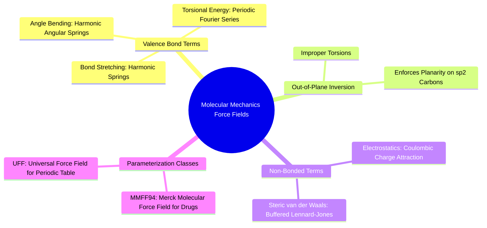

#### 6.3.1. Concept. Molecular Mechanics Force Fields (MMFF94, UFF)
**Molecular Mechanics (MM)** simulates the physical structure and energy of chemical systems by treating atoms as charged spheres connected by mechanical springs, governed by classical Newtonian mechanics rather than full quantum mechanical wavefunctions.

1. **The Potential Energy Function:** The total conformational energy $E_{\text{total}}$ is expressed as:
   $$E_{\text{total}} = E_{\text{stretch}} + E_{\text{bend}} + E_{\text{torsion}} + E_{\text{oop}} + E_{\text{vdW}} + E_{\text{electrostatic}}$$
   * **Bond Stretching:** $E_{\text{stretch}} = \sum \frac{1}{2} k_b (r - r_0)^2$. Penalizes deviations from the equilibrium covalent bond length $r_0$.
   * **Angle Bending:** $E_{\text{bend}} = \sum \frac{1}{2} k_\theta (\theta - \theta_0)^2$. Penalizes deviations from equilibrium bond angles (e.g., $109.5^\circ$ for $sp^3$ carbon).
   * **Torsional Energy:** $E_{\text{torsion}} = \sum \frac{1}{2} V_n [1 + \cos(n\phi - \gamma)]$. Models rotational barriers across single bonds.
   * **Out-of-Plane (Improper Torsions):** $E_{\text{oop}} = \sum \frac{1}{2} k_{\text{oop}} \chi^2$. Prevents $sp^2$ planar centers (like carbonyls and aromatic rings) from bending into pyramids.
2. **MMFF94 (Merck Molecular Force Field):** Heavily parameterized against experimental and quantum chemical data specifically for organic drug-like small molecules.
3. **UFF (Universal Force Field):** A generalized force field parameterized for all elements across the periodic table, used as a robust fallback when MMFF94 lacks parameters for rare heteroatoms (e.g., Boron in boronic acids).

*Related Notes:*
* Connects to: `[[1.2.1. Concept. Covalent Bonds and Valence Rules]]`
* Connects to: `[[6.3.2. Concept. Constrained Energy Minimization]]`

---
