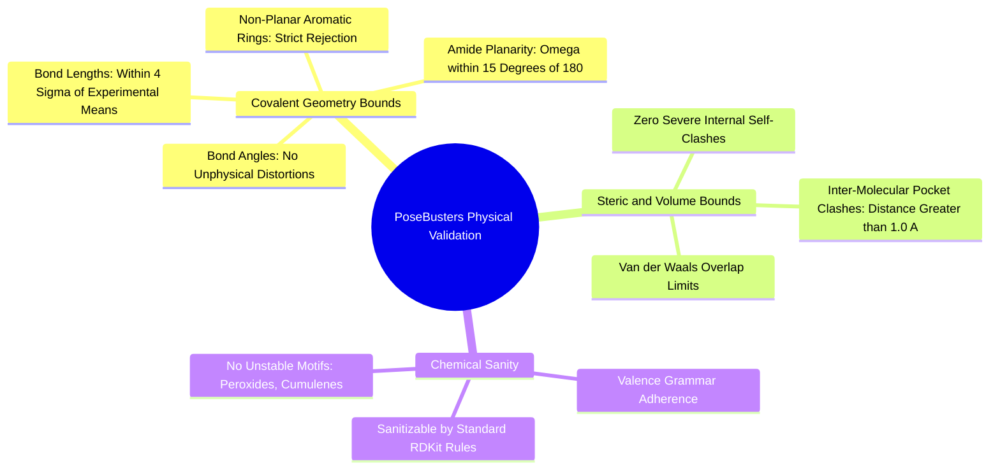

#### 6.4.1. Concept. PoseBusters and Physical Sanity Filters
Recent breakthroughs in generative drug discovery revealed that many published deep learning models achieve outstanding docking scores simply by "cheating" physics—placing atoms in strained configurations that exploit flaws in docking scoring functions. To eliminate this pathology, the pharmaceutical industry established the **PoseBusters** standardized testing protocol (Buttenschoen et al., *Nature Chemistry*, 2024).

1. **Bond Length and Angle Outliers:** Verifies that all bond lengths and angles in the generated 3D conformer reside within $4\sigma$ (standard deviations) of the mean values recorded in the Cambridge Structural Database (CSD).
2. **Aromatic and Amide Planarity:** Checks that aromatic rings do not bend like bowls, and that amide junctions do not twist out of planarity ($\omega$ within $\pm 15^\circ$ of $180^\circ$).
3. **Internal Self-Clash:** Verifies that no two non-bonded atoms within the generated drug sit closer than their van der Waals contact minimum.
4. **Protein-Ligand Steric Clash:** Verifies that no heavy atom of the drug penetrates within **$1.0\text{ \AA}$** of any protein pocket atom.
5. **Chemical Validator in 3D-SynTree:** In `syntree/chemistry/validator.py`, `ChemicalValidator` runs an automated battery of PoseBusters-equivalent checks. A molecule is flagged as invalid if it contains pentavalent carbons, unphysical formal charges ($>3$), or unstable moieties (peroxides, ozonides).

*Related Notes:*
* Connects to: `[[2.2.1. Concept. Formation, Geometry, and Resonance of the Peptide Bond]]`
* Connects to: `[[6.4.2. Concept. Strain Energy and Energetic Feasibility]]`
* Code Manifestation: Complete test battery executed in `syntree/chemistry/validator.py`.

---
