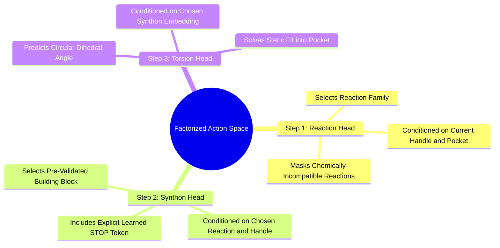

#### 7.1.2. Concept. The Factorized Action Space
To avoid the combinatorial intractability of searching all possible reactions, synthons, and angles simultaneously, `3D-SynTree` factorizes the policy action space according to the chain rule of probability:
$$\pi_\theta(a_t \mid \mathcal{P}, \mathcal{M}_t) = P(r_t \mid \mathcal{P}, \mathcal{M}_t) \times P(B_t \mid r_t, \mathcal{P}, \mathcal{M}_t) \times p(\phi_t \mid B_t, r_t, \mathcal{P}, \mathcal{M}_t)$$

1. **Reaction Selection ($r_t$):** The policy evaluates the active handle $u$ on the scaffold and predicts a discrete reaction family (e.g., amide coupling vs. reductive amination).
2. **Synthon Selection ($B_t$):** Given the chosen reaction, the policy queries the building block catalog, masking out all incompatible molecules, and selects a specific purchasable synthon.
3. **Dihedral Angle Prediction ($\phi_t$):** Conditioned on the chosen synthon, the policy predicts the continuous single-bond dihedral angle around the new junction bond.
4. **The Broken Factorization Flaw:** If the torsion head does not receive the embedding of the *chosen synthon* ($B_t$), it predicts the identical dihedral angle whether the model selects a tiny methyl group ($-\text{CH}_3$) or a massive spiro-adamantyl core. Conditioning the torsion head on $B_t$ is required because optimal dihedral rotation is dictated by steric interactions between the incoming synthon's specific side-chains and the pocket walls.

*Related Notes:*
* Connects to: `[[5.4.4. Concept. Chemoselectivity and Competing Reactive Handles]]`
* Connects to: `[[7.4.3. Concept. The Continuous von Mises Dihedral Torsion Head]]`
* Code Manifestation: Executed sequentially in `SynTreePolicy.act` (`syntree/models/policy.py`).

---

### 7.2. Topic. High-Fsp3 Building Blocks and Catalogs
