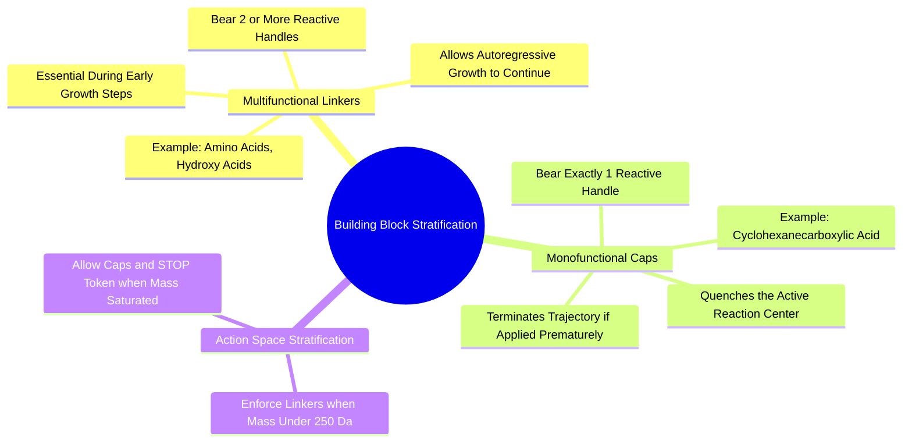

#### 7.2.2. Concept. Multifunctional Linkers vs Monofunctional Caps
To grow an elongated, multi-step drug candidate across an extended binding cavity, the policy must distinguish between building blocks that allow continued growth and those that terminate it.

1. **Monofunctional Caps:** Synthons possessing exactly **one** reactive functional group (e.g., cyclohexanecarboxylic acid, cyclopentylamine). Once attached to the growing scaffold, no reactive handle remains. The trajectory terminates instantly.
2. **Multifunctional Linkers:** Synthons possessing **two or more** reactive handles (e.g., an amino acid bearing both an amine and a carboxylic acid, or a bromo-aniline). When attached, one handle is consumed by the reaction, while the second handle remains free, serving as the attachment handle for the subsequent generative step.
3. **The One-Step Death Trap:** If an untrained or naive model selects a monofunctional cap at Step 1, growth stops permanently. The resulting compound has a molecular weight of only $\approx 180\text{ Da}$—too small to fill a binding pocket or achieve potency.
4. **The Resolution:** `3D-SynTree` enforces an architectural rule: during early growth steps (or until the intermediate scaffold reaches `data.terminal_cap_min_mw`, default $250\text{ Da}$), monofunctional caps are strictly masked from the synthon action space. The model is forced to choose multifunctional linkers until the ligand achieves drug-like volume.

*Related Notes:*
* Connects to: `[[7.4.2. Concept. The Synthon Head and the Explicit STOP Token]]`
* Code Manifestation: Filtered via `require_remaining_handle` in `SynthonCatalog.get_reaction_family_mask` and `SBDDGenerator.generate_ligand`.

---

### 7.3. Topic. SE(3)-Equivariant Pocket Conditioning
