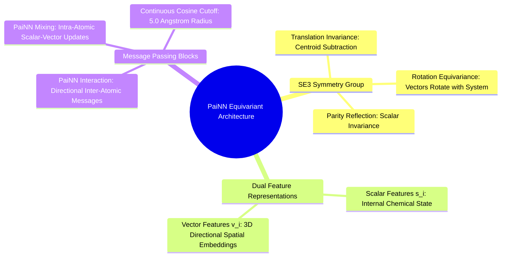

#### 7.3.1. Concept. PaiNN Invariant Scalar and Equivariant Vector Features
The protein pocket is an unconstrained three-dimensional point cloud living in Euclidean space $\mathbb{R}^3$. To process this cavity, `3D-SynTree` implements an $\text{SE}(3)$-equivariant graph neural network: the **Polarizable Atom Interaction Network (PaiNN)**.

1. **The $\text{SE}(3)$ Group:** The Special Euclidean group in three dimensions represents all rigid-body translations and rotations in 3D space:
   * **Invariance:** A function $f$ is invariant if rotating or translating the input leaves the output unchanged: $f(\mathbf{R}\mathbf{x} + \mathbf{t}) = f(\mathbf{x})$.
   * **Equivariance:** A function $g$ is equivariant if rotating the input rotates the output by the identical rotation matrix: $g(\mathbf{R}\mathbf{x} + \mathbf{t}) = \mathbf{R} g(\mathbf{x})$.
2. **Dual-Channel Features in PaiNN:**
   * **Scalar Features ($s_i \in \mathbb{R}^d$):** Invariant scalar representations of each atom's chemical state (atomic number, charge, local electronegativity).
   * **Vector Features ($\vec{v}_i \in \mathbb{R}^{3 \times d}$):** Equivariant spatial vectors that point along geometric axes in 3D space, capturing directed features (dipoles, orbital orientations, cavity wall directions).
3. **The Message Passing Updates:**
   * **Inter-Atomic Interaction:** Passes directional messages across edges within a radial cutoff ($r_{\text{cut}} = 5.0\text{ \AA}$), expanding interatomic distances $d_{ij}$ using Gaussian Radial Basis Functions (RBFs) smoothed by a cosine cutoff envelope.
   * **Intra-Atomic Mixing:** Mixes scalar and vector channels through a linear projection, computing vector norms $\|\vec{v}_i\|$ in $\text{fp32}$ to update both channels without breaking rotational equivariance.

*Related Notes:*
* Connects to: `[[1.2.2. Concept. Electronegativity, Dipoles, and Polar Covalent Bonds]]`
* Connects to: `[[7.3.2. Concept. Relative Distance RBFs and Cross-Attention Core]]`
* Code Manifestation: Implemented in `syntree/models/equivariant.py` and `syntree/models/pocket_encoder.py`.

---
