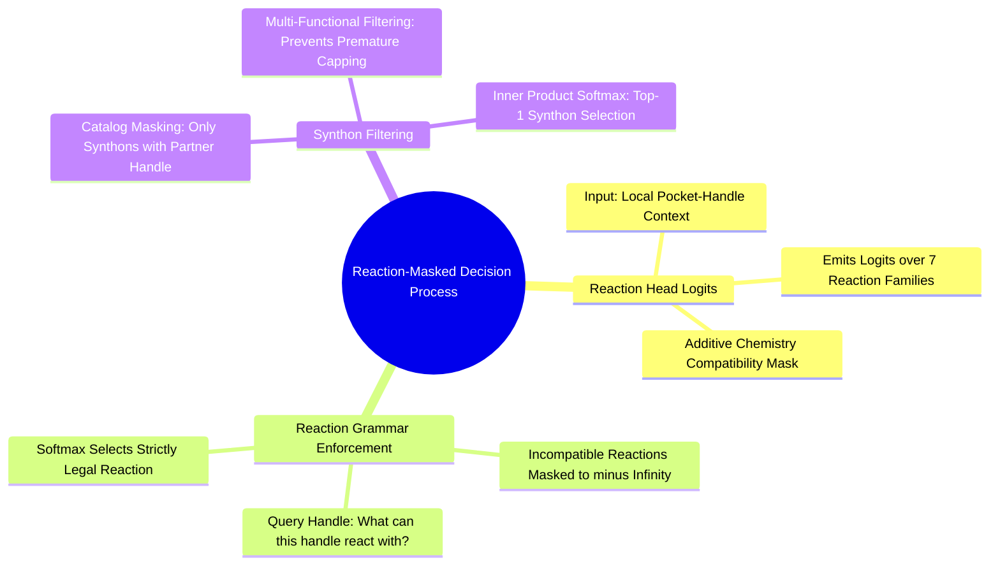

#### 7.4.1. Concept. The Reaction Head and Grammar Masking
The first decision in the factorized policy selects the reaction family.

1. **The Reaction Head Architecture:** A multi-layer perceptron taking the cross-attention context vector $\mathbf{z}_t$ and emitting logits over the 7 supported reaction families:
   $$\mathbf{z}_{\text{rxn}} = \text{MLP}(\mathbf{z}_t) \in \mathbb{R}^7$$
2. **The Reaction Compatibility Mask:** Before applying the softmax, the logits are masked by an additive boolean compatibility vector derived deterministically from the chemistry engine:
   $$\mathbf{M}_{\text{rxn}}(f) = \begin{cases} 0.0 & \text{if handle } u \text{ can participate in family } f \\ -\infty & \text{otherwise} \end{cases}$$
   $$\mathbf{p}_{\text{rxn}} = \text{Softmax}\left(\mathbf{z}_{\text{rxn}} + \mathbf{M}_{\text{rxn}}\right)$$
   If the active handle on the scaffold is a carboxylic acid, the mask permits amide coupling and esterification, while setting Suzuki coupling, reductive amination, and click triazole to $-\infty$. The network cannot propose an impossible reaction.

*Related Notes:*
* Connects to: `[[5.4.1. Concept. Amide Coupling Chemistry]]`
* Connects to: `[[7.4.2. Concept. The Synthon Head and the Explicit STOP Token]]`
* Code Manifestation: Implemented in `ReactionHead` (`syntree/models/reaction_head.py`).

---
