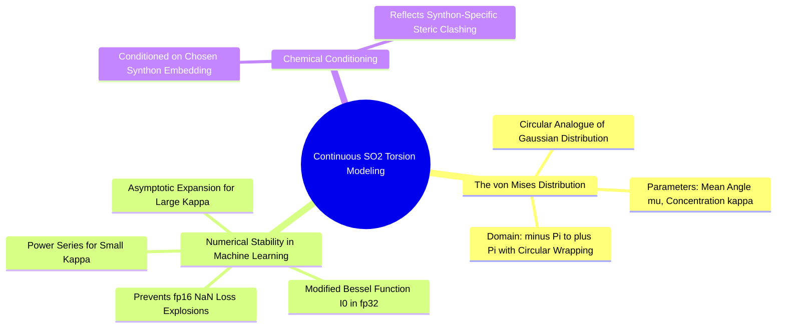

#### 7.4.3. Concept. The Continuous von Mises Dihedral Torsion Head
Predicting the 3D dihedral rotation of the newly formed bond requires modeling probability density on a circular manifold.

1. **The von Mises Distribution:** The circular analogue of the normal distribution, defined on $\phi \in [-\pi, \pi)$:
   $$p(\phi \mid \mu, \kappa) = \frac{\exp\left( \kappa \cos(\phi - \mu) \right)}{2\pi I_0(\kappa)}$$
   where:
   * $\mu \in [-\pi, \pi)$ is the predicted mean dihedral angle.
   * $\kappa > 0$ is the concentration parameter (equivalent to $1/\sigma^2$). High $\kappa$ means high certainty.
   * $I_0(\kappa)$ is the modified Bessel function of the first kind of order 0, serving as the normalizing partition function.
2. **Circular Negative Log-Likelihood Loss:**
   $$\mathcal{L}_{\text{torsion}} = -\ln p(\phi_{\text{true}} \mid \mu, \kappa) = -\kappa \cos(\phi_{\text{true}} - \mu) + \ln(2\pi) + \ln I_0(\kappa)$$
3. **The fp16 Precision Catastrophe:** In 16-bit mixed-precision training (such as on Colab Tesla T4 GPUs), computing $\ln I_0(\kappa)$ naively causes catastrophic NaN failures. When $\kappa > 50$, $I_0(\kappa)$ overflows the maximum fp16 representable limit ($65,504$) to `+inf`, which subsequently turns the loss into `NaN`. `3D-SynTree` hardens this by evaluating the modified Bessel function strictly in **$\text{fp32}$** using a dual regime:
   * Power series expansion for $\kappa < 5.0$.
   * Asymptotic expansion $\ln I_0(\kappa) \approx \kappa - \frac{1}{2}\ln(2\pi\kappa) + \dots$ for $\kappa \ge 5.0$.

*Related Notes:*
* Connects to: `[[5.2.1. Concept. Dihedral Angles and Rotational Barriers]]`
* Code Manifestation: Implemented in `ContinuousTorsionHead` and `log_bessel_i0` in `syntree/models/torsion_head.py`.

---

### 7.5. Topic. Physical Assembly and Conformer Snapping
