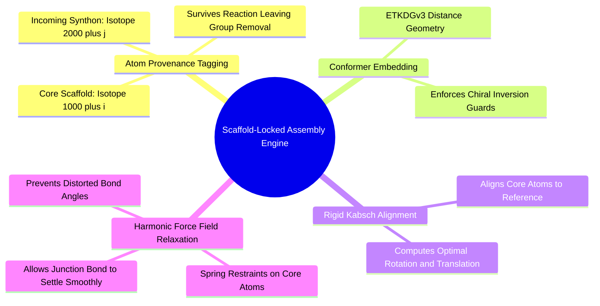

#### 7.5.1. Concept. Scaffold-Locked Harmonic Restraint Relaxation
After RDKit constructs the product molecule graph and the torsion head predicts dihedral angle $\phi_t$, the new synthon must be assigned physical 3D coordinates.

1. **Atom Provenance via Isotopes:** When RDKit executes a reaction (e.g., amide coupling), it strips leaving groups (the water molecule, $-\text{OH}$ and $-\text{H}$). Because RDKit scrambles internal atom-map tags during `RunReactants`, `ReactionEngine` tags core atoms with unique isotopes ($1000 + i$) and synthon atoms with ($2000 + j$). These isotopes survive product sanitization, providing exact $1:1$ atomic correspondence between reactant coordinates and product atoms.
2. **The Kabsch Rigid Alignment:** The newly embedded 3D product (which is initially generated by ETKDG in an arbitrary coordinate frame) must be aligned with the existing locked scaffold. The engine extracts the coordinates of all core atoms in the product ($\mathbf{P}$) and their reference positions ($\mathbf{Q}$), calculating the optimal translation vectors and proper rotation matrix $\mathbf{R} \in \text{SO}(3)$ via Singular Value Decomposition (SVD):
   $$\mathbf{H} = (\mathbf{P} - \bar{\mathbf{P}})^T (\mathbf{Q} - \bar{\mathbf{Q}}) = \mathbf{U} \mathbf{\Sigma} \mathbf{V}^T, \quad \mathbf{R} = \mathbf{V} \begin{pmatrix} 1 & 0 & 0 \\ 0 & 1 & 0 \\ 0 & 0 & \det(\mathbf{V}\mathbf{U}^T) \end{pmatrix} \mathbf{U}^T$$
3. **Harmonic Spring Relaxation:** Once aligned, the core atoms are held near their crystal reference positions using harmonic restraints ($k = 50\text{ kcal/mol/\AA}^2$) while the newly formed junction bond relaxes under the MMFF94 force field. This heals any bond length or angle distortions introduced during assembly without moving the scaffold.
4. **Dihedral Rotation:** Finally, `ConformerEngine.set_dihedral` rotates the newly attached synthon around the junction bond to match the neural network's predicted angle $\phi_t$. If the junction is an amide, the bond is locked strictly planar ($180^\circ$).

*Related Notes:*
* Connects to: `[[2.2.1. Concept. Formation, Geometry, and Resonance of the Peptide Bond]]`
* Connects to: `[[6.3.2. Concept. Constrained Energy Minimization]]`
* Code Manifestation: Implemented in `ConformerEngine.embed_product` (`syntree/chemistry/conformer.py`).

---

### 7.6. Topic. Multi-Objective Reinforcement Learning
