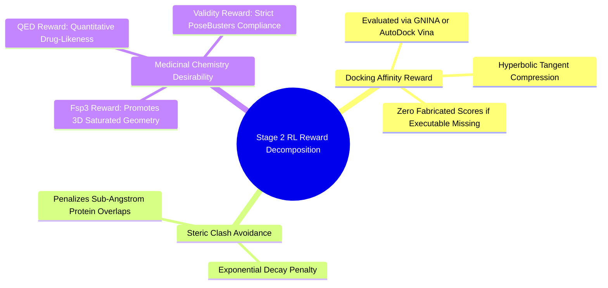

#### 7.6.1. Concept. The Multi-Objective Reinforcement Learning Reward
In Stage 2, the behavioral-cloning policy is fine-tuned using Reinforcement Learning (PPO) against an external multi-objective reward function:
$$R_{\text{total}} = w_{\text{dock}} R_{\text{dock}} + w_{\text{clash}} R_{\text{clash}} + w_{\text{fsp3}} R_{\text{fsp3}} + w_{\text{qed}} R_{\text{qed}} + w_{\text{valid}} R_{\text{valid}}$$

1. **Docking Affinity Reward ($R_{\text{dock}}$):**
   $$R_{\text{dock}} = \tanh\left( \frac{-\text{Score}_{\text{dock}}}{\text{Scale}} \right)$$
   Evaluated using external GNINA or AutoDock Vina. If the binary is missing, `docking_available` is set to $0.0$ and the reward component is recorded as zero—no proxy numbers are fabricated.
2. **Steric Clash Penalty ($R_{\text{clash}}$):**
   $$R_{\text{clash}} = \exp\left( -\frac{\max(0, \text{Score}_{\text{clash}})}{\text{Scale}} \right)$$
   Exponentially penalizes overlaps where ligand heavy atoms penetrate within the van der Waals radii of protein atoms.
3. **Saturation Reward ($R_{\text{fsp3}}$):**
   $$R_{\text{fsp3}} = \tanh\left( \frac{\max(0, \text{Fsp3} - 0.42)}{0.20} \right)$$
   Rewards the agent for selecting $sp^3$-rich building blocks that preserve 3D conformational complexity.
4. **Drug-Likeness Reward ($R_{\text{qed}}$):**
   Bickerton’s **Quantitative Estimate of Drug-Likeness (QED)** score ($[0, 1]$), which integrates molecular weight, $\log P$, polar surface area, and rotatable bonds into an underlying desirability function.
5. **Physical Validity Reward ($R_{\text{valid}}$):**
   A binary bonus ($1.0$ vs. $0.0$) granted only if the molecule passes all RDKit sanitization and PoseBusters physical geometry checks.

*Related Notes:*
* Connects to: `[[4.3.1. Concept. Lipinski's Rule of Five and Veber's Rules]]`
* Connects to: `[[6.2.2. Concept. Scoring Functions: Physics-Based vs Empirical]]`
* Code Manifestation: Implemented in `ThreeDReward` in `syntree/engine/rl.py`.

---
