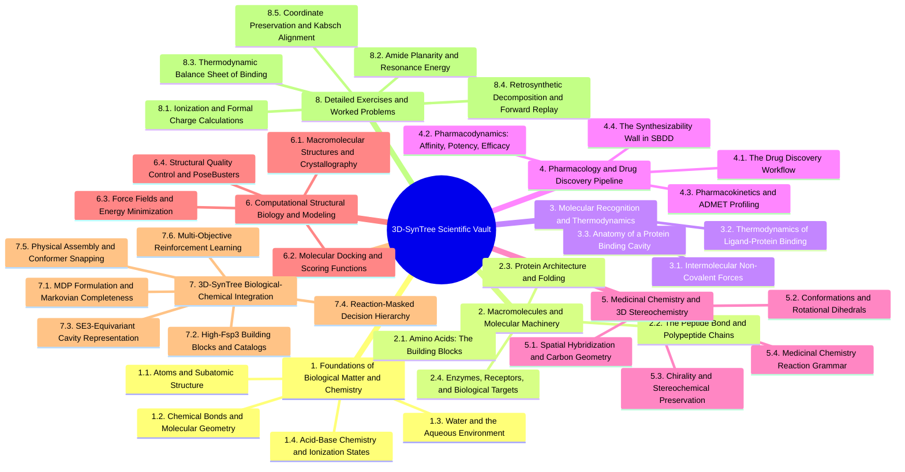

# 3D-SynTree Biology, Pharmacology, and Medicinal Chemistry Vault

---

## 0. Master Map of Content

### 0.1. Vault Architecture and Navigation Map



---


---


## 8. Chapter 8. Detailed Exercises, Worked Problems, and Case Studies

### 8.1. Exercise 1. Calculating Formal Charges and Ionization States at Physiological pH

#### 8.1.1. Problem Statement
You are given a synthetic hit molecule generated for an oncology target. The molecule contains three ionizable functional groups:
1. An aliphatic cyclohexyl carboxylic acid group ($\text{p}K_a = 4.80$).
2. A secondary piperidine aliphatic amine ($\text{p}K_a = 10.20$).
3. An aromatic aniline nitrogen attached to an unactivated benzene ring ($\text{p}K_a = 4.60$).

Calculate the exact ratio of deprotonated to protonated forms for each of the three groups in human blood at physiological $\text{pH } 7.40$. State the net formal charge of each group, and determine whether the overall molecule is cationic, anionic, or zwitterionic.

#### 8.1.2. Required Background Knowledge
* The Henderson-Hasselbalch equation (`[[1.4.1. Concept. pH, pKa, and Proton Exchange]]`).
* Behavior of carboxylic acids vs. amines (`[[1.4.2. Concept. Formal Charges at Physiological pH]]`).
* Logarithmic transformations and formal charge rules.

#### 8.1.3. Terminology Defined
* **Zwitterion:** A neutral molecule that carries equal numbers of positive and negative formal charges located on different atoms simultaneously.
* **Deprotonated Form ($[\text{A}^-]$ or $[\text{B}]$):** The chemical species remaining after an acid loses a proton ($\text{H}^+$).
* **Protonated Form ($[\text{HA}]$ or $[\text{BH}^+]$):** The chemical species formed when a base captures a proton.

#### 8.1.4. Step-by-Step Solution

##### Group 1: The Aliphatic Carboxylic Acid ($\text{p}K_a = 4.80$)
1. Write the Henderson-Hasselbalch equilibrium:
   $$\text{pH} = \text{p}K_a + \log_{10}\left( \frac{[\text{R—COO}^-]}{[\text{R—COOH}]} \right)$$
2. Substitute the values:
   $$7.40 = 4.80 + \log_{10}\left( \frac{[\text{R—COO}^-]}{[\text{R—COOH}]} \right)$$
3. Isolate the logarithmic term:
   $$\log_{10}\left( \frac{[\text{R—COO}^-]}{[\text{R—COOH}]} \right) = 7.40 - 4.80 = +2.60$$
4. Compute the antilogarithm:
   $$\frac{[\text{R—COO}^-]}{[\text{R—COOH}]} = 10^{2.60} \approx 398.1$$
5. Interpretation: For every 1 neutral molecule, there are $\approx 398$ deprotonated carboxylate anions.
   $$\text{Percentage Deprotonated} = \frac{398.1}{1 + 398.1} \times 100\% = 99.75\%$$
6. Formal charge: **$-1$**.

##### Group 2: The Aliphatic Piperidine Amine ($\text{p}K_a = 10.20$)
1. For a basic amine, the equilibrium involves its conjugate acid ($[\text{R}_2\text{NH}_2^+]$):
   $$\text{pH} = \text{p}K_a + \log_{10}\left( \frac{[\text{R}_2\text{NH}]}{[\text{R}_2\text{NH}_2^+]} \right)$$
2. Substitute the values:
   $$7.40 = 10.20 + \log_{10}\left( \frac{[\text{R}_2\text{NH}]}{[\text{R}_2\text{NH}_2^+]} \right)$$
3. Isolate the logarithmic term:
   $$\log_{10}\left( \frac{[\text{R}_2\text{NH}]}{[\text{R}_2\text{NH}_2^+]} \right) = 7.40 - 10.20 = -2.80$$
4. Compute the antilogarithm:
   $$\frac{[\text{R}_2\text{NH}]}{[\text{R}_2\text{NH}_2^+]} = 10^{-2.80} \approx 0.001585$$
5. Invert to calculate the ratio of protonated cation to neutral amine:
   $$\frac{[\text{R}_2\text{NH}_2^+]}{[\text{R}_2\text{NH}]} = \frac{1}{0.001585} \approx 630.9$$
6. Interpretation: Over $99.84\%$ of the piperidine molecules exist in the positively charged ammonium form.
7. Formal charge: **$+1$**.

##### Group 3: The Aromatic Aniline Nitrogen ($\text{p}K_a = 4.60$)
1. The equilibrium involves the anilinium conjugate acid ($[\text{Ar—NH}_3^+]$):
   $$\text{pH} = \text{p}K_a + \log_{10}\left( \frac{[\text{Ar—NH}_2]}{[\text{Ar—NH}_3^+]} \right)$$
2. Substitute the values:
   $$7.40 = 4.60 + \log_{10}\left( \frac{[\text{Ar—NH}_2]}{[\text{Ar—NH}_3^+]} \right)$$
3. Isolate the logarithmic term:
   $$\log_{10}\left( \frac{[\text{Ar—NH}_2]}{[\text{Ar—NH}_3^+]} \right) = 7.40 - 4.60 = +2.80$$
4. Compute the antilogarithm:
   $$\frac{[\text{Ar—NH}_2]}{[\text{Ar—NH}_3^+]} = 10^{2.80} \approx 630.9$$
5. Interpretation: For every 1 protonated anilinium cation, there are $631$ neutral aniline molecules.
   $$\text{Percentage Neutral} = \frac{630.9}{1 + 630.9} \times 100\% = 99.84\%$$
6. Formal charge: **$0$** (neutral).

#### 8.1.5. Correct Answer
* Carboxylic Acid: Ratio is $\mathbf{398:1}$ favoring deprotonation; Formal Charge = $\mathbf{-1}$.
* Piperidine Amine: Ratio is $\mathbf{631:1}$ favoring protonation; Formal Charge = $\mathbf{+1}$.
* Aniline Nitrogen: Ratio is $\mathbf{631:1}$ favoring the neutral free base; Formal Charge = $\mathbf{0}$.
* The overall molecule carries one $-1$ charge and one $+1$ charge; it is a **Zwitterion** with a net charge of $0$.

#### 8.1.6. Reasoning and Scientific Explanation
Carboxylic acids lose protons at biological $\text{pH}$ because their conjugate base is resonance-stabilized across two electronegative oxygens. Aliphatic amines hold their protons because the electron-donating alkyl carbons stabilize the positive charge. In contrast, aniline's lone pair delocalizes into the aromatic ring's $\pi$ system, lowering its basicity and preventing protonation at $\text{pH } 7.4$.

#### 8.1.7. Common Mistakes
* **Treating all nitrogens as identical bases:** Assuming that because aniline contains an $-\text{NH}_2$ group, it must be positively charged like Lysine. In reality, anilines are neutral at body $\text{pH}$.
* **Sign inversion in the antilog:** Calculating $7.4 - 10.2 = -2.8$, but forgetting that $10^{-2.8}$ represents the fraction of *unprotonated* base, leading to the false conclusion that the piperidine is neutral.

#### 8.1.8. Misleading Answers
* *"The molecule has a net charge of $+2$ because it contains two amines."* This is wrong because it ignores aromatic resonance in the aniline.
* *"The carboxylic acid is neutral because it is an acid."* This is wrong because acids dissociate in basic or neutral environments.

#### 8.1.9. Pro-Tips and Memory Aids
* **The "Lower $\text{pH}$ Protonates" Rule:** If $\text{pH} < \text{p}K_a$, the proton stays **ON**. If $\text{pH} > \text{p}K_a$, the proton comes **OFF**.
* For the acid ($\text{p}K_a = 4.8$): $\text{pH } 7.4 > \text{p}K_a \implies$ Proton OFF $\implies -\text{COO}^-$.
* For the amine ($\text{p}K_a = 10.2$): $\text{pH } 7.4 < \text{p}K_a \implies$ Proton ON $\implies -\text{NH}_2^+$.

#### 8.1.10. Details Commonly Forgotten
Students frequently forget that the $\text{p}K_a$ quoted for an amine in biochemical literature is the $\text{p}K_a$ of its **conjugate acid** ($-\text{NH}_3^+$), not the dissociation of neutral $-\text{NH}_2$ into an amide ion ($-\text{NH}^-$).

#### 8.1.11. Connection to the Larger Subject
Ionization states dictate aqueous solubility and membrane permeability. A zwitterion dissolves well in blood water, but its charged groups must pay a steep desolvation penalty to cross into lipid membranes.

#### 8.1.12. Application to 3D-SynTree
In `syntree/data/featurizer.py`, `MolecularFeaturizer.featurize_handle` encodes the atom's formal charge directly into slots 26–34:
```python
charge = int(atom.GetFormalCharge())
charge_slot = charge + 3 # maps [-3, +4] -> [0, 7]
feats[_CHARGE_OFFSET + charge_slot] = 1.0
```
If the preprocessing fails to protonate the piperidine or deprotonate the acid, the neural network receives a neutral $0.0$ feature, blinding it to the electrostatic salt bridge required to anchor the synthon into the pocket.

---

### 8.2. Exercise 2. Why the Twisted Amide is a Biophysical Catastrophe

#### 8.2.1. Problem Statement
A naive generative model generates a 3D ligand by connecting a carboxylic acid scaffold to an amine synthon via an amide bond. To fit into a narrow subpocket without clashing with a Leucine side chain, the model sets the dihedral angle across the central amide bond ($\text{C}_\alpha—\text{C}(=\text{O})—\text{N}—\text{C}_\alpha$) to $\phi = 90.0^\circ$.

1. Using molecular orbital theory, explain why this $90^\circ$ conformation is physically and chemically impossible in biological systems.
2. If the barrier to rotation of a planar amide is $\Delta E^\ddagger = 20.0\text{ kcal/mol}$, use the Boltzmann distribution at $T = 310.15\text{ K}$ to calculate the relative probability of finding this amide in the $90^\circ$ twisted state compared to the planar $180^\circ$ ($trans$) state.
3. Contrast this with how `3D-SynTree` enforces amide geometry.

#### 8.2.2. Required Background Knowledge
* Molecular orbital resonance of the peptide bond (`[[2.2.1. Concept. Formation, Geometry, and Resonance of the Peptide Bond]]`).
* The Boltzmann distribution equation:
  $$\frac{P_2}{P_1} = \exp\left( -\frac{\Delta E}{k_B T} \right)$$
* Rotational barriers in computational chemistry (`[[5.2.1. Concept. Dihedral Angles and Rotational Barriers]]`).

#### 8.2.3. Terminology Defined
* **$p$-Orbital Delocalization:** The lateral overlap of parallel atomic $p$ orbitals that allows electron density to spread across multiple adjacent nuclei.
* **Boltzmann Constant ($k_B$):** The physical constant relating average kinetic energy to temperature ($1.987 \times 10^{-3}\text{ kcal}\cdot\text{mol}^{-1}\text{K}^{-1}$).

#### 8.2.4. Step-by-Step Solution

##### Part 1: Molecular Orbital Explanation
1. In a planar amide ($\phi = 180^\circ$), the unhybridized $2p_z$ orbital of the nitrogen atom aligns parallel to the $2p_z$ orbital of the carbonyl carbon and the $2p_z$ orbital of the oxygen atom.
2. This parallel alignment permits continuous three-center, four-electron $\pi$-conjugation: the nitrogen lone pair delocalizes into the carbonyl $\pi^*$ antibonding orbital.
3. This resonance imparts approximately $40\%$ double-bond character to the central $\text{C—N}$ bond, stabilizing the system by $\approx 20\text{ kcal/mol}$ of resonance energy.
4. When the dihedral angle is twisted to $\phi = 90.0^\circ$, the nitrogen $2p$ orbital is rotated completely orthogonal ($90^\circ$ perpendicular) to the carbonyl $\pi$ system.
5. The overlap between the two orbitals drops to zero ($\cos(90^\circ) = 0$). Resonance is broken.
6. The nitrogen atom is forced out of its favorable planar $sp^2$ state into an energetic $sp^3$ pyramid, losing the entire $20\text{ kcal/mol}$ resonance stabilization.

##### Part 2: Boltzmann Probability Calculation
1. The energetic penalty of the orthogonal $90^\circ$ state relative to the $180^\circ$ ground state is $\Delta E \approx +20.0\text{ kcal/mol}$.
2. Calculate thermal energy at body temperature ($T = 310.15\text{ K}$):
   $$R T = (1.9872 \times 10^{-3}\text{ kcal}\cdot\text{mol}^{-1}\text{K}^{-1}) \times (310.15\text{ K}) = 0.6163\text{ kcal/mol}$$
3. Compute the Boltzmann ratio:
   $$\frac{P(90^\circ)}{P(180^\circ)} = \exp\left( -\frac{\Delta E}{R T} \right) = \exp\left( -\frac{20.0}{0.6163} \right)$$
4. Evaluate the exponent:
   $$-\frac{20.0}{0.6163} = -32.45$$
5. Compute the exponential value:
   $$\frac{P(90^\circ)}{P(180^\circ)} = e^{-32.45} \approx 8.08 \times 10^{-15}$$

##### Part 3: Algorithmic Contrast
* Naive models treat the amide bond as an unconstrained single bond, allowing continuous circular neural heads to sample arbitrary angles like $90^\circ$.
* `3D-SynTree` identifies amide junctions via SMARTS and locks them to $180^\circ$ ($trans$). The continuous torsion head is directed to rotate the *adjacent true single bond* (e.g., the $\text{C}_\alpha—\text{C}(=\text{O})$ bond) instead.

#### 8.2.5. Correct Answer
1. At $90^\circ$, $p$-orbital overlap drops to zero, breaking resonance and costing $\approx 20\text{ kcal/mol}$.
2. The relative probability of adopting the $90^\circ$ twisted state is $\mathbf{8.08 \times 10^{-15}}$ (roughly **1 in 120 trillion** molecules).
3. The twisted conformation is a non-existent physical state that no real protein will bind.

#### 8.2.6. Reasoning and Scientific Explanation
A molecule that pays a $20\text{ kcal/mol}$ penalty to enter a pocket experiences an affinity drop of more than $14$ orders of magnitude. The protein would have to form 10 perfect, uncompensated hydrogen bonds merely to break even on the energy cost of twisting that amide.

#### 8.2.7. Common Mistakes
* **Assuming that all single bonds rotate freely:** Relying on the Lewis structure representation ($\text{C—N}$) and assuming single-bond character without recognizing resonance.
* **Using non-biological temperatures:** Calculating $R T$ at $0\text{ K}$ or ignoring units.

#### 8.2.8. Misleading Answers
* *"A $90^\circ$ amide is fine because the force field can just minimize it."* This is wrong because if the core atoms are frozen in the pocket, standard minimization algorithms lack the energy to overcome the steep $20\text{ kcal/mol}$ barrier and remain trapped in the twisted local minimum.

#### 8.2.9. Pro-Tips and Memory Aids
* Treat amides as double bonds. You would never predict a $90^\circ$-twisted ethylene ($\text{C=C}$); do not predict a $90^\circ$-twisted amide.

#### 8.2.10. Details Commonly Forgotten
Esters ($\text{R—C(=O)—OR'}$) also possess resonance, but their barrier to rotation is lower ($\approx 10\text{ to }12\text{ kcal/mol}$) because oxygen is more electronegative than nitrogen and holds its lone pair more tightly.

#### 8.2.11. Connection to the Larger Subject
This exercise illustrates why computational generative chemistry cannot be treated purely as computer graphics (arranging shapes in space). Every geometric transformation must obey underlying molecular orbital physics.

#### 8.2.12. Application to 3D-SynTree
In `syntree/chemistry/conformer.py`, `_dihedral_definition()` searches for rotatable single bonds:
```python
# MISTAKE IN AMATEUR ENGINE:
if bond.IsInRing():
    return None # Skips ring bonds, but treated C(=O)-N as rotatable!
```
The fixed pipeline in `3D-SynTree` explicitly identifies amide bonds and overrides the predicted dihedral to planar $180^\circ$, directing the continuous von Mises torsion head to the adjacent single bond.

---

### 8.3. Exercise 3. Thermodynamic Balance Sheet of Ligand Binding

#### 8.3.1. Problem Statement
A computational drug design team proposes two lead candidates (Molecule A and Molecule B) targeting a viral protease. Both molecules are predicted to bind in the same subpocket. You are given the following thermodynamic parameters measured at $T = 310.15\text{ K}$:

* **Molecule A:**
  * Enthalpy of binding: $\Delta H_A = -14.5\text{ kcal/mol}$ (forms 3 strong hydrogen bonds and 1 salt bridge).
  * Number of freely rotatable single bonds frozen upon binding: $N_{\text{rot}} = 9$.
  * Hydrophobic desolvation entropy: $\Delta S_{\text{solv}} = +12.0\text{ cal}\cdot\text{mol}^{-1}\text{K}^{-1}$.
* **Molecule B (a conformationally constrained spirocyclic analogue):**
  * Enthalpy of binding: $\Delta H_B = -10.2\text{ kcal/mol}$ (forms only 2 hydrogen bonds; no salt bridge).
  * Number of freely rotatable single bonds frozen upon binding: $N_{\text{rot}} = 2$.
  * Hydrophobic desolvation entropy: $\Delta S_{\text{solv}} = +16.0\text{ cal}\cdot\text{mol}^{-1}\text{K}^{-1}$.

Assuming each frozen rotatable bond imposes an entropic penalty of $T\Delta S_{\text{rot}} = -0.60\text{ kcal/mol}$:
1. Construct the complete thermodynamic balance sheet ($\Delta H, -T\Delta S, \Delta G$) for both molecules.
2. Calculate the theoretical dissociation constant ($K_d$) for both molecules at $310.15\text{ K}$.
3. Identify which molecule binds with higher affinity, and explain the medicinal chemistry principles driving the outcome.

#### 8.3.2. Required Background Knowledge
* The Gibbs free energy equation: $\Delta G = \Delta H - T\Delta S$ (`[[3.2.1. Concept. Gibbs Free Energy of Binding]]`).
* Enthalpy-entropy compensation and rotatable bond penalties (`[[3.2.2. Concept. Enthalpy-Entropy Compensation]]`).
* Conversion of $\Delta G$ to $K_d$ via $K_d = \exp(\Delta G / RT)$.

#### 8.3.3. Terminology Defined
* **Calorie vs. Kilocalorie:** $1\text{ kcal} = 1,000\text{ cal}$. Entropy is typically reported in $\text{cal}\cdot\text{mol}^{-1}\text{K}^{-1}$ and must be converted to $\text{kcal}\cdot\text{mol}^{-1}\text{K}^{-1}$ by dividing by 1,000.
* **Conformational Pre-Organization:** Synthesizing a small molecule already locked into the active 3D conformation, minimizing the entropic penalty of binding.

#### 8.3.4. Step-by-Step Solution

##### Step 1: Calculate Total Entropy and $-T\Delta S$ for Molecule A
1. Convert desolvation entropy to $\text{kcal}$:
   $$\Delta S_{\text{solv}} = \frac{+12.0}{1000} = +0.012\text{ kcal}\cdot\text{mol}^{-1}\text{K}^{-1}$$
2. Compute the desolvation entropy contribution:
   $$-T\Delta S_{\text{solv}} = -(310.15\text{ K}) \times (+0.012\text{ kcal}\cdot\text{mol}^{-1}\text{K}^{-1}) = -3.72\text{ kcal/mol}$$
3. Compute the conformational freezing penalty:
   $$\Delta G_{\text{rot}} = -T\Delta S_{\text{rot}} = 9 \times (+0.60\text{ kcal/mol}) = +5.40\text{ kcal/mol}$$
4. Compute net $-T\Delta S_{\text{total}}$:
   $$-T\Delta S_{\text{total}} = -3.72\text{ kcal/mol} + 5.40\text{ kcal/mol} = +1.68\text{ kcal/mol}$$
5. Compute total Gibbs Free Energy ($\Delta G_A$):
   $$\Delta G_A = \Delta H_A + (-T\Delta S_{\text{total}}) = -14.50\text{ kcal/mol} + 1.68\text{ kcal/mol} = \mathbf{-12.82\text{ kcal/mol}}$$

##### Step 2: Calculate Total Entropy and $-T\Delta S$ for Molecule B
1. Convert desolvation entropy to $\text{kcal}$:
   $$\Delta S_{\text{solv}} = \frac{+16.0}{1000} = +0.016\text{ kcal}\cdot\text{mol}^{-1}\text{K}^{-1}$$
2. Compute the desolvation entropy contribution:
   $$-T\Delta S_{\text{solv}} = -(310.15\text{ K}) \times (+0.016\text{ kcal}\cdot\text{mol}^{-1}\text{K}^{-1}) = -4.96\text{ kcal/mol}$$
3. Compute the conformational freezing penalty:
   $$\Delta G_{\text{rot}} = -T\Delta S_{\text{rot}} = 2 \times (+0.60\text{ kcal/mol}) = +1.20\text{ kcal/mol}$$
4. Compute net $-T\Delta S_{\text{total}}$:
   $$-T\Delta S_{\text{total}} = -4.96\text{ kcal/mol} + 1.20\text{ kcal/mol} = -3.76\text{ kcal/mol}$$
5. Compute total Gibbs Free Energy ($\Delta G_B$):
   $$\Delta G_B = \Delta H_B + (-T\Delta S_{\text{total}}) = -10.20\text{ kcal/mol} + (-3.76\text{ kcal/mol}) = \mathbf{-13.96\text{ kcal/mol}}$$

##### Step 3: Compute Equilibrium Dissociation Constants ($K_d$)
Recall that $R T = 0.6163\text{ kcal/mol}$.
1. For Molecule A:
   $$K_d^{(A)} = \exp\left( \frac{\Delta G_A}{R T} \right) = \exp\left( \frac{-12.82}{0.6163} \right) = \exp(-20.80) \approx 9.26 \times 10^{-10}\text{ M} = \mathbf{0.93\text{ nM}}$$
2. For Molecule B:
   $$K_d^{(B)} = \exp\left( \frac{\Delta G_B}{R T} \right) = \exp\left( \frac{-13.96}{0.6163} \right) = \exp(-22.65) \approx 1.46 \times 10^{-10}\text{ M} = \mathbf{0.15\text{ nM}}$$

#### 8.3.5. Correct Answer
1. **Balance Sheet:**
   * Molecule A: $\Delta H = -14.50\text{ kcal/mol}$, $-T\Delta S = +1.68\text{ kcal/mol}$, $\mathbf{\Delta G = -12.82\text{ kcal/mol}}$ ($K_d = 0.93\text{ nM}$).
   * Molecule B: $\Delta H = -10.20\text{ kcal/mol}$, $-T\Delta S = -3.76\text{ kcal/mol}$, $\mathbf{\Delta G = -13.96\text{ kcal/mol}}$ ($K_d = 0.15\text{ nM}$).
2. **Outcome:** **Molecule B binds more tightly** (affinity is more than **6 times higher** than Molecule A), despite having weaker electrostatic enthalpy.

#### 8.3.6. Reasoning and Scientific Explanation
Molecule A is an example of an "enthalpic trap." It forms numerous hydrogen bonds and a salt bridge, yielding strong enthalpy ($\Delta H = -14.5$). However, because it is floppy ($9$ rotatable bonds), it pays a heavy conformational entropy penalty ($+5.4\text{ kcal/mol}$) to freeze those bonds. In contrast, Molecule B uses rigid spirocycles to pre-organize its structure: it has only 2 rotatable bonds, paying a tiny entropic penalty ($+1.2\text{ kcal/mol}$) that preserves its binding free energy.

#### 8.3.7. Common Mistakes
* **Looking only at enthalpy:** Assuming Molecule A must bind better because its $\Delta H$ is $-14.5$ versus $-10.2$.
* **Unit mismatch:** Adding $\Delta S = 12.0$ directly to $\Delta H = -14.5$ without multiplying by $T$ and dividing by 1,000.

#### 8.3.8. Misleading Answers
* *"Salt bridges always guarantee higher affinity."* This is wrong because forming salt bridges requires breaking water hydration shells, and floppy side chains cancel the gain through entropic penalties.

#### 8.3.9. Pro-Tips and Memory Aids
* **The "Floppy Chain Tax":** Every rotatable single bond you add to a molecule costs you a factor of 3 in binding affinity unless it forms a strong, directional contact.

#### 8.3.10. Details Commonly Forgotten
Desolvation entropy is positive ($\Delta S > 0$), meaning that $-T\Delta S_{\text{solv}}$ is **negative** (favorable). Students frequently confuse the signs.

#### 8.3.11. Connection to the Larger Subject
This exercise mathematically proves why rigidifying a molecule is a primary strategy in modern medicinal chemistry.

#### 8.3.12. Application to 3D-SynTree
This principle underpins `3D-SynTree`'s architectural rejection of floppy alkyl linkers in favor of pre-validated bicyclic and spirocyclic building blocks curated from the Enamine REAL catalog.

---

### 8.4. Exercise 4. Step-by-Step Retrosynthetic Decomposition and Forward Replay

#### 8.4.1. Problem Statement
You are inspecting a co-crystallized ligand extracted from a high-resolution PDB structure of a target cavity. The SMILES of the ligand is:
```text
O=C(NC1CC2(COC2)C1)C1CCCCC1
```
(A cyclohexyl ring connected via an amide bond to a 6-oxaspiro[3.3]heptan-3-amine).

1. Perform a retrosynthetic disconnection on this ligand across its primary acyclic junction bond, identifying the two chemical precursors.
2. Determine which supported forward reaction family reconstructs this molecule.
3. Write the exact forward reaction SMARTS template used by `3D-SynTree`.
4. Explain the verification check required by `ReactionConstrainedFragmenter` before this complex can be used for Stage 1 behavioral cloning supervision.

#### 8.4.2. Required Background Knowledge
* Amide coupling disconnection rules (`[[5.4.1. Concept. Amide Coupling Chemistry]]`).
* SMARTS reaction templates in RDKit (`[[7.4.1. Concept. The Reaction Head and Grammar Masking]]`).
* Retrosynthetic data curation (`[[7.2.1. Concept. Curating the Enamine REAL 3D-Diversity Catalog]]`).

#### 8.4.3. Terminology Defined
* **Disconnection:** A theoretical analytical operation where a covalent bond in a target molecule is cleaved to yield simpler precursor fragments (synthons).
* **Forward Replay:** Executing the chemical reaction in the forward synthesis direction using RDKit to verify that the product matches the original crystal ligand.

#### 8.4.4. Step-by-Step Solution

##### Step 1: Identify the Retrosynthetic Disconnection
1. Inspect the molecular graph for rotatable, non-ring single bonds that match a supported reaction family:
   * The bond between the carbonyl carbon ($\text{C}(=\text{O})$) and the nitrogen atom ($\text{NH}$) is an acyclic amide bond.
2. Cleave the $\text{C—N}$ bond:
   * Fragment 1: The acyl segment: $\text{C}_6\text{H}_{11}—\text{C}(=\text{O})—$
   * Fragment 2: The amino segment: $—\text{NH}—\text{C}_6\text{H}_9\text{O}$
3. Reconstruct the stable precursor handles:
   * Add a hydroxyl ($-\text{OH}$) to the acyl fragment $\longrightarrow$ **Cyclohexanecarboxylic acid** (`OC(=O)C1CCCCC1`).
   * Add a hydrogen ($-\text{H}$) to the amino fragment $\longrightarrow$ **6-oxaspiro[3.3]heptan-3-amine** (`NC1CC2(COC2)C1`).

##### Step 2: Determine the Forward Reaction Family
* The reaction is an **amide coupling** (`amide_coupling`).

##### Step 3: The Exact SMARTS Template
* From `syntree/chemistry/reactions.py`:
  ```smarts
  [C:1](=O)[OH].[N;!H0;!H3;!$(NC=O):2] >> [C:1](=O)[N:2]
  ```

##### Step 4: Verification Protocol in `ReactionConstrainedFragmenter`
1. Check that the synthon fragment exists in the filtered catalog (`SynthonCatalog`).
2. Execute the forward reaction using `ReactionEngine.apply_reaction(core, synthon, "amide_coupling")`.
3. Check the product connectivity:
   $$\text{CanonicalSMILES}(\text{ReplayProduct}) \stackrel{?}{=} \text{CanonicalSMILES}(\text{CrystalLigand})$$
4. Check 3D dihedral availability: Confirm that the original crystal ligand has an observed 3D junction dihedral angle $\phi_{\text{obs}}$.
5. Only if both checks pass is the example accepted as a ground-truth supervision state.

#### 8.4.5. Correct Answer
1. Precursors: Cyclohexanecarboxylic acid (`OC(=O)C1CCCCC1`) and 6-oxaspiro[3.3]heptan-3-amine (`NC1CC2(COC2)C1`).
2. Reaction: `amide_coupling`.
3. SMARTS: `[C:1](=O)[OH].[N;!H0;!H3;!$(NC=O):2] >> [C:1](=O)[N:2]`.
4. Verification: The replayed product must achieve exact canonical SMILES parity with the crystal ligand, and a valid 3D junction dihedral must be extractable.

#### 8.4.6. Reasoning and Scientific Explanation
A naive fragmenter that merely cuts bonds without replaying them forward risks generating training targets that fail in real chemistry (e.g., generating unstable tautomers or side reactions). Replaying the forward reaction guarantees that the neural network is trained only on valid chemical transformations.

#### 8.4.7. Common Mistakes
* **Cleaving ring bonds:** Attempting to cut the bonds of the spirocycle. Ring bonds cannot be cleaved in standard retrosynthetic synthon libraries.
* **Adding wrong functional handles:** Reconstructing the acyl fragment as an acyl chloride ($-\text{COCl}$) rather than the carboxylic acid handle present in the catalog.

#### 8.4.8. Misleading Answers
* *"The fragments are a carbocation and a nitrogen anion."* In theoretical retrosynthesis, synthons are formal charged concepts, but in computational library matching, they must be converted into **synthetic equivalents** (stable, neutral commercial molecules).

#### 8.4.9. Pro-Tips and Memory Aids
* Look for the carbonyl attached to nitrogen. Cut the $\text{C—N}$ bond, place an $-\text{OH}$ on the carbon, and put an $-\text{H}$ on the nitrogen.

#### 8.4.10. Details Commonly Forgotten
Both reactant orderings must be checked: either fragment can serve as the growing core scaffold, while the other serves as the incoming catalog synthon.

#### 8.4.11. Connection to the Larger Subject
This decomposition forms the basis of **imitation learning (behavioral cloning)**, training the neural network to mimic expert retrosynthetic choices made by human medicinal chemists.

#### 8.4.12. Application to 3D-SynTree
Implemented in `syntree/data/fragmenter.py` and used by `scripts/build_trajectories.py` to compile training datasets without manual labeling.

---

### 8.5. Exercise 5. Coordinate Preservation and Kabsch Alignment

#### 8.5.1. Problem Statement
During generation step $t=1$, `3D-SynTree` attaches an incoming amine synthon to a locked carboxylic acid core scaffold located inside an active site.
* The reference core has 8 heavy atoms with known crystal coordinates $\mathbf{Q} \in \mathbb{R}^{8 \times 3}$.
* RDKit's ETKDG embeds the combined product molecule into an arbitrary local coordinate frame, placing the corresponding 8 core atoms at coordinates $\mathbf{P} \in \mathbb{R}^{8 \times 3}$.

1. Explain mathematically why directly overwriting $\mathbf{P}$ with $\mathbf{Q}$ without an alignment step tears the newly formed junction bond.
2. Detail the exact Kabsch SVD algorithm used to calculate the optimal rigid rotation matrix $\mathbf{R}$ and translation vector $\mathbf{t}$.
3. Explain how the harmonic restraint force field step fixes residual bond-length errors at the junction.

#### 8.5.2. Required Background Knowledge
* Singular Value Decomposition (SVD) and the Kabsch algorithm (`[[7.5.1. Concept. Scaffold-Locked Harmonic Restraint Relaxation]]`).
* Conformer generation mechanics in RDKit (`[[6.3.2. Concept. Constrained Energy Minimization]]`).
* Rigid-body transformations in Euclidean space $\mathbb{SE}(3)$.

#### 8.5.3. Terminology Defined
* **Centroid:** The geometric center (mean position) of a point cloud: $\bar{\mathbf{P}} = \frac{1}{N} \sum_{i=1}^N \mathbf{P}_i$.
* **Singular Value Decomposition (SVD):** Factoring a matrix into $\mathbf{U} \mathbf{\Sigma} \mathbf{V}^T$, where $\mathbf{U}$ and $\mathbf{V}$ are orthogonal matrices containing singular vectors.

#### 8.5.4. Step-by-Step Solution

##### Step 1: Why Direct Coordinate Overwriting Tears Bonds
1. ETKDG embeds the product molecule with its own internal coordinate frame, placing the center of mass near $(0, 0, 0)$.
2. The reference core $\mathbf{Q}$ lives in the global coordinate frame of the protein pocket, centered at, for example, $(35.4, -12.8, 104.2)\text{ \AA}$.
3. The incoming synthon atoms in the product are physically bonded to the core atoms in ETKDG's frame (distances $\approx 1.5\text{ \AA}$).
4. If you overwrite the core atoms with $\mathbf{Q}$ while leaving the synthon atoms near $(0, 0, 0)$, the junction bond between the core and the synthon is stretched across empty space from $(0, 0, 0)$ to $(35, -12, 104)$—a broken bond length of **$110\text{ \AA}$**!

##### Step 2: The Kabsch Alignment Derivation
To bring the embedded product into the reference frame before locking:
1. Compute the centroids of the core atoms in both frames:
   $$\bar{\mathbf{P}} = \frac{1}{8}\sum_{i=1}^8 \mathbf{P}_i, \quad \bar{\mathbf{Q}} = \frac{1}{8}\sum_{i=1}^8 \mathbf{Q}_i$$
2. Translate both point clouds to the origin:
   $$\mathbf{P}_0 = \mathbf{P} - \bar{\mathbf{P}}, \quad \mathbf{Q}_0 = \mathbf{Q} - \bar{\mathbf{Q}}$$
3. Compute the $3 \times 3$ cross-covariance matrix $\mathbf{H}$:
   $$\mathbf{H} = \mathbf{P}_0^T \mathbf{Q}_0$$
4. Perform Singular Value Decomposition on $\mathbf{H}$:
   $$\mathbf{H} = \mathbf{U} \mathbf{\Sigma} \mathbf{V}^T$$
5. Check for reflection invariance: To ensure that $\mathbf{R}$ is a pure rotation and not an unphysical inversion (reflection), calculate the sign of the determinant:
   $$d = \text{sign}(\det(\mathbf{V} \mathbf{U}^T))$$
6. Compute the optimal rotation matrix $\mathbf{R}$:
   $$\mathbf{R} = \mathbf{V} \begin{pmatrix} 1 & 0 & 0 \\ 0 & 1 & 0 \\ 0 & 0 & d \end{pmatrix} \mathbf{U}^T$$
7. Compute the translation vector $\mathbf{t}$:
   $$\mathbf{t} = \bar{\mathbf{Q}} - \bar{\mathbf{P}} \mathbf{R}^T$$
8. Apply the transformation to **all atoms** in the product (both core and synthon):
   $$\mathbf{X}_{\text{product}}^{\text{aligned}} = \mathbf{X}_{\text{product}} \mathbf{R}^T + \mathbf{t}$$

##### Step 3: Restraint Relaxation at the Junction
* Even after rigid Kabsch alignment, the core conformation chosen by ETKDG may differ slightly from the crystal core $\mathbf{Q}$.
* Overwriting the core positions leaves the junction bond between the core atom and the synthon atom slightly off (e.g., $1.3\text{ \AA}$ or $1.8\text{ \AA}$).
* `ConformerEngine._relax_with_frozen_scaffold` applies MMFF94 force-field minimization with harmonic restraints ($k = 50\text{ kcal/mol/\AA}^2$) on all core atoms.
* The flexible synthon atoms move to accommodate the fixed core, allowing the junction bond length to settle to its optimal physical minimum ($1.47\text{ \AA}$) without distorting the core.

#### 8.5.5. Correct Answer
1. Direct overwriting without alignment creates an unphysical bond length spanning the distance between the origin and the pocket cavity ($>30\text{ \AA}$).
2. The Kabsch algorithm solves $\min_{\mathbf{R}, \mathbf{t}} \|\mathbf{P}\mathbf{R}^T + \mathbf{t} - \mathbf{Q}\|^2$ via SVD of the cross-covariance matrix $\mathbf{P}_0^T \mathbf{Q}_0$, enforcing $\det(\mathbf{R}) = +1$.
3. Harmonic restraints allow the synthon atoms to move under MMFF94 while holding the scaffold locked, restoring physical bond lengths.

#### 8.5.6. Reasoning and Scientific Explanation
A small molecule inside an enzyme must maintain valid bond lengths ($1.4\text{ to }1.5\text{ \AA}$). By separating global rigid alignment (Kabsch) from local internal relaxation (restrained MMFF), `3D-SynTree` preserves the locked binding pose of the scaffold while maintaining physical stereochemistry.

#### 8.5.7. Common Mistakes
* **Forgetting the determinant check:** Calculating $\mathbf{R} = \mathbf{V} \mathbf{U}^T$ without checking $\det(\mathbf{V}\mathbf{U}^T)$. If the determinant is $-1$, the transformation performs a mirror reflection, converting every chiral center in the molecule into its opposing enantiomer!
* **Transforming only the core:** Applying $\mathbf{R}$ and $\mathbf{t}$ to the core atoms while forgetting to apply them to the attached synthon atoms.

#### 8.5.8. Misleading Answers
* *"You don't need Kabsch alignment if you use distance geometry with fixed atom constraints."* In theory, ETKDG can take fixed coordinates, but in practice, standard distance geometry routines frequently fail to converge or distort the scaffold when more than 10 atoms are locked.

#### 8.5.9. Pro-Tips and Memory Aids
* Centroid subtract $\to$ Covariance $\to$ SVD $\to$ Check det $\to$ Rotate.

#### 8.5.10. Details Commonly Forgotten
The translation vector $\mathbf{t}$ must be applied *after* rotating around the centroid: $\mathbf{t} = \bar{\mathbf{Q}} - \bar{\mathbf{P}}\mathbf{R}^T$.

#### 8.5.11. Connection to the Larger Subject
Kabsch alignment is the universal method used in structural biology to compute Root-Mean-Square Deviation (RMSD) between docked poses and crystal references.

#### 8.5.12. Application to 3D-SynTree
Implemented in `_kabsch` and executed inside `ConformerEngine.embed_product` (`syntree/chemistry/conformer.py`).

---

## 9. Comprehensive Glossary of Technical Terms

* **Active Pharmaceutical Ingredient (API):** The biologically active chemical compound in a pharmaceutical drug that produces the intended therapeutic effect.
* **Affinity ($K_d$):** The thermodynamic strength of equilibrium binding between a small-molecule ligand and its target protein; lower values mean tighter binding.
* **Agonist:** A molecule that binds to a receptor and actively stabilizes its signaling conformation, triggering a biological response.
* **Allosteric Site:** A binding pocket on a protein distinct from the primary catalytic active site that modulates protein function via induced conformational changes.
* **Amide Bond:** A planar, resonance-stabilized covalent linkage formed between a carbonyl carbon and a nitrogen atom ($-\text{C(=O)—N}-$) with a high rotational energy barrier ($\approx 20\text{ kcal/mol}$).
* **Antagonist:** A drug that binds to a receptor with high affinity but produces zero biological signaling, blocking endogenous hormones.
* **Aromaticity:** A cyclic, planar, conjugated system of $p$ orbitals containing $(4n+2)$ $\pi$ electrons (Hückel's Rule) exhibiting enhanced chemical stability and strict geometric flatness.
* **B-Factor (Temperature Factor):** A crystallographic parameter indicating the relative vibrational motion, thermal mobility, and coordinate uncertainty of an atom in a PDB structure.
* **Bioavailability ($F$):** The fraction of an orally administered drug that reaches systemic circulation in an active, unchanged state.
* **Chirality:** The geometric property of a molecule of being non-superimposable on its mirror image, giving rise to distinct $(R)$ and $(S)$ enantiomers.
* **Clathrate Water:** A highly ordered, ice-like cage of water molecules that forms spontaneously around non-polar surfaces, driving the hydrophobic effect upon release.
* **Covalent Bond:** A strong chemical bond formed by the sharing of one or more pairs of valence electrons between atomic nuclei.
* **Dihedral Angle ($\phi$):** The circular angle between two intersecting planes defined by four sequentially bonded atoms ($A—B—C—D$), parameterized in $SO(2)$ space.
* **Docking:** A computational simulation method that samples translational, rotational, and torsional degrees of freedom to predict the 3D binding pose of a ligand in a protein cavity.
* **Efficacy ($E_{\text{max}}$):** The maximum biological response that a drug candidate can elicit when all target receptors are fully occupied.
* **Electronegativity ($\chi$):** The relative tendency of an atom to attract shared electron density in a covalent bond toward itself.
* **Enantiomers:** A pair of stereoisomeric molecules that are non-superimposable mirror images of each other.
* **Enthalpy ($\Delta H$):** The heat energy absorbed or released during chemical bond formation, electrostatic interactions, and desolvation.
* **Entropy ($\Delta S$):** A measure of molecular randomness, disorder, and degrees of freedom in a thermodynamic system.
* **Equivariance (SE(3)):** The mathematical property of a neural network where rotating or translating the input coordinates rotates or translates the output vector representations identically.
* **Fraction $sp^3$ (Fsp3):** The ratio of $sp^3$-hybridized carbons to total carbons in a molecule, measuring three-dimensional geometric saturation.
* **Gibbs Free Energy ($\Delta G$):** The thermodynamic quantity that determines whether a biological process (such as drug-protein binding) occurs spontaneously ($\Delta G < 0$).
* **Hydrogen Bond:** A directional non-covalent dipole interaction between an electronegative donor ($\text{D—H}$) and an electronegative acceptor ($\text{A:}$).
* **Induced Fit:** The process by which a flexible protein and a flexible ligand adjust their spatial conformations to maximize non-covalent contacts upon binding.
* **Isotopes:** Atomic variants of a chemical element containing the same number of protons ($Z$) but differing numbers of neutrons.
* **Kabsch Algorithm:** A mathematical method based on Singular Value Decomposition (SVD) that computes the optimal rigid-body rotation and translation between two paired sets of 3D coordinates.
* **Lead Optimization:** The iterative medicinal chemistry phase where hits are chemically modified to maximize target potency, selectivity, and ADMET parameters.
* **Lennard-Jones Potential:** A mathematical model of van der Waals interactions capturing short-range Pauli steric repulsion ($r^{-12}$) and long-range London dispersion attraction ($r^{-6}$).
* **Lipinski’s Rule of Five:** Empirical guidelines predicting poor oral absorption when a molecule exceeds specific thresholds for molecular weight, lipophilicity, and hydrogen bonding.
* **Markov Property:** The condition of a stochastic decision process where transitions depend solely on the current state and action, requiring complete representation of the system.
* **Micro-Batch Degradation:** The numerical collapse of policy gradient algorithms (like PPO) when gradients are computed across tiny batch sizes ($N=1\text{ to }2$), causing catastrophic forgetting.
* **Octet Rule:** The chemical principle that main-group elements achieve thermodynamic stability by filling their valence shell with 8 electrons.
* **Pharmacodynamics (PD):** The study of the biochemical and physiological effects of drugs on the body ("What the drug does to the body").
* **Pharmacokinetics (PK):** The study of the time-dependent absorption, distribution, metabolism, and excretion of chemicals in the body ("What the body does to the drug").
* **Pharmacophore:** The abstract spatial arrangement of essential electronic and steric features (donors, acceptors, charges, aromatics) required for target binding.
* **Pi ($\pi$) Bond:** A covalent bond formed by the lateral overlap of parallel, unhybridized $p$ orbitals, enforcing strict planarity.
* **PoseBusters:** A standardized quality-control testing battery that validates 3D molecular conformations against physical, chemical, and steric boundary criteria.
* **Potency ($\text{IC}_{50}$):** The concentration of a drug required to inhibit $50\%$ of a target's biological activity in a functional assay.
* **Primary Amine:** A nitrogen atom bonded covalently to one carbon atom and two hydrogen atoms ($-\text{NH}_2$).
* **Protein Data Bank (PDB):** The global biological repository of experimentally determined 3D atomic coordinates of proteins, nucleic acids, and complex assemblies.
* **QED (Quantitative Estimate of Drug-Likeness):** A continuous score ($[0, 1]$) combining molecular weight, lipophilicity, polar surface area, and structural alerts into a single metric.
* **Ramachandran Plot:** A 2D plot mapping permissible backbone dihedral angles ($\phi, \psi$) of polypeptide chains, revealing allowed secondary structures.
* **Receptor:** A membrane-bound or intracellular protein that recognizes endogenous signaling molecules and transmits biological information into the cell.
* **Retrosynthesis:** The technique of chemically planning the synthesis of a target molecule by recursively breaking bonds into purchasable precursor building blocks.
* **Rotatable Bond:** Any non-ring single bond connecting non-hydrogen atoms that possesses a low barrier to rotation and is not an amide or conjugated double bond.
* **Salt Bridge:** An electrostatic attraction formed between two oppositely charged formal ions (e.g., $-\text{NH}_3^+$ and $-\text{COO}^-$).
* **Secondary Structure:** Local periodic structural patterns in proteins ($\alpha$-helices and $\beta$-sheets) stabilized by backbone hydrogen bonds.
* **Sigma ($\sigma$) Bond:** A strong covalent bond formed by the direct end-to-end overlap of atomic orbitals, possessing cylindrical symmetry.
* **SMARTS:** A chemical language extending SMILES used to specify substructural patterns and chemical reaction templates.
* **Spirocycle:** A bicyclic organic molecular structure where two distinct rings are linked together through a single shared tetrahedral carbon atom.
* **Stereocenter:** An asymmetric tetrahedral atom (typically carbon) bonded to four chemically distinct substituents.
* **Structure-Based Drug Design (SBDD):** Designing small-molecule therapeutic agents using direct knowledge of the 3D atomic coordinates of the target protein binding pocket.
* **Synthon:** A structural building block fragment representing a potential synthetic precursor in retrosynthetic planning.
* **Tertiary Structure:** The complete folded three-dimensional spatial coordinates of a single polypeptide chain.
* **Topological Polar Surface Area (TPSA):** The sum of the surface areas of all polar atoms (O, N, and their attached hydrogens) in a molecule, correlating with permeability.
* **Valence Electrons:** The electrons occupying an atom's outermost quantum shell that participate in chemical bonding.
* **van der Waals Radius:** The effective spherical radius representing the hard-sphere contact boundary of a non-bonded atom.
* **von Mises Distribution:** A continuous circular probability distribution on the circle $SO(2)$, characterized by a mean angle $\mu$ and a concentration parameter $\kappa$.
* **Warhead:** A reactive electrophilic functional group engineered onto a small molecule that reacts covalently with an active-site amino acid.
* **Zwitterion:** A neutral chemical compound carrying localized positive and negative formal charges simultaneously.

---

## 10. Complete Knowledge Vault Directory Tree

```text
3D-SynTree Biology and Medicinal Chemistry Vault/
|-- 0. Master Map of Content.md
|-- 1. Chapter 1. Foundations of Biological Matter and Chemistry/
|   |-- 1.1. Topic. Atoms and Subatomic Particles in Biology/
|   |   |-- 1.1.1. Concept. Subatomic Particles and Atomic Number.md
|   |   \-- 1.1.2. Concept. Valence Electrons and the Octet Rule.md
|   |-- 1.2. Topic. Chemical Bonds and Molecular Geometry/
|   |   |-- 1.2.1. Concept. Covalent Bonds and Valence Rules.md
|   |   \-- 1.2.2. Concept. Electronegativity, Dipoles, and Polar Covalent Bonds.md
|   |-- 1.3. Topic. Water, Solvents, and the Aqueous Environment/
|   |   |-- 1.3.1. Concept. Water Structure and Biological Hydrogen Bonding.md
|   |   \-- 1.3.2. Concept. The Hydrophobic Effect and Solvation Shells.md
|   \-- 1.4. Topic. Acid-Base Chemistry and Ionization States/
|       |-- 1.4.1. Concept. pH, pKa, and Proton Exchange.md
|       \-- 1.4.2. Concept. Formal Charges at Physiological pH.md
|-- 2. Chapter 2. Macromolecules and the Molecular Machinery of Life/
|   |-- 2.1. Topic. Amino Acids: The Building Blocks of Proteins/
|   |   |-- 2.1.1. Concept. The Alpha-Amino Acid Architecture.md
|   |   \-- 2.1.2. Concept. Side-Chain Chemistry and Classification.md
|   |-- 2.2. Topic. The Peptide Bond and Polypeptide Chains/
|   |   |-- 2.2.1. Concept. Formation, Geometry, and Resonance of the Peptide Bond.md
|   |   \-- 2.2.2. Concept. Polypeptide Directionality and Backbone Dihedrals.md
|   |-- 2.3. Topic. Protein Architecture and Folding/
|   |   |-- 2.3.1. Concept. Primary, Secondary, Tertiary, and Quaternary Structure.md
|   |   \-- 2.3.2. Concept. Protein Dynamics and Induced Fit.md
|   \-- 2.4. Topic. Enzymes, Receptors, and Biological Targets/
|       |-- 2.4.1. Concept. Enzymes: Catalytic Mechanism and Inhibition Modes.md
|       \-- 2.4.2. Concept. Receptors: Agonism, Antagonism, and Signal Transduction.md
|-- 3. Chapter 3. Molecular Recognition and Thermodynamics of Binding/
|   |-- 3.1. Topic. Intermolecular Non-Covalent Forces/
|   |   |-- 3.1.1. Concept. Electrostatic Interactions and Salt Bridges.md
|   |   |-- 3.1.2. Concept. Hydrogen Bonds: Geometry, Donors, and Acceptors.md
|   |   |-- 3.1.3. Concept. van der Waals Forces and the Lennard-Jones Potential.md
|   |   \-- 3.1.4. Concept. Pi-System Interactions.md
|   |-- 3.2. Topic. Thermodynamics of Ligand-Protein Binding/
|   |   |-- 3.2.1. Concept. Gibbs Free Energy of Binding.md
|   |   \-- 3.2.2. Concept. Enthalpy-Entropy Compensation.md
|   \-- 3.3. Topic. Anatomy of a Protein Binding Cavity/
|       |-- 3.3.1. Concept. Cavity Geometry, Subpockets, and Enclosure.md
|       \-- 3.3.2. Concept. Pharmacophore Hotspots and Interaction Fields.md
|-- 4. Chapter 4. Pharmacology and the Drug Discovery Pipeline/
|   |-- 4.1. Topic. The Drug Discovery Workflow/
|   |   |-- 4.1.1. Concept. Target Identification and Validation.md
|   |   \-- 4.1.2. Concept. Hit-to-Lead and Lead Optimization.md
|   |-- 4.2. Topic. Pharmacodynamics: Affinity, Potency, Efficacy/
|   |   |-- 4.2.1. Concept. Binding Affinity (Kd), Inhibitory Potency (IC50), and Efficacy.md
|   |   \-- 4.2.2. Concept. Selectivity and Off-Target Toxicity.md
|   |-- 4.3. Topic. Pharmacokinetics and ADMET Profiling/
|   |   |-- 4.3.1. Concept. Lipinski's Rule of Five and Veber's Rules.md
|   |   \-- 4.3.2. Concept. Pharmacokinetics and the ADMET Profile.md
|   \-- 4.4. Topic. The Synthesizability Wall in SBDD/
|       |-- 4.4.1. Concept. The Flat Grease Trap in Generative Chemistry.md
|       \-- 4.4.2. Concept. The Synthesizability Wall: 2D Trees vs 3D Chimeras.md
|-- 5. Chapter 5. Medicinal Chemistry and 3D Stereochemistry/
|   |-- 5.1. Topic. Spatial Hybridization and Carbon Geometry/
|   |   |-- 5.1.1. Concept. sp3, sp2, and sp Hybridization.md
|   |   \-- 5.1.2. Concept. Fraction of sp3 Carbons (Fsp3).md
|   |-- 5.2. Topic. Conformations and Rotational Dihedrals/
|   |   |-- 5.2.1. Concept. Dihedral Angles and Rotational Barriers.md
|   |   \-- 5.2.2. Concept. Rotatable Bonds and Conformational Flexibility.md
|   |-- 5.3. Topic. Chirality and Stereochemical Preservation/
|   |   |-- 5.3.1. Concept. Stereocenters, Enantiomers, and Diastereomers.md
|   |   \-- 5.3.2. Concept. Stereochemical Amnesia and Chiral Inversion Hazards.md
|   \-- 5.4. Topic. Medicinal Chemistry Reaction Grammar/
|       |-- 5.4.1. Concept. Amide Coupling Chemistry.md
|       |-- 5.4.2. Concept. Reductive Amination Chemistry.md
|       |-- 5.4.3. Concept. Cross-Coupling and Aromatic Substitutions (Suzuki, SNAr, Buchwald).md
|       \-- 5.4.4. Concept. Chemoselectivity and Competing Reactive Handles.md
|-- 6. Chapter 6. Computational Structural Biology and SBDD/
|   |-- 6.1. Topic. Macromolecular Structures and File Formats/
|   |   |-- 6.1.1. Concept. X-Ray Crystallography and Cryo-EM Resolution.md
|   |   \-- 6.1.2. Concept. The Protein Data Bank Format and Structural Quirks.md
|   |-- 6.2. Topic. Molecular Docking and Scoring Functions/
|   |   |-- 6.2.1. Concept. Physics and Mechanics of Docking Algorithms.md
|   |   \-- 6.2.2. Concept. Scoring Functions: Physics-Based vs Empirical.md
|   |-- 6.3. Topic. Force Fields and Energy Minimization/
|   |   |-- 6.3.1. Concept. Molecular Mechanics Force Fields (MMFF94, UFF).md
|   |   \-- 6.3.2. Concept. Constrained Energy Minimization.md
|   \-- 6.4. Topic. Structural Quality Control and PoseBusters/
|       |-- 6.4.1. Concept. PoseBusters and Physical Sanity Filters.md
|       \-- 6.4.2. Concept. Strain Energy and Energetic Feasibility.md
|-- 7. Chapter 7. 3D-SynTree Biological and Chemical Architecture/
|   |-- 7.1. Topic. MDP Formulation and Markovian Completeness/
|   |   |-- 7.1.1. Concept. The Markov Property in SBDD.md
|   |   \-- 7.1.2. Concept. The Factorized Action Space.md
|   |-- 7.2. Topic. High-Fsp3 Building Blocks and Catalogs/
|   |   |-- 7.2.1. Concept. Curating the Enamine REAL 3D-Diversity Catalog.md
|   |   \-- 7.2.2. Concept. Multifunctional Linkers vs Monofunctional Caps.md
|   |-- 7.3. Topic. SE(3)-Equivariant Pocket Conditioning/
|   |   |-- 7.3.1. Concept. PaiNN Invariant Scalar and Equivariant Vector Features.md
|   |   \-- 7.3.2. Concept. Relative Distance RBFs and Cross-Attention Core.md
|   |-- 7.4. Topic. The Reaction-Masked Decision Hierarchy/
|   |   |-- 7.4.1. Concept. The Reaction Head and Grammar Masking.md
|   |   |-- 7.4.2. Concept. The Synthon Head and the Explicit STOP Token.md
|   |   \-- 7.4.3. Concept. The Continuous von Mises Dihedral Torsion Head.md
|   |-- 7.5. Topic. Physical Assembly and Conformer Snapping/
|   |   \-- 7.5.1. Concept. Scaffold-Locked Harmonic Restraint Relaxation.md
|   \-- 7.6. Topic. Multi-Objective Reinforcement Learning/
|       |-- 7.6.1. Concept. The Multi-Objective Reinforcement Learning Reward.md
|       \-- 7.6.2. Concept. Rollout Buffers and Destabilization Hazards in PPO.md
|-- 8. Chapter 8. Detailed Exercises, Worked Problems, and Case Studies/
|   |-- 8.1. Exercise 1. Calculating Formal Charges and Ionization States at Physiological pH.md
|   |-- 8.2. Exercise 2. Why the Twisted Amide is a Biophysical Catastrophe.md
|   |-- 8.3. Exercise 3. Thermodynamic Balance Sheet of Ligand Binding.md
|   |-- 8.4. Exercise 4. Step-by-Step Retrosynthetic Decomposition and Forward Replay.md
|   \-- 8.5. Exercise 5. Coordinate Preservation and Kabsch Alignment.md
\-- 9. Comprehensive Glossary of Technical Terms.md
```