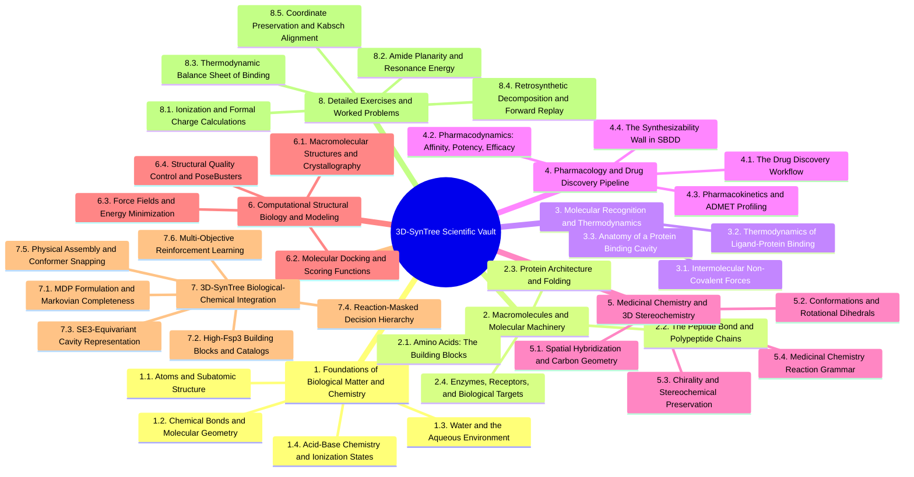

# 3D-SynTree Biology, Pharmacology, and Medicinal Chemistry Vault

---

## 0. Master Map of Content

### 0.1. Vault Architecture and Navigation Map

```mermaid
mindmap
  root((3D-SynTree Scientific Vault))
    1. Foundations of Biological Matter and Chemistry
      1.1. Atoms and Subatomic Structure
      1.2. Chemical Bonds and Molecular Geometry
      1.3. Water and the Aqueous Environment
      1.4. Acid-Base Chemistry and Ionization States
    2. Macromolecules and Molecular Machinery
      2.1. Amino Acids: The Building Blocks
      2.2. The Peptide Bond and Polypeptide Chains
      2.3. Protein Architecture and Folding
      2.4. Enzymes, Receptors, and Biological Targets
    3. Molecular Recognition and Thermodynamics
      3.1. Intermolecular Non-Covalent Forces
      3.2. Thermodynamics of Ligand-Protein Binding
      3.3. Anatomy of a Protein Binding Cavity
    4. Pharmacology and Drug Discovery Pipeline
      4.1. The Drug Discovery Workflow
      4.2. Pharmacodynamics: Affinity, Potency, Efficacy
      4.3. Pharmacokinetics and ADMET Profiling
      4.4. The Synthesizability Wall in SBDD
    5. Medicinal Chemistry and 3D Stereochemistry
      5.1. Spatial Hybridization and Carbon Geometry
      5.2. Conformations and Rotational Dihedrals
      5.3. Chirality and Stereochemical Preservation
      5.4. Medicinal Chemistry Reaction Grammar
    6. Computational Structural Biology and Modeling
      6.1. Macromolecular Structures and Crystallography
      6.2. Molecular Docking and Scoring Functions
      6.3. Force Fields and Energy Minimization
      6.4. Structural Quality Control and PoseBusters
    7. 3D-SynTree Biological-Chemical Integration
      7.1. MDP Formulation and Markovian Completeness
      7.2. High-Fsp3 Building Blocks and Catalogs
      7.3. SE3-Equivariant Cavity Representation
      7.4. Reaction-Masked Decision Hierarchy
      7.5. Physical Assembly and Conformer Snapping
      7.6. Multi-Objective Reinforcement Learning
    8. Detailed Exercises and Worked Problems
      8.1. Ionization and Formal Charge Calculations
      8.2. Amide Planarity and Resonance Energy
      8.3. Thermodynamic Balance Sheet of Binding
      8.4. Retrosynthetic Decomposition and Forward Replay
      8.5. Coordinate Preservation and Kabsch Alignment
```

---

---
