# 3D-SynTree Biology, Pharmacology, and Medicinal Chemistry Vault

---

## 0. Master Map of Content

### 0.1. Vault Architecture and Navigation Map

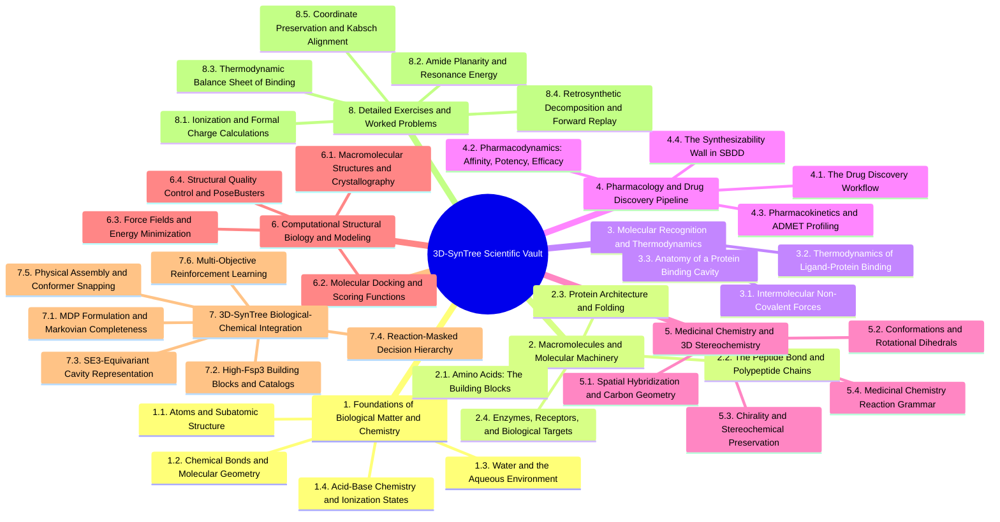

---


---


## 5. Chapter 5. Medicinal Chemistry and 3D Stereochemistry

### 5.1. Topic. Spatial Hybridization and Carbon Geometry

#### 5.1.1. Concept. sp3, sp2, and sp Hybridization
The physical three-dimensional shape of any organic molecule is governed by the quantum mechanical **hybridization** of its atomic orbitals.

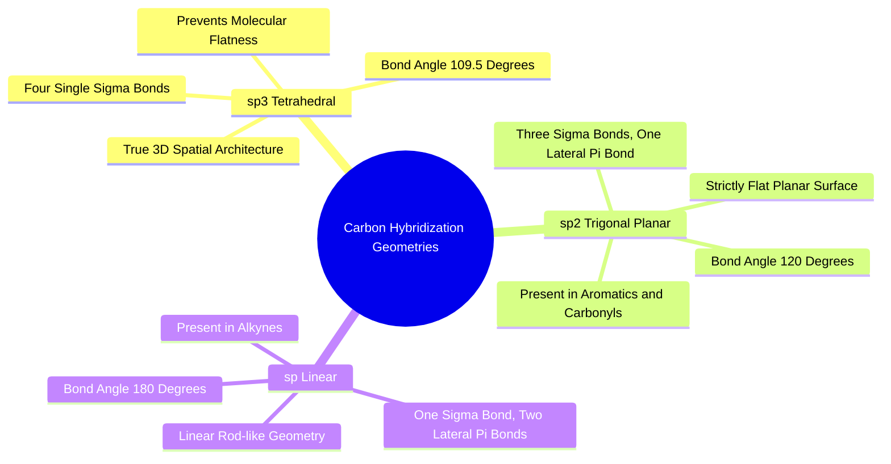

1. **$sp^3$ Hybridization (Tetrahedral Geometry):**
   * Formed when the carbon $2s$ orbital mixes with all three $2p$ orbitals ($p_x, p_y, p_z$) to create four identical hybrid orbitals directed toward the four corners of a regular tetrahedron.
   * Ideal bond angle: **$109.5^\circ$**.
   * Carbons with four single bonds are $sp^3$ hybridized. They confer depth, thickness, and true three-dimensional complexity to drug candidates.
2. **$sp^2$ Hybridization (Trigonal Planar Geometry):**
   * Formed when the $2s$ orbital mixes with only two $2p$ orbitals, leaving one unhybridized $p$ orbital perpendicular to the plane.
   * Ideal bond angle: **$120.0^\circ$**.
   * Carbons involved in double bonds ($\text{C=O}$, $\text{C=C}$) and all carbons within aromatic rings (benzene, pyridine) are $sp^2$ hybridized. They enforce strict two-dimensional planarity.
3. **$sp$ Hybridization (Linear Geometry):**
   * Formed when the $2s$ orbital mixes with one $2p$ orbital, leaving two unhybridized $p$ orbitals.
   * Ideal bond angle: **$180.0^\circ$**.
   * Found in alkynes ($-\text{C}\equiv\text{C}-$) and nitriles ($-\text{C}\equiv\text{N}$). They behave as rigid, linear rods.

*Related Notes:*
* Connects to: `[[1.2.1. Concept. Covalent Bonds and Valence Rules]]`
* Connects to: `[[5.1.2. Concept. Fraction of sp3 Carbons (Fsp3)]]`

---

#### 5.1.2. Concept. Fraction of sp3 Carbons (Fsp3)
In 2009, Frank Lovering and colleagues at Wyeth published a landmark medicinal chemistry analysis titled *"Escape from Flatland: Increasing Saturation as an Approach to Improving Clinical Success."*

1. **Definition of $\text{Fsp3}$:** The ratio of $sp^3$-hybridized carbon atoms to the total carbon count in a molecule:
   $$\text{Fsp3} = \frac{\text{Number of } sp^3 \text{ Carbons}}{\text{Total Carbon Count}}$$
2. **Correlation with Clinical Transition:** Lovering demonstrated that across every phase of human clinical trials:
   * Discovery hits: Mean $\text{Fsp3} \approx 0.36$.
   * Lead compounds: Mean $\text{Fsp3} \approx 0.41$.
   * Approved clinical medicines: Mean $\text{Fsp3} \approx 0.47$.
   Molecules with higher saturation ($\text{Fsp3} \ge 0.42$) exhibited significantly higher aqueous solubility, lower melting points, reduced non-specific binding, and dramatically higher progression rates through Phase 1, Phase 2, and Phase 3 clinical trials.
3. **The Enamine 3D Diversity Curation in 3D-SynTree:** To prevent the model from learning the flat grease pathology, `3D-SynTree` enforces an explicit floor:
   $$\text{Fsp3} \ge 0.42$$
   across its building block catalog (`syntree/chemistry/catalog.py`). The only permitted exemptions are specific aryl coupling partners (aryl halides and boronic acids) that are chemically required to be $sp^2$ aromatic by the reaction SMARTS of cross-couplings.

*Related Notes:*
* Connects to: `[[4.4.1. Concept. The Flat Grease Trap in Generative Chemistry]]`
* Connects to: `[[7.2.1. Concept. Curating the Enamine REAL 3D-Diversity Catalog]]`
* Code Manifestation: Filtered in `SynthonCatalog._load_and_filter` via `DEFAULT_MIN_FSP3 = 0.42`.

---

### 5.2. Topic. Conformations and Rotational Dihedrals

#### 5.2.1. Concept. Dihedral Angles and Rotational Barriers
A **dihedral angle (torsion angle, $\phi$)** is the geometric angle between two intersecting planes defined by four sequentially bonded atoms: $A—B—C—D$.

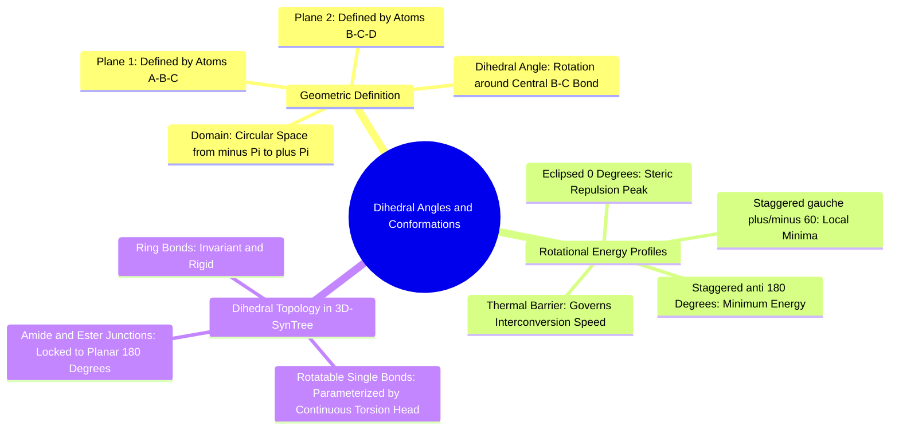

1. **Geometric Definition:** Plane 1 contains atoms $A$, $B$, and $C$. Plane 2 contains atoms $B$, $C$, and $D$. The angle between these two planes defines $\phi$, typically expressed in the continuous circular domain:
   $$\phi \in [-\pi, +\pi) \quad \text{or} \quad [-180^\circ, +180^\circ)$$
2. **Rotational Potential Energy (Ethane and Butane):** As rotation occurs around the central single bond ($B—C$), the energy of the molecule changes periodically:
   * **Staggered Conformations:** The electron pairs of bonds $A—B$ and $C—D$ are maximized in their separation.
     * *Anti* ($\phi = 180^\circ$): Bulky groups are completely opposite. Global thermodynamic minimum.
     * *Gauche* ($\phi = \pm 60^\circ$): Local thermodynamic energy minimum.
   * **Eclipsed Conformations ($\phi = 0^\circ, \pm 120^\circ$):** Bonds align directly in line with one another, resulting in severe electron-electron repulsion and steric clash. Global thermodynamic maximum.
3. **Circular Geometry in Machine Learning:** Because $\phi = -\pi$ and $\phi = +\pi$ represent the identical physical point in space, dihedral angles cannot be trained using standard Mean Squared Error (MSE). A loss like $(\phi_{\text{pred}} - \phi_{\text{true}})^2$ penalizes a prediction of $+3.14$ against a ground truth of $-3.14$ with an error of $(6.28)^2 \approx 39.4$, despite the two angles being separated by $0.001$ radians. `3D-SynTree` resolves this by parameterizing the dihedral angle as a continuous **von Mises distribution on the circle $SO(2)$**.

*Related Notes:*
* Connects to: `[[1.2.1. Concept. Covalent Bonds and Valence Rules]]`
* Connects to: `[[7.4.3. Concept. The Continuous von Mises Dihedral Torsion Head]]`
* Code Manifestation: Calculated in `ConformerEngine.set_dihedral` (`syntree/chemistry/conformer.py`) and trained in `ContinuousTorsionHead` (`syntree/models/torsion_head.py`).

---

#### 5.2.2. Concept. Rotatable Bonds and Conformational Flexibility
In cheminformatics, a **rotatable bond** is defined as any single non-ring bond, attached to non-hydrogen atoms, that is not an amide or partial double bond.

1. **Degrees of Freedom Explosion:** If a molecule possesses $N_{\text{rot}}$ rotatable single bonds, and each bond has 3 low-energy conformational wells ($anti, gauche^+, gauche^-$), the number of accessible three-dimensional conformers scales exponentially:
   $$\text{Conformers} \approx 3^{N_{\text{rot}}}$$
   A molecule with 10 rotatable bonds has nearly $60,000$ theoretically accessible conformations.
2. **The SBDD Search Complexity:** Traditional atom-by-atom generative models must predict the $(x, y, z)$ coordinates of all 30 heavy atoms in a drug simultaneously ($90$ continuous variables). `3D-SynTree` cuts through this combinatorial explosion: because the individual synthon building blocks are internally rigid (e.g., bicyclo-octanes, spirocycles), the internal coordinates of the synthon are fixed by RDKit's conformer engine. The AI only needs to predict the single **dihedral angle $\phi$** of the newly formed junction bond.

*Related Notes:*
* Connects to: `[[3.2.2. Concept. Enthalpy-Entropy Compensation]]`
* Connects to: `[[7.5.1. Concept. Scaffold-Locked Harmonic Restraint Relaxation]]`

---

### 5.3. Topic. Chirality and Stereochemical Preservation

#### 5.3.1. Concept. Stereocenters, Enantiomers, and Diastereomers
**Stereoisomers** are molecules that share the identical molecular formula and identical atom-to-atom bonding connectivity, but differ in the three-dimensional orientation of their atoms in space.

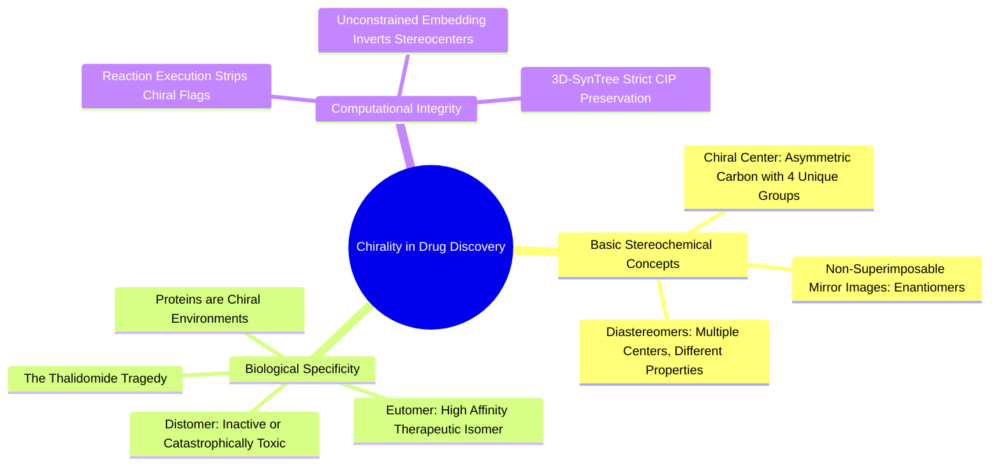

1. **Enantiomers:** A pair of non-superimposable mirror-image molecules (like a left hand and a right hand).
   * Enantiomers have identical physical and chemical properties in an achiral environment (same boiling point, same solubility, identical NMR spectra).
   * However, they rotate plane-polarized light in opposite directions (dextrorotatory vs. levorotatory).
2. **Diastereomers:** Stereoisomers that are not mirror images of one another. Occurs when a molecule possesses two or more chiral centers. Diastereomers have completely different physical properties, different solubilities, different melting points, and different biological activities.
3. **Biological Chiral Discrimination:** Because proteins are constructed exclusively from $\text{L}$-amino acids, the binding cavity is an asymmetric, chiral environment. A chiral drug molecule will interact with the chiral pocket differently depending on which enantiomer is present (Pfeiffer’s Rule).
   * **Eutomer:** The enantiomer that matches the chiral pocket and delivers the therapeutic response.
   * **Distomer:** The opposing enantiomer. The distomer can be completely inactive, act as an antagonist, or bind to an entirely different biological target and cause catastrophic human toxicity (e.g., the historical thalidomide disaster, where the $(R)$-enantiomer was a safe sedative, while the $(S)$-enantiomer caused severe teratogenic birth defects).

*Related Notes:*
* Connects to: `[[2.1.1. Concept. The Alpha-Amino Acid Architecture]]`
* Connects to: `[[5.3.2. Concept. Stereochemical Amnesia and Chiral Inversion Hazards]]`

---

#### 5.3.2. Concept. Stereochemical Amnesia and Chiral Inversion Hazards
A severe failure mode in naive cheminformatics programming is **Stereochemical Amnesia**—the accidental, random inversion of chiral centers during computational modeling.

1. **The RDKit Reaction Flaw:** When an RDKit routine executes a chemical transformation via `rdChemReactions.RunReactants()`, it matches substructures using SMARTS. If the SMARTS template does not explicitly track stereochemical parity tags, the reacted atoms in the product graph often have their chiral tags stripped or set to `ChiralType.CHI_UNSPECIFIED`.
2. **The 3D Embedding Hazard:** When a molecule containing an unspecified chiral center is subsequently processed through a 3D conformer embedding algorithm (such as RDKit's ETKDG):
   ```python
   # AMATEUR AMNESIA BUG:
   AllChem.EmbedMolecule(mol) # Randomly flips the chiral carbon!
   ```
   The algorithm arbitrarily assigns coordinates in space, randomly picking between the $(R)$ and $(S)$ enantiomer.
3. **The Pharmacological Consequence:** An AI model selects a certified, single-enantiomer, chiral building block from the Enamine library (e.g., an $(S)$-alanine derivative). The chemical reaction executes, the embedder randomly inverts the center, and the code outputs the $(R)$-enantiomer. The generated synthesis recipe commands the wet-lab chemist to buy the $(S)$-building block, but the 3D pose in the PDB requires the $(R)$-enantiomer to avoid clashing with the pocket walls!
4. **The `3D-SynTree` Fix:**
   * Explicit assignment and locking of stereocenters via `Chem.AssignStereochemistry(mol, cleanIt=True, force=True)`.
   * Enforcing `params.enforceChirality = True` inside `AllChem.ETKDGv3()` to reject any embedded conformer whose chiral center has been inverted.

*Related Notes:*
* Connects to: `[[5.3.1. Concept. Stereocenters, Enantiomers, and Diastereomers]]`
* Code Manifestation: Unit-tested via `test_stereocenter_preservation` in `tests/test_chemistry_conformer.py`.

---

### 5.4. Topic. Medicinal Chemistry Reaction Grammar

#### 5.4.1. Concept. Amide Coupling Chemistry
Amide coupling is the single most prevalent reaction in modern drug discovery, appearing in over $25\%$ of all active pharmaceutical ingredient synthesis pathways.

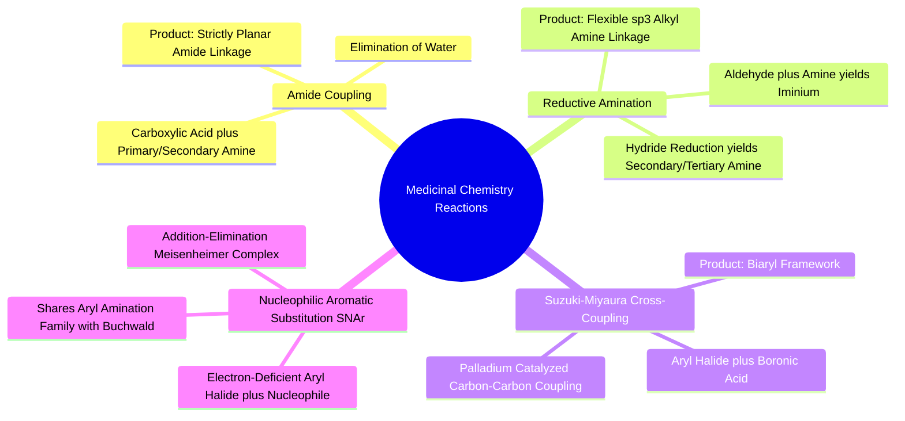

1. **Reaction Components:**
   * **Electrophile:** Carboxylic Acid ($-\text{C}(=\text{O})\text{OH}$).
   * **Nucleophile:** Primary or Secondary Amine ($-\text{NH}_2$ or $-\text{NHR}$).
2. **SMARTS Template in 3D-SynTree:**
   ```smarts
   [C:1](=O)[OH].[N;!H0;!H3;!$(NC=O):2] >> [C:1](=O)[N:2]
   ```
   * The predicate `!$(NC=O)` guarantees that amide nitrogens cannot act as nucleophiles, preventing impossible multi-amide cascades.
3. **Biological Role:** Forms a stable, planar, neutral linkage that provides a strong hydrogen bond acceptor ($\text{C=O}$) and a strong hydrogen bond donor ($\text{N—H}$).

*Related Notes:*
* Connects to: `[[2.2.1. Concept. Formation, Geometry, and Resonance of the Peptide Bond]]`
* Code Manifestation: Template `amide_coupling` in `REACTION_TEMPLATES` in `syntree/chemistry/reactions.py`.

---

#### 5.4.2. Concept. Reductive Amination Chemistry
Reductive amination allows medicinal chemists to link functional fragments through an $sp^3$-hybridized single bond rather than a rigid amide.

1. **Reaction Mechanism:**
   * An aldehyde (or ketone) reacts with a primary or secondary amine to form a transient, protonated **iminium intermediate** ($\text{C=N}^+$), accompanied by the loss of water.
   * A mild reducing agent (e.g., sodium triacetoxyborohydride, $\text{NaBH(OAc)}_3$) selectively reduces the iminium to a stable alkylamine.
2. **SMARTS Template in 3D-SynTree:**
   ```smarts
   [C;H1:1]=O.[N;!H0;!H3;!$(NC=O):2] >> [C:1][N:2]
   ```
3. **Pharmacological Significance:** Unlike an amide, the resulting basic amine ($-\text{CH}_2—\text{NH—}$) retains its basic lone pair. At $\text{pH } 7.4$, it ionizes to a cation ($+1$), enabling salt bridge formation with Aspartate and Glutamate in deep protein pockets.

*Related Notes:*
* Connects to: `[[1.4.2. Concept. Formal Charges at Physiological pH]]`
* Connects to: `[[5.1.2. Concept. Fraction of sp3 Carbons (Fsp3)]]`
* Code Manifestation: Template `reductive_amination` in `syntree/chemistry/reactions.py`.

---

#### 5.4.3. Concept. Cross-Coupling and Aromatic Substitutions (Suzuki, SNAr, Buchwald)
Metal-catalyzed cross-couplings and aromatic substitutions allow the targeted construction of carbon-carbon and carbon-nitrogen bonds between aromatic ring systems.

1. **Suzuki-Miyaura Cross-Coupling:**
   * Couples an **aryl halide** ($\text{Ar—Br, Ar—I, Ar—Cl}$) with an **aryl boronic acid** ($\text{Ar—B(OH)}_2$) in the presence of a Palladium(0) catalyst and base to form a direct $\text{Ar—Ar}$ biaryl bond.
   * SMARTS: `[c:1][Br,I,Cl].[c:2][B]([OH,O])[OH,O] >> [c:1][c:2]`
2. **Nucleophilic Aromatic Substitution ($\text{S}_\text{N}\text{Ar}$) and Buchwald-Hartwig Amination:**
   * Both reactions attach an amine nucleophile directly to an aromatic ring.
   * $\text{S}_\text{N}\text{Ar}$ requires electron-withdrawing groups (e.g., $-\text{NO}_2, -\text{CF}_3$) on the ring to stabilize the Meisenheimer intermediate.
   * Buchwald-Hartwig amination uses a Palladium/Phosphine catalyst to couple unactivated aryl halides with amines.
   * **The Scientific Resolution in 3D-SynTree:** When looking at the final static product of a co-crystallized ligand in the PDB, both reactions produce an identical aryl-amine bond ($[c]—[N]$). The crystal structure does not tell you whether the wet-lab chemist used a Palladium catalyst or thermal $\text{S}_\text{N}\text{Ar}$. Therefore, `3D-SynTree` groups them into a single learned **`aryl_amination`** reaction family, preventing false architectural supervision.

*Related Notes:*
* Connects to: `[[5.1.1. Concept. sp3, sp2, and sp Hybridization]]`
* Code Manifestation: Declared in `REACTION_FAMILY_MEMBERS` in `syntree/chemistry/reactions.py`.

---

#### 5.4.4. Concept. Chemoselectivity and Competing Reactive Handles
**Chemoselectivity** is the chemical preference of a reaction to occur at one specific functional group among several competing groups on the same molecule.

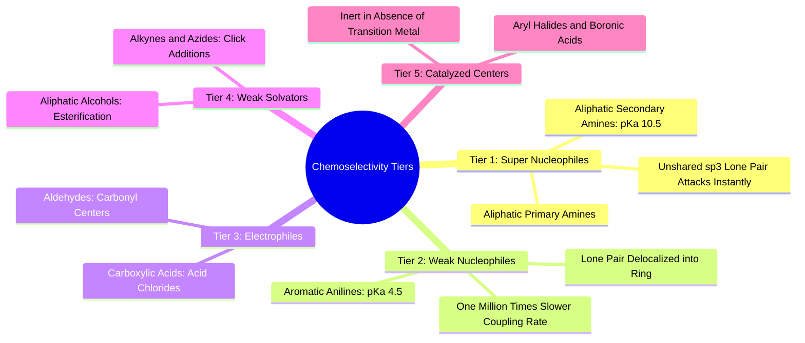

1. **The Amine Competition Problem:** Suppose a growing intermediate ligand contains both an **aliphatic piperidine amine** ($\text{p}K_a \approx 10.5$) and an **aromatic aniline amine** ($\text{p}K_a \approx 4.5$). Because the aniline lone pair delocalizes into the aromatic $\pi$ system, the aliphatic amine is roughly **one million times ($10^6$) more nucleophilic**.
2. **The Amateur SMARTS Flaw:** A naive Python regex that searches for `[N]` will simply match whichever nitrogen atom appears earlier in the PDB/SDF coordinate file. If the aniline happens to have a lower index, the algorithm attempts to couple the acid to the aniline while leaving the highly reactive aliphatic amine unreacted. In a wet lab, this reaction produces **$0\%$ yield** of the predicted molecule.
3. **The `3D-SynTree` Fix:** In `syntree/chemistry/reactions.py`, `ReactionEngine.rank_handles()` sorts all detected handles using an explicit **medicinal chemistry reactivity tier hierarchy**:
   * Tier 1: Aliphatic primary/secondary amines.
   * Tier 2: Aromatic amines (anilines).
   * Tier 3: Electrophilic coupling handles (acids, aldehydes).
   * Tier 4: Weak nucleophiles (alcohols).
   * Tier 5: Metal-catalyzed coupling partners (aryl halides, boronic acids).
   The model always attempts to grow through the most reactive handle first, reflecting laboratory reality.

*Related Notes:*
* Connects to: `[[1.2.2. Concept. Electronegativity, Dipoles, and Polar Covalent Bonds]]`
* Code Manifestation: Enforced in `HANDLE_REACTIVITY_TIERS` and `rank_handles` in `syntree/chemistry/reactions.py`.

---

## 6. Chapter 6. Computational Structural Biology and SBDD

### 6.1. Topic. Macromolecular Structures and File Formats

#### 6.1.1. Concept. X-Ray Crystallography and Cryo-EM Resolution
Structure-based drug design relies on experimental three-dimensional coordinates of proteins solved via **X-Ray Crystallography** or **Cryogenic Electron Microscopy (Cryo-EM)**.

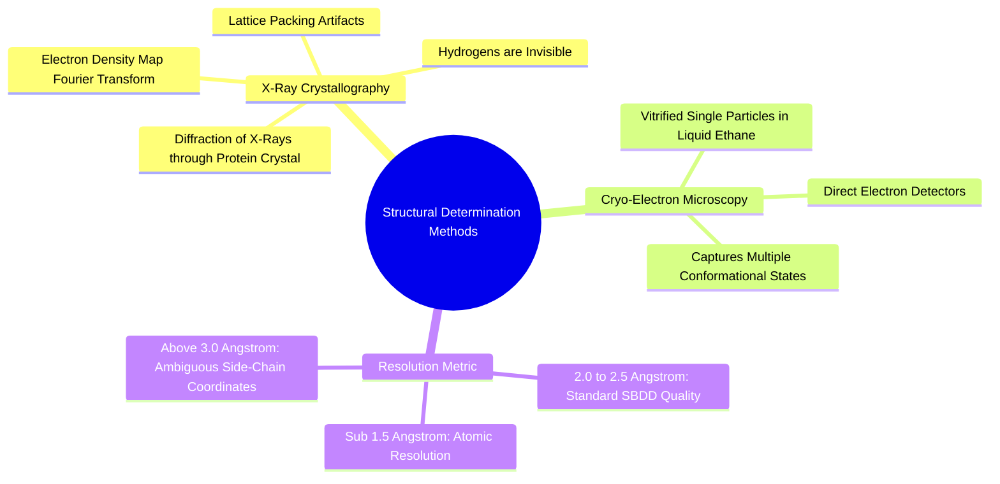

1. **The Electron Density Map:** X-rays scatter off electrons, not atomic nuclei. Crystallographers mathematically transform the observed X-ray diffraction pattern using Fourier synthesis to produce a continuous 3D **electron density map ($\rho(x, y, z)$)**, into which the amino acid sequence is computationally threaded.
2. **Resolution ($\text{\AA}$):**
   * **$< 1.5\text{ \AA}$ (Ultra-High Resolution):** Individual atoms are clearly separated as distinct spherical density peaks. Side-chain conformations and bound water molecules are unambiguous.
   * **$1.8\text{ to }2.5\text{ \AA}$ (Standard SBDD Resolution):** The general protein backbone and major side-chain orientations are clear, but single bonds and atom identities (e.g., distinguishing Carbon from Nitrogen or Oxygen in an imidazole ring) require chemical inferencing.
   * **$> 3.0\text{ \AA}$ (Low Resolution):** Only coarse secondary-structure shapes are visible. Individual side-chain coordinates have significant uncertainty.
3. **Filtering in `3D-SynTree`:** In `scripts/preprocess_multidataset.py`, `3D-SynTree` enforces a strict resolution cutoff:
   $$\text{Resolution} \le 2.5\text{ \AA}$$
   Structures with resolution $> 2.5\text{ \AA}$ are discarded to prevent the geometric neural network from learning training labels from noisy or ambiguous atomic coordinates.

*Related Notes:*
* Connects to: `[[6.1.2. Concept. The Protein Data Bank Format and Structural Quirks]]`
* Code Manifestation: Filtered via `--max-resolution 2.5` in `scripts/preprocess_multidataset.py`.

---

#### 6.1.2. Concept. The Protein Data Bank Format and Structural Quirks
The Protein Data Bank (.pdb) file format is the universal standard for structural biology, but it contains historical idiosyncrasies that must be handled during preprocessing.

1. **Anatomy of a PDB Line:**
   ```text
   ATOM      1  N   GLY A   1       0.000   1.458   2.009  1.00 20.00           N
   HETATM 1205  C1  LIG B 101      12.430  -3.210   8.910  1.00 35.50           C
   ```
   * Columns 1–6: Record name (`ATOM` for standard amino acids, `HETATM` for small molecules, ions, and water).
   * Columns 13–16: Atom name (`CA`, `N`, `O`, etc.).
   * Columns 18–20: Residue name (`GLY`, `PHE`, etc.).
   * Columns 31–54: Orthogonal Euclidean coordinates ($x, y, z$) in Angstroms ($\text{\AA}$).
   * Columns 55–60: **Occupancy** (the fraction of crystals in the lattice containing that atom; values $< 1.0$ indicate alternative side-chain conformations).
   * Columns 61–66: **B-Factor (Temperature Factor)** (quantifies the spatial thermal vibration and uncertainty of that atom; high B-factors indicate flexible, poorly defined loops).
2. **Crystallographic Artifacts:** Crystal growth requires high concentrations of precipitating salts and cryoprotectants. PDB files are frequently contaminated with non-biological junk molecules:
   * Glycerol (`GOL`), Ethylene glycol (`EDO`), Polyethylene glycol (`PEG`), Sulfate ions (`SO4`), Dimethyl sulfoxide (`DMS`).
   * A naive data curation pipeline that searches for the "bound ligand" by reading the first `HETATM` entry can mistakenly grab a glycerol crystallization artifact, training the AI to generate a three-carbon antifreeze molecule!
3. **The `3D-SynTree` Fix:** `syntree/data/curation.py` defines an explicit `ARTIFACT_RESNAMES` blacklist (`HOH`, `SO4`, `EDO`, `GOL`, `PEG`, `DMS`, etc.), sanitizing the pocket down to pure protein `ATOM` records within $10\text{ \AA}$ of the verified small molecule.

*Related Notes:*
* Connects to: `[[1.1.1. Concept. Subatomic Particles and Atomic Number]]`
* Connects to: `[[6.1.1. Concept. X-Ray Crystallography and Cryo-EM Resolution]]`
* Code Manifestation: Blacklist in `ARTIFACT_RESNAMES` and extraction in `syntree/data/curation.py`.

---

### 6.2. Topic. Molecular Docking and Scoring Functions

#### 6.2.1. Concept. Physics and Mechanics of Docking Algorithms
**Molecular docking** is a computational modeling technique that predicts the preferred three-dimensional binding orientation (pose) of a small molecule inside a receptor cavity.

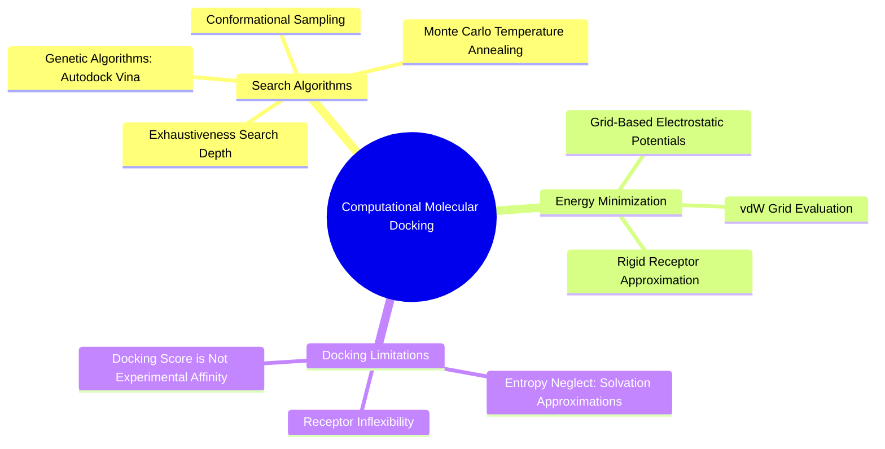

1. **The Search Space:** The docking engine must search a continuous multidimensional space:
   * **6 Rigid-Body Degrees of Freedom:** 3 translational coordinates $(x, y, z)$ and 3 rotational Euler angles $(\theta, \psi, \phi)$ positioning the molecule in the cavity.
   * **$N$ Internal Degrees of Freedom:** The rotational dihedral angles across all rotatable bonds in the ligand.
2. **Search Algorithms:**
   * **Genetic Algorithms (Lamarckian GA):** Implemented in tools like *AutoDock Vina*. The algorithm initializes a population of random poses, evaluates their fitness via a scoring function, and iteratively mutates, crosses over, and local-optimizes the best poses across generations.
   * **Grid-Based Pre-Calculation:** Calculating distances between every atom in the drug and all $5,000$ atoms in a protein at every search step is computationally expensive. Modern docking software pre-computes an electrostatic and van der Waals potential energy grid across the binding cavity. The small molecule is then scored instantly by interpolating its atomic coordinates on the pre-computed grid.
3. **Exhaustiveness:** The search parameter that controls how many independent runs the genetic algorithm performs. `3D-SynTree` exposes this parameter directly in its evaluation configuration:
   ```json
   "evaluation": {
     "docking_engine": "gnina",
     "exhaustiveness": 8
   }
   ```

*Related Notes:*
* Connects to: `[[3.2.1. Concept. Gibbs Free Energy of Binding]]`
* Connects to: `[[6.2.2. Concept. Scoring Functions: Physics-Based vs Empirical]]`
* Code Manifestation: Integrated via `EvaluationPipeline._dock` in `syntree/engine/evaluator.py`.

---

#### 6.2.2. Concept. Scoring Functions: Physics-Based vs Empirical
The **scoring function** is the mathematical objective function that guides the docking search and outputs a final predicted binding affinity score.

1. **Force-Field Scoring Functions (Physics-Based):** Direct summation of classical physical energy terms:
   $$E_{\text{total}} = \sum E_{\text{vdW}}(\text{LJ}) + \sum E_{\text{Coulomb}} + \sum E_{\text{torsion}}$$
   * Advantage: Grounded in clear physical principles.
   * Disadvantage: Exceptionally sensitive to tiny sub-Angstrom coordinate errors; ignores the entropic desolvation of bulk water.
2. **Empirical Scoring Functions (e.g., AutoDock Vina):**
   $$S = \sum w_i f_i(r_{ij})$$
   Uses parameterized terms calibrated via multivariate regression against hundreds of experimentally measured $K_d$ values from PDBbind:
   * Gaussian steric attraction terms.
   * Quadratic repulsion clash penalties.
   * Step-function directional hydrogen bonding.
   * Hydrophobic contact step terms.
   * An explicit rotational penalty: $1 + w_{\text{rot}} N_{\text{rot}}$.
3. **Machine Learning / CNN Scoring (e.g., GNINA):** GNINA uses a 3D Convolutional Neural Network trained directly on voxelized 3D grids of protein-ligand complexes. It recognizes non-obvious spatial motifs (like cation-$\pi$ stacking and halogen bonds) that classical empirical scoring equations miss.
4. **Docking Fallacy:** A low Vina score (e.g., $-11.5\text{ kcal/mol}$) is *not* an experimentally proven binding affinity. Docking scoring functions have typical root-mean-square errors of $\pm 2.0\text{ kcal/mol}$ (an error factor of $>25$ in $K_d$). Docking can distinguish a strong binder from a non-binder, but it cannot rank high-affinity nanomolar leads with precision.

*Related Notes:*
* Connects to: `[[4.2.1. Concept. Binding Affinity (Kd), Inhibitory Potency (IC50), and Efficacy]]`
* Connects to: `[[7.6.1. Concept. The Multi-Objective Reinforcement Learning Reward]]`
* Code Manifestation: Configured in `configs/default_config.json` and executed in `syntree/engine/evaluator.py`.

---

### 6.3. Topic. Force Fields and Energy Minimization

#### 6.3.1. Concept. Molecular Mechanics Force Fields (MMFF94, UFF)
**Molecular Mechanics (MM)** simulates the physical structure and energy of chemical systems by treating atoms as charged spheres connected by mechanical springs, governed by classical Newtonian mechanics rather than full quantum mechanical wavefunctions.

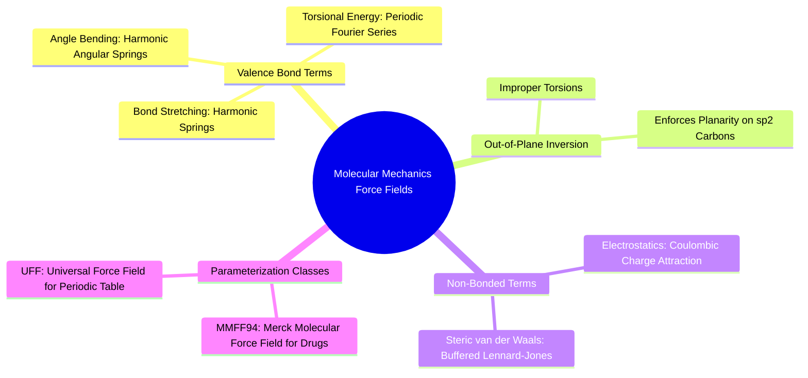

1. **The Potential Energy Function:** The total conformational energy $E_{\text{total}}$ is expressed as:
   $$E_{\text{total}} = E_{\text{stretch}} + E_{\text{bend}} + E_{\text{torsion}} + E_{\text{oop}} + E_{\text{vdW}} + E_{\text{electrostatic}}$$
   * **Bond Stretching:** $E_{\text{stretch}} = \sum \frac{1}{2} k_b (r - r_0)^2$. Penalizes deviations from the equilibrium covalent bond length $r_0$.
   * **Angle Bending:** $E_{\text{bend}} = \sum \frac{1}{2} k_\theta (\theta - \theta_0)^2$. Penalizes deviations from equilibrium bond angles (e.g., $109.5^\circ$ for $sp^3$ carbon).
   * **Torsional Energy:** $E_{\text{torsion}} = \sum \frac{1}{2} V_n [1 + \cos(n\phi - \gamma)]$. Models rotational barriers across single bonds.
   * **Out-of-Plane (Improper Torsions):** $E_{\text{oop}} = \sum \frac{1}{2} k_{\text{oop}} \chi^2$. Prevents $sp^2$ planar centers (like carbonyls and aromatic rings) from bending into pyramids.
2. **MMFF94 (Merck Molecular Force Field):** Heavily parameterized against experimental and quantum chemical data specifically for organic drug-like small molecules.
3. **UFF (Universal Force Field):** A generalized force field parameterized for all elements across the periodic table, used as a robust fallback when MMFF94 lacks parameters for rare heteroatoms (e.g., Boron in boronic acids).

*Related Notes:*
* Connects to: `[[1.2.1. Concept. Covalent Bonds and Valence Rules]]`
* Connects to: `[[6.3.2. Concept. Constrained Energy Minimization]]`

---

#### 6.3.2. Concept. Constrained Energy Minimization
When assembling molecules piece by piece inside a protein cavity, computational chemists must relax the newly added atoms into low-energy geometries without allowing the existing, verified scaffold to move.

1. **The "Hard-Locking" Danger:** In early revisions of `3D-SynTree`, when an incoming synthon was embedded and attached to the scaffold, all core atoms were rigidly locked (`ff.AddFixedPoint(core_idx)`). If the incoming synthon's embedded bond vector was slightly misaligned with the reference core, freezing the core junction atom immovable forced the force field to bend the incoming synthon's bond angles into unphysical states (e.g., squeezing a $109.5^\circ$ carbon to $75^\circ$) to bridge the gap.
2. **Constrained Relaxation with Harmonic Restraints:** Instead of rigidly freezing atoms with infinite stiffness, modern computational chemistry applies **harmonic positional restraints**:
   $$E_{\text{restraint}} = \sum_{i \in \text{Core}} \frac{1}{2} k_{\text{spring}} \|\vec{x}_i - \vec{x}_i^{\text{ref}}\|^2$$
   with spring constants $k_{\text{spring}} \approx 50.0\text{ kcal}\cdot\text{mol}^{-1}\text{\AA}^{-2}$.
3. **Physiological Reality:** This allows the scaffold atoms to vibrate slightly ($\approx 0.05\text{ \AA}$) during the minimization, allowing the newly formed junction bond length and angle to relax smoothly into its true quantum-mechanical minimum without tearing or distorting the molecule.

*Related Notes:*
* Connects to: `[[6.3.1. Concept. Molecular Mechanics Force Fields (MMFF94, UFF)]]`
* Connects to: `[[7.5.1. Concept. Scaffold-Locked Harmonic Restraint Relaxation]]`
* Code Manifestation: Implemented in `ConformerEngine._relax_with_frozen_scaffold` in `syntree/chemistry/conformer.py`.

---

### 6.4. Topic. Structural Quality Control and PoseBusters

#### 6.4.1. Concept. PoseBusters and Physical Sanity Filters
Recent breakthroughs in generative drug discovery revealed that many published deep learning models achieve outstanding docking scores simply by "cheating" physics—placing atoms in strained configurations that exploit flaws in docking scoring functions. To eliminate this pathology, the pharmaceutical industry established the **PoseBusters** standardized testing protocol (Buttenschoen et al., *Nature Chemistry*, 2024).

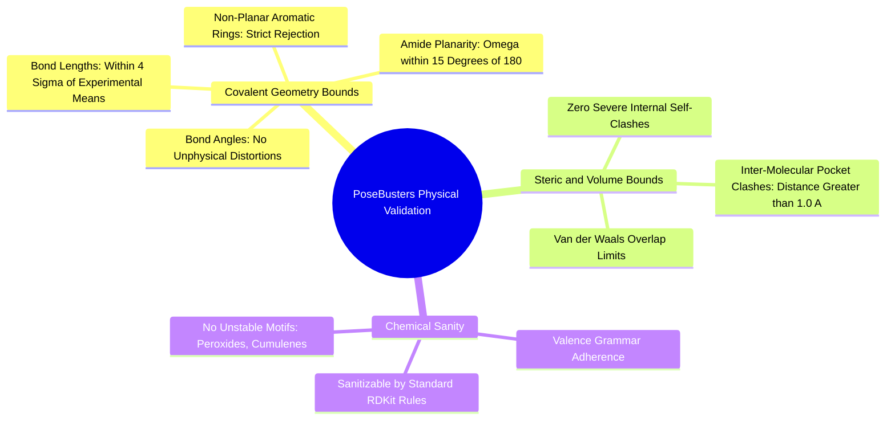

1. **Bond Length and Angle Outliers:** Verifies that all bond lengths and angles in the generated 3D conformer reside within $4\sigma$ (standard deviations) of the mean values recorded in the Cambridge Structural Database (CSD).
2. **Aromatic and Amide Planarity:** Checks that aromatic rings do not bend like bowls, and that amide junctions do not twist out of planarity ($\omega$ within $\pm 15^\circ$ of $180^\circ$).
3. **Internal Self-Clash:** Verifies that no two non-bonded atoms within the generated drug sit closer than their van der Waals contact minimum.
4. **Protein-Ligand Steric Clash:** Verifies that no heavy atom of the drug penetrates within **$1.0\text{ \AA}$** of any protein pocket atom.
5. **Chemical Validator in 3D-SynTree:** In `syntree/chemistry/validator.py`, `ChemicalValidator` runs an automated battery of PoseBusters-equivalent checks. A molecule is flagged as invalid if it contains pentavalent carbons, unphysical formal charges ($>3$), or unstable moieties (peroxides, ozonides).

*Related Notes:*
* Connects to: `[[2.2.1. Concept. Formation, Geometry, and Resonance of the Peptide Bond]]`
* Connects to: `[[6.4.2. Concept. Strain Energy and Energetic Feasibility]]`
* Code Manifestation: Complete test battery executed in `syntree/chemistry/validator.py`.

---

#### 6.4.2. Concept. Strain Energy and Energetic Feasibility
A generated molecule might fit neatly inside a protein cavity, but if achieving that fit requires twisting the molecule into an unphysical, high-energy conformational shape, it will never bind in a real wet lab.

1. **Definition of Conformer Strain Energy ($\Delta E_{\text{strain}}$):**
   $$\Delta E_{\text{strain}} = E_{\text{bound}} - E_{\text{free\_minimum}}$$
   where:
   * $E_{\text{bound}}$ is the potential energy of the small molecule in the exact 3D conformation it adopts inside the binding cavity.
   * $E_{\text{free\_minimum}}$ is the potential energy of the identical molecule after being extracted into empty space and minimized to its global thermodynamic minimum.
2. **The Thermodynamic Cost:** In free solution, the molecule naturally relaxes into its lowest-energy state ($E_{\text{free\_minimum}}$). To bind to the protein, the molecule must pay an energetic penalty equal to $\Delta E_{\text{strain}}$ to force itself into the bound pose:
   $$\Delta G_{\text{effective}} = \Delta G_{\text{bind}} + \Delta E_{\text{strain}}$$
3. **Acceptable Thresholds:** Extensive crystallographic analyses show that legitimate clinical drugs rarely bind with strain energies exceeding **$6.0\text{ to }10.0\text{ kcal/mol}$**. Any generated pose showing $\Delta E_{\text{strain}} > 15.0\text{ kcal/mol}$ is biologically invalid—it represents an impossible molecular shape that will remain dissolved in solution rather than straining itself to enter the pocket.

*Related Notes:*
* Connects to: `[[5.2.1. Concept. Dihedral Angles and Rotational Barriers]]`
* Connects to: `[[6.3.1. Concept. Molecular Mechanics Force Fields (MMFF94, UFF)]]`

---

## 7. Chapter 7. 3D-SynTree Biological and Chemical Architecture

### 7.1. Topic. MDP Formulation and Markovian Completeness

#### 7.1.1. Concept. The Markov Property in SBDD
A system satisfies the **Markov Property** if the conditional probability distribution of future states depends solely upon the present state, and not on the sequence of events that preceded it:
$$P(S_{t+1} \mid S_t, A_t, S_{t-1}, A_{t-1}, \dots, S_0) = P(S_{t+1} \mid S_t, A_t)$$

```mermaid
mindmap
  root((The 3D-SynTree MDP))
    Markov State Representation
      Protein Pocket Cloud: Atoms and Coordinates
      Intermediate Ligand Scaffold: All Grown Atoms
      Active Attachment Handle u: Reactive Point
      Global Physical Descriptors: Mass, Heavy Atoms
    Factorized Action Space
      Reaction Family Head: Discrete P(r)
      Synthon Head: Masked Discrete P(B)
      Continuous Torsion Head: SO(2) Dihedral Angle
      Explicit Termination: STOP Token
    Transition Function
      Deterministic RDKit Chemical Execution
      3D Conformational Embedding
      Scaffold Alignment and Minimization
```

1. **The "Ghost Ligand" Flaw:** A critical theoretical flaw identified in early versions of the `3D-SynTree` policy was inputting only the protein pocket atoms and the *single reacting handle atom* ($u$) into the neural network, while omitting the rest of the intermediate ligand grown so far ($M_t$).
   * At Step 1, the model attaches a bulky bicycle into Subpocket A.
   * At Step 2, the network chooses a synthon to grow from handle $u$.
   * If the network only sees the handle atom $u$ and the protein, the other 15 atoms of the bicycle *do not exist* in the AI's input graph.
   * The AI attempts to attach an adamantyl ring, unaware that the physical space directly behind handle $u$ is already filled by its own bicycle. The result is an internal **self-clash disaster**.
2. **The Heterogeneous Bipartite Graph Solution:** To restore the Markov property, the state $S_t$ must be modeled as a true bipartite graph containing:
   * Protein pocket nodes: $(X_P, Z_P)$.
   * Ligand scaffold nodes grown so far: $(X_L, Z_L)$.
   * An explicit indicator pointing to the active reaction handle $u$.
   Now the network evaluates both protein pocket walls and its own growing molecular body before proposing the next synthon.

*Related Notes:*
* Connects to: `[[3.3.1. Concept. Cavity Geometry, Subpockets, and Enclosure]]`
* Connects to: `[[7.3.1. Concept. PaiNN Invariant Scalar and Equivariant Vector Features]]`

---

#### 7.1.2. Concept. The Factorized Action Space
To avoid the combinatorial intractability of searching all possible reactions, synthons, and angles simultaneously, `3D-SynTree` factorizes the policy action space according to the chain rule of probability:
$$\pi_\theta(a_t \mid \mathcal{P}, \mathcal{M}_t) = P(r_t \mid \mathcal{P}, \mathcal{M}_t) \times P(B_t \mid r_t, \mathcal{P}, \mathcal{M}_t) \times p(\phi_t \mid B_t, r_t, \mathcal{P}, \mathcal{M}_t)$$

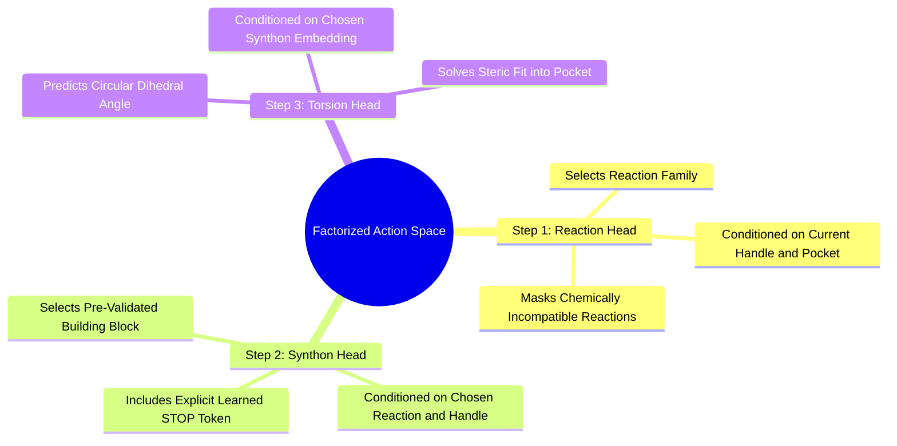

1. **Reaction Selection ($r_t$):** The policy evaluates the active handle $u$ on the scaffold and predicts a discrete reaction family (e.g., amide coupling vs. reductive amination).
2. **Synthon Selection ($B_t$):** Given the chosen reaction, the policy queries the building block catalog, masking out all incompatible molecules, and selects a specific purchasable synthon.
3. **Dihedral Angle Prediction ($\phi_t$):** Conditioned on the chosen synthon, the policy predicts the continuous single-bond dihedral angle around the new junction bond.
4. **The Broken Factorization Flaw:** If the torsion head does not receive the embedding of the *chosen synthon* ($B_t$), it predicts the identical dihedral angle whether the model selects a tiny methyl group ($-\text{CH}_3$) or a massive spiro-adamantyl core. Conditioning the torsion head on $B_t$ is required because optimal dihedral rotation is dictated by steric interactions between the incoming synthon's specific side-chains and the pocket walls.

*Related Notes:*
* Connects to: `[[5.4.4. Concept. Chemoselectivity and Competing Reactive Handles]]`
* Connects to: `[[7.4.3. Concept. The Continuous von Mises Dihedral Torsion Head]]`
* Code Manifestation: Executed sequentially in `SynTreePolicy.act` (`syntree/models/policy.py`).

---

### 7.2. Topic. High-Fsp3 Building Blocks and Catalogs

#### 7.2.1. Concept. Curating the Enamine REAL 3D-Diversity Catalog
The commercial building block library is the physical foundation of `3D-SynTree`. The model does not invent atoms; it selects pre-synthesized, buyable molecular units.

1. **The Enamine REAL Database:** Enamine supplies the world's largest collection of purchasable screening compounds and building blocks ($>38\text{ billion}$ virtual compounds synthesizable via standardized reaction protocols).
2. **The Curation Protocol:** `scripts/build_synthon_catalog.py` curates a diverse 3D subset from raw vendor SDF/CSV files:
   * **Molecular Weight:** $\le 220\text{ Da}$ (ensuring low molecular weight for assembled leads).
   * **Heavy Atom Count:** $\ge 4$ heavy atoms.
   * **Saturation Floor:** $\text{Fsp3} \ge 0.40$ (rejecting flat aromatics).
   * **Exemption Rule:** Aryl halides ($-\text{c—Br, —c—I, —c—Cl}$) and boronic acids ($-\text{c—B(OH)}_2$) are exempt from the $\text{Fsp3}$ floor because they are required coupling partners for Suzuki and amination chemistry.
3. **Handle Indexing:** Every catalog molecule is processed through RDKit SMARTS patterns to identify all reactive functional groups. Multifunctional synthons (molecules bearing two or more handles) are indexed under each handle separately, enabling them to act as branching linkers.

*Related Notes:*
* Connects to: `[[5.1.2. Concept. Fraction of sp3 Carbons (Fsp3)]]`
* Connects to: `[[7.2.2. Concept. Multifunctional Linkers vs Monofunctional Caps]]`
* Code Manifestation: Script `scripts/build_synthon_catalog.py` and class `SynthonCatalog` in `syntree/chemistry/catalog.py`.

---

#### 7.2.2. Concept. Multifunctional Linkers vs Monofunctional Caps
To grow an elongated, multi-step drug candidate across an extended binding cavity, the policy must distinguish between building blocks that allow continued growth and those that terminate it.

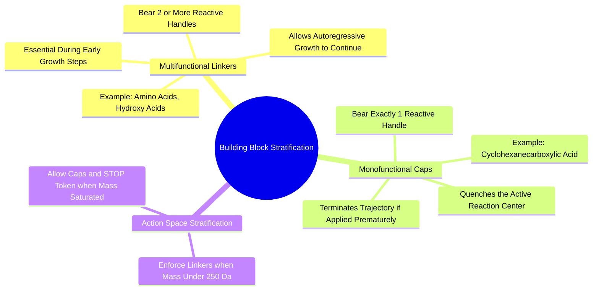

1. **Monofunctional Caps:** Synthons possessing exactly **one** reactive functional group (e.g., cyclohexanecarboxylic acid, cyclopentylamine). Once attached to the growing scaffold, no reactive handle remains. The trajectory terminates instantly.
2. **Multifunctional Linkers:** Synthons possessing **two or more** reactive handles (e.g., an amino acid bearing both an amine and a carboxylic acid, or a bromo-aniline). When attached, one handle is consumed by the reaction, while the second handle remains free, serving as the attachment handle for the subsequent generative step.
3. **The One-Step Death Trap:** If an untrained or naive model selects a monofunctional cap at Step 1, growth stops permanently. The resulting compound has a molecular weight of only $\approx 180\text{ Da}$—too small to fill a binding pocket or achieve potency.
4. **The Resolution:** `3D-SynTree` enforces an architectural rule: during early growth steps (or until the intermediate scaffold reaches `data.terminal_cap_min_mw`, default $250\text{ Da}$), monofunctional caps are strictly masked from the synthon action space. The model is forced to choose multifunctional linkers until the ligand achieves drug-like volume.

*Related Notes:*
* Connects to: `[[7.4.2. Concept. The Synthon Head and the Explicit STOP Token]]`
* Code Manifestation: Filtered via `require_remaining_handle` in `SynthonCatalog.get_reaction_family_mask` and `SBDDGenerator.generate_ligand`.

---

### 7.3. Topic. SE(3)-Equivariant Pocket Conditioning

#### 7.3.1. Concept. PaiNN Invariant Scalar and Equivariant Vector Features
The protein pocket is an unconstrained three-dimensional point cloud living in Euclidean space $\mathbb{R}^3$. To process this cavity, `3D-SynTree` implements an $\text{SE}(3)$-equivariant graph neural network: the **Polarizable Atom Interaction Network (PaiNN)**.

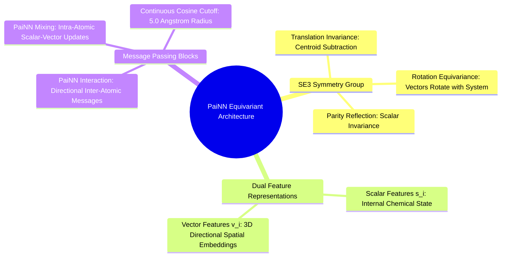

1. **The $\text{SE}(3)$ Group:** The Special Euclidean group in three dimensions represents all rigid-body translations and rotations in 3D space:
   * **Invariance:** A function $f$ is invariant if rotating or translating the input leaves the output unchanged: $f(\mathbf{R}\mathbf{x} + \mathbf{t}) = f(\mathbf{x})$.
   * **Equivariance:** A function $g$ is equivariant if rotating the input rotates the output by the identical rotation matrix: $g(\mathbf{R}\mathbf{x} + \mathbf{t}) = \mathbf{R} g(\mathbf{x})$.
2. **Dual-Channel Features in PaiNN:**
   * **Scalar Features ($s_i \in \mathbb{R}^d$):** Invariant scalar representations of each atom's chemical state (atomic number, charge, local electronegativity).
   * **Vector Features ($\vec{v}_i \in \mathbb{R}^{3 \times d}$):** Equivariant spatial vectors that point along geometric axes in 3D space, capturing directed features (dipoles, orbital orientations, cavity wall directions).
3. **The Message Passing Updates:**
   * **Inter-Atomic Interaction:** Passes directional messages across edges within a radial cutoff ($r_{\text{cut}} = 5.0\text{ \AA}$), expanding interatomic distances $d_{ij}$ using Gaussian Radial Basis Functions (RBFs) smoothed by a cosine cutoff envelope.
   * **Intra-Atomic Mixing:** Mixes scalar and vector channels through a linear projection, computing vector norms $\|\vec{v}_i\|$ in $\text{fp32}$ to update both channels without breaking rotational equivariance.

*Related Notes:*
* Connects to: `[[1.2.2. Concept. Electronegativity, Dipoles, and Polar Covalent Bonds]]`
* Connects to: `[[7.3.2. Concept. Relative Distance RBFs and Cross-Attention Core]]`
* Code Manifestation: Implemented in `syntree/models/equivariant.py` and `syntree/models/pocket_encoder.py`.

---

#### 7.3.2. Concept. Relative Distance RBFs and Cross-Attention Core
How does the model connect the invariant chemical state of the growing ligand to the equivariant 3D point cloud of the pocket?

1. **The "Franken-Tensor" Amateur Tell:** In naive models, developers take a 64-dimensional chemical feature vector describing an attachment handle and simply tack the raw Cartesian coordinates $(x, y, z)$ onto the end, creating a 67-dimensional hybrid tensor:
   $$\mathbf{x}_{\text{bad}} = [f_1, f_2, \dots, f_{64}, x, y, z]$$
   This breaks geometric deep learning principles. Raw $(x, y, z)$ coordinates depend entirely on the arbitrary global reference frame of the PDB file. If the PDB file is rotated by $45^\circ$, the chemical features are corrupted, and the neural network outputs completely different predictions.
2. **The Invariant Distance RBF Solution:** In `SynTreePolicy.forward()` (`syntree/models/policy.py`), `3D-SynTree` enforces rigorous frame-invariance:
   * The handle's chemical identity is projected through a Linear layer into query space: $\mathbf{q}_u \in \mathbb{R}^d$.
   * For every pocket atom $j$, the network computes the Euclidean distance between the pocket atom and the reacting handle position:
     $$d_{uj} = \|\mathbf{x}_j^{\text{pocket}} - \mathbf{x}_u^{\text{handle}}\|$$
   * This scalar distance is invariant to global rotations and translations. It is expanded through 16 Gaussian Radial Basis Functions (RBFs) and added directly to the pocket atom's scalar features before cross-attention.
3. **Cross-Attention Conditioning:** The handle query $\mathbf{q}_u$ cross-attends across all spatially enriched pocket atoms, extracting a localized, rotationally invariant context vector $\mathbf{z}_t \in \mathbb{R}^d$ that focuses specifically on the protein residues surrounding that active handle.

*Related Notes:*
* Connects to: `[[3.3.2. Concept. Pharmacophore Hotspots and Interaction Fields]]`
* Connects to: `[[7.4.2. Concept. The Synthon Head and the Explicit STOP Token]]`
* Code Manifestation: Implemented in `SynTreePolicy.forward` (`syntree/models/policy.py`).

---

### 7.4. Topic. The Reaction-Masked Decision Hierarchy

#### 7.4.1. Concept. The Reaction Head and Grammar Masking
The first decision in the factorized policy selects the reaction family.

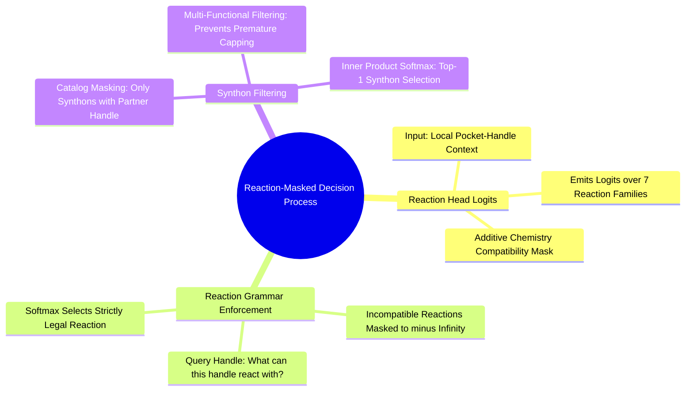

1. **The Reaction Head Architecture:** A multi-layer perceptron taking the cross-attention context vector $\mathbf{z}_t$ and emitting logits over the 7 supported reaction families:
   $$\mathbf{z}_{\text{rxn}} = \text{MLP}(\mathbf{z}_t) \in \mathbb{R}^7$$
2. **The Reaction Compatibility Mask:** Before applying the softmax, the logits are masked by an additive boolean compatibility vector derived deterministically from the chemistry engine:
   $$\mathbf{M}_{\text{rxn}}(f) = \begin{cases} 0.0 & \text{if handle } u \text{ can participate in family } f \\ -\infty & \text{otherwise} \end{cases}$$
   $$\mathbf{p}_{\text{rxn}} = \text{Softmax}\left(\mathbf{z}_{\text{rxn}} + \mathbf{M}_{\text{rxn}}\right)$$
   If the active handle on the scaffold is a carboxylic acid, the mask permits amide coupling and esterification, while setting Suzuki coupling, reductive amination, and click triazole to $-\infty$. The network cannot propose an impossible reaction.

*Related Notes:*
* Connects to: `[[5.4.1. Concept. Amide Coupling Chemistry]]`
* Connects to: `[[7.4.2. Concept. The Synthon Head and the Explicit STOP Token]]`
* Code Manifestation: Implemented in `ReactionHead` (`syntree/models/reaction_head.py`).

---

#### 7.4.2. Concept. The Synthon Head and the Explicit STOP Token
Once the reaction family $r_t$ is selected, the policy selects a specific building block from the catalog.

1. **The Cross-Attention Scoring:** The context vector is projected and scored against the pre-computed catalog embedding matrix $\mathbf{E}_B \in \mathbb{R}^{K \times d}$ using tied dot-product attention:
   $$\text{logits}_{\text{synthon}} = \frac{\mathbf{W}_{\text{out}}\mathbf{z}_t \cdot \mathbf{E}_B^T}{\sqrt{d}} + \mathbf{M}_{\text{synthon}}(r_t, u)$$
   where $\mathbf{M}_{\text{synthon}}(r_t, u)$ sets any synthon lacking the complementary partner functional group to $-\infty$.
2. **The Cavity Completion Paradox:** How does an autoregressive model know when the protein pocket is full?
   * If a model only sees local atoms, it cannot judge global cavity saturation.
   * If termination is implicit (stopping only when all handles run out), the model might attach a terminal cap when the pocket is only $20\%$ full.
3. **The Learned STOP Token:** `SynthonHead` outputs an action space of size **$K + 1$**, where indices $0$ to $K-1$ represent the catalog synthons, and index $K$ is an explicit learned **`STOP` action**:
   $$\text{stop\_logit} = \frac{\mathbf{W}_{\text{out}}\mathbf{z}_t \cdot \mathbf{w}_{\text{stop}}}{\sqrt{d}} + b_{\text{stop}}$$
   The policy is trained to emit `STOP` when the ligand has filled the subpockets. During early steps, when ligand molecular weight is below `terminal_cap_min_mw` ($250\text{ Da}$), the `STOP` logit is clamped to $-\infty$ via an architectural mask (`stop_mask`), preventing premature termination.

*Related Notes:*
* Connects to: `[[7.2.2. Concept. Multifunctional Linkers vs Monofunctional Caps]]`
* Code Manifestation: Implemented in `SynthonHead.forward` in `syntree/models/synthon_head.py`.

---

#### 7.4.3. Concept. The Continuous von Mises Dihedral Torsion Head
Predicting the 3D dihedral rotation of the newly formed bond requires modeling probability density on a circular manifold.

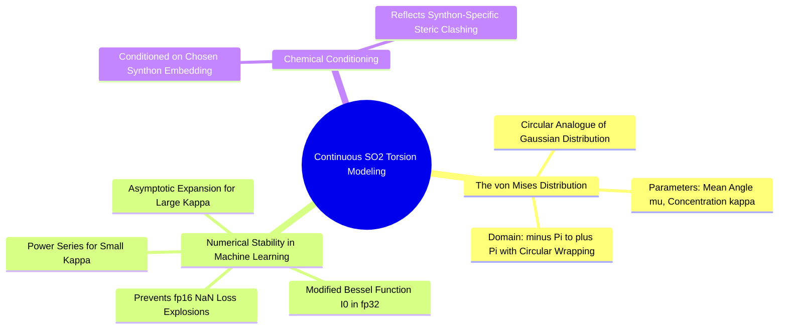

1. **The von Mises Distribution:** The circular analogue of the normal distribution, defined on $\phi \in [-\pi, \pi)$:
   $$p(\phi \mid \mu, \kappa) = \frac{\exp\left( \kappa \cos(\phi - \mu) \right)}{2\pi I_0(\kappa)}$$
   where:
   * $\mu \in [-\pi, \pi)$ is the predicted mean dihedral angle.
   * $\kappa > 0$ is the concentration parameter (equivalent to $1/\sigma^2$). High $\kappa$ means high certainty.
   * $I_0(\kappa)$ is the modified Bessel function of the first kind of order 0, serving as the normalizing partition function.
2. **Circular Negative Log-Likelihood Loss:**
   $$\mathcal{L}_{\text{torsion}} = -\ln p(\phi_{\text{true}} \mid \mu, \kappa) = -\kappa \cos(\phi_{\text{true}} - \mu) + \ln(2\pi) + \ln I_0(\kappa)$$
3. **The fp16 Precision Catastrophe:** In 16-bit mixed-precision training (such as on Colab Tesla T4 GPUs), computing $\ln I_0(\kappa)$ naively causes catastrophic NaN failures. When $\kappa > 50$, $I_0(\kappa)$ overflows the maximum fp16 representable limit ($65,504$) to `+inf`, which subsequently turns the loss into `NaN`. `3D-SynTree` hardens this by evaluating the modified Bessel function strictly in **$\text{fp32}$** using a dual regime:
   * Power series expansion for $\kappa < 5.0$.
   * Asymptotic expansion $\ln I_0(\kappa) \approx \kappa - \frac{1}{2}\ln(2\pi\kappa) + \dots$ for $\kappa \ge 5.0$.

*Related Notes:*
* Connects to: `[[5.2.1. Concept. Dihedral Angles and Rotational Barriers]]`
* Code Manifestation: Implemented in `ContinuousTorsionHead` and `log_bessel_i0` in `syntree/models/torsion_head.py`.

---

### 7.5. Topic. Physical Assembly and Conformer Snapping

#### 7.5.1. Concept. Scaffold-Locked Harmonic Restraint Relaxation
After RDKit constructs the product molecule graph and the torsion head predicts dihedral angle $\phi_t$, the new synthon must be assigned physical 3D coordinates.

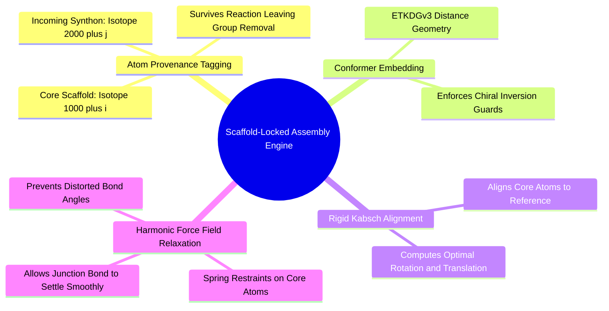

1. **Atom Provenance via Isotopes:** When RDKit executes a reaction (e.g., amide coupling), it strips leaving groups (the water molecule, $-\text{OH}$ and $-\text{H}$). Because RDKit scrambles internal atom-map tags during `RunReactants`, `ReactionEngine` tags core atoms with unique isotopes ($1000 + i$) and synthon atoms with ($2000 + j$). These isotopes survive product sanitization, providing exact $1:1$ atomic correspondence between reactant coordinates and product atoms.
2. **The Kabsch Rigid Alignment:** The newly embedded 3D product (which is initially generated by ETKDG in an arbitrary coordinate frame) must be aligned with the existing locked scaffold. The engine extracts the coordinates of all core atoms in the product ($\mathbf{P}$) and their reference positions ($\mathbf{Q}$), calculating the optimal translation vectors and proper rotation matrix $\mathbf{R} \in \text{SO}(3)$ via Singular Value Decomposition (SVD):
   $$\mathbf{H} = (\mathbf{P} - \bar{\mathbf{P}})^T (\mathbf{Q} - \bar{\mathbf{Q}}) = \mathbf{U} \mathbf{\Sigma} \mathbf{V}^T, \quad \mathbf{R} = \mathbf{V} \begin{pmatrix} 1 & 0 & 0 \\ 0 & 1 & 0 \\ 0 & 0 & \det(\mathbf{V}\mathbf{U}^T) \end{pmatrix} \mathbf{U}^T$$
3. **Harmonic Spring Relaxation:** Once aligned, the core atoms are held near their crystal reference positions using harmonic restraints ($k = 50\text{ kcal/mol/\AA}^2$) while the newly formed junction bond relaxes under the MMFF94 force field. This heals any bond length or angle distortions introduced during assembly without moving the scaffold.
4. **Dihedral Rotation:** Finally, `ConformerEngine.set_dihedral` rotates the newly attached synthon around the junction bond to match the neural network's predicted angle $\phi_t$. If the junction is an amide, the bond is locked strictly planar ($180^\circ$).

*Related Notes:*
* Connects to: `[[2.2.1. Concept. Formation, Geometry, and Resonance of the Peptide Bond]]`
* Connects to: `[[6.3.2. Concept. Constrained Energy Minimization]]`
* Code Manifestation: Implemented in `ConformerEngine.embed_product` (`syntree/chemistry/conformer.py`).

---

### 7.6. Topic. Multi-Objective Reinforcement Learning

#### 7.6.1. Concept. The Multi-Objective Reinforcement Learning Reward
In Stage 2, the behavioral-cloning policy is fine-tuned using Reinforcement Learning (PPO) against an external multi-objective reward function:
$$R_{\text{total}} = w_{\text{dock}} R_{\text{dock}} + w_{\text{clash}} R_{\text{clash}} + w_{\text{fsp3}} R_{\text{fsp3}} + w_{\text{qed}} R_{\text{qed}} + w_{\text{valid}} R_{\text{valid}}$$

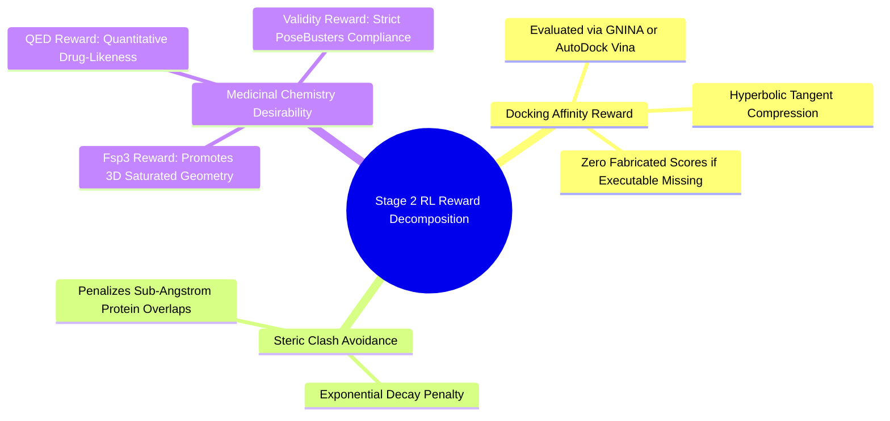

1. **Docking Affinity Reward ($R_{\text{dock}}$):**
   $$R_{\text{dock}} = \tanh\left( \frac{-\text{Score}_{\text{dock}}}{\text{Scale}} \right)$$
   Evaluated using external GNINA or AutoDock Vina. If the binary is missing, `docking_available` is set to $0.0$ and the reward component is recorded as zero—no proxy numbers are fabricated.
2. **Steric Clash Penalty ($R_{\text{clash}}$):**
   $$R_{\text{clash}} = \exp\left( -\frac{\max(0, \text{Score}_{\text{clash}})}{\text{Scale}} \right)$$
   Exponentially penalizes overlaps where ligand heavy atoms penetrate within the van der Waals radii of protein atoms.
3. **Saturation Reward ($R_{\text{fsp3}}$):**
   $$R_{\text{fsp3}} = \tanh\left( \frac{\max(0, \text{Fsp3} - 0.42)}{0.20} \right)$$
   Rewards the agent for selecting $sp^3$-rich building blocks that preserve 3D conformational complexity.
4. **Drug-Likeness Reward ($R_{\text{qed}}$):**
   Bickerton’s **Quantitative Estimate of Drug-Likeness (QED)** score ($[0, 1]$), which integrates molecular weight, $\log P$, polar surface area, and rotatable bonds into an underlying desirability function.
5. **Physical Validity Reward ($R_{\text{valid}}$):**
   A binary bonus ($1.0$ vs. $0.0$) granted only if the molecule passes all RDKit sanitization and PoseBusters physical geometry checks.

*Related Notes:*
* Connects to: `[[4.3.1. Concept. Lipinski's Rule of Five and Veber's Rules]]`
* Connects to: `[[6.2.2. Concept. Scoring Functions: Physics-Based vs Empirical]]`
* Code Manifestation: Implemented in `ThreeDReward` in `syntree/engine/rl.py`.

---

#### 7.6.2. Concept. Rollout Buffers and Destabilization Hazards in PPO
Proximal Policy Optimization (PPO) is an on-policy actor-critic algorithm that updates policy parameters using an empirical expectation over sampled trajectories:
$$L^{\text{CLIP}}(\theta) = \hat{\mathbb{E}}_t \left[ \min\left( r_t(\theta)\hat{A}_t, \text{clip}(r_t(\theta), 1-\epsilon, 1+\epsilon)\hat{A}_t \right) \right]$$
where $r_t(\theta) = \frac{\pi_\theta(a_t \mid s_t)}{\pi_{\theta_{\text{old}}}(a_t \mid s_t)}$ is the importance sampling probability ratio, and $\hat{A}_t$ is the generalized advantage estimate.

1. **The Micro-Batch Catastrophe:** A fatal implementation flaw identified in early versions of `syntree/engine/rl.py` was executing 4 epochs of gradient descent on a batch size of literally **one single molecule** (a horizon of $T = 2$ transitions):
   * AdamW computed gradients across a batch of $N=2$.
   * Gradient variance exploded.
   * The probability ratio $r_t(\theta)$ immediately hit the clipping boundaries ($1 \pm \epsilon$).
   * Within 50 episodes, the multi-million parameter PaiNN encoder underwent **catastrophic forgetting**, wiping out all pre-trained behavioral cloning weights.
2. **The Rollout Buffer Fix:** PPO requires sampling over a representative distribution of environments. The trainer must roll out $32\text{ to }64$ complete trajectories across distinct protein pockets, accumulate a **Rollout Buffer** containing $100\text{ to }250$ transitions, normalize the advantages $\hat{A}_t$ across the entire global buffer:
   $$\hat{A}_t^{\text{norm}} = \frac{\hat{A}_t - \mu_A}{\sigma_A + 1e-8}$$
   and only then execute mini-batch PPO updates.
3. **Discounted Terminal Reward Returns:** In molecular assembly, the intermediate steps receive zero immediate feedback; the drug candidate only docks once it is complete. For a trajectory of horizon $T$ with terminal reward $R$, the return at step $t$ must decay once per step:
   $$G_t = \gamma^{T - 1 - t} R$$
   This prevents the agent from counting the same final reward multiple times across preceding steps.

*Related Notes:*
* Connects to: `[[7.1.1. Concept. The Markov Property in SBDD]]`
* Code Manifestation: Implemented in `PPOFineTuner.update_episode` in `syntree/engine/rl.py`.

---

## 8. Chapter 8. Detailed Exercises, Worked Problems, and Case Studies

### 8.1. Exercise 1. Calculating Formal Charges and Ionization States at Physiological pH

#### 8.1.1. Problem Statement
You are given a synthetic hit molecule generated for an oncology target. The molecule contains three ionizable functional groups:
1. An aliphatic cyclohexyl carboxylic acid group ($\text{p}K_a = 4.80$).
2. A secondary piperidine aliphatic amine ($\text{p}K_a = 10.20$).
3. An aromatic aniline nitrogen attached to an unactivated benzene ring ($\text{p}K_a = 4.60$).

Calculate the exact ratio of deprotonated to protonated forms for each of the three groups in human blood at physiological $\text{pH } 7.40$. State the net formal charge of each group, and determine whether the overall molecule is cationic, anionic, or zwitterionic.

#### 8.1.2. Required Background Knowledge
* The Henderson-Hasselbalch equation (`[[1.4.1. Concept. pH, pKa, and Proton Exchange]]`).
* Behavior of carboxylic acids vs. amines (`[[1.4.2. Concept. Formal Charges at Physiological pH]]`).
* Logarithmic transformations and formal charge rules.

#### 8.1.3. Terminology Defined
* **Zwitterion:** A neutral molecule that carries equal numbers of positive and negative formal charges located on different atoms simultaneously.
* **Deprotonated Form ($[\text{A}^-]$ or $[\text{B}]$):** The chemical species remaining after an acid loses a proton ($\text{H}^+$).
* **Protonated Form ($[\text{HA}]$ or $[\text{BH}^+]$):** The chemical species formed when a base captures a proton.

#### 8.1.4. Step-by-Step Solution

##### Group 1: The Aliphatic Carboxylic Acid ($\text{p}K_a = 4.80$)
1. Write the Henderson-Hasselbalch equilibrium:
   $$\text{pH} = \text{p}K_a + \log_{10}\left( \frac{[\text{R—COO}^-]}{[\text{R—COOH}]} \right)$$
2. Substitute the values:
   $$7.40 = 4.80 + \log_{10}\left( \frac{[\text{R—COO}^-]}{[\text{R—COOH}]} \right)$$
3. Isolate the logarithmic term:
   $$\log_{10}\left( \frac{[\text{R—COO}^-]}{[\text{R—COOH}]} \right) = 7.40 - 4.80 = +2.60$$
4. Compute the antilogarithm:
   $$\frac{[\text{R—COO}^-]}{[\text{R—COOH}]} = 10^{2.60} \approx 398.1$$
5. Interpretation: For every 1 neutral molecule, there are $\approx 398$ deprotonated carboxylate anions.
   $$\text{Percentage Deprotonated} = \frac{398.1}{1 + 398.1} \times 100\% = 99.75\%$$
6. Formal charge: **$-1$**.

##### Group 2: The Aliphatic Piperidine Amine ($\text{p}K_a = 10.20$)
1. For a basic amine, the equilibrium involves its conjugate acid ($[\text{R}_2\text{NH}_2^+]$):
   $$\text{pH} = \text{p}K_a + \log_{10}\left( \frac{[\text{R}_2\text{NH}]}{[\text{R}_2\text{NH}_2^+]} \right)$$
2. Substitute the values:
   $$7.40 = 10.20 + \log_{10}\left( \frac{[\text{R}_2\text{NH}]}{[\text{R}_2\text{NH}_2^+]} \right)$$
3. Isolate the logarithmic term:
   $$\log_{10}\left( \frac{[\text{R}_2\text{NH}]}{[\text{R}_2\text{NH}_2^+]} \right) = 7.40 - 10.20 = -2.80$$
4. Compute the antilogarithm:
   $$\frac{[\text{R}_2\text{NH}]}{[\text{R}_2\text{NH}_2^+]} = 10^{-2.80} \approx 0.001585$$
5. Invert to calculate the ratio of protonated cation to neutral amine:
   $$\frac{[\text{R}_2\text{NH}_2^+]}{[\text{R}_2\text{NH}]} = \frac{1}{0.001585} \approx 630.9$$
6. Interpretation: Over $99.84\%$ of the piperidine molecules exist in the positively charged ammonium form.
7. Formal charge: **$+1$**.

##### Group 3: The Aromatic Aniline Nitrogen ($\text{p}K_a = 4.60$)
1. The equilibrium involves the anilinium conjugate acid ($[\text{Ar—NH}_3^+]$):
   $$\text{pH} = \text{p}K_a + \log_{10}\left( \frac{[\text{Ar—NH}_2]}{[\text{Ar—NH}_3^+]} \right)$$
2. Substitute the values:
   $$7.40 = 4.60 + \log_{10}\left( \frac{[\text{Ar—NH}_2]}{[\text{Ar—NH}_3^+]} \right)$$
3. Isolate the logarithmic term:
   $$\log_{10}\left( \frac{[\text{Ar—NH}_2]}{[\text{Ar—NH}_3^+]} \right) = 7.40 - 4.60 = +2.80$$
4. Compute the antilogarithm:
   $$\frac{[\text{Ar—NH}_2]}{[\text{Ar—NH}_3^+]} = 10^{2.80} \approx 630.9$$
5. Interpretation: For every 1 protonated anilinium cation, there are $631$ neutral aniline molecules.
   $$\text{Percentage Neutral} = \frac{630.9}{1 + 630.9} \times 100\% = 99.84\%$$
6. Formal charge: **$0$** (neutral).

#### 8.1.5. Correct Answer
* Carboxylic Acid: Ratio is $\mathbf{398:1}$ favoring deprotonation; Formal Charge = $\mathbf{-1}$.
* Piperidine Amine: Ratio is $\mathbf{631:1}$ favoring protonation; Formal Charge = $\mathbf{+1}$.
* Aniline Nitrogen: Ratio is $\mathbf{631:1}$ favoring the neutral free base; Formal Charge = $\mathbf{0}$.
* The overall molecule carries one $-1$ charge and one $+1$ charge; it is a **Zwitterion** with a net charge of $0$.

#### 8.1.6. Reasoning and Scientific Explanation
Carboxylic acids lose protons at biological $\text{pH}$ because their conjugate base is resonance-stabilized across two electronegative oxygens. Aliphatic amines hold their protons because the electron-donating alkyl carbons stabilize the positive charge. In contrast, aniline's lone pair delocalizes into the aromatic ring's $\pi$ system, lowering its basicity and preventing protonation at $\text{pH } 7.4$.

#### 8.1.7. Common Mistakes
* **Treating all nitrogens as identical bases:** Assuming that because aniline contains an $-\text{NH}_2$ group, it must be positively charged like Lysine. In reality, anilines are neutral at body $\text{pH}$.
* **Sign inversion in the antilog:** Calculating $7.4 - 10.2 = -2.8$, but forgetting that $10^{-2.8}$ represents the fraction of *unprotonated* base, leading to the false conclusion that the piperidine is neutral.

#### 8.1.8. Misleading Answers
* *"The molecule has a net charge of $+2$ because it contains two amines."* This is wrong because it ignores aromatic resonance in the aniline.
* *"The carboxylic acid is neutral because it is an acid."* This is wrong because acids dissociate in basic or neutral environments.

#### 8.1.9. Pro-Tips and Memory Aids
* **The "Lower $\text{pH}$ Protonates" Rule:** If $\text{pH} < \text{p}K_a$, the proton stays **ON**. If $\text{pH} > \text{p}K_a$, the proton comes **OFF**.
* For the acid ($\text{p}K_a = 4.8$): $\text{pH } 7.4 > \text{p}K_a \implies$ Proton OFF $\implies -\text{COO}^-$.
* For the amine ($\text{p}K_a = 10.2$): $\text{pH } 7.4 < \text{p}K_a \implies$ Proton ON $\implies -\text{NH}_2^+$.

#### 8.1.10. Details Commonly Forgotten
Students frequently forget that the $\text{p}K_a$ quoted for an amine in biochemical literature is the $\text{p}K_a$ of its **conjugate acid** ($-\text{NH}_3^+$), not the dissociation of neutral $-\text{NH}_2$ into an amide ion ($-\text{NH}^-$).

#### 8.1.11. Connection to the Larger Subject
Ionization states dictate aqueous solubility and membrane permeability. A zwitterion dissolves well in blood water, but its charged groups must pay a steep desolvation penalty to cross into lipid membranes.

#### 8.1.12. Application to 3D-SynTree
In `syntree/data/featurizer.py`, `MolecularFeaturizer.featurize_handle` encodes the atom's formal charge directly into slots 26–34:
```python
charge = int(atom.GetFormalCharge())
charge_slot = charge + 3 # maps [-3, +4] -> [0, 7]
feats[_CHARGE_OFFSET + charge_slot] = 1.0
```
If the preprocessing fails to protonate the piperidine or deprotonate the acid, the neural network receives a neutral $0.0$ feature, blinding it to the electrostatic salt bridge required to anchor the synthon into the pocket.

---

### 8.2. Exercise 2. Why the Twisted Amide is a Biophysical Catastrophe

#### 8.2.1. Problem Statement
A naive generative model generates a 3D ligand by connecting a carboxylic acid scaffold to an amine synthon via an amide bond. To fit into a narrow subpocket without clashing with a Leucine side chain, the model sets the dihedral angle across the central amide bond ($\text{C}_\alpha—\text{C}(=\text{O})—\text{N}—\text{C}_\alpha$) to $\phi = 90.0^\circ$.

1. Using molecular orbital theory, explain why this $90^\circ$ conformation is physically and chemically impossible in biological systems.
2. If the barrier to rotation of a planar amide is $\Delta E^\ddagger = 20.0\text{ kcal/mol}$, use the Boltzmann distribution at $T = 310.15\text{ K}$ to calculate the relative probability of finding this amide in the $90^\circ$ twisted state compared to the planar $180^\circ$ ($trans$) state.
3. Contrast this with how `3D-SynTree` enforces amide geometry.

#### 8.2.2. Required Background Knowledge
* Molecular orbital resonance of the peptide bond (`[[2.2.1. Concept. Formation, Geometry, and Resonance of the Peptide Bond]]`).
* The Boltzmann distribution equation:
  $$\frac{P_2}{P_1} = \exp\left( -\frac{\Delta E}{k_B T} \right)$$
* Rotational barriers in computational chemistry (`[[5.2.1. Concept. Dihedral Angles and Rotational Barriers]]`).

#### 8.2.3. Terminology Defined
* **$p$-Orbital Delocalization:** The lateral overlap of parallel atomic $p$ orbitals that allows electron density to spread across multiple adjacent nuclei.
* **Boltzmann Constant ($k_B$):** The physical constant relating average kinetic energy to temperature ($1.987 \times 10^{-3}\text{ kcal}\cdot\text{mol}^{-1}\text{K}^{-1}$).

#### 8.2.4. Step-by-Step Solution

##### Part 1: Molecular Orbital Explanation
1. In a planar amide ($\phi = 180^\circ$), the unhybridized $2p_z$ orbital of the nitrogen atom aligns parallel to the $2p_z$ orbital of the carbonyl carbon and the $2p_z$ orbital of the oxygen atom.
2. This parallel alignment permits continuous three-center, four-electron $\pi$-conjugation: the nitrogen lone pair delocalizes into the carbonyl $\pi^*$ antibonding orbital.
3. This resonance imparts approximately $40\%$ double-bond character to the central $\text{C—N}$ bond, stabilizing the system by $\approx 20\text{ kcal/mol}$ of resonance energy.
4. When the dihedral angle is twisted to $\phi = 90.0^\circ$, the nitrogen $2p$ orbital is rotated completely orthogonal ($90^\circ$ perpendicular) to the carbonyl $\pi$ system.
5. The overlap between the two orbitals drops to zero ($\cos(90^\circ) = 0$). Resonance is broken.
6. The nitrogen atom is forced out of its favorable planar $sp^2$ state into an energetic $sp^3$ pyramid, losing the entire $20\text{ kcal/mol}$ resonance stabilization.

##### Part 2: Boltzmann Probability Calculation
1. The energetic penalty of the orthogonal $90^\circ$ state relative to the $180^\circ$ ground state is $\Delta E \approx +20.0\text{ kcal/mol}$.
2. Calculate thermal energy at body temperature ($T = 310.15\text{ K}$):
   $$R T = (1.9872 \times 10^{-3}\text{ kcal}\cdot\text{mol}^{-1}\text{K}^{-1}) \times (310.15\text{ K}) = 0.6163\text{ kcal/mol}$$
3. Compute the Boltzmann ratio:
   $$\frac{P(90^\circ)}{P(180^\circ)} = \exp\left( -\frac{\Delta E}{R T} \right) = \exp\left( -\frac{20.0}{0.6163} \right)$$
4. Evaluate the exponent:
   $$-\frac{20.0}{0.6163} = -32.45$$
5. Compute the exponential value:
   $$\frac{P(90^\circ)}{P(180^\circ)} = e^{-32.45} \approx 8.08 \times 10^{-15}$$

##### Part 3: Algorithmic Contrast
* Naive models treat the amide bond as an unconstrained single bond, allowing continuous circular neural heads to sample arbitrary angles like $90^\circ$.
* `3D-SynTree` identifies amide junctions via SMARTS and locks them to $180^\circ$ ($trans$). The continuous torsion head is directed to rotate the *adjacent true single bond* (e.g., the $\text{C}_\alpha—\text{C}(=\text{O})$ bond) instead.

#### 8.2.5. Correct Answer
1. At $90^\circ$, $p$-orbital overlap drops to zero, breaking resonance and costing $\approx 20\text{ kcal/mol}$.
2. The relative probability of adopting the $90^\circ$ twisted state is $\mathbf{8.08 \times 10^{-15}}$ (roughly **1 in 120 trillion** molecules).
3. The twisted conformation is a non-existent physical state that no real protein will bind.

#### 8.2.6. Reasoning and Scientific Explanation
A molecule that pays a $20\text{ kcal/mol}$ penalty to enter a pocket experiences an affinity drop of more than $14$ orders of magnitude. The protein would have to form 10 perfect, uncompensated hydrogen bonds merely to break even on the energy cost of twisting that amide.

#### 8.2.7. Common Mistakes
* **Assuming that all single bonds rotate freely:** Relying on the Lewis structure representation ($\text{C—N}$) and assuming single-bond character without recognizing resonance.
* **Using non-biological temperatures:** Calculating $R T$ at $0\text{ K}$ or ignoring units.

#### 8.2.8. Misleading Answers
* *"A $90^\circ$ amide is fine because the force field can just minimize it."* This is wrong because if the core atoms are frozen in the pocket, standard minimization algorithms lack the energy to overcome the steep $20\text{ kcal/mol}$ barrier and remain trapped in the twisted local minimum.

#### 8.2.9. Pro-Tips and Memory Aids
* Treat amides as double bonds. You would never predict a $90^\circ$-twisted ethylene ($\text{C=C}$); do not predict a $90^\circ$-twisted amide.

#### 8.2.10. Details Commonly Forgotten
Esters ($\text{R—C(=O)—OR'}$) also possess resonance, but their barrier to rotation is lower ($\approx 10\text{ to }12\text{ kcal/mol}$) because oxygen is more electronegative than nitrogen and holds its lone pair more tightly.

#### 8.2.11. Connection to the Larger Subject
This exercise illustrates why computational generative chemistry cannot be treated purely as computer graphics (arranging shapes in space). Every geometric transformation must obey underlying molecular orbital physics.

#### 8.2.12. Application to 3D-SynTree
In `syntree/chemistry/conformer.py`, `_dihedral_definition()` searches for rotatable single bonds:
```python
# MISTAKE IN AMATEUR ENGINE:
if bond.IsInRing():
    return None # Skips ring bonds, but treated C(=O)-N as rotatable!
```
The fixed pipeline in `3D-SynTree` explicitly identifies amide bonds and overrides the predicted dihedral to planar $180^\circ$, directing the continuous von Mises torsion head to the adjacent single bond.

---

### 8.3. Exercise 3. Thermodynamic Balance Sheet of Ligand Binding

#### 8.3.1. Problem Statement
A computational drug design team proposes two lead candidates (Molecule A and Molecule B) targeting a viral protease. Both molecules are predicted to bind in the same subpocket. You are given the following thermodynamic parameters measured at $T = 310.15\text{ K}$:

* **Molecule A:**
  * Enthalpy of binding: $\Delta H_A = -14.5\text{ kcal/mol}$ (forms 3 strong hydrogen bonds and 1 salt bridge).
  * Number of freely rotatable single bonds frozen upon binding: $N_{\text{rot}} = 9$.
  * Hydrophobic desolvation entropy: $\Delta S_{\text{solv}} = +12.0\text{ cal}\cdot\text{mol}^{-1}\text{K}^{-1}$.
* **Molecule B (a conformationally constrained spirocyclic analogue):**
  * Enthalpy of binding: $\Delta H_B = -10.2\text{ kcal/mol}$ (forms only 2 hydrogen bonds; no salt bridge).
  * Number of freely rotatable single bonds frozen upon binding: $N_{\text{rot}} = 2$.
  * Hydrophobic desolvation entropy: $\Delta S_{\text{solv}} = +16.0\text{ cal}\cdot\text{mol}^{-1}\text{K}^{-1}$.

Assuming each frozen rotatable bond imposes an entropic penalty of $T\Delta S_{\text{rot}} = -0.60\text{ kcal/mol}$:
1. Construct the complete thermodynamic balance sheet ($\Delta H, -T\Delta S, \Delta G$) for both molecules.
2. Calculate the theoretical dissociation constant ($K_d$) for both molecules at $310.15\text{ K}$.
3. Identify which molecule binds with higher affinity, and explain the medicinal chemistry principles driving the outcome.

#### 8.3.2. Required Background Knowledge
* The Gibbs free energy equation: $\Delta G = \Delta H - T\Delta S$ (`[[3.2.1. Concept. Gibbs Free Energy of Binding]]`).
* Enthalpy-entropy compensation and rotatable bond penalties (`[[3.2.2. Concept. Enthalpy-Entropy Compensation]]`).
* Conversion of $\Delta G$ to $K_d$ via $K_d = \exp(\Delta G / RT)$.

#### 8.3.3. Terminology Defined
* **Calorie vs. Kilocalorie:** $1\text{ kcal} = 1,000\text{ cal}$. Entropy is typically reported in $\text{cal}\cdot\text{mol}^{-1}\text{K}^{-1}$ and must be converted to $\text{kcal}\cdot\text{mol}^{-1}\text{K}^{-1}$ by dividing by 1,000.
* **Conformational Pre-Organization:** Synthesizing a small molecule already locked into the active 3D conformation, minimizing the entropic penalty of binding.

#### 8.3.4. Step-by-Step Solution

##### Step 1: Calculate Total Entropy and $-T\Delta S$ for Molecule A
1. Convert desolvation entropy to $\text{kcal}$:
   $$\Delta S_{\text{solv}} = \frac{+12.0}{1000} = +0.012\text{ kcal}\cdot\text{mol}^{-1}\text{K}^{-1}$$
2. Compute the desolvation entropy contribution:
   $$-T\Delta S_{\text{solv}} = -(310.15\text{ K}) \times (+0.012\text{ kcal}\cdot\text{mol}^{-1}\text{K}^{-1}) = -3.72\text{ kcal/mol}$$
3. Compute the conformational freezing penalty:
   $$\Delta G_{\text{rot}} = -T\Delta S_{\text{rot}} = 9 \times (+0.60\text{ kcal/mol}) = +5.40\text{ kcal/mol}$$
4. Compute net $-T\Delta S_{\text{total}}$:
   $$-T\Delta S_{\text{total}} = -3.72\text{ kcal/mol} + 5.40\text{ kcal/mol} = +1.68\text{ kcal/mol}$$
5. Compute total Gibbs Free Energy ($\Delta G_A$):
   $$\Delta G_A = \Delta H_A + (-T\Delta S_{\text{total}}) = -14.50\text{ kcal/mol} + 1.68\text{ kcal/mol} = \mathbf{-12.82\text{ kcal/mol}}$$

##### Step 2: Calculate Total Entropy and $-T\Delta S$ for Molecule B
1. Convert desolvation entropy to $\text{kcal}$:
   $$\Delta S_{\text{solv}} = \frac{+16.0}{1000} = +0.016\text{ kcal}\cdot\text{mol}^{-1}\text{K}^{-1}$$
2. Compute the desolvation entropy contribution:
   $$-T\Delta S_{\text{solv}} = -(310.15\text{ K}) \times (+0.016\text{ kcal}\cdot\text{mol}^{-1}\text{K}^{-1}) = -4.96\text{ kcal/mol}$$
3. Compute the conformational freezing penalty:
   $$\Delta G_{\text{rot}} = -T\Delta S_{\text{rot}} = 2 \times (+0.60\text{ kcal/mol}) = +1.20\text{ kcal/mol}$$
4. Compute net $-T\Delta S_{\text{total}}$:
   $$-T\Delta S_{\text{total}} = -4.96\text{ kcal/mol} + 1.20\text{ kcal/mol} = -3.76\text{ kcal/mol}$$
5. Compute total Gibbs Free Energy ($\Delta G_B$):
   $$\Delta G_B = \Delta H_B + (-T\Delta S_{\text{total}}) = -10.20\text{ kcal/mol} + (-3.76\text{ kcal/mol}) = \mathbf{-13.96\text{ kcal/mol}}$$

##### Step 3: Compute Equilibrium Dissociation Constants ($K_d$)
Recall that $R T = 0.6163\text{ kcal/mol}$.
1. For Molecule A:
   $$K_d^{(A)} = \exp\left( \frac{\Delta G_A}{R T} \right) = \exp\left( \frac{-12.82}{0.6163} \right) = \exp(-20.80) \approx 9.26 \times 10^{-10}\text{ M} = \mathbf{0.93\text{ nM}}$$
2. For Molecule B:
   $$K_d^{(B)} = \exp\left( \frac{\Delta G_B}{R T} \right) = \exp\left( \frac{-13.96}{0.6163} \right) = \exp(-22.65) \approx 1.46 \times 10^{-10}\text{ M} = \mathbf{0.15\text{ nM}}$$

#### 8.3.5. Correct Answer
1. **Balance Sheet:**
   * Molecule A: $\Delta H = -14.50\text{ kcal/mol}$, $-T\Delta S = +1.68\text{ kcal/mol}$, $\mathbf{\Delta G = -12.82\text{ kcal/mol}}$ ($K_d = 0.93\text{ nM}$).
   * Molecule B: $\Delta H = -10.20\text{ kcal/mol}$, $-T\Delta S = -3.76\text{ kcal/mol}$, $\mathbf{\Delta G = -13.96\text{ kcal/mol}}$ ($K_d = 0.15\text{ nM}$).
2. **Outcome:** **Molecule B binds more tightly** (affinity is more than **6 times higher** than Molecule A), despite having weaker electrostatic enthalpy.

#### 8.3.6. Reasoning and Scientific Explanation
Molecule A is an example of an "enthalpic trap." It forms numerous hydrogen bonds and a salt bridge, yielding strong enthalpy ($\Delta H = -14.5$). However, because it is floppy ($9$ rotatable bonds), it pays a heavy conformational entropy penalty ($+5.4\text{ kcal/mol}$) to freeze those bonds. In contrast, Molecule B uses rigid spirocycles to pre-organize its structure: it has only 2 rotatable bonds, paying a tiny entropic penalty ($+1.2\text{ kcal/mol}$) that preserves its binding free energy.

#### 8.3.7. Common Mistakes
* **Looking only at enthalpy:** Assuming Molecule A must bind better because its $\Delta H$ is $-14.5$ versus $-10.2$.
* **Unit mismatch:** Adding $\Delta S = 12.0$ directly to $\Delta H = -14.5$ without multiplying by $T$ and dividing by 1,000.

#### 8.3.8. Misleading Answers
* *"Salt bridges always guarantee higher affinity."* This is wrong because forming salt bridges requires breaking water hydration shells, and floppy side chains cancel the gain through entropic penalties.

#### 8.3.9. Pro-Tips and Memory Aids
* **The "Floppy Chain Tax":** Every rotatable single bond you add to a molecule costs you a factor of 3 in binding affinity unless it forms a strong, directional contact.

#### 8.3.10. Details Commonly Forgotten
Desolvation entropy is positive ($\Delta S > 0$), meaning that $-T\Delta S_{\text{solv}}$ is **negative** (favorable). Students frequently confuse the signs.

#### 8.3.11. Connection to the Larger Subject
This exercise mathematically proves why rigidifying a molecule is a primary strategy in modern medicinal chemistry.

#### 8.3.12. Application to 3D-SynTree
This principle underpins `3D-SynTree`'s architectural rejection of floppy alkyl linkers in favor of pre-validated bicyclic and spirocyclic building blocks curated from the Enamine REAL catalog.

---

### 8.4. Exercise 4. Step-by-Step Retrosynthetic Decomposition and Forward Replay

#### 8.4.1. Problem Statement
You are inspecting a co-crystallized ligand extracted from a high-resolution PDB structure of a target cavity. The SMILES of the ligand is:
```text
O=C(NC1CC2(COC2)C1)C1CCCCC1
```
(A cyclohexyl ring connected via an amide bond to a 6-oxaspiro[3.3]heptan-3-amine).

1. Perform a retrosynthetic disconnection on this ligand across its primary acyclic junction bond, identifying the two chemical precursors.
2. Determine which supported forward reaction family reconstructs this molecule.
3. Write the exact forward reaction SMARTS template used by `3D-SynTree`.
4. Explain the verification check required by `ReactionConstrainedFragmenter` before this complex can be used for Stage 1 behavioral cloning supervision.

#### 8.4.2. Required Background Knowledge
* Amide coupling disconnection rules (`[[5.4.1. Concept. Amide Coupling Chemistry]]`).
* SMARTS reaction templates in RDKit (`[[7.4.1. Concept. The Reaction Head and Grammar Masking]]`).
* Retrosynthetic data curation (`[[7.2.1. Concept. Curating the Enamine REAL 3D-Diversity Catalog]]`).

#### 8.4.3. Terminology Defined
* **Disconnection:** A theoretical analytical operation where a covalent bond in a target molecule is cleaved to yield simpler precursor fragments (synthons).
* **Forward Replay:** Executing the chemical reaction in the forward synthesis direction using RDKit to verify that the product matches the original crystal ligand.

#### 8.4.4. Step-by-Step Solution

##### Step 1: Identify the Retrosynthetic Disconnection
1. Inspect the molecular graph for rotatable, non-ring single bonds that match a supported reaction family:
   * The bond between the carbonyl carbon ($\text{C}(=\text{O})$) and the nitrogen atom ($\text{NH}$) is an acyclic amide bond.
2. Cleave the $\text{C—N}$ bond:
   * Fragment 1: The acyl segment: $\text{C}_6\text{H}_{11}—\text{C}(=\text{O})—$
   * Fragment 2: The amino segment: $—\text{NH}—\text{C}_6\text{H}_9\text{O}$
3. Reconstruct the stable precursor handles:
   * Add a hydroxyl ($-\text{OH}$) to the acyl fragment $\longrightarrow$ **Cyclohexanecarboxylic acid** (`OC(=O)C1CCCCC1`).
   * Add a hydrogen ($-\text{H}$) to the amino fragment $\longrightarrow$ **6-oxaspiro[3.3]heptan-3-amine** (`NC1CC2(COC2)C1`).

##### Step 2: Determine the Forward Reaction Family
* The reaction is an **amide coupling** (`amide_coupling`).

##### Step 3: The Exact SMARTS Template
* From `syntree/chemistry/reactions.py`:
  ```smarts
  [C:1](=O)[OH].[N;!H0;!H3;!$(NC=O):2] >> [C:1](=O)[N:2]
  ```

##### Step 4: Verification Protocol in `ReactionConstrainedFragmenter`
1. Check that the synthon fragment exists in the filtered catalog (`SynthonCatalog`).
2. Execute the forward reaction using `ReactionEngine.apply_reaction(core, synthon, "amide_coupling")`.
3. Check the product connectivity:
   $$\text{CanonicalSMILES}(\text{ReplayProduct}) \stackrel{?}{=} \text{CanonicalSMILES}(\text{CrystalLigand})$$
4. Check 3D dihedral availability: Confirm that the original crystal ligand has an observed 3D junction dihedral angle $\phi_{\text{obs}}$.
5. Only if both checks pass is the example accepted as a ground-truth supervision state.

#### 8.4.5. Correct Answer
1. Precursors: Cyclohexanecarboxylic acid (`OC(=O)C1CCCCC1`) and 6-oxaspiro[3.3]heptan-3-amine (`NC1CC2(COC2)C1`).
2. Reaction: `amide_coupling`.
3. SMARTS: `[C:1](=O)[OH].[N;!H0;!H3;!$(NC=O):2] >> [C:1](=O)[N:2]`.
4. Verification: The replayed product must achieve exact canonical SMILES parity with the crystal ligand, and a valid 3D junction dihedral must be extractable.

#### 8.4.6. Reasoning and Scientific Explanation
A naive fragmenter that merely cuts bonds without replaying them forward risks generating training targets that fail in real chemistry (e.g., generating unstable tautomers or side reactions). Replaying the forward reaction guarantees that the neural network is trained only on valid chemical transformations.

#### 8.4.7. Common Mistakes
* **Cleaving ring bonds:** Attempting to cut the bonds of the spirocycle. Ring bonds cannot be cleaved in standard retrosynthetic synthon libraries.
* **Adding wrong functional handles:** Reconstructing the acyl fragment as an acyl chloride ($-\text{COCl}$) rather than the carboxylic acid handle present in the catalog.

#### 8.4.8. Misleading Answers
* *"The fragments are a carbocation and a nitrogen anion."* In theoretical retrosynthesis, synthons are formal charged concepts, but in computational library matching, they must be converted into **synthetic equivalents** (stable, neutral commercial molecules).

#### 8.4.9. Pro-Tips and Memory Aids
* Look for the carbonyl attached to nitrogen. Cut the $\text{C—N}$ bond, place an $-\text{OH}$ on the carbon, and put an $-\text{H}$ on the nitrogen.

#### 8.4.10. Details Commonly Forgotten
Both reactant orderings must be checked: either fragment can serve as the growing core scaffold, while the other serves as the incoming catalog synthon.

#### 8.4.11. Connection to the Larger Subject
This decomposition forms the basis of **imitation learning (behavioral cloning)**, training the neural network to mimic expert retrosynthetic choices made by human medicinal chemists.

#### 8.4.12. Application to 3D-SynTree
Implemented in `syntree/data/fragmenter.py` and used by `scripts/build_trajectories.py` to compile training datasets without manual labeling.

---

### 8.5. Exercise 5. Coordinate Preservation and Kabsch Alignment

#### 8.5.1. Problem Statement
During generation step $t=1$, `3D-SynTree` attaches an incoming amine synthon to a locked carboxylic acid core scaffold located inside an active site.
* The reference core has 8 heavy atoms with known crystal coordinates $\mathbf{Q} \in \mathbb{R}^{8 \times 3}$.
* RDKit's ETKDG embeds the combined product molecule into an arbitrary local coordinate frame, placing the corresponding 8 core atoms at coordinates $\mathbf{P} \in \mathbb{R}^{8 \times 3}$.

1. Explain mathematically why directly overwriting $\mathbf{P}$ with $\mathbf{Q}$ without an alignment step tears the newly formed junction bond.
2. Detail the exact Kabsch SVD algorithm used to calculate the optimal rigid rotation matrix $\mathbf{R}$ and translation vector $\mathbf{t}$.
3. Explain how the harmonic restraint force field step fixes residual bond-length errors at the junction.

#### 8.5.2. Required Background Knowledge
* Singular Value Decomposition (SVD) and the Kabsch algorithm (`[[7.5.1. Concept. Scaffold-Locked Harmonic Restraint Relaxation]]`).
* Conformer generation mechanics in RDKit (`[[6.3.2. Concept. Constrained Energy Minimization]]`).
* Rigid-body transformations in Euclidean space $\mathbb{SE}(3)$.

#### 8.5.3. Terminology Defined
* **Centroid:** The geometric center (mean position) of a point cloud: $\bar{\mathbf{P}} = \frac{1}{N} \sum_{i=1}^N \mathbf{P}_i$.
* **Singular Value Decomposition (SVD):** Factoring a matrix into $\mathbf{U} \mathbf{\Sigma} \mathbf{V}^T$, where $\mathbf{U}$ and $\mathbf{V}$ are orthogonal matrices containing singular vectors.

#### 8.5.4. Step-by-Step Solution

##### Step 1: Why Direct Coordinate Overwriting Tears Bonds
1. ETKDG embeds the product molecule with its own internal coordinate frame, placing the center of mass near $(0, 0, 0)$.
2. The reference core $\mathbf{Q}$ lives in the global coordinate frame of the protein pocket, centered at, for example, $(35.4, -12.8, 104.2)\text{ \AA}$.
3. The incoming synthon atoms in the product are physically bonded to the core atoms in ETKDG's frame (distances $\approx 1.5\text{ \AA}$).
4. If you overwrite the core atoms with $\mathbf{Q}$ while leaving the synthon atoms near $(0, 0, 0)$, the junction bond between the core and the synthon is stretched across empty space from $(0, 0, 0)$ to $(35, -12, 104)$—a broken bond length of **$110\text{ \AA}$**!

##### Step 2: The Kabsch Alignment Derivation
To bring the embedded product into the reference frame before locking:
1. Compute the centroids of the core atoms in both frames:
   $$\bar{\mathbf{P}} = \frac{1}{8}\sum_{i=1}^8 \mathbf{P}_i, \quad \bar{\mathbf{Q}} = \frac{1}{8}\sum_{i=1}^8 \mathbf{Q}_i$$
2. Translate both point clouds to the origin:
   $$\mathbf{P}_0 = \mathbf{P} - \bar{\mathbf{P}}, \quad \mathbf{Q}_0 = \mathbf{Q} - \bar{\mathbf{Q}}$$
3. Compute the $3 \times 3$ cross-covariance matrix $\mathbf{H}$:
   $$\mathbf{H} = \mathbf{P}_0^T \mathbf{Q}_0$$
4. Perform Singular Value Decomposition on $\mathbf{H}$:
   $$\mathbf{H} = \mathbf{U} \mathbf{\Sigma} \mathbf{V}^T$$
5. Check for reflection invariance: To ensure that $\mathbf{R}$ is a pure rotation and not an unphysical inversion (reflection), calculate the sign of the determinant:
   $$d = \text{sign}(\det(\mathbf{V} \mathbf{U}^T))$$
6. Compute the optimal rotation matrix $\mathbf{R}$:
   $$\mathbf{R} = \mathbf{V} \begin{pmatrix} 1 & 0 & 0 \\ 0 & 1 & 0 \\ 0 & 0 & d \end{pmatrix} \mathbf{U}^T$$
7. Compute the translation vector $\mathbf{t}$:
   $$\mathbf{t} = \bar{\mathbf{Q}} - \bar{\mathbf{P}} \mathbf{R}^T$$
8. Apply the transformation to **all atoms** in the product (both core and synthon):
   $$\mathbf{X}_{\text{product}}^{\text{aligned}} = \mathbf{X}_{\text{product}} \mathbf{R}^T + \mathbf{t}$$

##### Step 3: Restraint Relaxation at the Junction
* Even after rigid Kabsch alignment, the core conformation chosen by ETKDG may differ slightly from the crystal core $\mathbf{Q}$.
* Overwriting the core positions leaves the junction bond between the core atom and the synthon atom slightly off (e.g., $1.3\text{ \AA}$ or $1.8\text{ \AA}$).
* `ConformerEngine._relax_with_frozen_scaffold` applies MMFF94 force-field minimization with harmonic restraints ($k = 50\text{ kcal/mol/\AA}^2$) on all core atoms.
* The flexible synthon atoms move to accommodate the fixed core, allowing the junction bond length to settle to its optimal physical minimum ($1.47\text{ \AA}$) without distorting the core.

#### 8.5.5. Correct Answer
1. Direct overwriting without alignment creates an unphysical bond length spanning the distance between the origin and the pocket cavity ($>30\text{ \AA}$).
2. The Kabsch algorithm solves $\min_{\mathbf{R}, \mathbf{t}} \|\mathbf{P}\mathbf{R}^T + \mathbf{t} - \mathbf{Q}\|^2$ via SVD of the cross-covariance matrix $\mathbf{P}_0^T \mathbf{Q}_0$, enforcing $\det(\mathbf{R}) = +1$.
3. Harmonic restraints allow the synthon atoms to move under MMFF94 while holding the scaffold locked, restoring physical bond lengths.

#### 8.5.6. Reasoning and Scientific Explanation
A small molecule inside an enzyme must maintain valid bond lengths ($1.4\text{ to }1.5\text{ \AA}$). By separating global rigid alignment (Kabsch) from local internal relaxation (restrained MMFF), `3D-SynTree` preserves the locked binding pose of the scaffold while maintaining physical stereochemistry.

#### 8.5.7. Common Mistakes
* **Forgetting the determinant check:** Calculating $\mathbf{R} = \mathbf{V} \mathbf{U}^T$ without checking $\det(\mathbf{V}\mathbf{U}^T)$. If the determinant is $-1$, the transformation performs a mirror reflection, converting every chiral center in the molecule into its opposing enantiomer!
* **Transforming only the core:** Applying $\mathbf{R}$ and $\mathbf{t}$ to the core atoms while forgetting to apply them to the attached synthon atoms.

#### 8.5.8. Misleading Answers
* *"You don't need Kabsch alignment if you use distance geometry with fixed atom constraints."* In theory, ETKDG can take fixed coordinates, but in practice, standard distance geometry routines frequently fail to converge or distort the scaffold when more than 10 atoms are locked.

#### 8.5.9. Pro-Tips and Memory Aids
* Centroid subtract $\to$ Covariance $\to$ SVD $\to$ Check det $\to$ Rotate.

#### 8.5.10. Details Commonly Forgotten
The translation vector $\mathbf{t}$ must be applied *after* rotating around the centroid: $\mathbf{t} = \bar{\mathbf{Q}} - \bar{\mathbf{P}}\mathbf{R}^T$.

#### 8.5.11. Connection to the Larger Subject
Kabsch alignment is the universal method used in structural biology to compute Root-Mean-Square Deviation (RMSD) between docked poses and crystal references.

#### 8.5.12. Application to 3D-SynTree
Implemented in `_kabsch` and executed inside `ConformerEngine.embed_product` (`syntree/chemistry/conformer.py`).

---

## 9. Comprehensive Glossary of Technical Terms

* **Active Pharmaceutical Ingredient (API):** The biologically active chemical compound in a pharmaceutical drug that produces the intended therapeutic effect.
* **Affinity ($K_d$):** The thermodynamic strength of equilibrium binding between a small-molecule ligand and its target protein; lower values mean tighter binding.
* **Agonist:** A molecule that binds to a receptor and actively stabilizes its signaling conformation, triggering a biological response.
* **Allosteric Site:** A binding pocket on a protein distinct from the primary catalytic active site that modulates protein function via induced conformational changes.
* **Amide Bond:** A planar, resonance-stabilized covalent linkage formed between a carbonyl carbon and a nitrogen atom ($-\text{C(=O)—N}-$) with a high rotational energy barrier ($\approx 20\text{ kcal/mol}$).
* **Antagonist:** A drug that binds to a receptor with high affinity but produces zero biological signaling, blocking endogenous hormones.
* **Aromaticity:** A cyclic, planar, conjugated system of $p$ orbitals containing $(4n+2)$ $\pi$ electrons (Hückel's Rule) exhibiting enhanced chemical stability and strict geometric flatness.
* **B-Factor (Temperature Factor):** A crystallographic parameter indicating the relative vibrational motion, thermal mobility, and coordinate uncertainty of an atom in a PDB structure.
* **Bioavailability ($F$):** The fraction of an orally administered drug that reaches systemic circulation in an active, unchanged state.
* **Chirality:** The geometric property of a molecule of being non-superimposable on its mirror image, giving rise to distinct $(R)$ and $(S)$ enantiomers.
* **Clathrate Water:** A highly ordered, ice-like cage of water molecules that forms spontaneously around non-polar surfaces, driving the hydrophobic effect upon release.
* **Covalent Bond:** A strong chemical bond formed by the sharing of one or more pairs of valence electrons between atomic nuclei.
* **Dihedral Angle ($\phi$):** The circular angle between two intersecting planes defined by four sequentially bonded atoms ($A—B—C—D$), parameterized in $SO(2)$ space.
* **Docking:** A computational simulation method that samples translational, rotational, and torsional degrees of freedom to predict the 3D binding pose of a ligand in a protein cavity.
* **Efficacy ($E_{\text{max}}$):** The maximum biological response that a drug candidate can elicit when all target receptors are fully occupied.
* **Electronegativity ($\chi$):** The relative tendency of an atom to attract shared electron density in a covalent bond toward itself.
* **Enantiomers:** A pair of stereoisomeric molecules that are non-superimposable mirror images of each other.
* **Enthalpy ($\Delta H$):** The heat energy absorbed or released during chemical bond formation, electrostatic interactions, and desolvation.
* **Entropy ($\Delta S$):** A measure of molecular randomness, disorder, and degrees of freedom in a thermodynamic system.
* **Equivariance (SE(3)):** The mathematical property of a neural network where rotating or translating the input coordinates rotates or translates the output vector representations identically.
* **Fraction $sp^3$ (Fsp3):** The ratio of $sp^3$-hybridized carbons to total carbons in a molecule, measuring three-dimensional geometric saturation.
* **Gibbs Free Energy ($\Delta G$):** The thermodynamic quantity that determines whether a biological process (such as drug-protein binding) occurs spontaneously ($\Delta G < 0$).
* **Hydrogen Bond:** A directional non-covalent dipole interaction between an electronegative donor ($\text{D—H}$) and an electronegative acceptor ($\text{A:}$).
* **Induced Fit:** The process by which a flexible protein and a flexible ligand adjust their spatial conformations to maximize non-covalent contacts upon binding.
* **Isotopes:** Atomic variants of a chemical element containing the same number of protons ($Z$) but differing numbers of neutrons.
* **Kabsch Algorithm:** A mathematical method based on Singular Value Decomposition (SVD) that computes the optimal rigid-body rotation and translation between two paired sets of 3D coordinates.
* **Lead Optimization:** The iterative medicinal chemistry phase where hits are chemically modified to maximize target potency, selectivity, and ADMET parameters.
* **Lennard-Jones Potential:** A mathematical model of van der Waals interactions capturing short-range Pauli steric repulsion ($r^{-12}$) and long-range London dispersion attraction ($r^{-6}$).
* **Lipinski’s Rule of Five:** Empirical guidelines predicting poor oral absorption when a molecule exceeds specific thresholds for molecular weight, lipophilicity, and hydrogen bonding.
* **Markov Property:** The condition of a stochastic decision process where transitions depend solely on the current state and action, requiring complete representation of the system.
* **Micro-Batch Degradation:** The numerical collapse of policy gradient algorithms (like PPO) when gradients are computed across tiny batch sizes ($N=1\text{ to }2$), causing catastrophic forgetting.
* **Octet Rule:** The chemical principle that main-group elements achieve thermodynamic stability by filling their valence shell with 8 electrons.
* **Pharmacodynamics (PD):** The study of the biochemical and physiological effects of drugs on the body ("What the drug does to the body").
* **Pharmacokinetics (PK):** The study of the time-dependent absorption, distribution, metabolism, and excretion of chemicals in the body ("What the body does to the drug").
* **Pharmacophore:** The abstract spatial arrangement of essential electronic and steric features (donors, acceptors, charges, aromatics) required for target binding.
* **Pi ($\pi$) Bond:** A covalent bond formed by the lateral overlap of parallel, unhybridized $p$ orbitals, enforcing strict planarity.
* **PoseBusters:** A standardized quality-control testing battery that validates 3D molecular conformations against physical, chemical, and steric boundary criteria.
* **Potency ($\text{IC}_{50}$):** The concentration of a drug required to inhibit $50\%$ of a target's biological activity in a functional assay.
* **Primary Amine:** A nitrogen atom bonded covalently to one carbon atom and two hydrogen atoms ($-\text{NH}_2$).
* **Protein Data Bank (PDB):** The global biological repository of experimentally determined 3D atomic coordinates of proteins, nucleic acids, and complex assemblies.
* **QED (Quantitative Estimate of Drug-Likeness):** A continuous score ($[0, 1]$) combining molecular weight, lipophilicity, polar surface area, and structural alerts into a single metric.
* **Ramachandran Plot:** A 2D plot mapping permissible backbone dihedral angles ($\phi, \psi$) of polypeptide chains, revealing allowed secondary structures.
* **Receptor:** A membrane-bound or intracellular protein that recognizes endogenous signaling molecules and transmits biological information into the cell.
* **Retrosynthesis:** The technique of chemically planning the synthesis of a target molecule by recursively breaking bonds into purchasable precursor building blocks.
* **Rotatable Bond:** Any non-ring single bond connecting non-hydrogen atoms that possesses a low barrier to rotation and is not an amide or conjugated double bond.
* **Salt Bridge:** An electrostatic attraction formed between two oppositely charged formal ions (e.g., $-\text{NH}_3^+$ and $-\text{COO}^-$).
* **Secondary Structure:** Local periodic structural patterns in proteins ($\alpha$-helices and $\beta$-sheets) stabilized by backbone hydrogen bonds.
* **Sigma ($\sigma$) Bond:** A strong covalent bond formed by the direct end-to-end overlap of atomic orbitals, possessing cylindrical symmetry.
* **SMARTS:** A chemical language extending SMILES used to specify substructural patterns and chemical reaction templates.
* **Spirocycle:** A bicyclic organic molecular structure where two distinct rings are linked together through a single shared tetrahedral carbon atom.
* **Stereocenter:** An asymmetric tetrahedral atom (typically carbon) bonded to four chemically distinct substituents.
* **Structure-Based Drug Design (SBDD):** Designing small-molecule therapeutic agents using direct knowledge of the 3D atomic coordinates of the target protein binding pocket.
* **Synthon:** A structural building block fragment representing a potential synthetic precursor in retrosynthetic planning.
* **Tertiary Structure:** The complete folded three-dimensional spatial coordinates of a single polypeptide chain.
* **Topological Polar Surface Area (TPSA):** The sum of the surface areas of all polar atoms (O, N, and their attached hydrogens) in a molecule, correlating with permeability.
* **Valence Electrons:** The electrons occupying an atom's outermost quantum shell that participate in chemical bonding.
* **van der Waals Radius:** The effective spherical radius representing the hard-sphere contact boundary of a non-bonded atom.
* **von Mises Distribution:** A continuous circular probability distribution on the circle $SO(2)$, characterized by a mean angle $\mu$ and a concentration parameter $\kappa$.
* **Warhead:** A reactive electrophilic functional group engineered onto a small molecule that reacts covalently with an active-site amino acid.
* **Zwitterion:** A neutral chemical compound carrying localized positive and negative formal charges simultaneously.

---

## 10. Complete Knowledge Vault Directory Tree

```text
3D-SynTree Biology and Medicinal Chemistry Vault/
|-- 0. Master Map of Content.md
|-- 1. Chapter 1. Foundations of Biological Matter and Chemistry/
|   |-- 1.1. Topic. Atoms and Subatomic Particles in Biology/
|   |   |-- 1.1.1. Concept. Subatomic Particles and Atomic Number.md
|   |   \-- 1.1.2. Concept. Valence Electrons and the Octet Rule.md
|   |-- 1.2. Topic. Chemical Bonds and Molecular Geometry/
|   |   |-- 1.2.1. Concept. Covalent Bonds and Valence Rules.md
|   |   \-- 1.2.2. Concept. Electronegativity, Dipoles, and Polar Covalent Bonds.md
|   |-- 1.3. Topic. Water, Solvents, and the Aqueous Environment/
|   |   |-- 1.3.1. Concept. Water Structure and Biological Hydrogen Bonding.md
|   |   \-- 1.3.2. Concept. The Hydrophobic Effect and Solvation Shells.md
|   \-- 1.4. Topic. Acid-Base Chemistry and Ionization States/
|       |-- 1.4.1. Concept. pH, pKa, and Proton Exchange.md
|       \-- 1.4.2. Concept. Formal Charges at Physiological pH.md
|-- 2. Chapter 2. Macromolecules and the Molecular Machinery of Life/
|   |-- 2.1. Topic. Amino Acids: The Building Blocks of Proteins/
|   |   |-- 2.1.1. Concept. The Alpha-Amino Acid Architecture.md
|   |   \-- 2.1.2. Concept. Side-Chain Chemistry and Classification.md
|   |-- 2.2. Topic. The Peptide Bond and Polypeptide Chains/
|   |   |-- 2.2.1. Concept. Formation, Geometry, and Resonance of the Peptide Bond.md
|   |   \-- 2.2.2. Concept. Polypeptide Directionality and Backbone Dihedrals.md
|   |-- 2.3. Topic. Protein Architecture and Folding/
|   |   |-- 2.3.1. Concept. Primary, Secondary, Tertiary, and Quaternary Structure.md
|   |   \-- 2.3.2. Concept. Protein Dynamics and Induced Fit.md
|   \-- 2.4. Topic. Enzymes, Receptors, and Biological Targets/
|       |-- 2.4.1. Concept. Enzymes: Catalytic Mechanism and Inhibition Modes.md
|       \-- 2.4.2. Concept. Receptors: Agonism, Antagonism, and Signal Transduction.md
|-- 3. Chapter 3. Molecular Recognition and Thermodynamics of Binding/
|   |-- 3.1. Topic. Intermolecular Non-Covalent Forces/
|   |   |-- 3.1.1. Concept. Electrostatic Interactions and Salt Bridges.md
|   |   |-- 3.1.2. Concept. Hydrogen Bonds: Geometry, Donors, and Acceptors.md
|   |   |-- 3.1.3. Concept. van der Waals Forces and the Lennard-Jones Potential.md
|   |   \-- 3.1.4. Concept. Pi-System Interactions.md
|   |-- 3.2. Topic. Thermodynamics of Ligand-Protein Binding/
|   |   |-- 3.2.1. Concept. Gibbs Free Energy of Binding.md
|   |   \-- 3.2.2. Concept. Enthalpy-Entropy Compensation.md
|   \-- 3.3. Topic. Anatomy of a Protein Binding Cavity/
|       |-- 3.3.1. Concept. Cavity Geometry, Subpockets, and Enclosure.md
|       \-- 3.3.2. Concept. Pharmacophore Hotspots and Interaction Fields.md
|-- 4. Chapter 4. Pharmacology and the Drug Discovery Pipeline/
|   |-- 4.1. Topic. The Drug Discovery Workflow/
|   |   |-- 4.1.1. Concept. Target Identification and Validation.md
|   |   \-- 4.1.2. Concept. Hit-to-Lead and Lead Optimization.md
|   |-- 4.2. Topic. Pharmacodynamics: Affinity, Potency, Efficacy/
|   |   |-- 4.2.1. Concept. Binding Affinity (Kd), Inhibitory Potency (IC50), and Efficacy.md
|   |   \-- 4.2.2. Concept. Selectivity and Off-Target Toxicity.md
|   |-- 4.3. Topic. Pharmacokinetics and ADMET Profiling/
|   |   |-- 4.3.1. Concept. Lipinski's Rule of Five and Veber's Rules.md
|   |   \-- 4.3.2. Concept. Pharmacokinetics and the ADMET Profile.md
|   \-- 4.4. Topic. The Synthesizability Wall in SBDD/
|       |-- 4.4.1. Concept. The Flat Grease Trap in Generative Chemistry.md
|       \-- 4.4.2. Concept. The Synthesizability Wall: 2D Trees vs 3D Chimeras.md
|-- 5. Chapter 5. Medicinal Chemistry and 3D Stereochemistry/
|   |-- 5.1. Topic. Spatial Hybridization and Carbon Geometry/
|   |   |-- 5.1.1. Concept. sp3, sp2, and sp Hybridization.md
|   |   \-- 5.1.2. Concept. Fraction of sp3 Carbons (Fsp3).md
|   |-- 5.2. Topic. Conformations and Rotational Dihedrals/
|   |   |-- 5.2.1. Concept. Dihedral Angles and Rotational Barriers.md
|   |   \-- 5.2.2. Concept. Rotatable Bonds and Conformational Flexibility.md
|   |-- 5.3. Topic. Chirality and Stereochemical Preservation/
|   |   |-- 5.3.1. Concept. Stereocenters, Enantiomers, and Diastereomers.md
|   |   \-- 5.3.2. Concept. Stereochemical Amnesia and Chiral Inversion Hazards.md
|   \-- 5.4. Topic. Medicinal Chemistry Reaction Grammar/
|       |-- 5.4.1. Concept. Amide Coupling Chemistry.md
|       |-- 5.4.2. Concept. Reductive Amination Chemistry.md
|       |-- 5.4.3. Concept. Cross-Coupling and Aromatic Substitutions (Suzuki, SNAr, Buchwald).md
|       \-- 5.4.4. Concept. Chemoselectivity and Competing Reactive Handles.md
|-- 6. Chapter 6. Computational Structural Biology and SBDD/
|   |-- 6.1. Topic. Macromolecular Structures and File Formats/
|   |   |-- 6.1.1. Concept. X-Ray Crystallography and Cryo-EM Resolution.md
|   |   \-- 6.1.2. Concept. The Protein Data Bank Format and Structural Quirks.md
|   |-- 6.2. Topic. Molecular Docking and Scoring Functions/
|   |   |-- 6.2.1. Concept. Physics and Mechanics of Docking Algorithms.md
|   |   \-- 6.2.2. Concept. Scoring Functions: Physics-Based vs Empirical.md
|   |-- 6.3. Topic. Force Fields and Energy Minimization/
|   |   |-- 6.3.1. Concept. Molecular Mechanics Force Fields (MMFF94, UFF).md
|   |   \-- 6.3.2. Concept. Constrained Energy Minimization.md
|   \-- 6.4. Topic. Structural Quality Control and PoseBusters/
|       |-- 6.4.1. Concept. PoseBusters and Physical Sanity Filters.md
|       \-- 6.4.2. Concept. Strain Energy and Energetic Feasibility.md
|-- 7. Chapter 7. 3D-SynTree Biological and Chemical Architecture/
|   |-- 7.1. Topic. MDP Formulation and Markovian Completeness/
|   |   |-- 7.1.1. Concept. The Markov Property in SBDD.md
|   |   \-- 7.1.2. Concept. The Factorized Action Space.md
|   |-- 7.2. Topic. High-Fsp3 Building Blocks and Catalogs/
|   |   |-- 7.2.1. Concept. Curating the Enamine REAL 3D-Diversity Catalog.md
|   |   \-- 7.2.2. Concept. Multifunctional Linkers vs Monofunctional Caps.md
|   |-- 7.3. Topic. SE(3)-Equivariant Pocket Conditioning/
|   |   |-- 7.3.1. Concept. PaiNN Invariant Scalar and Equivariant Vector Features.md
|   |   \-- 7.3.2. Concept. Relative Distance RBFs and Cross-Attention Core.md
|   |-- 7.4. Topic. The Reaction-Masked Decision Hierarchy/
|   |   |-- 7.4.1. Concept. The Reaction Head and Grammar Masking.md
|   |   |-- 7.4.2. Concept. The Synthon Head and the Explicit STOP Token.md
|   |   \-- 7.4.3. Concept. The Continuous von Mises Dihedral Torsion Head.md
|   |-- 7.5. Topic. Physical Assembly and Conformer Snapping/
|   |   \-- 7.5.1. Concept. Scaffold-Locked Harmonic Restraint Relaxation.md
|   \-- 7.6. Topic. Multi-Objective Reinforcement Learning/
|       |-- 7.6.1. Concept. The Multi-Objective Reinforcement Learning Reward.md
|       \-- 7.6.2. Concept. Rollout Buffers and Destabilization Hazards in PPO.md
|-- 8. Chapter 8. Detailed Exercises, Worked Problems, and Case Studies/
|   |-- 8.1. Exercise 1. Calculating Formal Charges and Ionization States at Physiological pH.md
|   |-- 8.2. Exercise 2. Why the Twisted Amide is a Biophysical Catastrophe.md
|   |-- 8.3. Exercise 3. Thermodynamic Balance Sheet of Ligand Binding.md
|   |-- 8.4. Exercise 4. Step-by-Step Retrosynthetic Decomposition and Forward Replay.md
|   \-- 8.5. Exercise 5. Coordinate Preservation and Kabsch Alignment.md
\-- 9. Comprehensive Glossary of Technical Terms.md
```