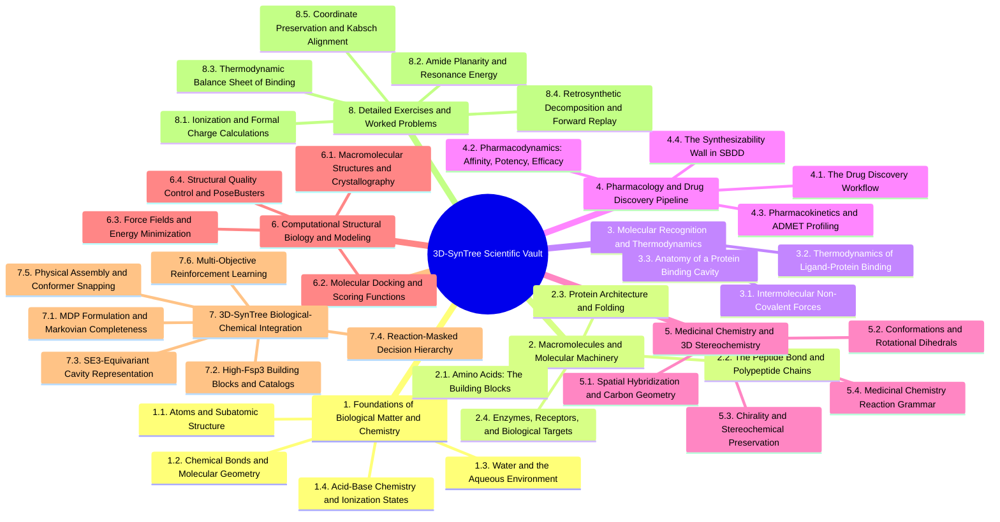

# 3D-SynTree Biology, Pharmacology, and Medicinal Chemistry Vault

---

## 0. Master Map of Content

### 0.1. Vault Architecture and Navigation Map



---


---


## 9. Comprehensive Glossary of Technical Terms

* **Active Pharmaceutical Ingredient (API):** The biologically active chemical compound in a pharmaceutical drug that produces the intended therapeutic effect.
* **Affinity ($K_d$):** The thermodynamic strength of equilibrium binding between a small-molecule ligand and its target protein; lower values mean tighter binding.
* **Agonist:** A molecule that binds to a receptor and actively stabilizes its signaling conformation, triggering a biological response.
* **Allosteric Site:** A binding pocket on a protein distinct from the primary catalytic active site that modulates protein function via induced conformational changes.
* **Amide Bond:** A planar, resonance-stabilized covalent linkage formed between a carbonyl carbon and a nitrogen atom ($-\text{C(=O)—N}-$) with a high rotational energy barrier ($\approx 20\text{ kcal/mol}$).
* **Antagonist:** A drug that binds to a receptor with high affinity but produces zero biological signaling, blocking endogenous hormones.
* **Aromaticity:** A cyclic, planar, conjugated system of $p$ orbitals containing $(4n+2)$ $\pi$ electrons (Hückel's Rule) exhibiting enhanced chemical stability and strict geometric flatness.
* **B-Factor (Temperature Factor):** A crystallographic parameter indicating the relative vibrational motion, thermal mobility, and coordinate uncertainty of an atom in a PDB structure.
* **Bioavailability ($F$):** The fraction of an orally administered drug that reaches systemic circulation in an active, unchanged state.
* **Chirality:** The geometric property of a molecule of being non-superimposable on its mirror image, giving rise to distinct $(R)$ and $(S)$ enantiomers.
* **Clathrate Water:** A highly ordered, ice-like cage of water molecules that forms spontaneously around non-polar surfaces, driving the hydrophobic effect upon release.
* **Covalent Bond:** A strong chemical bond formed by the sharing of one or more pairs of valence electrons between atomic nuclei.
* **Dihedral Angle ($\phi$):** The circular angle between two intersecting planes defined by four sequentially bonded atoms ($A—B—C—D$), parameterized in $SO(2)$ space.
* **Docking:** A computational simulation method that samples translational, rotational, and torsional degrees of freedom to predict the 3D binding pose of a ligand in a protein cavity.
* **Efficacy ($E_{\text{max}}$):** The maximum biological response that a drug candidate can elicit when all target receptors are fully occupied.
* **Electronegativity ($\chi$):** The relative tendency of an atom to attract shared electron density in a covalent bond toward itself.
* **Enantiomers:** A pair of stereoisomeric molecules that are non-superimposable mirror images of each other.
* **Enthalpy ($\Delta H$):** The heat energy absorbed or released during chemical bond formation, electrostatic interactions, and desolvation.
* **Entropy ($\Delta S$):** A measure of molecular randomness, disorder, and degrees of freedom in a thermodynamic system.
* **Equivariance (SE(3)):** The mathematical property of a neural network where rotating or translating the input coordinates rotates or translates the output vector representations identically.
* **Fraction $sp^3$ (Fsp3):** The ratio of $sp^3$-hybridized carbons to total carbons in a molecule, measuring three-dimensional geometric saturation.
* **Gibbs Free Energy ($\Delta G$):** The thermodynamic quantity that determines whether a biological process (such as drug-protein binding) occurs spontaneously ($\Delta G < 0$).
* **Hydrogen Bond:** A directional non-covalent dipole interaction between an electronegative donor ($\text{D—H}$) and an electronegative acceptor ($\text{A:}$).
* **Induced Fit:** The process by which a flexible protein and a flexible ligand adjust their spatial conformations to maximize non-covalent contacts upon binding.
* **Isotopes:** Atomic variants of a chemical element containing the same number of protons ($Z$) but differing numbers of neutrons.
* **Kabsch Algorithm:** A mathematical method based on Singular Value Decomposition (SVD) that computes the optimal rigid-body rotation and translation between two paired sets of 3D coordinates.
* **Lead Optimization:** The iterative medicinal chemistry phase where hits are chemically modified to maximize target potency, selectivity, and ADMET parameters.
* **Lennard-Jones Potential:** A mathematical model of van der Waals interactions capturing short-range Pauli steric repulsion ($r^{-12}$) and long-range London dispersion attraction ($r^{-6}$).
* **Lipinski’s Rule of Five:** Empirical guidelines predicting poor oral absorption when a molecule exceeds specific thresholds for molecular weight, lipophilicity, and hydrogen bonding.
* **Markov Property:** The condition of a stochastic decision process where transitions depend solely on the current state and action, requiring complete representation of the system.
* **Micro-Batch Degradation:** The numerical collapse of policy gradient algorithms (like PPO) when gradients are computed across tiny batch sizes ($N=1\text{ to }2$), causing catastrophic forgetting.
* **Octet Rule:** The chemical principle that main-group elements achieve thermodynamic stability by filling their valence shell with 8 electrons.
* **Pharmacodynamics (PD):** The study of the biochemical and physiological effects of drugs on the body ("What the drug does to the body").
* **Pharmacokinetics (PK):** The study of the time-dependent absorption, distribution, metabolism, and excretion of chemicals in the body ("What the body does to the drug").
* **Pharmacophore:** The abstract spatial arrangement of essential electronic and steric features (donors, acceptors, charges, aromatics) required for target binding.
* **Pi ($\pi$) Bond:** A covalent bond formed by the lateral overlap of parallel, unhybridized $p$ orbitals, enforcing strict planarity.
* **PoseBusters:** A standardized quality-control testing battery that validates 3D molecular conformations against physical, chemical, and steric boundary criteria.
* **Potency ($\text{IC}_{50}$):** The concentration of a drug required to inhibit $50\%$ of a target's biological activity in a functional assay.
* **Primary Amine:** A nitrogen atom bonded covalently to one carbon atom and two hydrogen atoms ($-\text{NH}_2$).
* **Protein Data Bank (PDB):** The global biological repository of experimentally determined 3D atomic coordinates of proteins, nucleic acids, and complex assemblies.
* **QED (Quantitative Estimate of Drug-Likeness):** A continuous score ($[0, 1]$) combining molecular weight, lipophilicity, polar surface area, and structural alerts into a single metric.
* **Ramachandran Plot:** A 2D plot mapping permissible backbone dihedral angles ($\phi, \psi$) of polypeptide chains, revealing allowed secondary structures.
* **Receptor:** A membrane-bound or intracellular protein that recognizes endogenous signaling molecules and transmits biological information into the cell.
* **Retrosynthesis:** The technique of chemically planning the synthesis of a target molecule by recursively breaking bonds into purchasable precursor building blocks.
* **Rotatable Bond:** Any non-ring single bond connecting non-hydrogen atoms that possesses a low barrier to rotation and is not an amide or conjugated double bond.
* **Salt Bridge:** An electrostatic attraction formed between two oppositely charged formal ions (e.g., $-\text{NH}_3^+$ and $-\text{COO}^-$).
* **Secondary Structure:** Local periodic structural patterns in proteins ($\alpha$-helices and $\beta$-sheets) stabilized by backbone hydrogen bonds.
* **Sigma ($\sigma$) Bond:** A strong covalent bond formed by the direct end-to-end overlap of atomic orbitals, possessing cylindrical symmetry.
* **SMARTS:** A chemical language extending SMILES used to specify substructural patterns and chemical reaction templates.
* **Spirocycle:** A bicyclic organic molecular structure where two distinct rings are linked together through a single shared tetrahedral carbon atom.
* **Stereocenter:** An asymmetric tetrahedral atom (typically carbon) bonded to four chemically distinct substituents.
* **Structure-Based Drug Design (SBDD):** Designing small-molecule therapeutic agents using direct knowledge of the 3D atomic coordinates of the target protein binding pocket.
* **Synthon:** A structural building block fragment representing a potential synthetic precursor in retrosynthetic planning.
* **Tertiary Structure:** The complete folded three-dimensional spatial coordinates of a single polypeptide chain.
* **Topological Polar Surface Area (TPSA):** The sum of the surface areas of all polar atoms (O, N, and their attached hydrogens) in a molecule, correlating with permeability.
* **Valence Electrons:** The electrons occupying an atom's outermost quantum shell that participate in chemical bonding.
* **van der Waals Radius:** The effective spherical radius representing the hard-sphere contact boundary of a non-bonded atom.
* **von Mises Distribution:** A continuous circular probability distribution on the circle $SO(2)$, characterized by a mean angle $\mu$ and a concentration parameter $\kappa$.
* **Warhead:** A reactive electrophilic functional group engineered onto a small molecule that reacts covalently with an active-site amino acid.
* **Zwitterion:** A neutral chemical compound carrying localized positive and negative formal charges simultaneously.

---

## 10. Complete Knowledge Vault Directory Tree

```text
3D-SynTree Biology and Medicinal Chemistry Vault/
|-- 0. Master Map of Content.md
|-- 1. Chapter 1. Foundations of Biological Matter and Chemistry/
|   |-- 1.1. Topic. Atoms and Subatomic Particles in Biology/
|   |   |-- 1.1.1. Concept. Subatomic Particles and Atomic Number.md
|   |   \-- 1.1.2. Concept. Valence Electrons and the Octet Rule.md
|   |-- 1.2. Topic. Chemical Bonds and Molecular Geometry/
|   |   |-- 1.2.1. Concept. Covalent Bonds and Valence Rules.md
|   |   \-- 1.2.2. Concept. Electronegativity, Dipoles, and Polar Covalent Bonds.md
|   |-- 1.3. Topic. Water, Solvents, and the Aqueous Environment/
|   |   |-- 1.3.1. Concept. Water Structure and Biological Hydrogen Bonding.md
|   |   \-- 1.3.2. Concept. The Hydrophobic Effect and Solvation Shells.md
|   \-- 1.4. Topic. Acid-Base Chemistry and Ionization States/
|       |-- 1.4.1. Concept. pH, pKa, and Proton Exchange.md
|       \-- 1.4.2. Concept. Formal Charges at Physiological pH.md
|-- 2. Chapter 2. Macromolecules and the Molecular Machinery of Life/
|   |-- 2.1. Topic. Amino Acids: The Building Blocks of Proteins/
|   |   |-- 2.1.1. Concept. The Alpha-Amino Acid Architecture.md
|   |   \-- 2.1.2. Concept. Side-Chain Chemistry and Classification.md
|   |-- 2.2. Topic. The Peptide Bond and Polypeptide Chains/
|   |   |-- 2.2.1. Concept. Formation, Geometry, and Resonance of the Peptide Bond.md
|   |   \-- 2.2.2. Concept. Polypeptide Directionality and Backbone Dihedrals.md
|   |-- 2.3. Topic. Protein Architecture and Folding/
|   |   |-- 2.3.1. Concept. Primary, Secondary, Tertiary, and Quaternary Structure.md
|   |   \-- 2.3.2. Concept. Protein Dynamics and Induced Fit.md
|   \-- 2.4. Topic. Enzymes, Receptors, and Biological Targets/
|       |-- 2.4.1. Concept. Enzymes: Catalytic Mechanism and Inhibition Modes.md
|       \-- 2.4.2. Concept. Receptors: Agonism, Antagonism, and Signal Transduction.md
|-- 3. Chapter 3. Molecular Recognition and Thermodynamics of Binding/
|   |-- 3.1. Topic. Intermolecular Non-Covalent Forces/
|   |   |-- 3.1.1. Concept. Electrostatic Interactions and Salt Bridges.md
|   |   |-- 3.1.2. Concept. Hydrogen Bonds: Geometry, Donors, and Acceptors.md
|   |   |-- 3.1.3. Concept. van der Waals Forces and the Lennard-Jones Potential.md
|   |   \-- 3.1.4. Concept. Pi-System Interactions.md
|   |-- 3.2. Topic. Thermodynamics of Ligand-Protein Binding/
|   |   |-- 3.2.1. Concept. Gibbs Free Energy of Binding.md
|   |   \-- 3.2.2. Concept. Enthalpy-Entropy Compensation.md
|   \-- 3.3. Topic. Anatomy of a Protein Binding Cavity/
|       |-- 3.3.1. Concept. Cavity Geometry, Subpockets, and Enclosure.md
|       \-- 3.3.2. Concept. Pharmacophore Hotspots and Interaction Fields.md
|-- 4. Chapter 4. Pharmacology and the Drug Discovery Pipeline/
|   |-- 4.1. Topic. The Drug Discovery Workflow/
|   |   |-- 4.1.1. Concept. Target Identification and Validation.md
|   |   \-- 4.1.2. Concept. Hit-to-Lead and Lead Optimization.md
|   |-- 4.2. Topic. Pharmacodynamics: Affinity, Potency, Efficacy/
|   |   |-- 4.2.1. Concept. Binding Affinity (Kd), Inhibitory Potency (IC50), and Efficacy.md
|   |   \-- 4.2.2. Concept. Selectivity and Off-Target Toxicity.md
|   |-- 4.3. Topic. Pharmacokinetics and ADMET Profiling/
|   |   |-- 4.3.1. Concept. Lipinski's Rule of Five and Veber's Rules.md
|   |   \-- 4.3.2. Concept. Pharmacokinetics and the ADMET Profile.md
|   \-- 4.4. Topic. The Synthesizability Wall in SBDD/
|       |-- 4.4.1. Concept. The Flat Grease Trap in Generative Chemistry.md
|       \-- 4.4.2. Concept. The Synthesizability Wall: 2D Trees vs 3D Chimeras.md
|-- 5. Chapter 5. Medicinal Chemistry and 3D Stereochemistry/
|   |-- 5.1. Topic. Spatial Hybridization and Carbon Geometry/
|   |   |-- 5.1.1. Concept. sp3, sp2, and sp Hybridization.md
|   |   \-- 5.1.2. Concept. Fraction of sp3 Carbons (Fsp3).md
|   |-- 5.2. Topic. Conformations and Rotational Dihedrals/
|   |   |-- 5.2.1. Concept. Dihedral Angles and Rotational Barriers.md
|   |   \-- 5.2.2. Concept. Rotatable Bonds and Conformational Flexibility.md
|   |-- 5.3. Topic. Chirality and Stereochemical Preservation/
|   |   |-- 5.3.1. Concept. Stereocenters, Enantiomers, and Diastereomers.md
|   |   \-- 5.3.2. Concept. Stereochemical Amnesia and Chiral Inversion Hazards.md
|   \-- 5.4. Topic. Medicinal Chemistry Reaction Grammar/
|       |-- 5.4.1. Concept. Amide Coupling Chemistry.md
|       |-- 5.4.2. Concept. Reductive Amination Chemistry.md
|       |-- 5.4.3. Concept. Cross-Coupling and Aromatic Substitutions (Suzuki, SNAr, Buchwald).md
|       \-- 5.4.4. Concept. Chemoselectivity and Competing Reactive Handles.md
|-- 6. Chapter 6. Computational Structural Biology and SBDD/
|   |-- 6.1. Topic. Macromolecular Structures and File Formats/
|   |   |-- 6.1.1. Concept. X-Ray Crystallography and Cryo-EM Resolution.md
|   |   \-- 6.1.2. Concept. The Protein Data Bank Format and Structural Quirks.md
|   |-- 6.2. Topic. Molecular Docking and Scoring Functions/
|   |   |-- 6.2.1. Concept. Physics and Mechanics of Docking Algorithms.md
|   |   \-- 6.2.2. Concept. Scoring Functions: Physics-Based vs Empirical.md
|   |-- 6.3. Topic. Force Fields and Energy Minimization/
|   |   |-- 6.3.1. Concept. Molecular Mechanics Force Fields (MMFF94, UFF).md
|   |   \-- 6.3.2. Concept. Constrained Energy Minimization.md
|   \-- 6.4. Topic. Structural Quality Control and PoseBusters/
|       |-- 6.4.1. Concept. PoseBusters and Physical Sanity Filters.md
|       \-- 6.4.2. Concept. Strain Energy and Energetic Feasibility.md
|-- 7. Chapter 7. 3D-SynTree Biological and Chemical Architecture/
|   |-- 7.1. Topic. MDP Formulation and Markovian Completeness/
|   |   |-- 7.1.1. Concept. The Markov Property in SBDD.md
|   |   \-- 7.1.2. Concept. The Factorized Action Space.md
|   |-- 7.2. Topic. High-Fsp3 Building Blocks and Catalogs/
|   |   |-- 7.2.1. Concept. Curating the Enamine REAL 3D-Diversity Catalog.md
|   |   \-- 7.2.2. Concept. Multifunctional Linkers vs Monofunctional Caps.md
|   |-- 7.3. Topic. SE(3)-Equivariant Pocket Conditioning/
|   |   |-- 7.3.1. Concept. PaiNN Invariant Scalar and Equivariant Vector Features.md
|   |   \-- 7.3.2. Concept. Relative Distance RBFs and Cross-Attention Core.md
|   |-- 7.4. Topic. The Reaction-Masked Decision Hierarchy/
|   |   |-- 7.4.1. Concept. The Reaction Head and Grammar Masking.md
|   |   |-- 7.4.2. Concept. The Synthon Head and the Explicit STOP Token.md
|   |   \-- 7.4.3. Concept. The Continuous von Mises Dihedral Torsion Head.md
|   |-- 7.5. Topic. Physical Assembly and Conformer Snapping/
|   |   \-- 7.5.1. Concept. Scaffold-Locked Harmonic Restraint Relaxation.md
|   \-- 7.6. Topic. Multi-Objective Reinforcement Learning/
|       |-- 7.6.1. Concept. The Multi-Objective Reinforcement Learning Reward.md
|       \-- 7.6.2. Concept. Rollout Buffers and Destabilization Hazards in PPO.md
|-- 8. Chapter 8. Detailed Exercises, Worked Problems, and Case Studies/
|   |-- 8.1. Exercise 1. Calculating Formal Charges and Ionization States at Physiological pH.md
|   |-- 8.2. Exercise 2. Why the Twisted Amide is a Biophysical Catastrophe.md
|   |-- 8.3. Exercise 3. Thermodynamic Balance Sheet of Ligand Binding.md
|   |-- 8.4. Exercise 4. Step-by-Step Retrosynthetic Decomposition and Forward Replay.md
|   \-- 8.5. Exercise 5. Coordinate Preservation and Kabsch Alignment.md
\-- 9. Comprehensive Glossary of Technical Terms.md
```