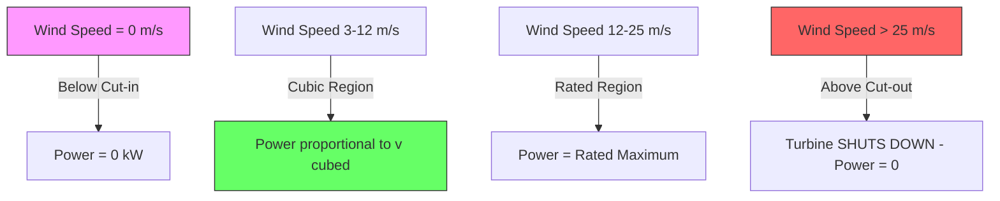

# 1.1 The Renewable Intermittency Problem

## The Core Challenge

The fundamental problem in renewable energy forecasting is **intermittency**. Unlike coal, nuclear, or natural gas power plants that can be dispatched on demand, solar and wind power generation fluctuates based on weather conditions that are inherently chaotic and only partially predictable. The sun sets every evening, clouds roll in without warning, and wind speeds can change from a gentle breeze to a destructive gale within minutes. This creates a fundamental mismatch between energy supply and demand that threatens the stability of electrical grids worldwide.

When you turn on a light switch, you expect electricity to flow immediately. This expectation is built on decades of operating a grid where supply is continuously adjusted to match demand. Traditional power plants achieve this by burning more fuel when demand rises. But a solar farm cannot "burn more sun" at 8 PM when peak evening demand hits. This is the intermittency problem in its most visceral form: renewable energy sources produce power on nature's schedule, not on humanity's schedule.

## Why Intermittency Demands Forecasting

The electrical grid operates on a delicate balance: the total power generated must equal the total power consumed at every single moment. If generation exceeds consumption, frequency rises above the target (50 Hz or 60 Hz depending on your region), potentially damaging equipment. If consumption exceeds generation, frequency drops, which can trigger cascading failures and blackouts. The larger the share of intermittent renewables on the grid, the more critical accurate forecasting becomes.

Consider a grid operator managing a region with 500 MW of solar capacity. At noon on a clear day, those panels might produce 450 MW. But if a large cloud bank moves across the region at 12:30 PM, production could plummet to 50 MW within minutes. Without a forecast warning, the operator has no time to spin up backup generation, and the grid faces an immediate deficit of 400 MW. With accurate forecasting, the operator can pre-position gas peaker plants or request demand response from industrial consumers, smoothing the transition.

## The Two Flavors of Intermittency

### Solar Intermittency

Solar power follows a highly predictable diurnal cycle: the sun rises and sets at known times, and seasonal irradiance patterns are well-established. The "easy" part of solar forecasting is predicting that power will be zero at night and peak around solar noon. The genuinely difficult part is predicting **cloud cover** and its impact on irradiance. Clouds can reduce solar output by 70-90% in seconds, and their movement is governed by fluid dynamics equations that are fundamentally chaotic over short timescales.

Solar intermittency also has a **seasonal dimension**. A solar installation in Melbourne, Australia produces roughly 3-4 times more energy in January (summer) than in June (winter). This is not stochastic; it follows from the solar geometry (the sun's elevation angle varies predictably with season). However, within any given day, the stochastic component (clouds, fog, haze, smoke from wildfires) can dominate.

### Wind Intermittency

Wind is arguably more challenging than solar because it lacks the diurnal anchor. While solar power has a guaranteed zero baseline at night, wind turbines can produce maximum power at 3 AM and zero power at 3 PM, with no deterministic pattern. Wind speed follows a **Weibull distribution** at any given location, but temporal correlations (the tendency for wind to persist or change gradually) introduce structure that forecasting models can exploit.

Wind intermittency also has a **direction component**. Wind turbines are designed to face into the wind (yaw control), but when the wind direction shifts rapidly, the turbine's nacelle may not track fast enough, leading to temporary power drops. Furthermore, the relationship between wind speed and power is highly nonlinear: below the "cut-in" speed (typically 3-4 m/s), no power is generated; between cut-in and rated speed, power increases as the cube of wind speed; above rated speed, power is capped by pitch control; and above the "cut-out" speed (typically 25 m/s), the turbine shuts down entirely for safety.

## The Economic Dimension

Grid operators do not just need forecasts for technical stability; they need them for **economic efficiency**. Electricity markets operate on a bidding system where generators submit day-ahead bids. A solar farm that accurately forecasts its next-day output can bid confidently, maximizing revenue. One that overestimates may face penalty charges for under-delivery. One that underestimates leaves money on the table.

The economic value of improved forecasting is quantified as the **avoided cost of reserves**. If your forecast RMSE is 10%, the grid must maintain 10% of renewable capacity as spinning reserves (fast-responding backup generators). If improved forecasting reduces RMSE to 5%, the reserve requirement halves, saving millions of dollars annually in fuel costs and carbon emissions.

## How This Project Addresses Intermittency

This project tackles intermittency through two complementary systems:

1. **The Solar Hybrid Residual Corrector**: Uses XGBoost to capture the static nonlinear relationship between weather variables and solar output, then uses an LSTM to correct the temporal errors (residuals) that XGBoost makes. A heteroscedastic loss function quantifies uncertainty, so the system can express when it is unsure.

2. **The Wind Bi-GRU System**: Uses a Bidirectional Gated Recurrent Unit that reads wind history in both forward and backward directions, augmented with physics-engineered features (wind cubed, U/V vector decomposition) that encode fundamental fluid dynamics. An "anchor" mechanism grounds predictions in the current physical reality to prevent lag.

Both systems share a philosophy: **inject physics into the data pipeline so the model does not have to re-learn the laws of nature from scratch**. This dramatically improves data efficiency and generalization.

## Key Takeaways

- Intermittency is the defining challenge of renewable energy integration
- Solar intermittency is driven primarily by cloud cover; wind intermittency by atmospheric turbulence
- The grid requires real-time balance between supply and demand
- Accurate forecasting reduces the need for expensive backup reserves
- This project addresses intermittency through physics-informed hybrid AI models
- The economic value of improved forecasts scales with grid penetration of renewables

> **Important Reminder**: When you see a high R-squared score in a renewable energy model, always ask: is the model actually learning the weather-power relationship, or is it just memorizing the diurnal cycle (predicting zero at night and something during the day)? The diurnal cycle is "free information" that inflates performance metrics. The true test is whether the model can predict **deviations** from the expected cycle.
