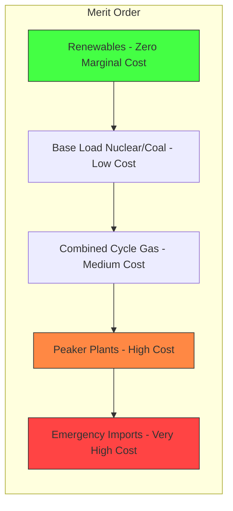

# 1.2 Grid Economics and System Goals

## The Electric Grid as a Real-Time Marketplace

The electric grid is not simply a network of wires connecting generators to consumers. It is a **real-time marketplace** where supply and demand must balance at every instant, with prices that fluctuate by the minute. Understanding this marketplace is essential for understanding why forecasting models are built the way they are, and why their outputs (not just predictions, but uncertainty estimates) matter.

In traditional power systems, grid operators use a hierarchy of generation resources. **Base-load plants** (nuclear, large coal) run continuously at near-constant output because they are cheap to operate but expensive and slow to start or stop. **Intermediate plants** (combined-cycle gas) can ramp up or down over hours. **Peaker plants** (simple-cycle gas turbines) can start in minutes but are expensive to run. The entire economic optimization of the grid is about using the cheapest available generation at every moment while maintaining reliability.

## The Impact of Renewables on Grid Economics

When solar and wind generation enters this picture, it fundamentally disrupts the economic hierarchy. Solar and wind have **zero marginal cost** (the fuel is free). Once installed, every additional kWh from a solar panel costs essentially nothing. This means renewables are always the cheapest source when available, and they should always be dispatched first (the "merit order effect").

However, their intermittency creates a paradox: the more renewable capacity on the grid, the more backup capacity is needed, and that backup (peaker plants) is the most expensive generation to operate. A grid with 50% solar penetration might produce excess energy at noon (forcing curtailment) and face severe shortages at 7 PM (requiring expensive peaker plants). This is the **duck curve** problem, named after the shape of the net-load curve.

## Why Uncertainty Quantification Matters Economically

This is where the project's focus on heteroscedastic loss and prediction intervals becomes economically critical. Consider two forecasts:

- **Forecast A**: "Solar output at 2 PM will be 200 kW" (point estimate only)
- **Forecast B**: "Solar output at 2 PM will be 200 kW, with a 95% confidence interval of [150, 250] kW"

Forecast A gives a grid operator no information about risk. Forecast B tells the operator: "There is a 5% chance output could fall below 150 kW." If the economic penalty for an unexpected shortfall is $10,000 per MW, the operator can make a risk-adjusted decision about how much reserve to procure.

The **heteroscedastic loss function** used in this project's solar model is specifically designed to produce Forecast B. The word "heteroscedastic" comes from Greek: "hetero" (different) + "skedasis" (dispersion). It means the model recognizes that its prediction uncertainty varies across conditions. On a clear, cloudless day, uncertainty is low (sigma is small). On a partly cloudy day, uncertainty is high (sigma is large). This dynamic uncertainty quantification directly translates to economic savings.

## System Goals of This Project

The project has two distinct but related forecasting systems, each with specific goals:

### Solar System Goals
1. **Short-term forecasting** (15-minute to 6-hour horizon) for Site 25 in the UNISOLAR dataset
2. **Physics-guided imputation** of missing data, particularly the 18,000+ missing nighttime rows
3. **Hybrid prediction**: XGBoost for feature-level learning, LSTM for temporal residual correction
4. **Probabilistic output**: Not just a point prediction, but a calibrated uncertainty estimate (sigma)
5. **Target accuracy**: R-squared above 0.90 with well-calibrated prediction intervals

### Wind System Goals
1. **Medium-term forecasting** (up to 48-hour horizon) using the SDWPF dataset (134 turbines)
2. **Physics-informed features**: Wind cubed (energy flux), U/V vector decomposition, air density
3. **Multi-source data fusion**: Combining real SCADA data (Turkey) with simulated NREL data
4. **Lag prevention**: Using an "anchor" mechanism to prevent the common forecasting lag problem
5. **Robustness**: Handling outliers, missing values, and the "is_real" flag to distinguish data sources

## The Forecasting Hierarchy

## Key Takeaways

- The grid is a real-time marketplace where forecasting directly impacts economic outcomes
- Renewables have zero marginal cost but require expensive backup due to intermittency
- Uncertainty quantification is not an academic exercise; it has direct economic value
- The solar system targets short-term forecasting with probabilistic outputs
- The wind system targets medium-term forecasting with physics-augmented features
- Both datasets present significant data quality challenges that require careful engineering
- The merit order effect means better forecasts reduce the need for expensive peaker plants

> **Important Reminder**: The R-squared metric alone is insufficient for model evaluation in grid applications. A model with R-squared of 0.95 but poorly calibrated uncertainty could lead to worse economic outcomes than a model with R-squared of 0.90 and well-calibrated intervals. Always evaluate both point accuracy AND uncertainty calibration.
